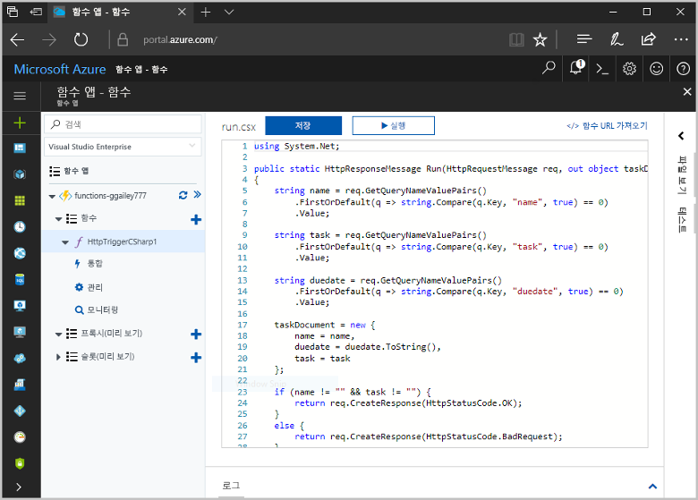
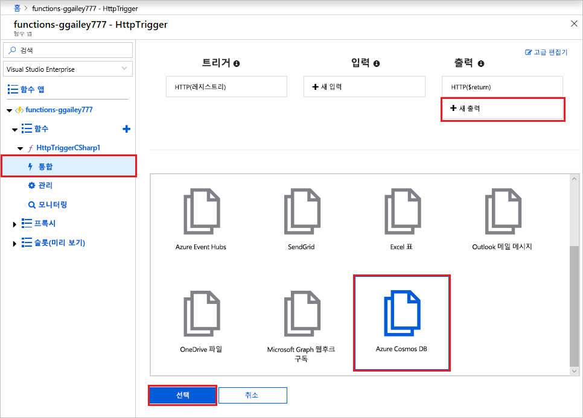
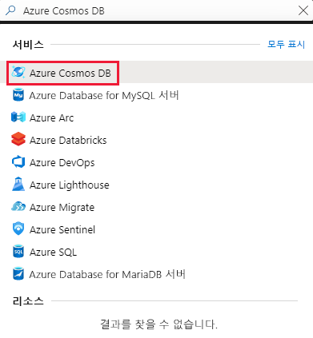

# <a name="store-unstructured-data-using-azure-functions-and-azure-cosmos-db"></a>Azure Functions 및 Azure Cosmos DB를 사용하여 구조화되지 않은 데이터 저장

[Azure Cosmos DB](https://azure.microsoft.com/services/cosmos-db/)는 구조화되지 않은 데이터 및 JSON 데이터를 저장하기 좋습니다. Cosmos DB를 Azure Functions와 함께 사용하면 관계형 데이터베이스에 데이터를 저장하는 데 필요한 것보다 훨씬 적은 코드를 사용하여 쉽고 빠르게 데이터를 저장할 수 있습니다.

> [!NOTE]
> 이때 Azure Cosmos DB 트리거, 입력 바인딩 및 출력 바인딩은 SQL API 및 Graph API 계정에서만 작동합니다.

Azure Functions에서 입력 및 출력 바인딩은 함수에서 외부 서비스 데이터로 연결하기 위한 선언적 방식을 제공합니다. 이 문서에서는 구조화되지 않은 데이터를 Azure Cosmos DB 문서에 저장하는 출력 바인딩을 추가하여 기존 함수를 업데이트하는 방법에 대해 알아봅니다.



## <a name="prerequisites"></a>필수 조건

이 자습서를 완료하려면 다음이 필요합니다.

[!INCLUDE [Previous quickstart note](../../includes/functions-quickstart-previous-topics.md)]

## <a name="create-an-azure-cosmos-db-account"></a>Azure Cosmos DB 계정 만들기

출력 바인딩을 만들기 전에 SQL API를 사용하는 Azure Cosmos DB 계정이 있어야 합니다.

[!INCLUDE [cosmos-db-create-dbaccount](../../includes/cosmos-db-create-dbaccount.md)]

## <a name="add-an-output-binding"></a>출력 바인딩 추가

1. 포털에서 이전에 만든 함수 앱으로 이동하고 함수 앱과 함수를 모두 확장합니다.

1. 페이지 오른쪽 위에서 **통합** 및 **+ 새 출력**을 선택합니다. **Azure Cosmos DB**를 선택하고 **선택**을 클릭합니다.

    

1. **확장이 설치되지 않았습니다**라는 메시지가 표시되면 **설치**를 선택하여 Azure Cosmos DB 바인딩 확장을 함수 앱에 설치합니다. 설치하는 데 1-2분이 걸릴 수 있습니다.

    

1. 다음 표에 지정된 대로 **Azure Cosmos DB 출력** 설정을 사용합니다.

    

    | 설정      | 제안 값  | 설명                                |
    | ------------ | ---------------- | ------------------------------------------ |
    | **문서 매개 변수 이름** | taskDocument | 코드에서 Cosmos DB 개체를 참조하는 이름. |
    | **데이터베이스 이름** | taskDatabase | 문서를 저장할 데이터베이스의 이름. |
    | **컬렉션 이름** | TaskCollection | 데이터베이스 컬렉션 이름. |
    | **true이면 Cosmos DB 데이터베이스 및 컬렉션을 만듭니다.** | 선택 | 아직 컬렉션이 없으므로 지금 만듭니다. |
    | **Azure Cosmos DB 계정 연결** | 새 설정 | **새로 만들기**를 선택한 다음, **구독**, 이전에 만든 **데이터베이스 계정**, **선택**을 차례로 선택합니다. 계정 연결에 대한 응용 프로그램 설정이 만들어집니다. 이 설정은 데이터베이스에 연결하는 바인딩에서 사용됩니다. |
    | **컬렉션 처리량** |400RU| 대기 시간을 줄이면 나중에 처리량을 늘릴 수 있습니다. |

1. **저장**을 선택하여 바인딩을 만듭니다.

## <a name="update-the-function-code"></a>함수 코드 업데이트

선택한 언어로 기존 함수 코드를 다음 코드로 바꿉니다.

# <a name="ctabcsharp"></a>[C\#](#tab/csharp)

기존 C# 함수를 다음 코드로 바꿉니다.

```csharp
#r "Newtonsoft.Json"

using Microsoft.AspNetCore.Mvc;
using Microsoft.AspNetCore.Http;
using Microsoft.Extensions.Logging;

public static IActionResult Run(HttpRequest req, out object taskDocument, ILogger log)
{
    string name = req.Query["name"];
    string task = req.Query["task"];
    string duedate = req.Query["duedate"];

    // We need both name and task parameters.
    if (!string.IsNullOrEmpty(name) && !string.IsNullOrEmpty(task))
    {
        taskDocument = new
        {
            name,
            duedate,
            task
        };

        return (ActionResult)new OkResult();
    }
    else
    {
        taskDocument = null;
        return (ActionResult)new BadRequestResult();
    }
```

# <a name="javascripttabnodejs"></a>[JavaScript](#tab/nodejs)

기존 JavaScript 함수를 다음 코드로 바꿉니다.

```js
module.exports = async function (context, req) {

    // We need both name and task parameters.
    if (req.query.name && req.query.task) {

        // Set the output binding data from the query object.
        context.bindings.taskDocument = req.query;

        // Success.
        context.res = {
            status: 200
        };
    }
    else {
        context.res = {
            status: 400,
            body: "The query options 'name' and 'task' are required."
        };
    }
};
```
---

이 코드 샘플은 HTTP 요청 쿼리 문자열을 읽고 `taskDocument` 개체의 필드에 할당합니다. `taskDocument` 바인딩은 이 바인딩 매개 변수의 개체 데이터 중에서 바인딩된 문서 데이터베이스에 저장할 데이터를 보냅니다. 함수가 처음으로 실행될 때 데이터베이스가 생성됩니다.

## <a name="test-the-function-and-database"></a>함수 및 데이터베이스 테스트

1. 오른쪽 창을 확장하고 **테스트**를 선택합니다. **쿼리** 아래에서 **+ 매개 변수 추가**를 클릭하고 쿼리 문자열에 다음 매개 변수를 추가합니다.

    + `name`
    + `task`
    + `duedate`

1. **실행**을 클릭하고 200 상태가 반환되는지 확인합니다.

    

1. Azure Portal의 왼쪽에서 아이콘 표시줄을 확장하고, 검색 필드에 `cosmos`를 입력하고, **Azure Cosmos DB**를 선택합니다.

    

1. Azure Cosmos DB 계정을 선택한 다음 **데이터 탐색기**를 선택합니다.

1. **컬렉션** 노드를 확장하고, 새 문서를 선택하고, 문서에 일부 추가 메타데이터와 함께 쿼리 문자열 값이 포함되어 있는지 확인합니다.

    

Azure Cosmos DB에 구조화되지 않은 데이터를 저장하는 HTTP 트리거에 바인딩을 성공적으로 추가했습니다.

[!INCLUDE [Clean-up section](../../includes/clean-up-section-portal.md)]

## <a name="next-steps"></a>다음 단계

[!INCLUDE [functions-quickstart-next-steps](../../includes/functions-quickstart-next-steps.md)]

Cosmos DB 데이터베이스에 바인딩하는 자세한 내용은 [Azure Functions Cosmos DB 바인딩](functions-bindings-cosmosdb.md)을 참조하세요.
