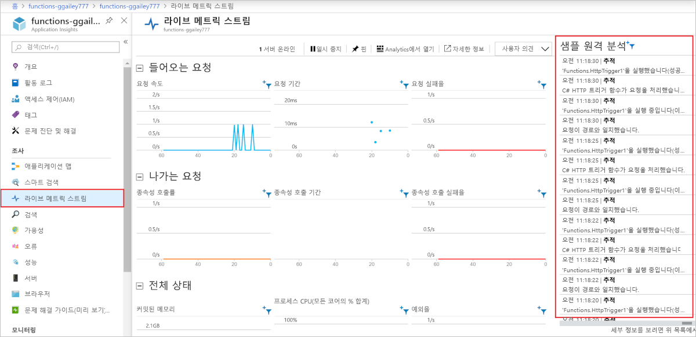

# <a name="enable-streaming-execution-logs-in-azure-functions"></a>Azure Functions에서 스트리밍 실행 로그 사용

응용 프로그램을 개발 하는 동안 Azure에서 실행할 때 거의 실시간으로 로그에 기록 되는 항목을 확인 하는 것이 좋습니다.

함수 실행에 의해 생성되는 로그 파일의 스트림을 보는 두 가지 방법이 있습니다.

* **기본 제공 로그 스트리밍**: App Service 플랫폼을 사용하여 애플리케이션 로그 파일의 스트림을 볼 수 있습니다. 이는 [로컬 개발](functions-develop-local.md)에서 함수를 디버그할 때와 포털에서 **테스트** 탭을 사용할 때 표시되는 출력에 해당합니다. 모든 로그 기반 정보가 표시됩니다. 자세한 내용은 [로그 스트리밍](../app-service/troubleshoot-diagnostic-logs.md#stream-logs)을 참조하세요. 이 스트리밍 방법은 단일 인스턴스만 지원하며, 사용 계획을 사용하는 Linux에서 실행되는 앱에는 사용할 수 없습니다.

* **라이브 메트릭 스트림**: 함수 앱이 [Application Insights에 연결](configure-monitoring.md#enable-application-insights-integration)되는 경우 Azure Portal에서 [라이브 메트릭 스트림](../azure-monitor/app/live-stream.md)을 사용하여 로그 데이터 및 기타 메트릭을 거의 실시간으로 볼 수 있습니다. 사용 계획을 사용하는 여러 인스턴스 또는 Linux에서 실행되는 함수를 모니터링할 때 이 방법을 사용합니다. 이 방법은 [샘플링된 데이터](configure-monitoring.md#configure-sampling)를 사용합니다.

로그 스트림은 포털과 대부분의 로컬 개발 환경에서 볼 수 있습니다. 

## <a name="portal"></a>포털

포털에서 두 유형의 로그 스트림을 모두 볼 수 있습니다.

### <a name="built-in-log-streaming"></a>기본 제공 로그 스트리밍

포털에서 스트리밍 로그를 보려면 함수 앱에서 **플랫폼 기능** 탭을 선택합니다. 그런 다음, **모니터링**에서 **로그 스트리밍**를 선택합니다.


이렇게 하면 앱이 로그 스트리밍 서비스에 연결하고, 창에 애플리케이션 로그가 표시됩니다. **애플리케이션 로그**와 **웹 서버 로그** 간에 전환할 수 있습니다.  


### <a name="live-metrics-stream"></a>라이브 메트릭 스트림

앱의 라이브 메트릭 스트림을 보려면 함수 앱의 **개요** 탭을 선택합니다. Application Insights를 사용하도록 설정하면 **구성된 기능**에 **Application Insights** 링크가 표시됩니다. 이 링크를 누르면 앱의 Application Insights 페이지로 이동합니다.

Application Insights에서 **라이브 메트릭 스트림**을 선택합니다. [샘플링된 로그 항목](configure-monitoring.md#configure-sampling)이 **샘플 원격 분석** 아래에 표시됩니다.

 

## <a name="visual-studio-code"></a>Visual Studio Code

[!INCLUDE [functions-enable-log-stream-vs-code](../../includes/functions-enable-log-stream-vs-code.md)]

## <a name="core-tools"></a>핵심 도구

[!INCLUDE [functions-streaming-logs-core-tools](../../includes/functions-streaming-logs-core-tools.md)]

## <a name="azure-cli"></a>Azure CLI

[Azure CLI](/cli/azure/install-azure-cli)를 사용하여 스트리밍 로그를 사용하도록 설정할 수 있습니다. 다음 명령을 사용하여 로그인하고, 구독을 선택하고, 로그 파일을 스트리밍합니다.

```azurecli
az login
az account list
az account set --subscription <subscriptionNameOrId>
az webapp log tail --resource-group <RESOURCE_GROUP_NAME> --name <FUNCTION_APP_NAME>
```

## <a name="azure-powershell"></a>Azure PowerShell

[Azure PowerShell](/powershell/azure/)을 사용하여 스트리밍 로그를 사용하도록 설정할 수 있습니다. PowerShell의 경우 다음 코드 조각과 같이 [AzWebApp](/powershell/module/az.websites/set-azwebapp) 명령을 사용 하 여 함수 앱에 대 한 로깅을 사용 하도록 설정 합니다. 

:::code language="powershell" source="~/powershell_scripts/app-service/monitor-with-logs/monitor-with-logs.ps1" range="19-20":::

자세한 내용은 [전체 코드 예제](../app-service/scripts/powershell-monitor.md#sample-script)를 참조 하세요. 

## <a name="next-steps"></a>다음 단계

+ [Azure Functions 모니터링](functions-monitoring.md)
+ [Application Insights에서 Azure Functions 원격 분석 분석](analyze-telemetry-data.md)
