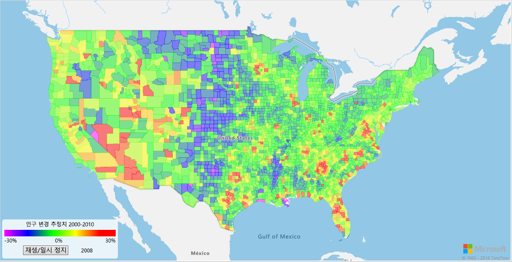
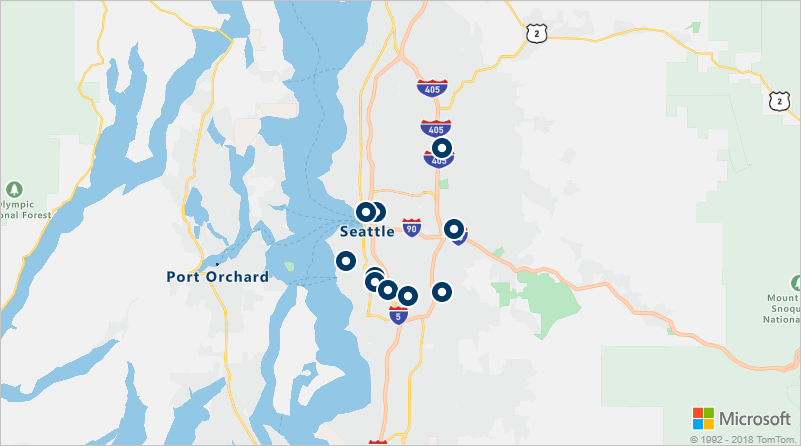

# <a name="what-is-azure-maps"></a>Azure Maps란?

Azure Maps는 웹 및 모바일 애플리케이션에 지리적 컨텍스트를 제공하기 위해 최신 매핑 데이터를 사용하는 지리 공간적 서비스의 컬렉션입니다. Azure Maps는 다음을 제공합니다.

* 맵을 여러 스타일과 위성 이미지로 렌더링하는 REST API
* 전 세계의 주소, 장소 및 관심 지점을 찾는 검색 서비스
* 지점 간 라우팅, 다중 지점, 다중 지점 최적화, 등시선, 상용차, 교통 영향 및 매트릭스 라우팅과 같은 다양한 라우팅 옵션
* 트래픽 정보를 필요로 하는 애플리케이션의 경우 트래픽 흐름 보기 및 인시던트 보기
* 공용 전송 물류를 요청하고, 실시간으로 경로를 계획하고, 다른 교통 모드에 대한 정보를 요청하는 모바일 서비스
* 표준 시간대, 지리적 위치 서비스 및 위치를 표준 시간대로 변환
* 위치 정보가 Azure에서 호스팅되는 지오펜싱 서비스 및 매핑 데이터 스토리지 
* 지리 공간 분석을 통한 위치 인텔리전스. 

또한 웹 SDK 또는 Android SDK를 통해 Azure Maps 서비스를 사용할 수 있습니다. 이러한 도구는 개발자들이 위치 정보를 Azure 솔루션으로 통합하는 솔루션을 신속하게 개발하고 확장하는 데 유용합니다. 

지금 바로 [Azure Maps 계정](https://azure.microsoft.com/services/azure-maps/) 체험판에 가입하여 개발을 시작할 수 있습니다.

다음 비디오는 Azure Maps를 자세히 설명합니다.

<br/>

<iframe src="https://channel9.msdn.com/Shows/Internet-of-Things-Show/Azure-Maps/player?format=ny" width="960" height="540" allowFullScreen frameBorder="0"></iframe>

## <a name="map-controls"></a>맵 컨트롤

### <a name="web-sdk"></a>웹 SDK

Azure Maps 웹 SDK를 사용하면 고유한 콘텐츠와 이미지를 사용하여 대화형 맵을 사용자 지정할 수 있습니다. 웹 또는 모바일 애플리케이션 모두에 대해 이 대화형 맵을 사용할 수 있습니다. 맵 컨트롤을 통해 WebGL을 사용하여 고성능의 큰 데이터 세트를 렌더링할 수 있습니다. JavaScript 또는 TypeScript를 사용하여 SDK에서 개발합니다.



### <a name="android-sdk"></a>Android SDK

Azure Maps Android SDK를 사용하여 모바일 매핑 애플리케이션을 만듭니다. 


## <a name="services-in-azure-maps"></a>Azure Maps의 서비스

Azure Maps는 Azure 애플리케이션에 지리적 컨텍스트를 제공할 수 있는 다음 9개의 서비스로 구성됩니다.

### <a name="data-service"></a>Data Service

데이터는 맵에 필수적입니다. Data Service를 사용하여 공간 작업 또는 이미지 구성에 사용할 지리 공간 데이터를 업로드하고 저장합니다.  고객 데이터를 Azure Maps 서비스에 더 가까이 가져오면 대기 시간이 줄어들고 생산성이 향상되며 애플리케이션에서 새 시나리오를 만들 수 있습니다. 이 서비스에 대해 자세히 알아보려면 [Data Service API 설명서](https://docs.microsoft.com/rest/api/maps/data)를 참조하세요.

### <a name="mobility-service"></a>모바일 서비스

Azure Maps Mobility Service를 사용하면 실시간 여행 계획이 가능합니다. 최적의 경로 옵션을 반환하고 다양한 이동 모드를 제공합니다. 지하철(도시) 지역의 경우, 이러한 모드에는 걷기, 자전거 타기 및 대중 교통 수단이 포함될 수 있습니다. 개발자는 대중교통 시간표, 선 기하학, 정류장 목록, 예정 도착 시간, 실제 도착 시간 및 서비스 알림을 요청할 수 있습니다.

또한 서비스를 통해 주변의 특정한 물체 유형을 검색할 수 있습니다. 사용자는 주변의 공유 자전거, 스쿠터 또는 자동차를 검색할 수 있습니다. 사용자는 가장 가까운 도크에서 사용 가능한 자전거 수를 요청하고, 카풀에 사용 가능한 차량을 검색할 수 있습니다. 또한 사용자는 차량의 향후 이용 가능 정보나 현재 남은 연료와 같은 세부 정보도 찾을 수 있습니다.

서비스에 대해 자세히 알아보려면 [Mobility API 설명서](https://docs.microsoft.com/rest/api/maps/mobility)를 참조하세요.

### <a name="render-service"></a>Render Service

Render Service는 개발자가 매핑 기능을 사용하여 웹 및 모바일 애플리케이션을 만드는 데 도움을 줍니다. 이 서비스는 19단계 확대/축소 수준에서 사용할 수 있는 고품질 래스터 그래픽 이미지 또는 모든 것을 사용자 지정할 수 있는 벡터 형식 맵 이미지를 사용합니다.


Render Service는 현재 개발자가 위성 이미지를 사용하여 작업할 수 있도록 미리 보기 API를 제공합니다. 자세한 내용은 [Render API 설명서](https://docs.microsoft.com/rest/api/maps/render)를 읽어보세요.

### <a name="route-service"></a>Route Service

Route Service는 여러 운송 모드의 실제 인프라 및 방향에 대한 강력한 기하 도형 계산을 포함합니다. 이 서비스는 개발자가 다양한 이동 모드(예제: 자동차, 트럭, 자전거 또는 도보)에서 방향을 계산할 수 있도록 합니다. 또한 서비스는 교통 상황, 무게 제한 또는 위해 물질 운송 등의 입력도 고려합니다.


Route Service는 다음과 같은 고급 기능의 미리 보기를 제공합니다. 

* 여러 경로 요청의 일괄 처리.
* 원본과 대상 세트 간 여행 시간 및 거리의 매트릭스.
* 시간 또는 연료 요구 사항에 기반한 사용자가 여행할 수 있는 경로 또는 거리 찾기. 

라우팅 기능에 대한 자세한 내용은 [Route API 설명서](https://docs.microsoft.com/rest/api/maps/route)를 읽어보세요.

### <a name="search-service"></a>Search 서비스

Search Service는 개발자가 주소, 장소, 비즈니스 목록을 이름이나 범주 및 기타 지리 정보 기준으로 검색하는 데 유용합니다. Search Service는 위도 및 경도를 기반으로 주소 및 교차로를 [역방향으로 지오코딩](https://en.wikipedia.org/wiki/Reverse_geocoding)할 수 있습니다.



또한 Search Service는 다음과 같은 고급 기능을 제공합니다.

* 경로에 따른 검색.
* 더 넓은 영역 내에서 검색.
* 검색 요청의 그룹 일괄 처리.
* 위치 지점 대신 더 큰 영역 검색. 

일괄 처리 및 영역 검색에 대한 API는 현재 미리 보기에 있습니다. 검색 기능에 대한 자세한 내용은 [Search API 설명서](https://docs.microsoft.com/rest/api/maps/search)를 읽어보세요.

### <a name="spatial-operations-service"></a>Spatial Operations Service

Azure Maps Spatial Operations 서비스는 위치 정보를 사용합니다. 위치 정보를 신속하게 분석하여 고객들에게 시간 및 공간에서 발생하고 있는 실시간 이벤트를 알려줍니다. 이벤트를 거의 실시간으로 분석하고 예측 모델링을 수행할 수 있습니다. 

이 서비스를 통해 고객은 일반적인 지리 공간적 수학 계산 라이브러리를 사용하여 위치 인텔리전스를 개선할 수 있습니다. 일반적인 계산에는 가장 가까운 지점, 대원 거리 및 버퍼가 포함됩니다. 서비스와 다양한 기능에 대해 자세히 알아보려면 [Spatial Operations API 설명서](https://docs.microsoft.com/rest/api/maps/spatial)를 읽어보세요.

### <a name="time-zone-service"></a>Time Zone Service

Time Zone Service를 사용하면 현재, 과거 및 미래의 표준 시간대 정보를 쿼리할 수 있습니다. 위도 및 경도 쌍 또는 [IANA ID](https://www.iana.org/)를 사용할 수 있습니다. Time Zone Service를 통해 다음을 수행할 수 있습니다.

* Microsoft Windows 표준 시간대 ID를 IANA 표준 시간대로 변환.
* 표준 시간대 오프셋을 UTC로 페치.
* 현재 시간을 선택한 표준 시간대로 가져오기. 

Time Zone Service에 대한 쿼리의 일반적인 JSON 응답은 다음 샘플과 같습니다.

```JSON
{
    "Version": "2017c",
    "ReferenceUtcTimestamp": "2017-11-20T23:09:48.686173Z",
    "TimeZones": [{
        "Id": "America/Los_Angeles",
        "ReferenceTime": {
            "Tag": "PST",
            "StandardOffset": "-08:00:00",
            "DaylightSavings": "00:00:00",
            "WallTime": "2017-11-20T15:09:48.686173-08:00",
            "PosixTzValidYear": 2017,
            "PosixTz": "PST+8PDT,M3.2.0,M11.1.0"
        }
    }]
}
```

이 서비스에 대한 자세한 내용은 [Time Zone API 설명서](https://docs.microsoft.com/rest/api/maps/timezone)를 읽어보세요.

### <a name="traffic-service"></a>Traffic Service

Traffic Service는 교통 정보가 필요한 웹 및 모바일 애플리케이션에 사용할 수 있는 개발자용 웹 서비스 제품군입니다. 이 서비스는 다음 두 가지 데이터 형식을 제공합니다.

* 교통 흐름: 네트워크의 모든 주요 도로에 대해 실시간으로 관찰된 속도와 여행 시간.
* 교통 사고: 도로 네트워크와 관련된 교통 혼잡 및 사고에 대한 최신 보기.


자세한 내용은 [Traffic API 설명서](https://docs.microsoft.com/rest/api/maps/traffic)를 참조하세요.

### <a name="ip-to-location-service"></a>IP to Location Service

IP to Location Service를 사용하여 IP 주소의 검색된 두 글자 국가 번호를 미리 볼 수 있습니다. 이 서비스는 지리적 위치를 기반으로 사용자 지정된 애플리케이션 콘텐츠를 제공하여 사용자 환경을 개선하는 데 도움을 줄 수 있습니다.

REST API의 IP to Location Service에 대한 자세한 내용은 [Azure Maps Geolocation API 설명서](https://docs.microsoft.com/rest/api/maps/geolocation)를 참조하세요.

## <a name="programming-model"></a>프로그래밍 모델

Azure Maps는 이동성을 위해 빌드되었으며 플랫폼 간 애플리케이션을 개발하는 데 유용할 수 있습니다. 언어에 구애 받지 않는 프로그래밍 모델을 사용하며 [REST API](https://docs.microsoft.com/rest/api/maps/)를 통해 JSON 출력을 지원합니다.

또한 Azure Maps는 간단한 프로그래밍 모델을 사용하는 간편한 [JavaScript 맵 컨트롤](https://docs.microsoft.com/javascript/api/azure-maps-control)을 제공합니다. 웹 및 모바일 애플리케이션을 쉽고 빠르게 개발할 수 있습니다.

## <a name="usage"></a>사용

Azure Maps 서비스에 액세스하려면 [Azure Portal](https://portal.azure.com)로 이동하여 Azure Maps 계정을 만들어야 합니다.

Azure Maps는 키 기반 인증 체계를 사용합니다. 계정에는 미리 생성된 두 개의 키가 함께 제공되며, 두 키 중 하나를 사용합니다. 이러한 위치 기능을 애플리케이션에 통합하는 작업을 시작하고, Azure Maps 서비스를 요청합니다.

참고 - Azure Maps는 고객 제공 주소/위치 쿼리("쿼리")를 매핑 기능을 위해 타사 TomTom과 공유합니다. TomTom와 공유하는 경우 쿼리는 고객 또는 최종 사용자에게 연결되지 않으며 개인을 식별하는 데 사용할 수 없습니다. Microsoft는 현재 Online Services 하도급업자 목록에 TomTom을 추가하는 과정을 진행 중입니다. Moovit 및 AccuWeather와의 통합을 포함하는 모바일 및 날씨 서비스는 현재 [미리 보기](https://azure.microsoft.com/support/legal/preview-supplemental-terms/)에 있습니다.

## <a name="supported-regions"></a>지원되는 지역

Azure Maps API는 현재 다음 지역을 제외한 모든 국가 및 지역에서 제공됩니다.

* 중국
* 대한민국

현재 IP 주소의 위치가 지원되는 국가에 포함되어 있는지 확인하세요.

## <a name="next-steps"></a>다음 단계

Azure Maps를 보여주는 샘플 앱을 사용해보세요.

> [!div class="nextstepaction"]
> [빠른 시작: 웹앱 만들기](quick-demo-map-app.md)

Azure Maps에서 데이터를 최신 상태로 유지하세요. 

> [!div class="nextstepaction"]
> [Azure Maps 블로그](https://azure.microsoft.com/blog/topics/azure-maps/)
