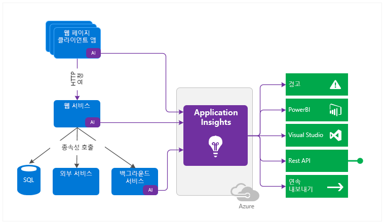
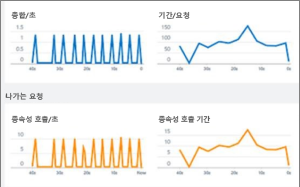
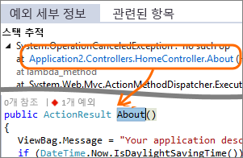
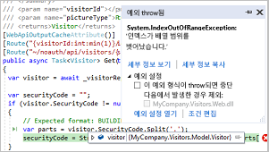
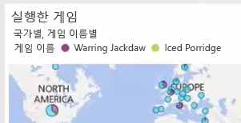

# Application Insights란?
[Azure Monitor](../overview.md)의 기능인 Application Insights는 여러 플랫폼의 웹 개발자를 위한 확장 가능한 APM(애플리케이션 성능 관리) 서비스입니다. 이를 사용하여 라이브 웹 애플리케이션을 모니터링합니다. 성능 이상을 자동으로 감지합니다. 사용자가 문제를 진단하고 앱을 사용하여 실제로 수행할 작업을 이해할 수 있도록 돕는 강력한 분석 도구를 포함합니다.  성능 및 가용성을 지속적으로 향상시킬 수 있도록 설계되었습니다. .NET, Node.js 및 Java EE, 호스트된 온-프레미스, 하이브리드 또는 퍼블릭 클라우드를 포함하여 다양한 플랫폼에서 앱과 함께 작동합니다. DevOps 프로세스와 통합되며, 다양한 개발 도구와의 연결 지점을 갖고 있습니다. Visual Studio App Center를 통합하여 모바일 앱에서 원격 분석을 모니터링하고 분석할 수 있습니다.

## Application Insights의 작동 방식
애플리케이션에 작은 계측 패키지를 설치하고 Microsoft Azure 포털에서 Application Insights 리소스를 설정합니다. 이 계측 기능이 앱을 모니터링하고 원격 분석 데이터를 Azure Monitor에 보냅니다. 애플리케이션을 어디서나 실행할 수 있습니다. Azure에 호스트할 필요가 없습니다.

웹 서비스 애플리케이션뿐 아니라 모든 백그라운드 구성 요소와 웹 페이지 자체의 JavaScript까지 계측할 수 있습니다. 

뿐만 아니라 호스트 환경에서 성능 카운터, Azure 진단, Docker 로그 등의 원격 분석을 가져올 수 있습니다. 웹 서비스에 주기적으로 가상 요청을 보내는 웹 테스트를 설정할 수도 있습니다.

이러한 모든 원격 분석 스트림은 Azure Monitor에 통합되어 있습니다. Azure Portal에서 강력한 분석 및 검색 도구를 원시 데이터에 적용할 수 있습니다.

### 오버헤드는 무엇입니까?
앱 성능에 미치는 영향을 매우 작습니다. 추적 호출은 차단되지 않으며, 별도의 스레드로 일괄 처리 및 전송합니다.

## Application Insights는 무엇을 모니터링하나요?

Application Insights는 애플리케이션 팀에서 앱의 작동 방식과 사용 방식을 이해하는 데 도움을 주기 위해 고안되었습니다. 다음 사항을 모니터링합니다.

* **요청 속도, 응답 시간 및 실패율** - 하루 중 어느 시간에 어떤 페이지를 가장 많이 방문하는지, 사용자가 어디에 있는지 확인합니다. 어떤 페이지가 가장 성능이 우수한지 확인합니다. 요청이 더 있는데 응답 시간과 실패율이 높아지면 아마도 리소스 문제가 있는 것입니다. 
* **종속성 비율, 응답 시간 및 실패율** - 외부 서비스 때문에 속도가 느려지는지 확인합니다.
* **예외** - 집계된 통계를 분석하거나 특정 인스턴스를 선택하여 스택 추적 및 관련 요청을 자세히 분석합니다. 서버 및 브라우저 예외가 전부 보고됩니다.
* **페이지 보기 및 로드 성능** - 사용자의 브라우저에서 보고합니다.
* 웹 페이지의 **AJAX 호출** - 속도, 응답 시간 및 실패율.
* **사용자 및 세션 수**.
* Windows 또는 Linux 서버 컴퓨터의 **성능 카운터** - CPU, 메모리, 네트워크 사용량 등. 
* Docker 또는 Azure의 **호스트 진단**. 
* 앱의 **진단 추적 로그** - 추적 이벤트를 요청과 상호 연결하는 데 사용됩니다.
* 판매된 품목, 승리한 게임 등의 비즈니스 이벤트를 추적하기 위해 개발자가 직접 클라이언트 또는 서버 코드로 작성하는 **사용자 지정 이벤트 및 메트릭**.

## 원격 분석은 어디서 찾을 수 있나요?

다양한 방법으로 데이터를 탐색할 수 있습니다. 다음 문서를 확인하세요.

|  |  |
| --- | --- |
| [**스마트 검색 및 수동 경고**](../../azure-monitor/app/proactive-diagnostics.md) 자동 경고는 앱의 일반적인 원격 분석 패턴에 맞게 조정되고, 일반적인 패턴을 벗어나는 항목이 있으면 트리거합니다. 특정 수준의 사용자 지정 또는 표준 메트릭에 대해 [경고를 설정](../../azure-monitor/app/alerts.md)할 수도 있습니다. | |
| [**애플리케이션 맵**](../../azure-monitor/app/app-map.md) 주요 메트릭 및 경고가 포함된 앱의 구성 요소입니다. |  |
| [**프로파일러**](../../azure-monitor/app/profiler.md) 샘플링된 요청의 실행 프로필을 검사합니다. | |
| [**사용량 현황 분석**](../../azure-monitor/app/usage-overview.md) 사용자 구분 및 재방문 주기를 분석합니다.| |
| [**인스턴스 데이터에 대한 진단 검색**](../../azure-monitor/app/diagnostic-search.md) 요청, 예외, 종속성 호출, 로그 추적 및 페이지 보기와 같은 이벤트를 검색하고 필터링할 수 있습니다.  | |
| [**집계된 데이터에 대한 메트릭 탐색기**](../../azure-monitor/app/metrics-explorer.md) 요청, 오류 및 예외의 비율과 응답 시간, 페이지 로드 시간과 같은 집계된 데이터를 탐색, 필터링 및 분할할 수 있습니다. | |
| [**대시보드**](../../azure-monitor/app/overview-dashboard.md) 여러 리소스의 데이터를 매시업한 후 다른 사용자와 공유할 수 있습니다. 다중 구성 요소 애플리케이션에서 사용하거나 단체방에 연속으로 표시하는 데 유용합니다. | |
| [**라이브 메트릭 스트림**](../../azure-monitor/app/live-stream.md) 새 빌드를 배포할 때 이러한 실시간에 가까운 성능 표시기를 확인하여 모든 항목이 예상대로 작동하는지 알 수 있습니다. | |
| [**분석**](../../azure-monitor/app/analytics.md) 이 강력한 쿼리 언어를 사용하여 앱의 성능 및 사용 현황에 대한 까다로운 질문에 답변할 수 있습니다. | |
| [**Visual Studio**](../../azure-monitor/app/visual-studio.md) 코드의 성능 데이터를 참조하세요. 스택 추적의 코드로 이동하세요.| |
| [**스냅샷 디버거**](../../azure-monitor/app/snapshot-debugger.md) 실시간 작업에서 샘플링된 스냅샷을 매개 변수 값으로 디버그합니다.| |
| [**Power BI**](../../azure-monitor/app/export-power-bi.md ) 사용 현황 메트릭을 다른 비즈니스 인텔리전스와 통합합니다.| |
| [**REST API**](https://dev.applicationinsights.io/) 메트릭 및 원시 데이터에 대한 쿼리를 실행하는 코드를 작성합니다.|  |
| [**연속 내보내기**](../../azure-monitor/app/export-telemetry.md) 원시 데이터가 도착하는 즉시 스토리지에 대량으로 내보냅니다. | |

## Application Insights를 어떻게 사용하나요?

### 모니터
앱에 Application Insights를 설치하고, [가용성 웹 테스트를 설정](../../azure-monitor/app/monitor-web-app-availability.md)하고, 다음을 수행합니다.

* 종속성, 페이지 로드 및 AJAX 호출의 부하, 응답성 및 성능을 모니터링하기 위한 팀 공간용 기본 [애플리케이션 대시보드](../../azure-monitor/app/overview-dashboard.md)를 체크 아웃합니다.
* 가장 느리고 대부분 실패한 요청을 검색합니다.
* 새 릴리스를 배포할 때 [라이브 스트림](../../azure-monitor/app/live-stream.md)을 보고 성능 저하를 즉시 인식합니다.

### 감지, 진단
경고를 수신하거나 문제를 검색한 경우:

* 얼마나 많은 사용자가 영향을 받는지 평가합니다.
* 오류는 예외, 종속성 호출 및 추적과 연관이 있습니다.
* 프로파일러, 스냅샷, 스택 덤프 및 추적 로그를 검사합니다.

### 빌드, 측정, 학습
배포하는 새로운 각 기능의 [효율성을 측정](../../azure-monitor/app/usage-overview.md)합니다.

* 고객이 새 UX 또는 비즈니스 기능을 사용하는 방식을 측정하도록 계획합니다.
* 코드에 사용자 지정 원격 분석을 작성합니다.
* 원격 분석에서 얻은 구체적인 증거를 기반으로 다음 개발 주기를 결정합니다.

## 시작하기
Application Insights는 Microsoft Azure에서 호스트되는 다양한 서비스 중 하나이며, 원격 분석이 분석 및 프레젠테이션을 위해 이 서비스로 전송됩니다. 따라서 다른 작업을 수행하기 전에 [Microsoft Azure](https://azure.com)를 구독해야 합니다. 등록은 무료이며 Application Insights에 대해 기본 [가격 책정 계획](https://azure.microsoft.com/pricing/details/application-insights/)을 선택하는 경우 애플리케이션 사용량이 특정 크기로 커질 때까지 무료입니다. 조직에 이미 구독이 있으면 해당 구독에 Microsoft 계정을 추가할 수 있습니다.

시작하는 데는 몇 가지 방법이 있습니다. 본인에게 적합한 방법으로 시작합니다. 나중에 계정을 더 추가할 수 있습니다.

* **런타임: 서버에서 웹앱을 계측합니다.** 이미 배포된 애플리케이션에 적합합니다. 코드에 대한 업데이트를 방지합니다.
  * [**Azure Web Apps에서 호스팅되는 ASP.NET 또는 ASP.NET Core 애플리케이션**](../../azure-monitor/app/azure-web-apps.md)
  * [**Azure VM 또는 Azure Virtual Machine Scale Set의 IIS에 호스트된 ASP.NET 애플리케이션**](../../azure-monitor/app/azure-vm-vmss-apps.md)
  * [**IIS 온-프레미스 VM에 호스트된 ASP.NET 애플리케이션**](../../azure-monitor/app/monitor-performance-live-website-now.md)
* **개발 타임: 코드에 Application Insights를 추가합니다.** 원격 분석 데이터 컬렉션을 사용자 지정하고 원격 분석 데이터를 추가로 전송할 수 있습니다.
  * [ASP.NET 애플리케이션](../../azure-monitor/app/asp-net.md)
  * [ASP.NET Core 애플리케이션](../../azure-monitor/app/asp-net-core.md)
  * [.NET 콘솔 애플리케이션](../../azure-monitor/app/console.md)
  * [Java](../../azure-monitor/app/java-get-started.md)
  * [Node.JS](../../azure-monitor/app/nodejs.md)
  * [기타 플랫폼](../../azure-monitor/app/platforms.md)
* 페이지 보기, AJAX 및 기타 클라이언트 쪽 원격 분석에 대해 **[웹 페이지를 계측](../../azure-monitor/app/javascript.md)** 합니다.
* Visual Studio App Center와 통합하여 **[모바일 앱 사용을 분석](../../azure-monitor/learn/mobile-center-quickstart.md)** 합니다.
* **[가용성 테스트](../../azure-monitor/app/monitor-web-app-availability.md)** -서버에서 정기적으로 웹 사이트를 ping합니다.

## 다음 단계
다음을 사용하여 런타임에 시작하세요.

* [Azure VM 및 Azure Virtual Machine Scale Set IIS 호스트 앱](../../azure-monitor/app/azure-vm-vmss-apps.md)
* [IIS 서버](../../azure-monitor/app/monitor-performance-live-website-now.md)
* [Azure Web Apps](../../azure-monitor/app/azure-web-apps.md)

다음을 사용하여 개발 시에 시작하세요.

* [ASP.NET](../../azure-monitor/app/asp-net.md)
* [ASP.NET Core](../../azure-monitor/app/asp-net-core.md)
* [Java](../../azure-monitor/app/java-get-started.md)
* [Node.JS](../../azure-monitor/app/nodejs.md)

## 지원 및 피드백
* 질문 및 문제:
  * [문제 해결][qna]
  * [MSDN 포럼](https://social.msdn.microsoft.com/Forums/vstudio/home?forum=ApplicationInsights)
  * [StackOverflow](https://stackoverflow.com/questions/tagged/ms-application-insights)
* 사용자 제안:
  * [UserVoice](https://feedback.azure.com/forums/357324-application-insights/filters/top)
* 블로그:
  * [Application Insights 블로그](https://azure.microsoft.com/blog/tag/application-insights)

<!--Link references-->

[android]: ../../azure-monitor/learn/mobile-center-quickstart.md
[azure]: ../../insights-perf-analytics.md
[client]: ../../azure-monitor/app/javascript.md
[desktop]: ../../azure-monitor/app/windows-desktop.md
[greenbrown]: ../../azure-monitor/app/asp-net.md
[ios]: ../../azure-monitor/learn/mobile-center-quickstart.md
[java]: ../../azure-monitor/app/java-get-started.md
[knowUsers]: app-insights-web-track-usage.md
[platforms]: ../../azure-monitor/app/platforms.md
[portal]: https://portal.azure.com/
[qna]: ../../azure-monitor/app/troubleshoot-faq.md
[redfield]: ../../azure-monitor/app/monitor-performance-live-website-now.md
