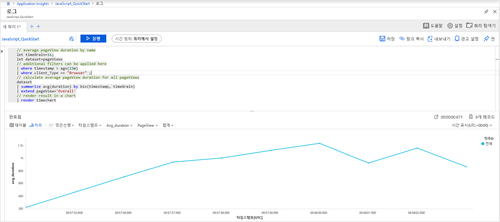
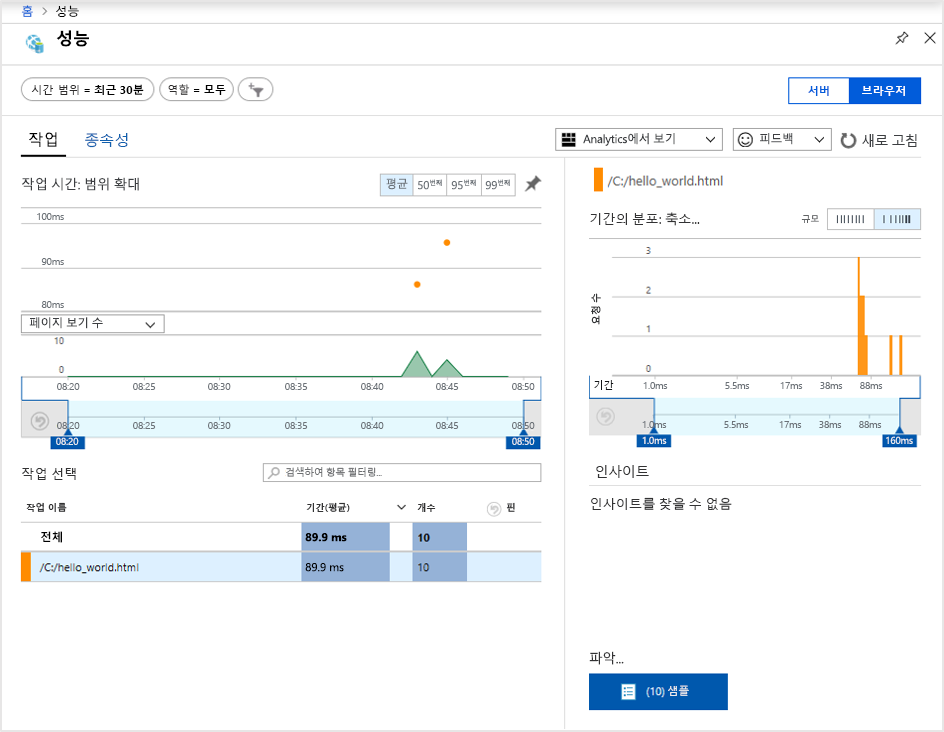
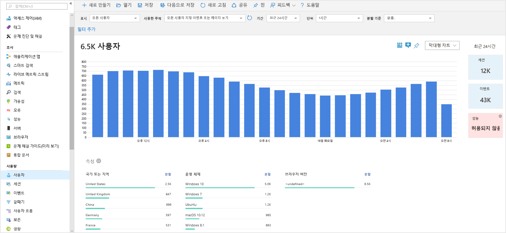

# <a name="start-monitoring-your-website"></a>웹 사이트 모니터링 시작

Azure Monitor Application Insights를 사용하면 웹 애플리케이션의 가용성, 성능 및 사용량을 쉽게 모니터링할 수 있습니다. 또한 사용자가 보고할 때까지 기다리지 않고 애플리케이션의 오류를 빠르게 식별하고 진단할 수 있습니다. Application Insights는 서버 쪽 모니터링뿐 아니라 클라이언트/브라우저 쪽 기능도 제공합니다.

이 빠른 시작에서는 [오픈 소스 Application Insight JavaScript SDK](https://github.com/Microsoft/ApplicationInsights-JS)를 추가하는 방법을 안내하며, 이를 통해 웹 사이트 방문자가 사용하는 클라이언트/브라우저 쪽 경험을 이해할 수 있습니다.

## <a name="prerequisites"></a>필수 조건

이 빠른 시작을 완료하려면 다음이 필요합니다.

- Azure 구독이 필요합니다.

Azure 구독이 아직 없는 경우 시작하기 전에 [체험](https://azure.microsoft.com/free/) 계정을 만듭니다.

## <a name="sign-in-to-the-azure-portal"></a>Azure Portal에 로그인

[Azure Portal](https://portal.azure.com/)에 로그인합니다.

## <a name="enable-application-insights"></a>Application Insights 사용

Application Insights는 온-프레미스 또는 클라우드에서 실행되고 인터넷에 연결된 모든 애플리케이션에서 원격 분석 데이터를 수집할 수 있습니다. 이 데이터를 보기 시작하려면 다음 단계를 사용합니다.

1. **리소스 만들기** > **관리 도구** > **Application Insights**를 선택합니다.

   > [!NOTE]
   >Application Insights 리소스를 처음 만드는 경우 자세한 내용은 [Application Insights 리소스 만들기](https://docs.microsoft.com/azure/azure-monitor/app/create-new-resource) 문서를 참조하세요.

   구성 상자가 표시되면 다음 표를 사용하여 입력 필드를 채웁니다.

    | 설정        | 값           | 설명  |
   | ------------- |:-------------|:-----|
   | **Name**      | 전역적으로 고유한 값 | 모니터링하는 응용 프로그램을 식별하는 이름입니다. |
   | **리소스 그룹**     | myResourceGroup      | Application Insights 데이터를 호스팅할 새 리소스 그룹의 이름입니다. |
   | **위치** | 미국 동부 | 가까운 위치 또는 응용 프로그램이 호스팅되는 위치 근처를 선택합니다. |

2. **만들기**를 클릭합니다.

## <a name="create-an-html-file"></a>HTML 파일 만들기

1. 로컬 컴퓨터에서 ``hello_world.html``이라는 파일을 만듭니다. 이 예제에서는 이 파일이 C 드라이브의 루트인 ``C:\hello_world.html``에 배치됩니다.
2. 아래 스크립트를 ``hello_world.html``에 복사합니다.

    ```html
    <!DOCTYPE html>
    <html>
    <head>
    <title>Azure Monitor Application Insights</title>
    </head>
    <body>
    <h1>Azure Monitor Application Insights Hello World!</h1>
    <p>You can use the Application Insights JavaScript SDK to perform client/browser-side monitoring of your website. To learn about more advanced JavaScript SDK configurations visit the <a href="https://github.com/Microsoft/ApplicationInsights-JS/blob/master/API-reference.md" title="API Reference">API reference</a>.</p>
    </body>
    </html>
    ```

## <a name="configure-app-insights-sdk"></a>Application Insights SDK 구성

1. **개요** > **기본 정보**를 차례로 선택하고, 애플리케이션의 **계측 키**를 복사합니다.

   

2. 다음 스크립트를 ``hello_world.html``에 추가하고 ``</head>`` 태그를 닫습니다.

   ```javascript
    <script type="text/javascript">
      var sdkInstance="appInsightsSDK";window[sdkInstance]="appInsights";var aiName=window[sdkInstance],aisdk=window[aiName]||function(e){function n(e){t[e]=function(){var n=arguments;t.queue.push(function(){t[e].apply(t,n)})}}var t={config:e};t.initialize=!0;var i=document,a=window;setTimeout(function(){var n=i.createElement("script");n.src=e.url||"https://az416426.vo.msecnd.net/scripts/b/ai.2.min.js",i.getElementsByTagName("script")[0].parentNode.appendChild(n)});try{t.cookie=i.cookie}catch(e){}t.queue=[],t.version=2;for(var r=["Event","PageView","Exception","Trace","DependencyData","Metric","PageViewPerformance"];r.length;)n("track"+r.pop());n("startTrackPage"),n("stopTrackPage");var s="Track"+r[0];if(n("start"+s),n("stop"+s),n("setAuthenticatedUserContext"),n("clearAuthenticatedUserContext"),n("flush"),!(!0===e.disableExceptionTracking||e.extensionConfig&&e.extensionConfig.ApplicationInsightsAnalytics&&!0===e.extensionConfig.ApplicationInsightsAnalytics.disableExceptionTracking)){n("_"+(r="onerror"));var o=a[r];a[r]=function(e,n,i,a,s){var c=o&&o(e,n,i,a,s);return!0!==c&&t["_"+r]({message:e,url:n,lineNumber:i,columnNumber:a,error:s}),c},e.autoExceptionInstrumented=!0}return t}(
      {
         instrumentationKey:"INSTRUMENTATION_KEY"
      }
      );window[aiName]=aisdk,aisdk.queue&&0===aisdk.queue.length&&aisdk.trackPageView({});
   </script>
   ```

3. ``hello_world.html``을 편집하고 계측 키를 추가합니다.

4. 로컬 브라우저 세션에서 ``hello_world.html``을 엽니다. 이렇게 하면 페이지 보기가 하나 만들어집니다. 브라우저를 새로 고침하여 여러 테스트 페이지 보기를 생성할 수 있습니다.

## <a name="start-monitoring-in-the-azure-portal"></a>Azure Portal에서 모니터링 시작

1. 이제 계측 키를 검색한 Azure Portal에서 Application Insights **개요** 페이지를 다시 열어 현재 실행 중인 애플리케이션에 대한 세부 정보를 볼 수 있습니다. 개요 페이지의 기본 차트 4개는 그 범위가 서버 쪽 애플리케이션 데이터로 지정됩니다. 우리가 계측하려는 것은 JavaScript SDK와의 클라이언트/브라우저 쪽 상호 작용이므로 서버 쪽 SDK가 설치되지 않은 이상, 이 보기가 적용되지 않습니다.

2. **분석**을 클릭합니다.  그러면 Application Insights에서 수집한 모든 데이터를 분석하기 위한 풍부한 쿼리 언어를 제공하는 **Analytics**가 열립니다. 클라이언트 쪽 브라우저 요청과 관련된 데이터를 보려면 다음 쿼리를 실행합니다.

    ```kusto
    // average pageView duration by name
    let timeGrain=1s;
    let dataset=pageViews
    // additional filters can be applied here
    | where timestamp > ago(15m)
    | where client_Type == "Browser" ;
    // calculate average pageView duration for all pageViews
    dataset
    | summarize avg(duration) by bin(timestamp, timeGrain)
    | extend pageView='Overall'
    // render result in a chart
    | render timechart
    ```

   

3. **개요** 페이지로 돌아갑니다. **조사** 헤더 아래에서 **브라우저**를 클릭한 다음, **성능**을 선택합니다. 여기서 웹 사이트 성능과 관련된 메트릭을 찾을 수 있습니다. 웹 사이트의 실패 및 예외를 분석할 수 있는 보기도 있습니다. **샘플**을 클릭하여 개별 트랜잭션 세부 정보로 드릴다운할 수 있습니다. 여기서 [엔드투엔드 트랜잭션 세부 정보](../../azure-monitor/app/transaction-diagnostics.md)에 액세스할 수 있습니다.

   

4. [사용자 동작 분석 도구](../../azure-monitor/app/usage-overview.md) 탐색을 시작하려면 Application Insights 주 메뉴의 **사용량** 헤더 아래에서 [**사용자**](../../azure-monitor/app/usage-segmentation.md)를 선택합니다. 현재 단일 머신으로 테스트 중이기 때문에 한 사용자에 대한 데이터만 표시됩니다. 라이브 웹 사이트의 경우 사용자 분포가 다음과 비슷합니다.

     

5. 페이지가 여러 개 있는 좀 더 복잡한 웹 사이트를 계측하는 경우 [**사용자 흐름**](../../azure-monitor/app/usage-flows.md) 도구가 유용합니다. **사용자 흐름** 도구를 사용하면 방문자가 웹 사이트의 여러 부분을 탐색하는 경로를 추적할 수 있습니다.

   

웹 사이트 모니터링을 위한 고급 구성에 대해 자세히 알아보려면 [JavaScript SDK API 참조](https://github.com/Microsoft/ApplicationInsights-JS/blob/master/API-reference.md)를 확인하세요.

## <a name="clean-up-resources"></a>리소스 정리

다음 빠른 시작 또는 자습서를 사용하여 계속하려는 경우 이 빠른 시작에서 만든 리소스를 정리하지 않습니다. 그렇지 않으면 다음 단계에 따라 이 빠른 시작에서 만든 모든 리소스를 Azure Portal에서 삭제합니다.

1. Azure Portal의 왼쪽 메뉴에서 **리소스 그룹**과 **myResourceGroup**을 차례로 클릭합니다.
2. 리소스 그룹 페이지에서 **삭제**를 클릭하고 텍스트 상자에 **myResourceGroup**을 입력한 후 **삭제**를 클릭합니다.

## <a name="next-steps"></a>다음 단계

> [!div class="nextstepaction"]
> [성능 문제 찾기 및 진단](https://docs.microsoft.com/azure/application-insights/app-insights-analytics)
