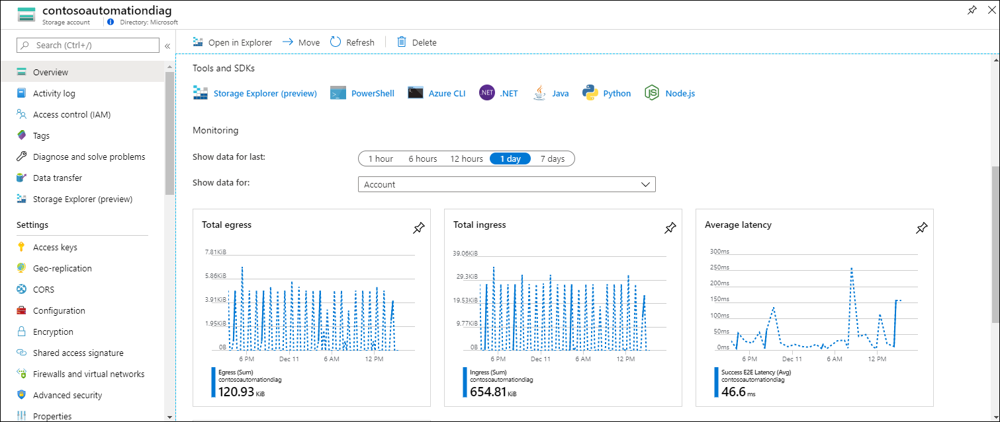

# 빠른 시작: Azure Monitor를 사용하여 Azure 리소스 모니터링
[Azure Monitor](../overview.md)는 생성되는 순간부터 Azure 리소스에서 데이터 수집을 시작합니다. 이 빠른 시작에서는 리소스에 대해 자동으로 수집되는 데이터 및 특정 리소스에 대한 Azure Portal에서 이 데이터를 보는 방법에 대한 간단한 연습을 제공합니다. 나중에 추가 데이터를 수집하는 구성을 추가하고, Azure Monitor 메뉴로 이동한 후 동일한 도구를 사용하여 구독의 모든 리소스에 대해 수집된 데이터에 액세스할 수 있습니다.

Azure 리소스에서 수집된 데이터 모니터링에 대한 자세한 내용은 [Azure Monitor를 사용하여 Azure 리소스 모니터링](../essentials/monitor-azure-resource.md)을 참조하세요.

## Azure Portal에 로그인

[https://portal.azure.com](https://portal.azure.com)에서 Azure Portal에 로그인합니다. 

## 개요 페이지
많은 서비스가 작업을 한눈에 파악할 수 있도록 **개요** 페이지에 모니터링 데이터를 포함할 것입니다. 개요는 일반적으로 Azure Monitor 메트릭에 저장된 플랫폼 메트릭의 하위 세트를 기반으로 합니다.

1. 구독에서 Azure 리소스를 찾습니다.
2. **개요** 페이지로 이동하여 표시된 성능 데이터가 있는지 확인합니다. 이 데이터는 Azure Monitor에서 제공합니다. 아래 예제는 Azure 스토리지 계정의 **개요** 페이지이며, 여러 메트릭이 표시된 것을 볼 수 있습니다.

    

3. 아무 그래프를 클릭하면 아래에 설명된 메트릭 탐색기에서 데이터가 열립니다.

## 활동 로그 보기
활동 로그는 구독에 있는 각 Azure 리소스의 작업에 대한 인사이트를 제공합니다. 여기에는 리소스가 생성 또는 수정된 시간, 작업이 시작된 시간, 특정 작업이 발생하는 조건 등의 정보가 포함됩니다.

1. 리소스 메뉴 맨 위에서 **활동 로그** 를 선택합니다.
2. 현재 필터는 리소스와 관련된 이벤트로 설정되어 있습니다. 이벤트가 보이지 않으면 **시간 범위** 를 변경하여 시간 범위를 늘려봅니다.

    

4. 구독에 있는 다른 리소스의 이벤트를 보려면 필터의 조건을 변경하거나 필터 속성을 제거합니다.

    

## 메트릭 보기
메트릭은 특정 시간에 리소스의 일부 측면을 설명하는 숫자 값입니다. Azure Monitor는 모든 Azure 리소스에서 1분 간격으로 플랫폼 메트릭을 자동으로 수집합니다. 메트릭 탐색기를 사용하여 이러한 메트릭을 볼 수 있습니다.

1. 리소스 메뉴의 **모니터링** 섹션에서 **메트릭** 을 선택합니다. 그러면 범위가 리소스로 설정된 메트릭 탐색기가 열립니다.
2. **메트릭 추가** 를 클릭하여 차트에 메트릭을 추가합니다.
   
   
   
4. 드롭다운 목록에서 **메트릭** 을 선택하고 **집계** 를 선택합니다. 그러면 수집된 값을 시간 간격마다 샘플링하는 방법이 정의됩니다.

    

5. **메트릭 추가** 를 클릭하여 차트에 메트릭 및 집계 조합을 추가합니다.

    

## 다음 단계
이 빠른 시작에서는 Azure Monitor에서 자동으로 수집하는 Azure 리소스에 대한 활동 로그 및 메트릭을 살펴보았습니다. [로그 쿼리](../logs/log-query-overview.md)를 사용하여 분석할 수 있는 Log Analytics 작업 영역에 활동 로그를 수집하는 방법을 보여주는 다음 빠른 시작을 계속 진행하세요.

> [!div class="nextstepaction"]
> [Azure 활동 로그를 Log Analytics 작업 영역으로 보내기](./quick-collect-activity-log-portal.md)