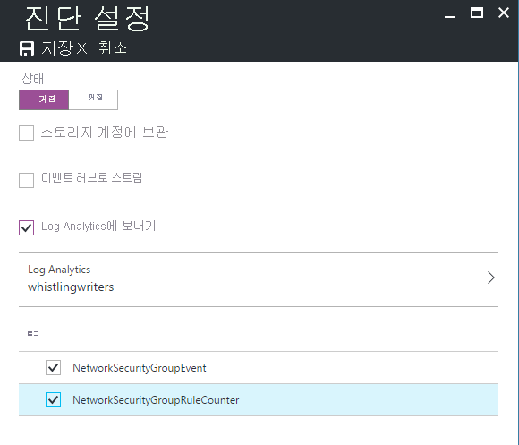
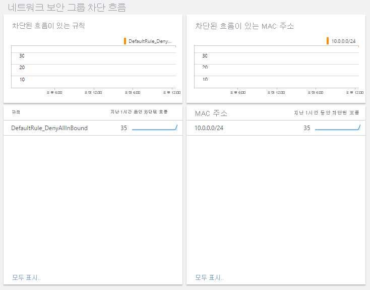

# <a name="azure-networking-monitoring-solutions-in-azure-monitor"></a>Azure Monitor에서 솔루션을 모니터링 하는 azure 네트워킹

[!INCLUDE [updated-for-az](../../../includes/updated-for-az.md)]

Azure Monitor는 네트워크 모니터링에 대 한 다음 솔루션을 제공 합니다.
* NPM(네트워크 성능 모니터)
    * 네트워크 상태 모니터링
* 검토할 Azure Application Gateway 분석
    * Azure Application Gateway 로그
    * Azure Application Gateway 메트릭
* 클라우드 네트워크에서 네트워크 작업을 모니터링하고 감사하는 솔루션
    * [트래픽 분석](https://docs.microsoft.com/azure/networking/network-monitoring-overview#traffic-analytics) 
    * Azure 네트워크 보안 그룹 분석

## <a name="network-performance-monitor-npm"></a>NPM(네트워크 성능 모니터)

[네트워크 성능 모니터](https://docs.microsoft.com/azure/networking/network-monitoring-overview) 관리 솔루션은 네트워크의 상태, 가용성 및 연결 가능성을 모니터링하는 네트워크 모니터링 솔루션입니다.  다음 항목 간의 연결을 모니터링하는 데 사용됩니다.

* 공용 클라우드 및 온-프레미스
* 데이터 센터 및 사용자 위치(지점)
* 다중 계층 애플리케이션의 다양한 계층을 호스팅하는 서브넷

자세한 내용은 [네트워크 성능 모니터](https://docs.microsoft.com/azure/networking/network-monitoring-overview)를 참조하세요.

## <a name="azure-application-gateway-and-network-security-group-analytics"></a>Azure Application Gateway 및 네트워크 보안 그룹 분석
솔루션을 사용하려면:
1. Azure Monitor에 관리 솔루션을 추가 하 고
2. Azure Monitor에서 Log Analytics 작업 영역에 진단을 지시 하는 진단을 사용 하도록 설정 합니다. Azure Blob Storage에 로그를 작성할 필요는 없습니다.

Application Gateway 및 네트워킹 보안 그룹 중 하나 또는 둘 다에 대해 진단 및 해당 솔루션을 사용할 수 있습니다.

특정 리소스 유형에 진단 로깅을 사용하도록 설정하지 않고 솔루션을 설치하면 해당 리소스의 대시보드 블레이드가 비어 있고 오류 메시지가 표시됩니다.

> [!NOTE]
> 2017 년 1 월 전송에 대 한 지원 되는 방식의 Application Gateway 및 네트워크 보안 그룹에서 변경 하는 Log Analytics 작업 영역에 기록 합니다. **Azure Networking Analytics(사용되지 않음)** 솔루션을 표시하는 경우 수행해야 할 단계는 [이전 Networking Analytics 솔루션에서 마이그레이션](#migrating-from-the-old-networking-analytics-solution)을 참조하세요.
>
>

## <a name="review-azure-networking-data-collection-details"></a>Azure 네트워킹 데이터 수집 세부 정보 검토
Azure Application Gateway 분석 및 네트워크 보안 그룹 분석 관리 솔루션은 Azure Application Gateway 및 네트워크 보안 그룹에서 직접 진단 로그를 수집합니다. Azure Blob Storage에 로그를 작성할 필요가 없으며 데이터를 수집하는 데 에이전트가 필요하지 않습니다.

다음 표에서는 Azure Application Gateway 분석 및 네트워크 보안 그룹 분석에서 데이터가 수집되는 방법에 대한 데이터 수집 방법 및 기타 세부 정보를 보여 줍니다.

| 플랫폼 | 직접 에이전트 | Systems Center Operations Manager 에이전트 | Azure | Operations Manager 필요 여부 | 관리 그룹을 통해 전송되는 Operations Manager 에이전트 데이터 | 수집 빈도 |
| --- | --- | --- | --- | --- | --- | --- |
| Azure |  |  |&#8226; |  |  |기록될 때 |


## <a name="azure-application-gateway-analytics-solution-in-azure-monitor"></a>Azure Monitor에서 azure Application Gateway 분석 솔루션


Application Gateway에는 다음 로그가 지원됩니다.

* ApplicationGatewayAccessLog
* ApplicationGatewayPerformanceLog
* ApplicationGatewayFirewallLog

Application Gateway에는 다음 메트릭이 지원됩니다.


* 5분 처리량

### <a name="install-and-configure-the-solution"></a>솔루션 설치 및 구성
다음 지침을 사용하여 Azure Application Gateway 분석 솔루션을 설치하고 구성합니다.

1. Azure Application Gateway 분석 솔루션을 사용 하도록 설정 [Azure marketplace](https://azuremarketplace.microsoft.com/marketplace/apps/Microsoft.AzureAppGatewayAnalyticsOMS?tab=Overview) 하거나에 설명 된 프로세스를 사용 하 여 [솔루션 갤러리에서 Azure Monitor 추가 솔루션](../../azure-monitor/insights/solutions.md)합니다.
2. 모니터링할 [Application Gateway](../../application-gateway/application-gateway-diagnostics.md)에 대해 진단 로깅을 사용하도록 설정합니다.

#### <a name="enable-azure-application-gateway-diagnostics-in-the-portal"></a>포털에서 Azure Application Gateway 진단 사용 설정

1. Azure portal에서 모니터링할 Application Gateway 리소스로 이동 합니다.
2. 선택 *진단 로그* 다음 페이지를 엽니다.

   
3. 클릭 *진단 켜기* 다음 페이지를 엽니다.

   
4. 진단을 켜려면 클릭 *온* 아래에서 *상태*합니다.
5. 에 대 한 확인란을 클릭 *Log Analytics에 보내기*합니다.
6. 기존 Log Analytics 작업 영역을 선택 하거나 작업 영역을 만듭니다.
7. 아래에 있는 확인란을 클릭 **로그** 각 수집할 로그 유형에 대 한 합니다.
8. 클릭 *저장할* Azure Monitor에 대 한 진단 로깅을 사용 하도록 설정 합니다.

#### <a name="enable-azure-network-diagnostics-using-powershell"></a>PowerShell을 사용하여 Azure 네트워크 진단 사용 설정

다음 PowerShell 스크립트는 애플리케이션 게이트웨이에 진단 로깅을 사용하도록 설정하는 방법에 대한 예제를 제공합니다.

```powershell
$workspaceId = "/subscriptions/d2e37fee-1234-40b2-5678-0b2199de3b50/resourcegroups/oi-default-east-us/providers/microsoft.operationalinsights/workspaces/rollingbaskets"

$gateway = Get-AzApplicationGateway -Name 'ContosoGateway'

Set-AzDiagnosticSetting -ResourceId $gateway.ResourceId  -WorkspaceId $workspaceId -Enabled $true
```

### <a name="use-azure-application-gateway-analytics"></a>Azure Application Gateway 분석 사용


개요에서 **Azure Application Gateway 분석** 타일을 클릭한 후 로그 요약을 확인한 후 다음 범주에 대한 세부 정보를 파악할 수 있습니다.

* Application Gateway 액세스 로그
  * Application Gateway 액세스 로그에 대한 클라이언트 및 서버 오류
  * 각 Application Gateway의 시간당 요청
  * 각 Application Gateway의 시간당 실패한 요청
  * Application Gateway에 대한 사용자 에이전트별 오류
* Application Gateway 성능 
  * Application Gateway에 대한 호스트 상태
  * Application Gateway 실패한 요청에 대해 최댓값 및 95번째 백분위수


**Azure Application Gateway 분석** 대시보드의 블레이드 중 하나에서 요약 정보를 검토한 다음 하나를 클릭하여 로그 검색 페이지에서 해당 항목에 대한 세부 정보를 봅니다.

로그 검색 페이지에서, 시간별 결과, 자세한 결과 및 로그 검색 기록을 볼 수 있습니다. 패싯으로 필터링하여 결과 범위를 좁힐 수 있습니다.


## <a name="azure-network-security-group-analytics-solution-in-azure-monitor"></a>Azure Monitor에서 azure 네트워크 보안 그룹 분석 솔루션


> [!NOTE]
> 해당 기능이 [트래픽 분석](../../network-watcher/traffic-analytics.md)으로 대체되었으므로 네트워크 보안 그룹 분석 솔루션은 커뮤니티 지원으로 이동합니다.
> - 이제 솔루션은 [Azure 빠른 시작 템플릿](https://azure.microsoft.com/resources/templates/oms-azurensg-solution/)에서 지원되고 곧 Azure Marketplace에서 더 이상 지원되지 않습니다.
> - 이미 해당 작업 영역에 솔루션을 추가한 기존 고객의 경우 변경 없이 계속 작동됩니다.
> - Microsoft는 진단 설정을 사용하여 NSG 진단 로그를 작업 영역으로 전송하도록 계속 지원합니다.

네트워크 보안 그룹에는 다음 로그가 지원됩니다.

* NetworkSecurityGroupEvent
* NetworkSecurityGroupRuleCounter

### <a name="install-and-configure-the-solution"></a>솔루션 설치 및 구성
다음 지침을 사용하여 Azure Networking Analytics 솔루션을 설치 및 구성합니다.

1. Azure 네트워크 보안 그룹 분석 솔루션을 사용 하도록 설정 [Azure marketplace](https://azuremarketplace.microsoft.com/marketplace/apps/Microsoft.AzureNSGAnalyticsOMS?tab=Overview) 하거나에 설명 된 프로세스를 사용 하 여 [솔루션 갤러리에서 Azure Monitor 추가 솔루션](../../azure-monitor/insights/solutions.md)합니다.
2. 모니터링할 [네트워크 보안 그룹](../../virtual-network/virtual-network-nsg-manage-log.md) 리소스에 대해 진단 로깅을 사용하도록 설정합니다.

### <a name="enable-azure-network-security-group-diagnostics-in-the-portal"></a>포털에서 Azure 네트워크 보안 그룹 진단 사용 설정

1. Azure Portal에서 모니터링할 네트워크 보안 그룹 리소스로 이동합니다.
2. *진단 로그*를 선택하여 다음 페이지를 엽니다.

   
3. *진단 사용*을 클릭하여 다음 페이지를 엽니다.

   
4. 진단을 사용하려면 *상태*에서 *켜기*를 클릭합니다.
5. *Log Analytics로 보내기* 확인란을 클릭합니다.
6. 기존 Log Analytics 작업 영역을 선택하거나 작업 영역을 만듭니다.
7. 수집할 각 로그 유형에 대해 **로그** 아래의 확인란을 클릭합니다.
8. *저장*을 클릭하여 Log Analytics로의 진단 로깅을 활성화합니다.

### <a name="enable-azure-network-diagnostics-using-powershell"></a>PowerShell을 사용하여 Azure 네트워크 진단 사용 설정

다음 PowerShell 스크립트는 네트워크 보안 그룹에 진단 로깅을 사용하도록 설정하는 방법에 대한 예제를 제공합니다.
```powershell
$workspaceId = "/subscriptions/d2e37fee-1234-40b2-5678-0b2199de3b50/resourcegroups/oi-default-east-us/providers/microsoft.operationalinsights/workspaces/rollingbaskets"

$nsg = Get-AzNetworkSecurityGroup -Name 'ContosoNSG'

Set-AzDiagnosticSetting -ResourceId $nsg.ResourceId  -WorkspaceId $workspaceId -Enabled $true
```

### <a name="use-azure-network-security-group-analytics"></a>Azure 네트워크 보안 그룹 분석 사용
[개요]에서 **Azure 네트워크 보안 그룹 분석** 타일을 클릭한 후 로그 요약을 확인한 후 다음 범주에 대한 세부 정보를 파악할 수 있습니다.

* 네트워크 보안 그룹 차단 흐름
  * 차단된 흐름이 있는 네트워크 보안 그룹 규칙
  * 차단된 흐름이 있는 MAC 주소 
* 네트워크 보안 그룹 허용 흐름
  * 허용된 흐름이 있는 네트워크 보안 그룹 규칙
  * 허용된 흐름이 있는 MAC 주소 




**Azure 네트워크 보안 그룹 분석** 대시보드의 블레이드 중 하나에서 요약 정보를 검토한 다음 하나를 클릭하여 로그 검색 페이지에서 해당 항목에 대한 세부 정보를 봅니다.

로그 검색 페이지에서, 시간별 결과, 자세한 결과 및 로그 검색 기록을 볼 수 있습니다. 패싯으로 필터링하여 결과 범위를 좁힐 수 있습니다.

## <a name="migrating-from-the-old-networking-analytics-solution"></a>이전 Networking Analytics 솔루션에서 마이그레이션
2017 년 1 월 전송 하는 지원 되는 방법은 Azure Application Gateway 및 Azure 네트워크 보안 그룹에서 변경 하는 Log Analytics 작업 영역에 기록 합니다. 이러한 변경은 다음과 같은 이점을 제공합니다.
+ 로그는 저장소 계정을 사용 하지 않아도 Azure Monitor에 직접 기록
+ Azure Monitor에서 사용할 수 있도록 로그를 생성 하는 경우 시간에서 대기 시간이 짧습니다
+ 구성 단계 감소
+ 모든 유형의 Azure 진단을 위한 공통 형식

업데이트된 솔루션을 사용하려면 다음을 수행합니다.

1. [Azure Application Gateway에서 Azure Monitor로 직접 보내도록 진단을 구성 합니다.](#enable-azure-application-gateway-diagnostics-in-the-portal)
2. [Azure 네트워크 보안 그룹에서 Azure Monitor로 직접 보내도록 진단을 구성 합니다.](#enable-azure-network-security-group-diagnostics-in-the-portal)
2. 사용 하도록 설정 합니다 *Azure Application Gateway 분석* 하며 *Azure 네트워크 보안 그룹 분석* 에서 설명한 프로세스를 사용 하 여 솔루션 [에서 Azure Monitor 추가 솔루션은 솔루션 갤러리](solutions.md)
3. 새 데이터 형식을 사용하도록 저장된 쿼리, 대시보드 또는 경고를 업데이트합니다.
   + 형식은 AzureDiagnostics로 변경합니다. ResourceType을 사용하여 Azure 네트워킹 로그로 필터링할 수 있습니다.

     | 다음 위치 대신 | 사용: |
     | --- | --- |
     | NetworkApplicationgateways &#124; where OperationName=="ApplicationGatewayAccess" | AzureDiagnostics &#124; where ResourceType="APPLICATIONGATEWAYS" and OperationName=="ApplicationGatewayAccess" |
     | NetworkApplicationgateways &#124; where OperationName=="ApplicationGatewayPerformance" | AzureDiagnostics &#124; where ResourceType=="APPLICATIONGATEWAYS" and OperationName=ApplicationGatewayPerformance |
     | NetworkSecuritygroups | AzureDiagnostics &#124; where ResourceType=="NETWORKSECURITYGROUPS" |

   + 이름에 \_s, \_d 또는 \_g 접미사가 있는 필드의 경우 첫 번째 문자를 소문자로 변경합니다.
   + 이름에 \_o 접미사가 있는 모든 필드의 경우 데이터는 중첩된 필드 이름에 기반하여 개별 필드로 분할합니다.
4. *Azure Networking Analytics(사용되지 않음)* 솔루션을 제거합니다.
   + PowerShell을 사용 하는 경우 `Set-AzureOperationalInsightsIntelligencePack -ResourceGroupName <resource group that the workspace is in> -WorkspaceName <name of the log analytics workspace> -IntelligencePackName "AzureNetwork" -Enabled $false`

변경 전에 수집된 데이터는 새 솔루션에서 볼 수 없습니다. 이전 형식 및 필드 이름을 사용하여 이 데이터를 계속 쿼리할 수 있습니다.

## <a name="troubleshooting"></a>문제 해결
[!INCLUDE [log-analytics-troubleshoot-azure-diagnostics](../../../includes/log-analytics-troubleshoot-azure-diagnostics.md)]

## <a name="next-steps"></a>다음 단계
* 사용 하 여 [Azure Monitor에서 로그 쿼리](../log-query/log-query-overview.md) 자세한 Azure 진단 데이터를 볼 수 있습니다.
