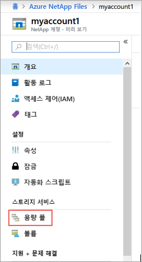
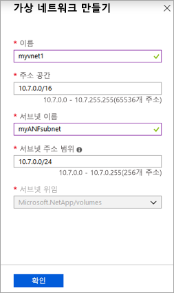

# Azure NetApp Files 설정 및 볼륨 만들기 

이 문서에서는 신속하게 Azure NetApp Files를 설정하고 볼륨을 만드는 방법을 보여줍니다. 

## 시작하기 전에 

사용자가 공개 미리 보기 프로그램에 속해 있고 Microsoft.NetApp Azure 리소스 공급자에 액세스하는 허용 목록에 지정되어야 합니다. 공개 미리 보기 프로그램에 참여하는 방법에 대한 자세한 내용은 [Azure NetApp Files 공개 미리 보기 등록 페이지](https://aka.ms/nfspublicpreview)를 참조하세요. 

## Azure NetApp Files 및 NetApp 리소스 공급자 등록

1. Azure Portal의 오른쪽 위 모서리에 있는 Azure Cloud Shell 아이콘을 클릭합니다.

      

2. 다음과 같이 Azure NetApp Files의 허용 목록에 포함된 구독을 지정합니다.
    
        az account set --subscription <subscriptionId>

3. 다음과 같이 Azure 리소스 공급자를 등록합니다. 
    
        az provider register --namespace Microsoft.NetApp --wait  

    등록 프로세스는 완료하는 데 다소 시간이 걸릴 수 있습니다.

## NetApp 계정 만들기

1. Azure Portal의 검색 상자에 **Azure NetApp Files**를 입력한 다음, 나타나는 목록에서 **Azure NetApp Files(미리 보기)** 를 선택합니다.

      

2. **+ 추가**를 클릭하여 새 NetApp 계정을 만듭니다.

     

3. [새 NetApp 계정] 창에서 다음 정보를 입력합니다. 
   1. 계정 이름으로 **myaccount1**을 입력합니다. 
   2. 구독을 선택합니다.
   3. **새로 만들기**를 선택하여 새 리소스 그룹을 만듭니다. 리소스 그룹 이름으로 **myRG1**을 입력합니다. **확인**을 클릭합니다. 
   4. 계정 위치를 선택합니다.  

        

      

4. **만들기**를 클릭하여 새 NetApp 계정을 만듭니다.

## 용량 풀 설정

1. Azure NetApp Files 관리 블레이드에서 NetApp 계정(**myaccount1**)을 선택합니다.

      

2. NetApp 계정의 Azure NetApp Files 관리 블레이드에서 **용량 풀**을 클릭합니다.

      

3. **+ 풀 추가**를 클릭합니다. 

      

4. 다음과 같은 용량 풀 정보를 입력합니다. 
    1. 풀 이름으로 **mypool1**을 입력합니다.
    2. 서비스 수준으로 **프리미엄**을 선택합니다. 
    3. 풀 크기로 **4(TiB)** 를 지정합니다. 

5. **확인**을 클릭합니다.

## Azure NetApp Files에 대한 볼륨 만들기

1. NetApp 계정의 Azure NetApp Files 관리 블레이드에서 **볼륨**을 클릭합니다.

      

2. **+ 볼륨 추가**를 클릭합니다.

      

3. 볼륨 만들기 창에서 다음과 같은 볼륨 정보를 입력합니다. 
   1. 볼륨 이름으로 **myvol1**을 입력합니다. 
   2. 볼륨의 내보내기 경로를 만드는 데 사용할 파일 경로로 **myfilepath1**을 입력합니다.
   3. 용량 풀을 선택합니다(**mypool1**).
   4. 할당량은 기본값을 사용합니다. 
   5. 가상 네트워크 아래에서 **새로 만들기**를 클릭하여 새 Azure 가상 네트워크(Vnet)를 만듭니다.  다음 정보를 입력합니다.
       * Vnet 이름으로 **myvnet1**을 입력합니다.
       * 설정의 주소 공간을 지정합니다(예: 10.7.0.0/16).
       * 서브넷 이름으로 **myANFsubnet**을 입력합니다.
       * 서브넷 주소 범위를 지정합니다(예: 10.7.0.0/24). 전용 서브넷은 다른 리소스와 공유할 수 없습니다.
       * 서브넷 위임으로 **Microsoft.NetApp/volumes**를 선택합니다.
       * **확인**을 클릭하여 Vnet을 만듭니다.
   6. 서브넷에서, 새로 만든 Vnet(**myvnet1**)을 대리자 서브넷으로 선택합니다.

        

        

4. **검토 + 만들기**를 클릭합니다.

      

5. 볼륨의 정보를 검토한 다음, **만들기**를 클릭합니다.  
    만든 볼륨은 볼륨 블레이드에 표시됩니다.

      

## 다음 단계  

* [Azure NetApp Files의 스토리지 계층 구조 이해](azure-netapp-files-understand-storage-hierarchy.md)
* [Azure NetApp Files를 사용하여 볼륨 관리](azure-netapp-files-manage-volumes.md) 
