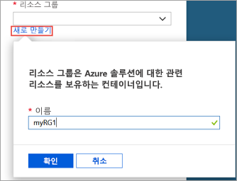
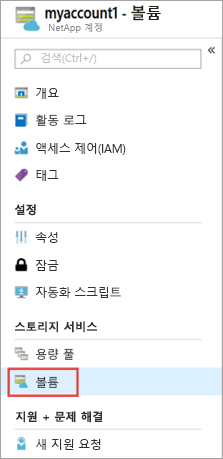

# Azure NetApp Files 설정 및 볼륨 만들기 

이 문서에서는 빠르게 Azure NetApp 파일을 설정 하 고 볼륨을 만드는 방법을 보여 줍니다. 

## 시작하기 전에 

사용자가 공개 미리 보기 프로그램에 속해 있고 Microsoft.NetApp Azure 리소스 공급자에 액세스하는 허용 목록에 지정되어야 합니다. 공개 미리 보기 프로그램에 참여하는 방법에 대한 자세한 내용은 [Azure NetApp Files 공개 미리 보기 등록 페이지](https://aka.ms/nfspublicpreview)를 참조하세요. 

## Azure NetApp 파일 및 NetApp 리소스 공급자 등록

1. Azure portal에서 오른쪽 위 모서리에 있는 Azure Cloud Shell 아이콘을 클릭 합니다.

      

2. Azure NetApp 파일에 대 한 허용 목록에 포함 된 구독을 지정 합니다.
    
        az account set --subscription <subscriptionId>

3. Azure 리소스 공급자를 등록 합니다. 
    
        az provider register --namespace Microsoft.NetApp --wait  

    등록 프로세스는 완료하는 데 다소 시간이 걸릴 수 있습니다.

## NetApp 계정 만들기

1. Azure portal의 검색 상자에서 입력 **Azure NetApp Files** 선택한 후 **Azure NetApp 파일 (미리 보기)** 나타나는 목록에서.

      

2. **+ 추가**를 클릭하여 새 NetApp 계정을 만듭니다.

     

3. 새 NetApp 계정 창에서 다음 정보를 제공 합니다. 
   1. 입력 **myaccount1** 계정 이름에 대 한 합니다. 
   2. 구독을 선택합니다.
   3. 선택 **새로 만들기** 새 리소스 그룹을 만듭니다. 입력 **myRG1** 리소스 그룹 이름에 대 한 합니다. **확인**을 클릭합니다. 
   4. 계정 위치를 선택 합니다.  

        

      

4. 클릭 **만들기** 새 NetApp 계정을 만듭니다.

## 용량 풀 설정

1. Azure NetApp 파일 관리 블레이드에서 NetApp 계정을 선택 (**myaccount1**).

      

2. NetApp 계정의 Azure NetApp 파일 관리 블레이드에서 클릭 **용량 풀**합니다.

      

3. 클릭 **풀 추가 +** 합니다. 

      

4. 용량 풀에 대 한 정보를 제공 합니다. 
    1. 입력 **mypool1** 풀 이름으로 합니다.
    2. 선택 **Premium** 서비스 수준에 대 한 합니다. 
    3. 지정할 **4 (TiB)** 풀 크기입니다. 

5. **확인**을 클릭합니다.

## Azure NetApp Files에 대한 볼륨 만들기

1. NetApp 계정의 Azure NetApp 파일 관리 블레이드에서 클릭 **볼륨**합니다.

      

2. **+ 볼륨 추가**를 클릭합니다.

      

3. 볼륨 창 만들기, 볼륨에 대 한 정보를 제공 합니다. 
   1. 입력 **myvol1** 볼륨 이름으로 합니다. 
   2. 입력 **myfilepath1** 를 볼륨에 대 한 내보내기 경로 만드는 데 사용할 파일 경로입니다.
   3. 용량 풀 선택 (**mypool1**).
   4. 할당량에 대 한 기본값을 사용 합니다. 
   5. 가상 네트워크에서 클릭 **새로 만들기** 새로운 Azure virtual network (Vnet)를 만들려고 합니다.  그런 다음 다음 정보를 입력 합니다.
       * 입력 **myvnet1** Vnet 이름으로 합니다.
       * 예를 들어 10.7.0.0/16 설정에 대 한 주소 공간 지정
       * 입력 **myANFsubnet** 서브넷 이름으로 합니다.
       * 예를 들어 10.7.0.0/24 서브넷 주소 범위를 지정 합니다. 다른 리소스와 전용된 서브넷을 공유할 수 없습니다는 참고 합니다.
       * 선택 **Microsoft.NetApp/volumes** 서브넷 위임에 대 한 합니다.
       * 클릭 **확인** Vnet을 만들어야 합니다.
   6. 서브넷에서 새로 만든된 Vnet 선택 (**myvnet1**) 대리자 서브넷입니다.

        

        

4. **검토 + 만들기**를 클릭합니다.

      

5. 볼륨에 대 한 정보를 검토 한 다음 클릭 **만들기**합니다.  
    만든된 볼륨 볼륨 블레이드에 표시 됩니다.

      

## 다음 단계  

* [Azure NetApp Files의 스토리지 계층 구조 이해](azure-netapp-files-understand-storage-hierarchy.md)
* [NetApp Azure Files를 사용 하 여 볼륨 관리](azure-netapp-files-manage-volumes.md) 
