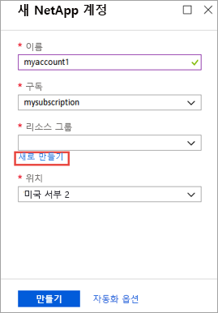
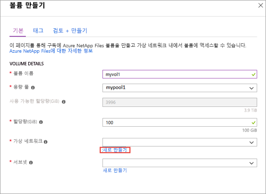
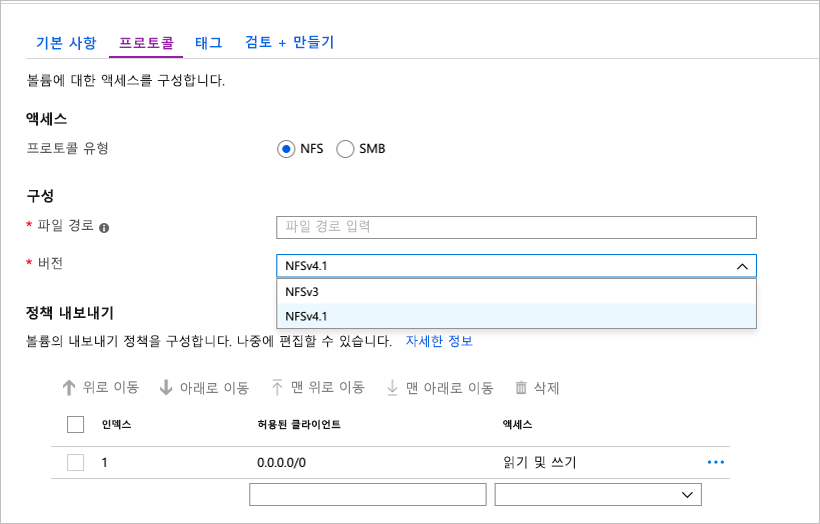

# <a name="quickstart-set-up-azure-netapp-files-and-create-an-nfs-volume"></a>빠른 시작: Azure NetApp Files 설정 및 NFS 볼륨 만들기 

이 문서에서는 신속하게 Azure NetApp Files를 설정하고 볼륨을 만드는 방법을 보여줍니다. 

이 빠른 시작에서는 다음 항목을 설정합니다.

- Azure NetApp Files 및 NetApp 리소스 공급 기업 등록
- NetApp 계정
- 용량 풀
- Azure NetApp Files에 대한 NFS 볼륨

Azure 구독이 아직 없는 경우 시작하기 전에 [체험 계정](https://azure.microsoft.com/free/?WT.mc_id=A261C142F)을 만듭니다.

## <a name="before-you-begin"></a>시작하기 전에 

> [!IMPORTANT] 
> Azure NetApp Files 서비스에 대한 액세스 권한을 부여받아야 합니다.  서비스에 대한 액세스를 요청하려면 [Azure NetApp Files 대기 목록 제출 페이지](https://forms.office.com/Pages/ResponsePage.aspx?id=v4j5cvGGr0GRqy180BHbR8cq17Xv9yVBtRCSlcD_gdVUNUpUWEpLNERIM1NOVzA5MzczQ0dQR1ZTSS4u)를 참조하세요.  계속하려면 Azure NetApp Files 팀의 공식 확인 이메일을 받아야 합니다. 

[!INCLUDE [cloud-shell-try-it.md](../../includes/cloud-shell-try-it.md)]

---

## <a name="register-for-azure-netapp-files-and-netapp-resource-provider"></a>Azure NetApp Files 및 NetApp 리소스 공급자 등록

> [!NOTE]
> 등록 프로세스는 완료하는 데 다소 시간이 걸릴 수 있습니다.
>

# <a name="portaltabazure-portal"></a>[포털](#tab/azure-portal)

포털을 사용하는 등록 단계의 경우 위에서 설명한 대로 Cloud Shell 세션을 열고 다음 Azure CLI 단계를 수행합니다.

[!INCLUDE [azure-netapp-files-cloudshell-include](../../includes/azure-netapp-files-azure-cloud-shell-window.md)]

# <a name="powershelltabazure-powershell"></a>[PowerShell](#tab/azure-powershell)

이 방법 문서에는 Azure PowerShell 모듈 Az 버전 2.6.0 이상이 필요합니다. `Get-Module -ListAvailable Az`을 실행하여 현재 버전을 찾습니다. 설치 또는 업그레이드해야 하는 경우 [Azure PowerShell 모듈 설치](/powershell/azure/install-Az-ps)를 참조하세요. 원하는 경우 PowerShell 세션에서 Cloud Shell 콘솔을 대신 사용할 수 있습니다.

1. PowerShell 명령 프롬프트(또는 PowerShell Cloud Shell 세션)에서 Azure NetApp Files의 허용 목록에 포함된 구독을 지정합니다.
    ```powershell-interactive
    Select-AzSubscription -Subscription <subscriptionId>
    ```

2. 다음과 같이 Azure 리소스 공급자를 등록합니다.
    ```powershell-interactive
    Register-AzResourceProvider -ProviderNamespace Microsoft.NetApp
    ```

# <a name="azure-clitabazure-cli"></a>[Azure CLI](#tab/azure-cli)

[!INCLUDE [azure-netapp-files-cloudshell-include](../../includes/azure-netapp-files-azure-cloud-shell-window.md)]

---

## <a name="create-a-netapp-account"></a>NetApp 계정 만들기

# <a name="portaltabazure-portal"></a>[포털](#tab/azure-portal)

1. Azure Portal의 검색 상자에 **Azure NetApp Files**를 입력한 다음, 나타나는 목록에서 **Azure NetApp Files**를 선택합니다.

      

2. **+ 추가**를 클릭하여 새 NetApp 계정을 만듭니다.

     

3. [새 NetApp 계정] 창에서 다음 정보를 입력합니다. 
   1. 계정 이름으로 **myaccount1**을 입력합니다. 
   2. 구독을 선택합니다.
   3. **새로 만들기**를 선택하여 새 리소스 그룹을 만듭니다. 리소스 그룹 이름으로 **myRG1**을 입력합니다. **확인**을 클릭합니다. 
   4. 계정 위치를 선택합니다.  

        

      

4. **만들기**를 클릭하여 새 NetApp 계정을 만듭니다.

# <a name="powershelltabazure-powershell"></a>[PowerShell](#tab/azure-powershell)

1. 나머지 예제에서 참조할 수 있도록 몇 가지 변수를 정의합니다.

    ```powershell-interactive
    $resourceGroup = "myRG1"
    $location = "eastus"
    $anfAccountName = "myaccount1"
    ``` 

    > [!NOTE]
    > 지원되는 지역 목록은 [지역별로 사용 가능한 제품](https://azure.microsoft.com/en-us/global-infrastructure/services/?products=netapp&regions=all)을 참조하세요.
    > 명령줄 도구에서 지원되는 지역 이름을 가져오려면 `Get-AzLocation | select Location`을 사용하세요.
    >

1. [New-AzResourceGroup](/powershell/module/az.resources/new-azresourcegroup) 명령을 사용하여 새 리소스 그룹을 만듭니다.

    ```powershell-interactive
    New-AzResourceGroup -Name $resourceGroup -Location $location
    ```

2. [New-AzNetAppFilesAccount](/powershell/module/az.netappfiles/New-AzNetAppFilesAccount) 명령을 사용하여 Azure NetApp Files 계정을 만듭니다.
   
    ```powershell-interactive
    New-AzNetAppFilesAccount -ResourceGroupName $resourceGroup -Location $location -Name $anfAccountName
    ```

# <a name="azure-clitabazure-cli"></a>[Azure CLI](#tab/azure-cli)

1. 나머지 예제에서 참조할 수 있도록 몇 가지 변수를 정의합니다.

    ```azurecli-interactive
    RESOURCE_GROUP="myRG1"
    LOCATION="eastus"
    ANF_ACCOUNT_NAME="myaccount1"
    ``` 

    > [!NOTE]
    > 지원되는 지역 목록은 [지역별로 사용 가능한 제품](https://azure.microsoft.com/en-us/global-infrastructure/services/?products=netapp&regions=all)을 참조하세요.
    > 명령줄 도구에서 지원되는 지역 이름을 가져오려면 `az account list-locations -query "[].{Region:name}" --out table`을 사용하세요.
    >

2. [az group create](/cli/azure/group#az-group-create) 명령을 사용하여 새 리소스 그룹을 만듭니다.

    ```azurecli-interactive
    az group create \
        --name $RESOURCE_GROUP \
        --location $LOCATION
    ```

3. [az netappfiles account create](/cli/azure/netappfiles/account#az-netappfiles-account-create) 명령을 사용하여 Azure NetApp Files 계정을 만듭니다.
   
    ```azurecli-interactive
    az netappfiles account create \
        --resource-group $RESOURCE_GROUP \
        --location $LOCATION \
        --account-name $ANF_ACCOUNT_NAME
    ```
---

## <a name="set-up-a-capacity-pool"></a>용량 풀 설정

# <a name="portaltabazure-portal"></a>[포털](#tab/azure-portal)

1. Azure NetApp Files 관리 블레이드에서 NetApp 계정(**myaccount1**)을 선택합니다.

      

2. NetApp 계정의 Azure NetApp Files 관리 블레이드에서 **용량 풀**을 클릭합니다.

      

3. **+ 풀 추가**를 클릭합니다. 

      

4. 다음과 같은 용량 풀 정보를 입력합니다. 
    1. 풀 이름으로 **mypool1**을 입력합니다.
    2. 서비스 수준으로 **프리미엄**을 선택합니다. 
    3. 풀 크기로 **4(TiB)** 를 지정합니다. 

5. **확인**을 클릭합니다.

# <a name="powershelltabazure-powershell"></a>[PowerShell](#tab/azure-powershell)

1. 나중에 참조할 일부 새 변수 정의

    ```powershell-interactive
    $poolName = "mypool1"
    $poolSizeBytes = 4398046511104 # 4TiB
    $serviceLevel = "Premium" # Valid values are Standard, Premium and Ultra
    ```

1. [New-AzNetAppFilesPool](/powershell/module/az.netappfiles/new-aznetappfilespool)을 사용하여 새 용량 풀을 만듭니다.

    ```powershell-interactive
    New-AzNetAppFilesPool -ResourceGroupName $resourceGroup -Location $location -AccountName $anfAccountName -Name $poolName -PoolSize $poolSizeBytes -ServiceLevel $serviceLevel
    ```

# <a name="azure-clitabazure-cli"></a>[Azure CLI](#tab/azure-cli)

1. 나중에 참조할 일부 새 변수 정의

    ```azurecli-interactive
    POOL_NAME="mypool1"
    POOL_SIZE_TiB=4 # Size in Azure CLI needs to be in TiB unit (minimum 4 TiB)
    SERVICE_LEVEL="Premium" # Valid values are Standard, Premium and Ultra
    ```

2. [az netappfiles pool create](/cli/azure/netappfiles/pool#az-netappfiles-pool-create)를 사용하여 새 용량 풀을 만듭니다. 

    ```azurecli-interactive
    az netappfiles pool create \
        --resource-group $RESOURCE_GROUP \
        --location $LOCATION \
        --account-name $ANF_ACCOUNT_NAME \
        --pool-name $POOL_NAME \
        --size $POOL_SIZE_TiB \
        --service-level $SERVICE_LEVEL
    ```

---

## <a name="create-nfs-volume-for-azure-netapp-files"></a>Azure NetApp Files에 대한 NFS 볼륨 만들기

# <a name="portaltabazure-portal"></a>[포털](#tab/azure-portal)

1. NetApp 계정의 Azure NetApp Files 관리 블레이드에서 **볼륨**을 클릭합니다.

      

2. **+ 볼륨 추가**를 클릭합니다.

      

3. 볼륨 만들기 창에서 다음과 같은 볼륨 정보를 입력합니다. 
   1. 볼륨 이름으로 **myvol1**을 입력합니다. 
   2. 용량 풀을 선택합니다(**mypool1**).
   3. 할당량은 기본값을 사용합니다. 
   4. 가상 네트워크 아래에서 **새로 만들기**를 클릭하여 새 Azure 가상 네트워크(Vnet)를 만듭니다.  다음 정보를 입력합니다.
       * Vnet 이름으로 **myvnet1**을 입력합니다.
       * 설정의 주소 공간을 지정합니다(예: 10.7.0.0/16).
       * 서브넷 이름으로 **myANFsubnet**을 입력합니다.
       * 서브넷 주소 범위를 지정합니다(예: 10.7.0.0/24). 전용 서브넷은 다른 리소스와 공유할 수 없습니다.
       * 서브넷 위임으로 **Microsoft.NetApp/volumes**를 선택합니다.
       * **확인**을 클릭하여 Vnet을 만듭니다.
   5. 서브넷에서, 새로 만든 Vnet(**myvnet1**)을 대리자 서브넷으로 선택합니다.

        

        

4. **프로토콜**을 클릭한 다음, **NFS**를 볼륨에 대한 프로토콜 유형으로 선택합니다.   

    볼륨의 내보내기 경로를 만드는 데 사용할 파일 경로로 **myfilepath1**을 입력합니다. 

    

5. **검토 + 만들기**를 클릭합니다.

      

6. 볼륨의 정보를 검토한 다음, **만들기**를 클릭합니다.  
    만든 볼륨은 볼륨 블레이드에 표시됩니다.

      

# <a name="powershelltabazure-powershell"></a>[PowerShell](#tab/azure-powershell)

1. [New-AzDelegation](/powershell/module/az.network/new-azdelegation) 명령을 사용하여 "Microsoft.NetApp/volumes"에 대한 서브넷 위임을 만듭니다.

    ```powershell-interactive
    $anfDelegation = New-AzDelegation -Name ([guid]::NewGuid().Guid) -ServiceName "Microsoft.NetApp/volumes"
    ```

2. [New-AzVirtualNetworkSubnetConfig](/powershell/module/az.network/new-azvirtualnetworksubnetconfig) 명령을 사용하여 서브넷 구성을 만듭니다.

    ```powershell-interactive
    $subnet = New-AzVirtualNetworkSubnetConfig -Name "myANFSubnet" -AddressPrefix "10.7.0.0/24" -Delegation $anfDelegation
    ```

3. [New-AzVirtualNetwork](/powershell/module/az.network/new-azvirtualnetwork) 명령을 사용하여 가상 네트워크를 만듭니다.
    
    ```powershell-interactive
    $vnet = New-AzVirtualNetwork -Name "myvnet1" -ResourceGroupName $resourceGroup -Location $location -AddressPrefix "10.7.0.0/16" -Subnet $subnet
    ```

4. [New-AzNetAppFilesVolume](/powershell/module/az.netappfiles/new-aznetappfilesvolume) 명령을 사용하여 볼륨을 만듭니다.
   
    ```powershell-interactive
    $volumeSizeBytes = 1099511627776 # 100GiB
    $subnetId = $vnet.Subnets[0].Id

    New-AzNetAppFilesVolume -ResourceGroupName $resourceGroup `
        -Location $location `
        -AccountName $anfAccountName `
        -PoolName $poolName `
        -Name "myvol1" `
        -UsageThreshold $volumeSizeBytes `
        -SubnetId $subnetId `
        -CreationToken "myfilepath1" `
        -ServiceLevel $serviceLevel `
        -ProtocolType NFSv3
    ```

# <a name="azure-clitabazure-cli"></a>[Azure CLI](#tab/azure-cli)

1. 나중에 사용하기 위해 몇 가지 변수를 정의합니다.
    
    ```azurecli-interactive
    VNET_NAME="myvnet1"
    SUBNET_NAME="myANFSubnet"
    ```

1. [az network vnet create](/cli/azure/network/vnet#az-network-vnet-create) 명령을 사용하여 서브넷이 없는 가상 네트워크를 만듭니다.
    
    ```azurecli-interactive
    az network vnet create \
        --resource-group $RESOURCE_GROUP \
        --name $VNET_NAME \
        --location $LOCATION \
        --address-prefix "10.7.0.0/16"

    ```

2. [az network vnet subnet create](/cli/azure/network/vnet/subnet#az-network-vnet-subnet-create) 명령을 사용하여 위임된 서브넷을 만듭니다.

    ```azurecli-interactive
    az network vnet subnet create \
        --resource-group $RESOURCE_GROUP \
        --vnet-name $VNET_NAME \
        --name $SUBNET_NAME \
        --address-prefixes "10.7.0.0/24" \
        --delegations "Microsoft.NetApp/volumes"
    ```

3. [az netappfiles volume create](/cli/azure/netappfiles/volume#az-netappfiles-volume-create) 명령을 사용하여 볼륨을 만듭니다.
   
    ```azurecli-interactive
    VNET_ID=$(az network vnet show --resource-group $RESOURCE_GROUP --name $VNET_NAME --query "id" -o tsv)
    SUBNET_ID=$(az network vnet subnet show --resource-group $RESOURCE_GROUP --vnet-name $VNET_NAME --name $SUBNET_NAME --query "id" -o tsv)
    VOLUME_SIZE_GiB=100 # 100 GiB
    UNIQUE_FILE_PATH="myfilepath2" # Please note that creation token needs to be unique within all ANF Accounts

    az netappfiles volume create \
        --resource-group $RESOURCE_GROUP \
        --location $LOCATION \
        --account-name $ANF_ACCOUNT_NAME \
        --pool-name $POOL_NAME \
        --name "myvol1" \
        --service-level $SERVICE_LEVEL \
        --vnet $VNET_ID \
        --subnet $SUBNET_ID \
        --usage-threshold $VOLUME_SIZE_GiB \
        --creation-token $UNIQUE_FILE_PATH \
        --protocol-types "NFSv3"
    ```

---

## <a name="clean-up-resources"></a>리소스 정리

# <a name="portaltabazure-portal"></a>[포털](#tab/azure-portal)

완료되면 원하는 경우 리소스 그룹을 삭제할 수 있습니다. 리소스 그룹을 삭제하면 다시 되돌릴 수 없습니다.  

> [!IMPORTANT]
> 리소스 그룹 내의 모든 리소스가 영구적으로 삭제되고 취소할 수 없습니다. 

1. Azure Portal의 검색 상자에 **Azure NetApp Files**를 입력한 다음, 나타나는 목록에서 **Azure NetApp Files**를 선택합니다.

2. 구독 목록에서 삭제하려는 리소스 그룹(myRG1)을 클릭합니다. 

    


3. 리소스 그룹 페이지에서 **리소스 그룹 삭제**를 클릭합니다.

     

    창이 하나 열리고 리소스 그룹과 함께 삭제될 리소스에 대한 경고가 표시됩니다.

4. 리소스 그룹의 이름(myRG1)을 입력하고 리소스 그룹 및 포함된 모든 리소스를 영구적으로 삭제할 것인지 확인한 다음, **삭제**를 클릭합니다.

     

# <a name="powershelltabazure-powershell"></a>[PowerShell](#tab/azure-powershell)

완료되면 원하는 경우 리소스 그룹을 삭제할 수 있습니다. 리소스 그룹을 삭제하면 다시 되돌릴 수 없습니다.  

> [!IMPORTANT]
> 리소스 그룹 내의 모든 리소스가 영구적으로 삭제되고 취소할 수 없습니다.

1. [Remove-AzResourceGroup](/powershell/module/az.resources/remove-azresourcegroup) 명령을 사용하여 리소스 그룹을 삭제합니다.
   
    ```powershell-interactive
    Remove-AzResourceGroup -Name $resourceGroup
    ```

# <a name="azure-clitabazure-cli"></a>[Azure CLI](#tab/azure-cli)

완료되면 원하는 경우 리소스 그룹을 삭제할 수 있습니다. 리소스 그룹을 삭제하면 다시 되돌릴 수 없습니다.  

> [!IMPORTANT]
> 리소스 그룹 내의 모든 리소스가 영구적으로 삭제되고 취소할 수 없습니다.

1. [az group delete](/cli/azure/group#az-group-delete) 명령을 사용하여 리소스 그룹을 삭제합니다.
   
    ```azurecli-interactive
    az group delete \
        --name $RESOURCE_GROUP
    ```
---

## <a name="next-steps"></a>다음 단계  

> [!div class="nextstepaction"]
> [Azure NetApp Files를 사용하여 볼륨 관리](azure-netapp-files-manage-volumes.md)  
