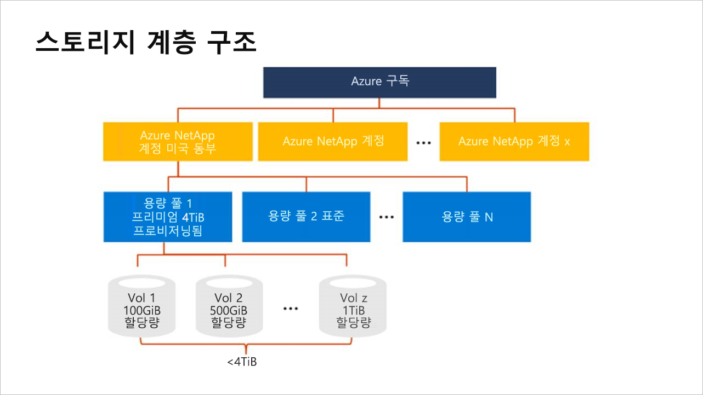

# Azure NetApp Files의 저장소 계층 구조 이해

Azure NetApp Files에서 볼륨을 만들기 전에 프로비전된 용량에 대한 풀을 구매하고 설정해야 합니다.  용량 풀을 설정하려면 NetApp 계정이 있어야 합니다. 저장소 계층 구조를 이해하는 것은 Azure NetApp Files 리소스를 설정하고 관리하는 데 도움이 됩니다.

## NetApp 계정

- NetApp 계정은 구성 용량 풀의 관리 그룹으로 사용됩니다.  
- NetApp 계정은 일반 Azure 저장소 계정과 동일하지 않습니다. 
- NetApp 계정은 범위에서 지역적입니다.   
- 지역에서 여러 NetApp 계정을 가질 수 있지만 각 NetApp 계정은 단일 지역에만 연결됩니다.

## 용량 풀

- 용량 풀은 해당 프로비전된 용량에 의해 측정됩니다.  
- 용량은 구입한 고정 SKU(예: 4TiB 용량)를 통해 프로비전됩니다.
- 용량 풀은 하나의 서비스 수준만 가질 수 있습니다.  
- 각 용량 풀은 하나의 NetApp 계정에만 속할 수 있습니다. 그러나 NetApp 계정에는 여러 개의 용량 풀이 있을 수 있습니다.  
- 용량 풀은 NetApp 계정 간에 이동할 수 없습니다.   
  예를 들어 아래 [저장소 계층 구조의 개념 다이어그램](#conceptual_diagram_of_storage_hierarchy)에서 용량 풀 1은 미국 동부 NetApp 계정에서 미국 서부 2 NetApp 계정으로 이동할 수 없습니다.  

## 볼륨

- 볼륨은 논리적 용량 사용량으로 측정되며 확장 가능합니다. 
- 볼륨의 용량 소비는 해당 풀의 프로비전된 용량에 대해 계산됩니다.
- 각 볼륨은 하나의 풀에만 속하지만 풀은 여러 볼륨을 포함할 수 있습니다. 
- 동일한 NetApp 계정 내에서 풀 간에 볼륨을 이동할 수 있습니다.    
  예를 들어 아래 [저장소 계층 구조의 개념 다이어그램](#conceptual_diagram_of_storage_hierarchy)에서 용량 풀 1에서 용량 풀 2로 볼륨을 이동할 수 있습니다.

## 저장소 계층 구조의 개념 다이어그램 
다음 예제에서는 Azure 구독, NetApp 계정, 용량 풀 및 볼륨의 관계를 보여줍니다.   

## 다음 단계

- [Azure NetApp Files에 대한 리소스 제한](azure-netapp-files-resource-limits.md)
- [Azure NetApp Files에 등록](azure-netapp-files-register.md)
