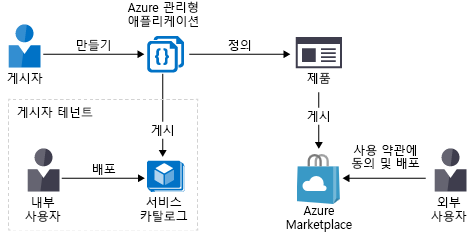

# Azure 관리되는 애플리케이션 개요

Azure 관리되는 애플리케이션을 사용하면 고객의 배포 및 운영이 용이한 클라우드 솔루션을 제공할 수 있습니다. 인프라를 구현하고 지속적인 지원을 제공합니다. 관리 되는 애플리케이션을 모든 고객에게 제공하려면 Azure Marketplace에 게시합니다. 조직의 사용자만 사용할 수 있게 하려면 내부 카탈로그에 게시합니다. 

관리형 애플리케이션은 한 가지 주요 차이점이 있지만 Marketplace의 솔루션 템플릿과 유사합니다. 관리되는 애플리케이션에서 리소스는 앱 게시자가 관리하는 리소스 그룹에 배포됩니다. 리소스 그룹은 소비자의 구독에 있지만, 게시자 테넌트의 ID는 해당 리소스 그룹에 액세스할 수 있습니다. 게시자는 지속적인 솔루션 지원을 위한 비용을 지정합니다.

> [!NOTE]
> 이전에는 Azure 사용자 지정 공급자용 설명서가 관리형 애플리케이션용 설명서에 포함되었습니다. 해당 설명서가 이동되었습니다. 이제 [Azure 사용자 지정 공급자](../custom-providers/overview.md)를 참조하세요.

## 관리되는 애플리케이션의 이점

관리되는 애플리케이션은 솔루션을 사용하는 소비자의 장벽을 낮춥니다. 솔루션 사용을 위해 클라우드 인프라에 대한 전문 지식이 필요하지 않습니다. 소비자는 중요한 리소스에 제한적으로 액세스할 수 있으며, 이를 관리할 때 실수하는 것에 대해 걱정할 필요가 없습니다. 

관리되는 애플리케이션을 사용하면 소비자와의 지속적 관계를 구현할 수 있습니다. 애플리케이션 관리를 위한 조건을 정의하고 모든 비용을 Azure 청구를 통해 관리합니다.

고객은 자신의 구독에서 이러한 관리되는 애플리케이션을 배포하지만 애플리케이션을 유지 관리, 업데이트 또는 서비스하지 않아도 됩니다. 모든 고객이 승인된 버전을 사용하고 있는지 확인할 수 있습니다. 고객은 이러한 애플리케이션을 관리하기 위해 애플리케이션에 관한 도메인 지식을 쌓을 필요가 없습니다. 고객은 애플리케이션 관련 문제 해결 및 문제 진단을 염려하지 않고 애플리케이션 업데이트를 자동으로 얻을 수 있습니다. 

IT 팀은 관리되는 애플리케이션을 통해 사전 승인된 솔루션을 조직 내 사용자에게 제공할 수 있습니다. 이러한 솔루션은 조직을 표준을 준수합니다.

관리형 애플리케이션은 [Azure 리소스에 대한 관리 ID](./publish-managed-identity.md)를 지원합니다.

## 관리되는 애플리케이션의 형식

외부 또는 내부적으로 관리되는 애플리케이션을 게시할 수 있습니다.

### 서비스 카탈로그

서비스 카탈로그는 조직 내 사용자에 대해 승인된 솔루션의 내부 카탈로그입니다. 조직의 표준에 맞게 카탈로그를 사용하는 한편, 조직을 위한 솔루션을 제공합니다. 직원은 카탈로그를 사용하여 IT 부서에서 권장하고 승인한 애플리케이션을 손쉽게 찾습니다. 조직의 다른 사용자와 공유하는 관리되는 애플리케이션을 확인합니다.

서비스 카탈로그 관리되는 애플리케이션을 게시하는 방법에 대한 자세한 내용은 [서비스 카탈로그 애플리케이션 만들기](publish-service-catalog-app.md)를 참조하세요.

### Marketplace

서비스에 대한 요금을 청구하려는 공급업체들은 Azure Marketplace를 통해 관리되는 애플리케이션을 제공할 수 있습니다. 공급업체가 애플리케이션을 게시한 후 조직 외부 사용자에게 제공할 수 있습니다. 이런 방식으로 MSP(관리되는 서비스 제공업체), ISV(독립 소프트웨어 공급업체), SI(시스템 통합업체)는 모든 Azure 고객에게 솔루션을 제공할 수 있습니다.

관리되는 애플리케이션을 마켓플레이스에 게시하는 방법에 대한 자세한 내용은 [마켓플레이스 애플리케이션 만들기](../../marketplace/create-new-azure-apps-offer.md)를 참조하세요.

## 관리되는 애플리케이션에 대한 리소스 그룹

일반적으로 관리되는 애플리케이션의 리소스는 두 리소스 그룹에 있습니다. 소비자가 한 리소스 그룹을 관리하고 게시자가 다른 리소스 그룹을 관리합니다. 관리되는 애플리케이션을 정의할 때는 게시자가 액세스 수준을 지정합니다. 게시자는 영구 역할 할당을 요청하거나 기간이 제한된 할당에 대한 [Just-In-Time 액세스](request-just-in-time-access.md)를 요청할 수 있습니다.

[데이터 작업](../../role-based-access-control/role-definitions.md)에 대한 액세스 제한은 현재 Azure의 모든 데이터 공급자에 대해 지원되지 않습니다.

다음 이미지는 게시자가 관리되는 리소스 그룹에 대한 소유자 역할을 요청하는 시나리오를 보여 줍니다. 게시자는 소비자에 대해 이 리소스 그룹에 대한 읽기 전용 잠금을 적용했습니다. 관리되는 리소스 그룹에 대한 액세스 권한이 부여된 게시자 ID는 잠금에서 제외됩니다.

### 애플리케이션 리소스 그룹

이 리소스 그룹은 관리되는 애플리케이션 인스턴스를 갖습니다. 이 리소스 그룹에는 하나의 리소스만 포함될 수 있습니다. 관리되는 애플리케이션의 리소스 형식은 **Microsoft.Solutions/applications** 입니다.

소비자는 리소스 그룹에 대한 전체 액세스 권한을 가지며 이를 사용하여 관리되는 애플리케이션의 수명 주기를 관리합니다.

### 관리되는 리소스 그룹

이 리소스 그룹은 관리되는 애플리케이션에 필요한 모든 리소스를 갖습니다. 예를 들어 이 리소스 그룹에는 솔루션에 대한 가상 머신, 스토리지 계정 및 가상 네트워크가 포함됩니다. 소비자는 관리되는 애플리케이션에 대한 개별 리소스를 관리하지 않으므로 이 리소스 그룹에 제한적으로 액세스할 수 있습니다. 이 리소스 그룹에 대한 게시자의 액세스는 관리되는 애플리케이션 정의에서 지정한 역할에 해당합니다. 예를 들어 게시자는 이 리소스 그룹에 대해 소유자 또는 참가자 역할을 요청할 수 있습니다. 액세스는 영구적이거나 특정 시간으로 제한됩니다.

[Marketplace에 관리형 애플리케이션](../../marketplace/create-new-azure-apps-offer.md)을 게시할 때 게시자는 관리형 리소스 그룹의 리소스에 대해 특정 작업을 수행하는 기능을 소비자에게 부여할 수 있습니다. 예를 들어 게시자는 소비자가 가상 머신을 다시 시작할 수 있도록 지정할 수 있습니다. 읽기 작업 이외의 다른 모든 작업은 여전히 거부됩니다. 권한이 부여된 소비자에 의해 관리되는 리소스 그룹의 리소스를 변경하면 관리되는 리소스 그룹을 포함하도록 범위가 지정된 소비자 테넌트 내의 [Azure Policy](../../governance/policy/overview.md) 할당이 적용됩니다.

소비자가 관리되는 애플리케이션을 삭제하면 관리되는 리소스 그룹도 삭제됩니다.

## Azure Policy

[Azure Policy](../../governance/policy/overview.md)를 적용하여 관리형 애플리케이션을 감사할 수 있습니다. 관리형 애플리케이션의 배포된 인스턴스에서 데이터 및 보안 요구 사항을 충족하는지 확인하는 정책 정의를 적용합니다. 애플리케이션에서 중요한 데이터와 상호 작용하는 경우 해당 데이터를 보호해야 하는 방법을 평가했는지 확인합니다. 예를 들어 애플리케이션이 Microsoft 365에서 데이터와 상호 작용하는 경우 정책 정의를 적용하여 데이터 암호화가 활성화되어 있는지 확인합니다.

## 다음 단계

이 문서에서는 관리되는 애플리케이션을 사용하는 경우의 이점에 대해 알아보았습니다. 다음 문서로 이동하여 관리되는 애플리케이션 정의를 만듭니다.

> [!div class="nextstepaction"]
> [빠른 시작: Azure 관리되는 애플리케이션 정의 게시](publish-service-catalog-app.md)