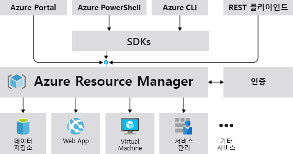
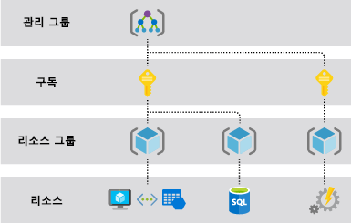

# Azure Resource Manager 개요

Azure Resource Manager는 Azure용 배포 및 관리 서비스입니다. Azure 구독에서 리소스를 만들고, 업데이트하고, 삭제할 수 있는 관리 계층을 제공합니다. 배포 이후 액세스 제어, 잠금 및 태그와 같은 관리 기능을 사용하여 리소스를 보호하고 구성합니다.

Azure Resource Manager 템플릿에 대한 자세한 내용은 [템플릿 배포 개요](../templates/overview.md)를 참조하세요.

## 일관적인 관리 계층

사용자가 Azure 도구, API 또는 SDK에서 요청을 보내면 Resource Manager에서 요청을 받습니다. 요청을 인증하고 권한을 부여합니다. Resource Manager에서 요청된 작업을 수행하는 Azure 서비스에 요청을 보냅니다. 모든 요청이 동일한 API를 통해 처리되므로 모든 여러 도구에서 일관적인 결과 및 기능을 볼 수 있습니다.

다음 이미지에서는 Azure Resource Manager에서 Azure 요청을 처리할 때 수행하는 역할을 보여 줍니다. 

포털에서 사용할 수 있는 모든 기능은 PowerShell, Azure CLI, Azure REST API 및 클라이언트 SDK를 통해서도 사용 가능합니다. API를 통해 처음 릴리스된 기능은 처음 릴리스된 지 180일 이내에 포털에 표시됩니다.

## 용어

Azure Resource Manager가 처음이라면 익숙하지 않은 용어가 있을 수 있습니다.

* **리소스** - Azure를 통해 사용할 수 있는 관리 가능한 항목입니다. 리소스의 예로는 가상 머신, 스토리지 계정, 웹앱, 데이터베이스 및 가상 네트워크가 있습니다.
* **리소스 그룹** - Azure 솔루션에 관련된 리소스를 보유하는 컨테이너입니다. 리소스 그룹은 그룹으로 관리하려는 리소스만 포함합니다. 조직에 가장 적합한 요소에 따라 리소스 그룹에 속하는 리소스를 결정합니다. [리소스 그룹](#resource-groups)을 참조하세요.
* **리소스 공급자** - Azure 리소스를 제공하는 서비스입니다. 예를 들어 일반적인 리소스 공급자는 가상 머신 리소스를 제공하는 Microsoft.Compute입니다. Microsoft.Storage는 또 다른 일반적인 리소스 공급자입니다. [리소스 공급자 및 형식](resource-providers-and-types.md)을 참조하세요.
* **Resource Manager 템플릿** - 리소스 그룹 또는 구독에 배포한 하나 이상의 리소스를 정의하는 JSON(JavaScript Object Notation) 파일입니다. 템플릿은 리소스를 일관되고 반복적으로 배포하는 데 사용할 수 있습니다. [템플릿 배포 개요](../templates/overview.md)를 참조하세요.
* **선언적 구문** - 항목을 만드는 프로그래밍 명령의 시퀀스를 작성하지 않고도 "만들려는 대상은 다음과 같습니다"라고 선언하는 구문입니다. Resource Manager 템플릿은 선언적 구문의 예입니다. 파일에서 Azure에 배포하는 인프라에 대한 속성을 정의합니다.  [템플릿 배포 개요](../templates/overview.md)를 참조하세요.

## 리소스 관리자를 사용할 경우의 이점

Resource Manager를 사용하면 다음을 수행할 수 있습니다.

* 스크립트가 아니라 선언적 템플릿을 통해 인프라를 관리합니다.

* 이 리소스를 개별적으로 처리하는 대신, 솔루션의 모든 리소스를 그룹으로 배포, 관리 및 모니터링합니다.

* 개발 수명 주기 전체에 걸쳐 솔루션을 다시 배포하고, 리소스가 일관된 상태로 배포된다고 확신할 수 있습니다.

* 리소스가 올바른 순서로 배포되도록 리소스 간의 종속성을 정의합니다.

* RBAC(역할 기반 액세스 제어)가 관리 플랫폼에 통합되어 있으므로 액세스 제어가 리소스 그룹의 모든 서비스에 적용됩니다.

* 리소스에 태그를 적용하여 구독의 모든 리소스를 논리적으로 구성합니다.

* 동일한 태그를 공유하는 리소스 그룹에 대한 비용을 확인하여 조직의 청구를 명확히 합니다.

## 범위 이해

Azure는 [관리 그룹](../../governance/management-groups/overview.md), 구독, [리소스 그룹](#resource-groups) 및 리소스라는 네 가지 수준의 범위를 제공합니다. 다음 그림은 세 가지 계층의 예를 보여 줍니다.

이러한 범위 수준에서 관리 설정을 적용합니다. 선택한 수준은 설정이 적용되는 범위를 결정합니다. 하위 수준은 상위 수준의 설정을 상속합니다. 예를 들어 구독에 [정책](../../governance/policy/overview.md)을 적용하면 해당 정책이 구독의 모든 리소스 그룹 및 리소스에 적용됩니다. 리소스 그룹에 정책을 적용하면 해당 정책이 리소스 그룹 및 모든 리소스에 적용됩니다. 그러나 다른 리소스 그룹에는 해당 정책 할당이 적용되지 않습니다.

템플릿은 관리 그룹, 구독 또는 리소스 그룹에 배포할 수 있습니다.

## 리소스 그룹

리소스 그룹을 정의할 때 고려해야 할 몇 가지 중요한 요인이 있습니다.

* 그룹에서 모든 리소스는 동일한 수명 주기를 공유해야 합니다. 리소스를 함께 배포, 업데이트, 삭제합니다. 데이터베이스 서버와 같은 하나의 리소스에 다양한 배포 주기가 존재하는 경우 다른 리소스 그룹에 있어야 합니다.

* 각 리소스는 하나의 리소스 그룹에만 있을 수 있습니다.

* 언제든지 리소스 그룹에 리소스를 추가하거나 제거할 수 있습니다.

* 특정 리소스 그룹에서 다른 그룹에 리소스를 이동할 수 있습니다. 자세한 내용을 보려면 [새 리소스 그룹 또는 구독으로 리소스 이동](move-resource-group-and-subscription.md)을 참조하세요.

* 리소스 그룹은 다른 지역에 있는 리소스를 포함할 수 있습니다.

* 관리 작업에 대한 Access Control 범위를 지정하는 데 리소스 그룹을 사용할 수 있습니다.

* 리소스는 다른 리소스 그룹의 리소스와 상호 작용할 수 있습니다. 이 상호 작용은 두 개의 리소스가 관련되어 있지만 동일한 수명 주기를 공유하지 않는 경우에 일반적입니다(예: 데이터베이스에 연결된 웹앱).

리소스 그룹을 만들 때 해당 리소스 그룹의 위치를 제공해야 합니다. 리소스 그룹에 위치가 필요한 이유는 무엇인지 궁금할 수 있습니다. 리소스의 위치가 리소스 그룹과 다른 경우 리소스 그룹 위치가 중요한 이유는 무엇인가요? 리소스 그룹은 리소스에 대한 메타데이터를 저장합니다. 리소스 그룹의 위치를 지정하면 메타데이터가 저장되는 위치를 지정하게 됩니다. 규정 준수 때문에 특정 지역에 데이터가 저장되는지 확인해야 합니다.

리소스 그룹의 지역이 일시적으로 사용할 수 없는 경우 메타데이터를 사용할 수 없기 때문에 리소스 그룹의 리소스를 업데이트할 수 없습니다. 다른 지역에 있는 리소스는 여전히 예상대로 작동하지만 업데이트는 불가능합니다. 신뢰할 수 있는 애플리케이션을 빌드하는 방법에 대한 자세한 내용은 [신뢰할 수 있는 Azure 애플리케이션 디자인](/azure/architecture/checklist/resiliency-per-service)을 참조하세요.

## Azure Resource Manager의 복원력

Azure Resource Manager 서비스는 복원력 및 지속적인 가용성을 위해 설계되었습니다. REST API의 Resource Manager 및 제어 평면 작업(management.azure.com에 전송된 요청)은 다음과 같습니다.

* 지역별로 분산됩니다 일부 서비스는 지역적입니다.

* 여러 가용성 영역이 있는 위치에서 가용성 영역(지역도 포함)으로 분산됩니다.

* 단일 논리 데이터 센터에 종속되지 않습니다.

* 유지 관리 작업을 위해 다운되지 않습니다.

이 복원력은 Resource Manager를 통해 요청을 수신하는 서비스에 적용됩니다. 예를 들어 Key Vault는 이 복원력의 이점을 사용합니다.

## 다음 단계

* 리소스 공급자가 제공하는 모든 작업에 대한 자세한 내용은 [Azure REST API](/rest/api/azure/)를 참조하세요.

* 리소스 이동에 대해 알아보려면 [새 리소스 그룹 또는 구독으로 리소스 이동](move-resource-group-and-subscription.md)을 참조하세요.

* 리소스에 태그를 지정하는 방법에 대해 알아보려면 [태그를 사용하여 Azure 리소스 구성](tag-resources.md)을 참조하세요.

* 리소스를 잠그는 방법에 대해 알아보려면 [리소스 잠금으로 예기치 않은 변경 방지](lock-resources.md)를 참조하세요.

* 배포용 템플릿을 만드는 방법에 대한 자세한 내용은 [템플릿 배포 개요](../templates/overview.md)를 참조하세요.
