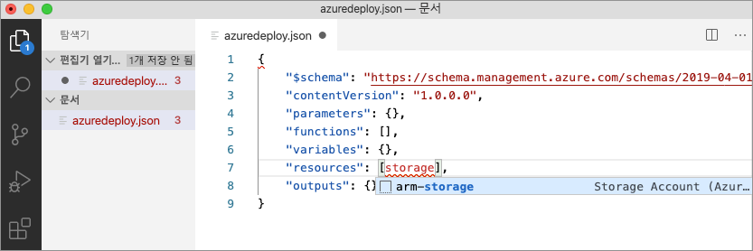
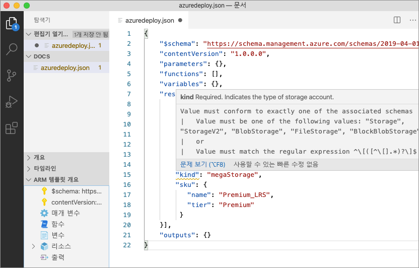
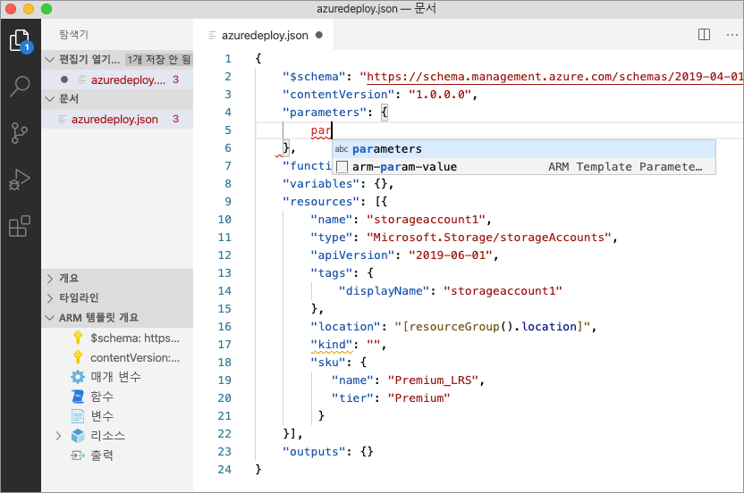
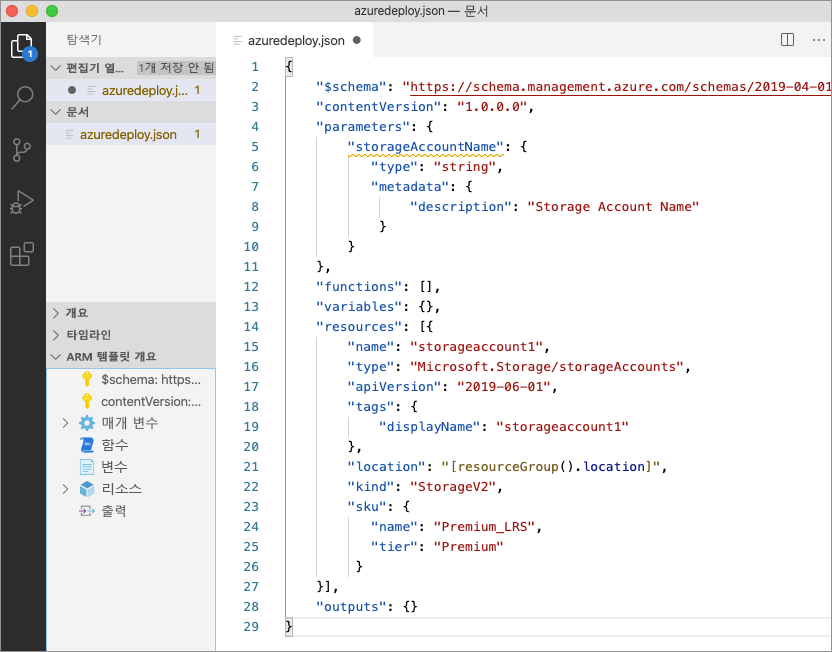
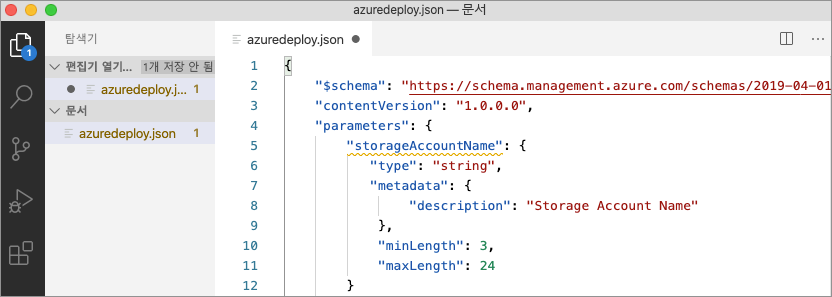
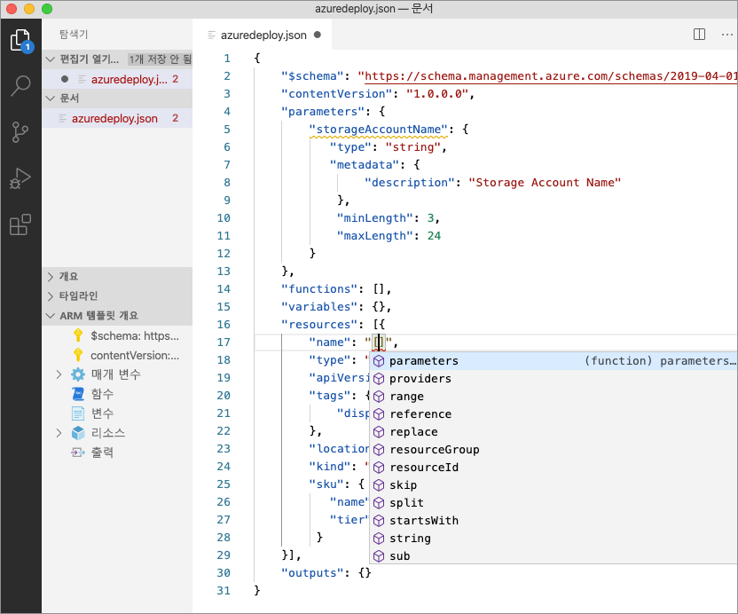
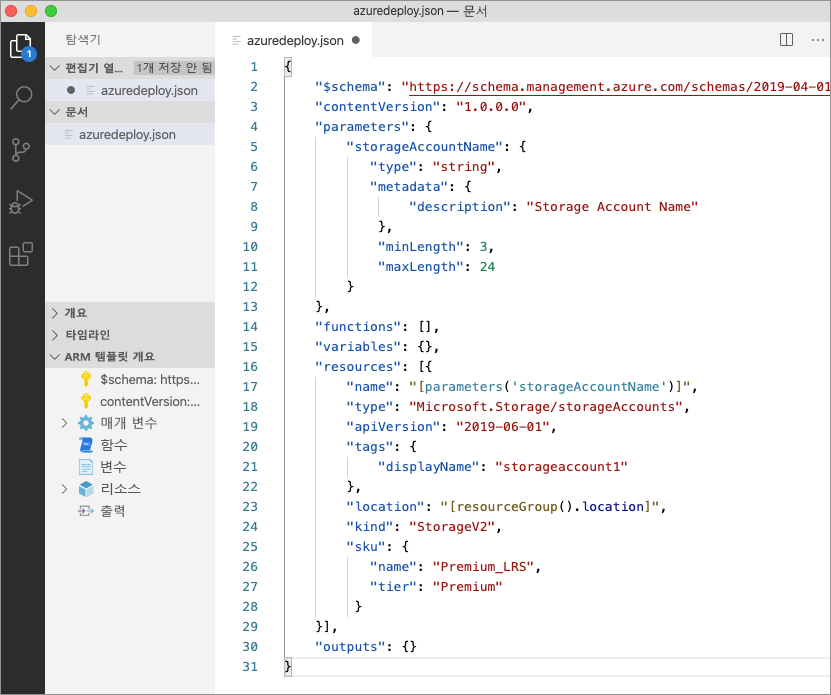
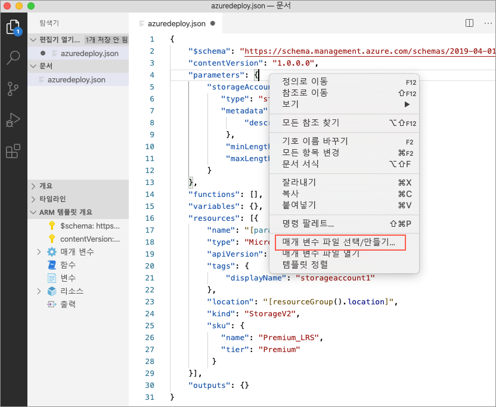
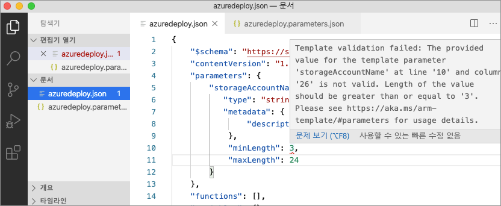

# <a name="quickstart-create-azure-resource-manager-templates-with-visual-studio-code"></a>빠른 시작: Visual Studio Code를 사용하여 Azure Resource Manager 템플릿 만들기

Visual Studio Code용 Azure Resource Manager 도구는 언어 지원, 리소스 코드 조각 및 리소스 자동 완성 기능을 제공합니다. 이러한 도구는 Azure Resource Manager 템플릿을 만들고 유효성을 검사하는 데 도움이 됩니다. 이 빠른 시작에서는 확장 기능을 사용하여 Azure Resource Manager 템플릿을 새로 만듭니다. 이 작업을 수행하는 동안 ARM 템플릿 코드 조각, 유효성 검사, 완성 및 매개 변수 파일 지원과 같은 확장 기능이 제공됩니다.

이 빠른 시작을 완료하려면 [Azure Resource Manager 도구 확장](https://marketplace.visualstudio.com/items?itemName=msazurermtools.azurerm-vscode-tools)이 설치된 [Visual Studio Code](https://code.visualstudio.com/)가 필요합니다. 또한 [Azure CLI](/cli/azure/?view=azure-cli-latest) 또는 [Azure PowerShell 모듈](/powershell/azure/new-azureps-module-az?view=azps-3.7.0)이 설치 및 인증되어 있어야 합니다.

Azure 구독이 아직 없는 경우 시작하기 전에 [체험](https://azure.microsoft.com/free/) 계정을 만듭니다.

## <a name="create-an-arm-template"></a>ARM 템플릿 만들기

*azuredeploy.json*이라는 새 파일을 만들고 Visual Studio Code를 사용하여 엽니다. 코드 편집기에 `arm`을 입력합니다. 그러면 ARM 템플릿을 스캐폴딩하는 Azure Resource Manager 코드 조각이 시작됩니다.

Azure 리소스 그룹 배포로 범위가 지정된 템플릿을 만들려면 `arm!`를 선택합니다.


이 코드 조각은 ARM 템플릿의 기본 구성 요소를 만듭니다.


Visual Studio Code 언어 모드가 *JSON*에서 *Azure Resource Manager 템플릿*으로 변경되었습니다. 이 확장에는 ARM 템플릿별 유효성 검사, 완성 및 기타 언어 서비스를 제공하는 ARM 템플릿과 관련된 언어 서버가 포함됩니다.


## <a name="add-an-azure-resource"></a>Azure 리소스 추가

이 확장에는 많은 Azure 리소스의 코드 조각이 포함됩니다. 이러한 코드 조각은 템플릿 배포에 리소스를 쉽게 추가하는 데 사용할 수 있습니다.

템플릿 **리소스** 블록에 커서를 놓고 `storage`를 입력한 후 *arm-storage* 코드 조각을 선택합니다.



이 작업은 템플릿에 스토리지 리소스를 추가합니다.


**탭** 키를 사용하여 스토리지 계정에서 구성 가능한 속성을 탐색할 수 있습니다.


## <a name="completion-and-validation"></a>완성 및 유효성 검사

이 확장의 가장 강력한 기능 중 하나는 Azure 스키마와의 통합입니다. Azure 스키마는 이 확장에 유효성 검사 및 리소스 인식 완성 기능을 제공합니다. 스토리지 계정을 수정하여 유효성 검사 및 완성이 작동하는 모습을 확인하겠습니다. 

먼저 스토리지 계정 종류를 `megaStorage`와 같은 잘못된 값으로 업데이트합니다. 이 작업을 수행하면 `megaStorage`가 올바른 값이 아님을 나타내는 경고가 생성됩니다.



완성 기능을 사용하려면 `megaStorage`를 제거하고, 큰따옴표 안에 커서를 놓고 `ctrl` + `space`를 누릅니다. 이 작업을 수행하면 올바른 값의 완성 목록이 표시됩니다.


## <a name="add-template-parameters"></a>템플릿 매개 변수 추가

이제 매개 변수를 만들고 사용하여 스토리지 계정 이름을 지정합니다.

매개 변수 블록에 커서를 놓고 캐리지 리턴을 추가하고 `par`을 입력한 다음, `arm-param-value` 코드 조각을 선택합니다. 이 작업을 수행하면 제네릭 매개 변수가 템플릿에 추가됩니다.



`storageAccountName` 매개 변수의 이름과 설명을 `Storage Account Name`으로 업데이트합니다.



Azure 스토리지 계정 이름은 3~24자여야 합니다. `minLength` 및 `maxLength`를 모두 매개 변수에 추가하고 적절한 값을 제공합니다.



이제 스토리지 리소스에서 이 매개 변수를 사용하도록 name 속성을 업데이트합니다. 이렇게 하려면 현재 이름을 제거합니다. ARM 템플릿 함수 목록을 생성하는 큰따옴표와 여는 대괄호 `[`를 입력합니다. 목록에서 *매개 변수*를 선택합니다. 



둥근 괄호 안에 작은따옴표 `'`를 입력하면 템플릿에 정의된 모든 매개 변수 목록이 생성됩니다(이 경우에는 *storageAccountName*). 매개 변수를 선택합니다.



## <a name="create-a-parameter-file"></a>매개 변수 파일 만들기

ARM 템플릿 매개 변수 파일을 사용하여 환경별 매개 변수 값을 저장하고 이러한 값을 배포 시 그룹으로 전달할 수 있습니다. 예를 들어 테스트 환경에 해당하는 값을 가진 매개 변수 파일과 프로덕션 환경에 대한 매개 변수 파일이 있을 수 있습니다.

확장을 사용하면 기존 템플릿에서 매개 변수 파일을 쉽게 만들 수 있습니다. 이렇게 하려면 코드 편집기에서 템플릿을 마우스 오른쪽 단추로 클릭하고 `Select/Create Parameter File`을 선택합니다.



`New` > `All Parameters` > 매개 변수 파일의 이름과 위치를 선택합니다.


이 작업을 수행하면 새 매개 변수 파일이 생성되고 이 파일이 만들어진 템플릿에 매핑됩니다. 템플릿이 선택된 상태에서 Visual Studio Code 상태 표시줄에서 현재 템플릿/매개 변수 파일 매핑을 확인하고 수정할 수 있습니다.


이제 매개 변수 파일이 템플릿에 매핑되었으므로 확장 기능이 템플릿과 매개 변수 파일 모두의 유효성을 검사합니다. 이 유효성 검사를 실제로 보려면 매개 변수 파일의 `storageAccountName` 매개 변수에 두 문자 값을 추가하고 파일을 저장합니다.


ARM 템플릿으로 다시 이동하고 값이 매개 변수 조건을 충족하지 않음을 나타내는 오류가 발생한 것을 확인합니다.



값을 적절한 값으로 업데이트하고, 파일을 저장하고, 템플릿으로 다시 이동합니다. 매개 변수의 오류가 해결된 것을 알 수 있습니다.

## <a name="deploy-the-template"></a>템플릿 배포

`ctrl` + ```` ` ```` 키 조합을 사용하여 통합 Visual Studio Code 터미널을 열고 Azure CLI 또는 Azure PowerShell 모듈 중 하나를 사용하여 템플릿을 배포합니다.

# <a name="cli"></a>[CLI](#tab/CLI)

```azurecli
az group create --name arm-vscode --location eastus

az deployment group create --resource-group arm-vscode --template-file azuredeploy.json --parameters azuredeploy.parameters.json
```

# <a name="powershell"></a>[PowerShell](#tab/PowerShell)

```azurepowershell
New-AzResourceGroup -Name arm-vscode -Location eastus

New-AzResourceGroupDeployment -ResourceGroupName arm-vscode -TemplateFile ./azuredeploy.json -TemplateParameterFile ./azuredeploy.parameters.json
```
---

## <a name="clean-up-resources"></a>리소스 정리

Azure 리소스가 더 이상 필요 없으면 Azure CLI 또는 Azure PowerShell 모듈을 사용하여 빠른 시작 리소스 그룹을 삭제합니다.

# <a name="cli"></a>[CLI](#tab/CLI)

```azurecli
az group delete --name arm-vscode
```

# <a name="powershell"></a>[PowerShell](#tab/PowerShell)

```azurepowershell
Remove-AzResourceGroup -Name arm-vscode
```
---

## <a name="next-steps"></a>다음 단계

> [!div class="nextstepaction"]
> [초보자용 자습서](./template-tutorial-create-first-template.md)
