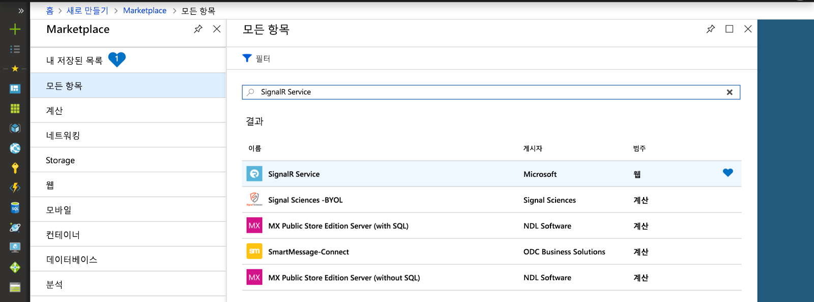
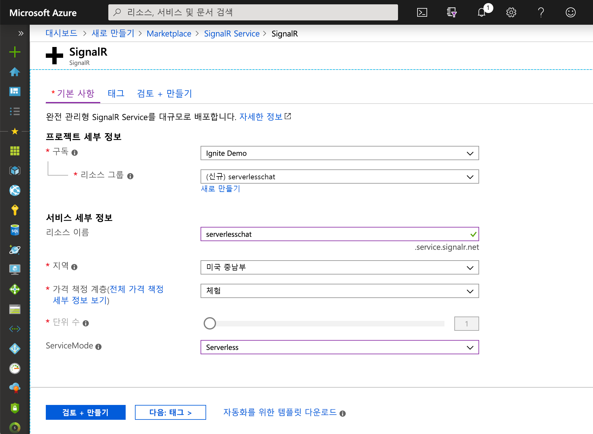

## Azure SignalR Service 인스턴스 만들기

애플리케이션이 Azure의 SignalR Service 인스턴스에 연결됩니다.

1. Azure Portal의 왼쪽 위에 있는 새로 만들기 단추를 선택합니다. 새 화면의 검색 상자에서 *SignalR Service*를 입력한 후 Enter 키를 누릅니다.

    

1. 검색 결과에서 **SignalR Service**를 선택한 다음, **만들기**를 선택합니다.

1. 다음 설정을 입력합니다.

    | 설정      | 제안 값  | 설명                                        |
    | ------------ |  ------- | -------------------------------------------------- |
    | **리소스 이름** | 전역적으로 고유한 이름 | 새 SignalR Service 인스턴스를 식별하는 이름입니다. 유효한 문자는 `a-z`, `0-9` 및 `-`입니다.  | 
    | **구독** | 사용자의 구독 | 이 새 SignalR Service 인스턴스가 생성되는 구독입니다. | 
    | **[리소스 그룹](../../azure-resource-manager/resource-group-overview.md)** |  myResourceGroup | SignalR Service 인스턴스를 만들 새 리소스 그룹의 이름입니다. | 
    | **위치**: | 미국 서부 | 근처 [지역](https://azure.microsoft.com/regions/)을 선택하세요. |
    | **가격 책정 계층** | 무료 | Azure SignalR Service를 체험해 보세요. |
    | **단위 수** |  해당 없음 | 단위 수는 SignalR Service 인스턴스가 허용할 수 있는 연결 수를 지정합니다. 표준 계층에서만 구성할 수 있습니다. |

    

1. **만들기**를 선택하여 SignalR Service 인스턴스 배포를 시작하세요.

1. 인스턴스가 배포되면 포털에서 열고 해당 설정 페이지를 찾습니다. Azure Functions 바인딩이나 REST API를 통해 Azure SignalR Service를 사용하는 경우에만 서비스 모드 설정을 *서버리스*로 변경합니다. 그렇지 않으면 *클래식*이나 *기본값*으로 유지합니다.