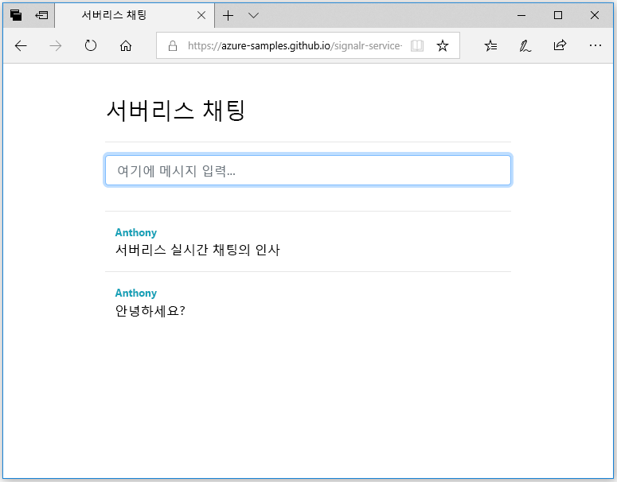

## <a name="run-the-web-application"></a>웹 애플리케이션 실행

1. 클라이언트 테스트를 간소화하려면 샘플 단일 페이지 웹 애플리케이션 [https://azure-samples.github.io/signalr-service-quickstart-serverless-chat/demo/chat-v2/](https://azure-samples.github.io/signalr-service-quickstart-serverless-chat/demo/chat-v2/)로 브라우저를 엽니다. 

    > [!NOTE]
    > HTML 파일 소스는 [/docs/demo/chat-v2/index.html](https://github.com/Azure-Samples/signalr-service-quickstart-serverless-chat/blob/master/docs/demo/chat-v2/index.html)에 있습니다. 그리고 HTML을 직접 호스트하려면 */docs/demo/chat-v2* 디렉터리에서 [http-server](https://www.npmjs.com/package/http-server)와 같은 로컬 HTTP 서버를 시작하세요. 원본이 샘플과 유사한 *local.settings.json* 의 `CORS` 설정에 추가되어 있는지 확인합니다.
    > 
    > ```javascript
    > "Host": {
    >  "LocalHttpPort": 7071,
    >  "CORS": "http://localhost:8080,https://azure-samples.github.io",
    >  "CORSCredentials": true
    > }
    >
    > ```

1. 함수 앱 기본 URL을 입력하라는 메시지가 표시되면 `http://localhost:7071`을 입력합니다.

1. 메시지가 표시되면 사용자 이름을 입력합니다.

1. 웹 애플리케이션이 함수 앱에서 *GetSignalRInfo* 함수를 호출하여 Azure SignalR Service에 연결할 연결 정보를 검색합니다. 연결이 완료되면 이 채팅 메시지 입력 상자가 표시됩니다.

1. 메시지를 입력하고 Enter 키를 누릅니다. 이 애플리케이션이 Azure 함수 앱에서 이 메시지를 *SendMessage* 함수로 보낸 다음, 이 앱이 SignalR 출력 바인딩을 사용하여 연결된 클라이언트 모두에 이 메시지를 브로드캐스트합니다. 모든 기능이 올바르게 작동하는 경우 이 메시지가 애플리케이션에 표시됩니다.

    

1. 다른 브라우저 창에서 웹 애플리케이션의 다른 인스턴스를 엽니다. 애플리케이션의 모든 인스턴스에 전송된 메시지가 표시됩니다.
