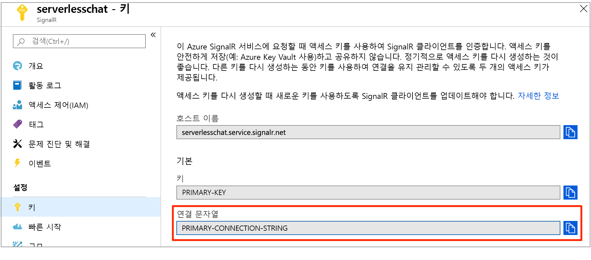

# <a name="quickstart-create-a-chat-room-with-azure-functions-and-signalr-service-using-javascript"></a>빠른 시작: JavaScript를 사용하여 Azure Functions와 SignalR Service로 대화방 만들기

Azure SignalR Service를 사용하면 애플리케이션에 실시간 기능을 쉽게 추가할 수 있습니다. Azure Functions는 인프라를 관리하지 않고 코드를 실행할 수 있는 서버리스 플랫폼입니다. 이 빠른 시작에서는 SignalR Serivces와 Functions를 사용하여 서버리스, 실시간 대화 애플리케이션을 빌드하는 방법에 대해 알아봅니다.

## <a name="prerequisites"></a>사전 요구 사항

이 빠른 시작은 macOS, Windows 또는 Linux에서 실행할 수 있습니다.

[Visual Studio Code](https://code.visualstudio.com/)와 같은 코드 편집기가 설치되어 있는지 확인합니다.

Azure 함수 앱을 로컬로 실행하려면 [Azure Functions Core Tools](https://github.com/Azure/azure-functions-core-tools#installing)(버전 2 이상)를 설치하세요.

이 빠른 시작에서는 [Node.js](https://nodejs.org/en/download/) 10.x를 사용하지만 다른 버전과 함께 작동해야 합니다. 지원되는 Node.js 버전에 대한 자세한 내용은 [Azure Functions 런타임 버전 설명서](../azure-functions/functions-versions.md#languages)를 참조하세요.

[!INCLUDE [quickstarts-free-trial-note](../../includes/quickstarts-free-trial-note.md)]

## <a name="log-in-to-azure"></a>Azure에 로그인

Azure 계정을 사용하여 <https://portal.azure.com/>에서 Azure Portal에 로그인합니다.

[!INCLUDE [Create instance](includes/signalr-quickstart-create-instance.md)]

[!INCLUDE [Clone application](includes/signalr-quickstart-clone-application.md)]

## <a name="configure-and-run-the-azure-function-app"></a>Azure 함수 앱을 구성하고 실행합니다.

1. Azure Portal이 열리는 브라우저에서, 포털의 맨 위에 있는 검색 상자에서 해당 이름을 검색하여 이전에 배포한 SignalR Service 인스턴스를 성공적으로 만들었는지 확인합니다. 인스턴스를 선택하여 엽니다.

    

1. SignalR Service 인스턴스의 연결 문자열을 보려면 **키**를 선택합니다.

1. 기본 연결 문자열을 선택하여 복사합니다.

    

1. 코드 편집기에서 복제된 리포지토리의 *src/chat/javascript* 폴더를 엽니다.

1. *local.settings.sample.json*의 이름을 *local.settings.json*으로 바꿉니다.

1. **local.settings.json** 에서 연결 문자열을 **AzureSignalRConnectionString** 설정 값에 붙여넣습니다. 파일을 저장합니다.

1. JavaScript 함수는 폴더로 구성됩니다. 각 폴더에는 두 개의 파일이 있습니다. *function.json*은 함수에서 사용되는 바인딩을 정의하고 *index.js*는 함수의 본문입니다. 이 함수 앱에서는 두 개의 HTTP 트리거 함수가 있습니다.

    - **negotiate** - *SignalRConnectionInfo* 입력 바인딩을 사용하여 올바른 연결 정보를 생성하고 리턴합니다.
    - **messages** - 요청 본문에서 대화 메시지를 수신하고 *SignalR* 출력 바인딩을 사용하여 모든 연결된 클라이언트 애플리케이션으로 메시지를 브로드캐스트합니다.

1. 터미널에서 *src/chat/javascript* 폴더에 있는지 확인합니다. 함수 앱을 실행합니다.

    ```bash
    func start
    ```

    

[!INCLUDE [Run web application](includes/signalr-quickstart-run-web-application.md)]

[!INCLUDE [Cleanup](includes/signalr-quickstart-cleanup.md)]

## <a name="next-steps"></a>다음 단계

이 빠른 시작에서는 VS Code에서 실시간 서버리스 애플리케이션을 빌드하고 실행했습니다. 다음으로는 VS Code에서 Azure Functions를 배포하는 방법에 대해 자세히 알아보세요.

> [!div class="nextstepaction"]
> [VS Code로 Azure Functions 배포](/azure/javascript/tutorial-vscode-serverless-node-01)
