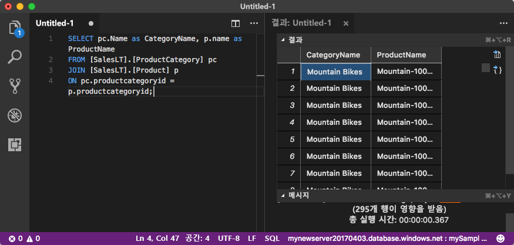

# <a name="quickstart-use-visual-studio-code-to-connect-and-query"></a>빠른 시작: Visual Studio Code를 사용하여 연결 및 쿼리를 참조하세요. 
[!INCLUDE[appliesto-sqldb-sqlmi](../includes/appliesto-sqldb-sqlmi.md)]

[Visual Studio Code](https://code.visualstudio.com/docs)는 Windows, macOS, Linux용 그래픽 코드 편집기입니다. Azure Synapse Analytics에서 SQL Server 인스턴스, Azure SQL Database, Azure SQL Managed Instance 및 데이터베이스를 쿼리하기 위한 [mssql 확장](https://aka.ms/mssql-marketplace)을 포함하는 확장을 지원합니다. 이 빠른 시작에서는 Visual Studio Code를 사용하여 Azure SQL Database 또는 Azure SQL Managed Instance에 연결한 다음, Transact-SQL 문을 실행하여 데이터를 쿼리, 삽입, 업데이트 및 삭제합니다.

## <a name="prerequisites"></a>필수 구성 요소

- Azure SQL Database 또는 Azure SQL Managed Instance의 데이터베이스. 다음 빠른 시작 중 하나를 사용하여 Azure SQL Database에서 데이터베이스를 만들고 구성할 수 있습니다.

  | 작업 | Azure SQL Database | Azure SQL Managed Instance |
  |:--- |:--- |:---|
  | 생성| [포털](single-database-create-quickstart.md) | [포털](../managed-instance/instance-create-quickstart.md) |
  || [CLI](scripts/create-and-configure-database-cli.md) | [CLI](https://medium.com/azure-sqldb-managed-instance/working-with-sql-managed-instance-using-azure-cli-611795fe0b44) |
  || [PowerShell](scripts/create-and-configure-database-powershell.md) | [PowerShell](../managed-instance/scripts/create-configure-managed-instance-powershell.md) |
  | 구성 | [서버 수준 IP 방화벽 규칙](firewall-create-server-level-portal-quickstart.md))| [가상 머신(VM)에서 연결](../managed-instance/connect-vm-instance-configure.md)|
  |||[온-프레미스에서 연결](../managed-instance/point-to-site-p2s-configure.md)
  |데이터 로드|Adventure Works(빠른 시작마다 로드됨)|[Wide World Importers 복원](../managed-instance/restore-sample-database-quickstart.md)
  |||[GitHub](https://github.com/Microsoft/sql-server-samples/tree/master/samples/databases/adventure-works)의 [BACPAC](database-import.md) 파일에서 Adventure Works 복원 또는 가져오기|
  |||

  > [!IMPORTANT]
  > 이 문서의 스크립트는 Adventure Works 데이터베이스를 사용하도록 작성되었습니다. SQL Managed Instance의 경우 Adventure Works 데이터베이스를 인스턴스 데이터베이스로 가져오거나 이 문서의 스크립트를 수정하여 Wide World Importors 데이터베이스를 사용해야 합니다.

## <a name="install-visual-studio-code"></a>Visual Studio Code 설치

최신 [Visual Studio Code](https://code.visualstudio.com/Download)를 설치하고 [mssql 확장](https://aka.ms/mssql-marketplace)을 로드했는지 확인합니다. mssql 확장 프로그램 설치에 대한 지침은 [Visual Studio Code 설치](/sql/linux/sql-server-linux-develop-use-vscode#install-and-start-visual-studio-code) 및 [Visual Studio Code용 mssql](https://marketplace.visualstudio.com/items?itemName=ms-mssql.mssql)을 참조하세요.

## <a name="configure-visual-studio-code"></a>Visual Studio Code 구성

### <a name="macos"></a>**macOS**

macOS의 경우 mssql 확장에서 사용하는 .NET Core의 필수 구성 요소인 OpenSSL을 설치해야 합니다. 터미널을 열고 다음 명령을 입력하여 **brew** 및 **OpenSSL** 을 설치합니다.

```bash
ruby -e "$(curl -fsSL https://raw.githubusercontent.com/Homebrew/install/master/install)"
brew update
brew install openssl
mkdir -p /usr/local/lib
ln -s /usr/local/opt/openssl/lib/libcrypto.1.0.0.dylib /usr/local/lib/
ln -s /usr/local/opt/openssl/lib/libssl.1.0.0.dylib /usr/local/lib/
```

### <a name="linux-ubuntu"></a>**Linux(Ubuntu)**

특별한 구성이 필요 없습니다.

### <a name="windows"></a>**Windows**

특별한 구성이 필요 없습니다.

## <a name="get-server-connection-information"></a>서버 연결 정보 가져오기

Azure SQL Database에 연결하는 데 필요한 연결 정보를 가져옵니다. 다음 절차를 수행하려면 정규화된 서버 이름이나 호스트 이름, 데이터베이스 이름 및 로그인 정보가 필요합니다.

1. [Azure Portal](https://portal.azure.com/)에 로그인합니다.

2. **SQL Databases** 또는 **SQL Managed Instances** 페이지로 이동합니다.

3. **개요** 페이지에서 SQL Database에 대한 **서버 이름** 옆에 있는 정규화된 서버 이름 또는 SQL Managed Instance에 대한 **호스트** 옆에 있는 정규화된 서버 이름을 검토합니다. 서버 이름이나 호스트 이름을 복사하려면 마우스로 해당 이름 위를 가리키고 **복사** 아이콘을 선택합니다.

## <a name="set-language-mode-to-sql"></a>언어 모드를 SQL로 설정

Visual Studio Code에서 언어 모드를 **SQL** 로 설정하여 mssql 명령 및 T-SQL IntelliSense를 사용합니다.

1. 새 Visual Studio Code 창을 엽니다.

2. **Ctrl**+**N** 을 누릅니다. 새 일반 텍스트 파일이 열립니다.

3. 상태 표시줄의 오른쪽 아래 모서리에 있는 **일반 텍스트** 를 선택합니다.

4. 열리는 **언어 모드 선택** 드롭다운 메뉴에서 **SQL** 을 선택합니다.

## <a name="connect-to-your-database"></a>데이터베이스 연결

Visual Studio Code를 사용하여 서버에 대한 연결을 설정합니다.

> [!IMPORTANT]
> 계속하기 전에 서버 및 로그인 정보를 준비했는지 확인합니다. 연결 프로필 정보를 입력하기 시작하면 Visual Studio Code에서 포커스를 변경하는 경우 프로필 만들기를 다시 시작해야 합니다.

1. Visual Studio Code에서 **Ctrl+Shift+P**(또는 **F1** 키)를 눌러서 명령 팔레트를 엽니다.

2. **MS SQL:Connect** 를 선택하고 **Enter** 를 선택합니다.

3. **연결 프로필 만들기** 를 선택합니다.

4. 프롬프트에 따라 새 프로필의 연결 속성을 지정합니다. 각 값을 지정한 후에 **Enter** 를 선택하여 계속합니다.

   | 속성       | 제안 값 | Description |
   | ------------ | ------------------ | ------------------------------------------------- |
   | **서버 이름** | 정규화된 서버 이름 | 예: **mynewserver20170313.database.windows.net**. |
   | **데이터베이스 이름** | mySampleDatabase | 연결할 데이터베이스입니다. |
   | **인증** | SQL 로그인| 이 자습서에서는 SQL 인증을 사용합니다. |
   | **사용자 이름** | 사용자 이름 | 서버를 만드는 데 사용되는 서버 관리자 계정의 사용자 이름입니다. |
   | **암호(SQL 로그인)** | 암호 | 서버를 만드는 데 사용되는 서버 관리자 계정의 암호입니다. |
   | **암호를 저장하시겠습니까?** | Yes 또는 No | 매번 암호를 입력하지 않으려면 **예** 를 선택합니다. |
   | **이 프로필의 이름을 입력합니다.** | **mySampleProfile** 과 같은 프로필 이름 | 프로필을 저장할 경우 후속 로그인의 연결 속도가 빨라집니다. |

   성공하면 프로필이 생성되고 연결되었다는 알림이 나타납니다.

## <a name="query-data"></a>쿼리 데이터

다음 [SELECT](/sql/t-sql/queries/select-transact-sql) Transact-SQL 문을 실행하여 범주별 상위 20개 제품을 쿼리합니다.

1. 편집기 창에서 다음 SQL 쿼리를 붙여넣습니다.

   ```sql
   SELECT pc.Name as CategoryName, p.name as ProductName
   FROM [SalesLT].[ProductCategory] pc
   JOIN [SalesLT].[Product] p
   ON pc.productcategoryid = p.productcategoryid;
   ```

2. **Ctrl**+**Shift**+**E** 를 눌러 쿼리를 실행하고 `Product` 및 `ProductCategory` 테이블의 결과를 표시합니다.

    

## <a name="insert-data"></a>데이터 삽입

다음 [INSERT](/sql/t-sql/statements/insert-transact-sql) Transact-SQL 문을 실행하여 `SalesLT.Product` 테이블에 새 제품을 추가합니다.

1. 이전 쿼리를 다음 쿼리로 바꿉니다.

   ```sql
   INSERT INTO [SalesLT].[Product]
        ( [Name]
        , [ProductNumber]
        , [Color]
        , [ProductCategoryID]
        , [StandardCost]
        , [ListPrice]
        , [SellStartDate]
        )
     VALUES
        ('myNewProduct'
        ,123456789
        ,'NewColor'
        ,1
         ,100
         ,100
         ,GETDATE() );
   ```

2. **Ctrl**+**Shift**+**E** 를 눌러 `Product` 테이블에 새 행을 삽입합니다.

## <a name="update-data"></a>데이터 업데이트

다음 [UPDATE](/sql/t-sql/queries/update-transact-sql) Transact-SQL 문을 실행하여 추가된 제품을 업데이트합니다.

1. 이전 쿼리를 다음 쿼리로 바꿉니다.

   ```sql
   UPDATE [SalesLT].[Product]
   SET [ListPrice] = 125
   WHERE Name = 'myNewProduct';
   ```

2. **Ctrl**+**Shift**+**E** 를 눌러 `Product` 테이블에서 지정된 행을 업데이트합니다.

## <a name="delete-data"></a>데이터 삭제

다음 [DELETE](/sql/t-sql/statements/delete-transact-sql) Transact-SQL 문을 실행하여 새 제품을 제거합니다.

1. 이전 쿼리를 다음 쿼리로 바꿉니다.

   ```sql
   DELETE FROM [SalesLT].[Product]
   WHERE Name = 'myNewProduct';
   ```

2. **Ctrl**+**Shift**+**E** 를 눌러 `Product` 테이블에서 지정된 행을 삭제합니다.

## <a name="next-steps"></a>다음 단계

- SQL Server Management Studio를 사용하여 연결 및 쿼리하려면 [빠른 시작: SQL Server Management Studio를 사용하여 Azure SQL Database의 데이터베이스에 연결하고 데이터를 쿼리합니다](connect-query-ssms.md).
- Azure Portal을 사용하여 연결 및 쿼리하려면 [빠른 시작: Azure Portal에서 SQL 쿼리 편집기를 사용하여 데이터 연결 및 쿼리](connect-query-portal.md)를 참조하세요.
- Visual Studio Code를 사용하는 MSDN 잡지 문서는 [MSSQL 확장을 사용하여 데이터베이스 IDE 만들기 블로그 게시물](/archive/msdn-magazine/2017/june/data-points-visual-studio-code-create-a-database-ide-with-mssql-extension)을 참조하세요.