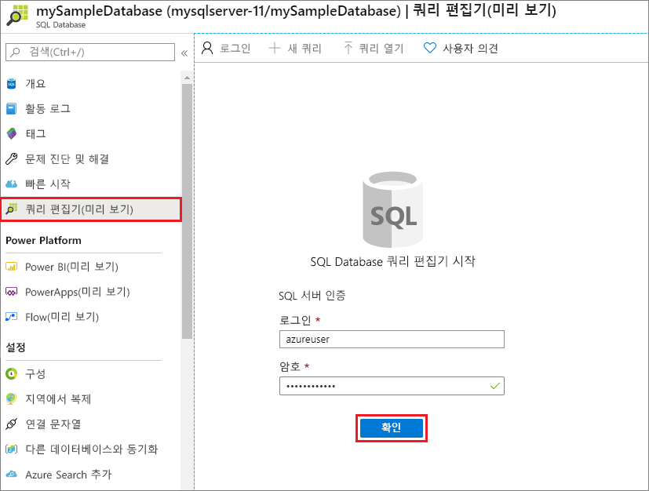
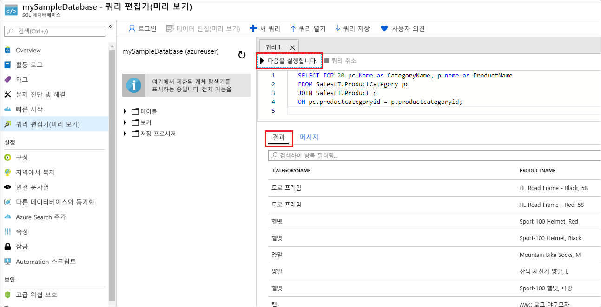

# <a name="quickstart-create-an-azure-sql-database-single-database"></a>빠른 시작: Azure SQL Database 단일 데이터베이스 만들기
[!INCLUDE[appliesto-sqldb](../includes/appliesto-sqldb.md)]

이 빠른 시작에서는 Azure Portal, PowerShell 스크립트 또는 Azure CLI 스크립트를 사용하여 단일 Azure SQL Database를 만듭니다. 그런 다음, Azure Portal에서 **쿼리 편집기**를 사용하여 데이터베이스를 쿼리합니다.

[단일 데이터베이스](single-database-overview.md)는 Azure SQL Database에 대한 가장 빠르고 간단한 옵션입니다. 지정된 Azure 지역의 [Azure 리소스 그룹](../../active-directory-b2c/overview.md) 내에 있는 [서버](logical-servers.md) 내에서 단일 데이터베이스를 관리합니다. 이 빠른 시작에서는 새 데이터베이스에 대한 새 리소스 그룹 및 서버를 만듭니다.

*프로비저닝된* 또는 *서버리스* 컴퓨팅 계층에서 단일 데이터베이스를 만들 수 있습니다. 프로비저닝된 데이터베이스에는 CPU 및 메모리를 비롯한 정해진 양의 컴퓨팅 리소스가 미리 할당되어 있으며 두 가지 [구매 모델](purchasing-models.md) 중 하나를 사용합니다. 이 빠른 시작은 [vCore 기반](service-tiers-vcore.md) 구매 모델을 사용하여 프로비저닝된 데이터베이스를 만들지만 [DTU 기반](service-tiers-dtu.md) 모델을 선택할 수도 있습니다.

서버리스 컴퓨팅 계층은 vCore 기반 구매 모델에서만 사용할 수 있으며, CPU 및 메모리를 비롯한 다양한 자동 크기 조정 범위의 컴퓨팅 리소스가 있습니다. 서버리스 컴퓨팅 계층에서 단일 데이터베이스를 만들려면 [서버리스 데이터베이스 만들기](serverless-tier-overview.md#create-new-database-in-serverless-compute-tier)를 참조하세요.

## <a name="prerequisite"></a>필수 요소

- 활성화된 Azure 구독. 아직 없는 경우 [체험 계정](https://azure.microsoft.com/free/)을 만들 수 있습니다.

## <a name="create-a-single-database"></a>단일 데이터베이스 만들기

[!INCLUDE [sql-database-create-single-database](../includes/sql-database-create-single-database.md)]

## <a name="query-the-database"></a>데이터베이스 쿼리

데이터베이스를 만든 후에는 이제 Azure Portal에서 기본 제공 **쿼리 편집기**를 사용하여 데이터베이스에 연결하고 데이터를 쿼리할 수 있습니다.

1. 포털에서 **SQL 데이터베이스**를 검색하고 선택한 다음, 목록에서 데이터베이스를 선택합니다.
1. 데이터베이스의 **SQL Database** 페이지에서 왼쪽 메뉴에 있는 **쿼리 편집기(미리 보기)** 를 선택합니다.
1. 사용자의 서버 관리자 로그인 정보를 입력하고, **확인**을 선택합니다.

   

1. 다음 쿼리를 **쿼리 편집기** 창에 입력합니다.

   ```sql
   SELECT TOP 20 pc.Name as CategoryName, p.name as ProductName
   FROM SalesLT.ProductCategory pc
   JOIN SalesLT.Product p
   ON pc.productcategoryid = p.productcategoryid;
   ```

1. **실행**을 선택한 다음, **결과** 창에서 쿼리 결과를 검토합니다.

   

1. **쿼리 편집기** 창을 닫고, 저장하지 않은 편집 내용을 삭제하라는 메시지가 표시될 때 **확인**을 선택합니다.

## <a name="clean-up-resources"></a>리소스 정리

리소스 그룹, 서버 및 단일 데이터베이스를 유지하여 다음 단계로 이동하고, 다양한 방법으로 데이터베이스에 연결하고 쿼리하는 방법을 알아봅니다.

이러한 리소스의 사용을 마친 후에는 만든 리소스 그룹을 삭제할 수 있습니다. 그러면 해당 리소스 그룹 내에서 서버 및 단일 데이터베이스도 삭제됩니다.

### <a name="portal"></a>[포털](#tab/azure-portal)

Azure Portal을 사용하여 **myResourceGroup** 및 모든 해당 리소스를 삭제하려면 다음을 수행합니다.

1. 포털에서 **리소스 그룹**을 검색하고 선택한 다음, 목록에서 **myResourceGroup**을 선택합니다.
1. 리소스 그룹 페이지에서 **리소스 그룹 삭제**를 선택합니다.
1. **리소스 그룹 이름 입력**에 *myResourceGroup*을 입력한 다음, **삭제**를 선택합니다.

### <a name="azure-cli"></a>[Azure CLI](#tab/azure-cli)

리소스 그룹 및 모든 해당 리소스를 삭제하려면 리소스 그룹 이름을 사용하여 다음 Azure CLI 명령을 실행합니다.

```azurecli-interactive
az group delete --name <your resource group>
```

### <a name="powershell"></a>[PowerShell](#tab/azure-powershell)

리소스 그룹 및 모든 해당 리소스를 삭제하려면 리소스 그룹의 이름을 사용하여 다음 PowerShell cmdlet을 실행합니다.

```azurepowershell-interactive
Remove-AzResourceGroup -Name <your resource group>
```

---

## <a name="next-steps"></a>다음 단계

다양한 도구 및 언어를 사용하여 데이터베이스 [연결 및 쿼리](connect-query-content-reference-guide.md):
> [!div class="nextstepaction"]
> [SQL Server Management Studio를 사용하여 연결 및 쿼리 ](connect-query-ssms.md)
> [Azure Data Studio를 사용하여 연결 및 쿼리](/sql/azure-data-studio/quickstart-sql-database?toc=/azure/sql-database/toc.json)
