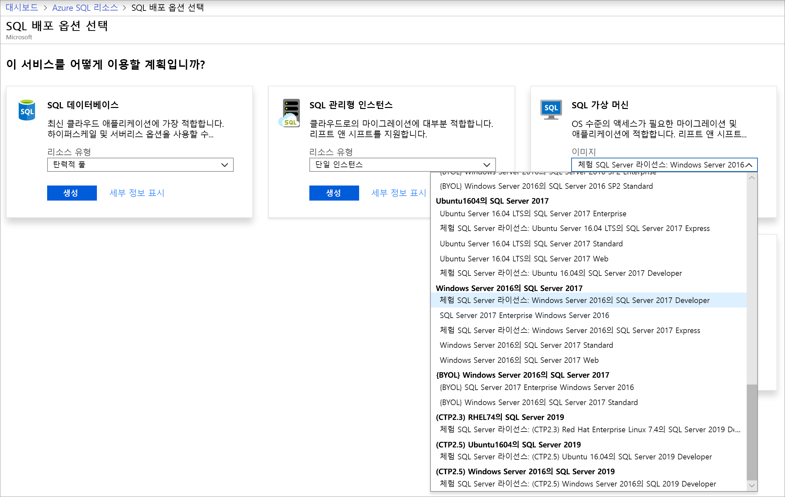
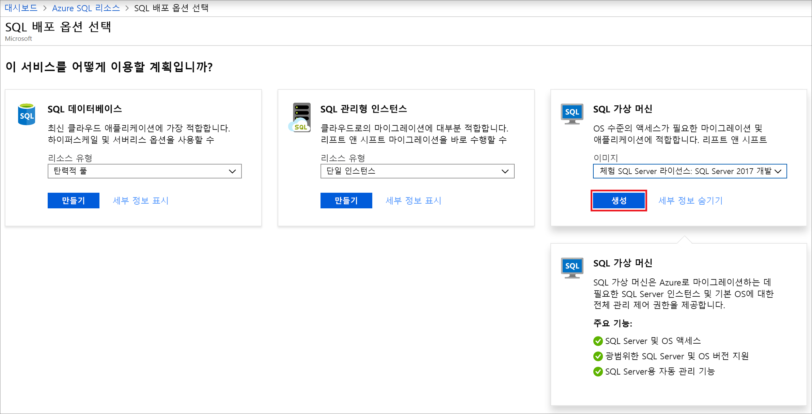
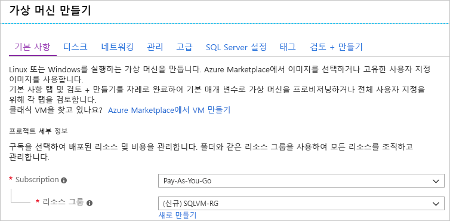
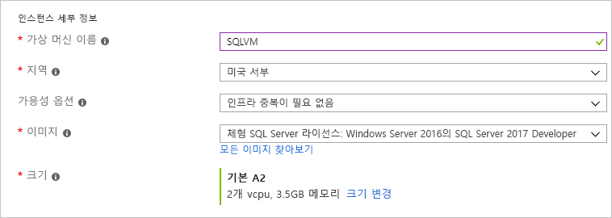
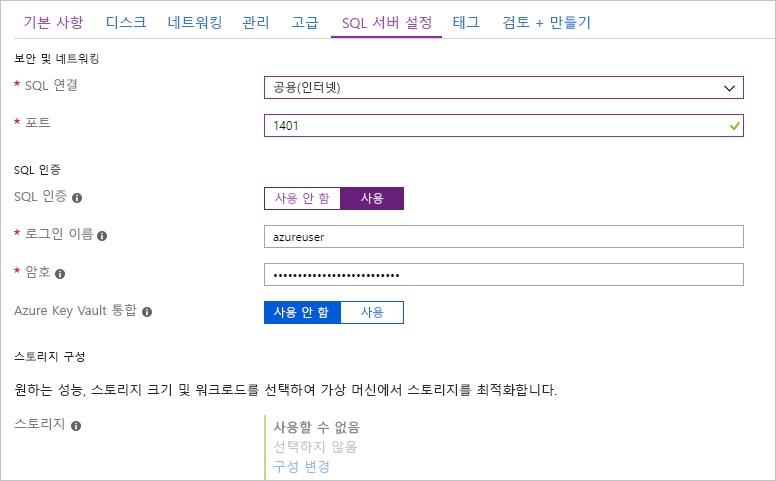
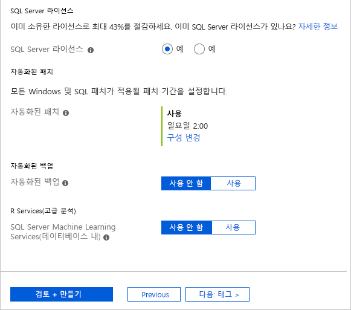
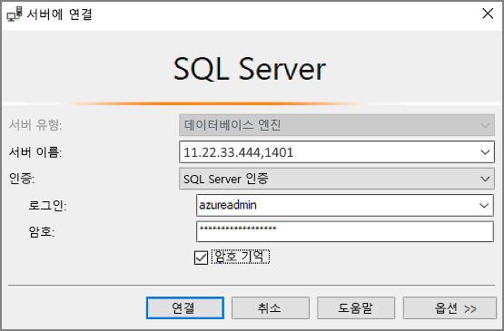

# 빠른 시작: Azure Portal의 Windows 가상 머신에서 SQL Server 2017 만들기

[!INCLUDE[appliesto-sqlvm](../../includes/appliesto-sqlvm.md)]

> [!div class="op_single_selector"]
> * [Windows](sql-vm-create-portal-quickstart.md)
> * [Linux](../linux/sql-vm-create-portal-quickstart.md)

이 빠른 시작에서는 Azure Portal에서 SQL Server VM(가상 머신)을 만드는 과정을 안내합니다.

  > [!TIP]
  > - 이 빠른 시작에서는 신속하게 SQL VM을 프로비전하고 연결하는 경로를 제공합니다. 다른 SQL VM 프로비저닝 선택 항목에 대한 자세한 내용은 [Azure Portal의 Windows VM에서 SQL Server에 대한 프로비저닝 가이드](create-sql-vm-portal.md)를 참조하세요.
  > - SQL Server 가상 머신에 대한 질문이 있으면 [질문과 대답](frequently-asked-questions-faq.md)을 참조하세요.

##  Azure 구독 가져오기

Azure 구독이 아직 없는 경우 시작하기 전에 [체험 계정](https://azure.microsoft.com/free/?WT.mc_id=A261C142F)을 만듭니다.

## SQL Server VM 이미지 선택

1. 계정을 사용하여 [Azure Portal](https://portal.azure.com)에 로그인합니다.

1. Azure Portal의 왼쪽 메뉴에서 **Azure SQL**을 선택합니다. **Azure SQL**이 목록에 없는 경우 **모든 서비스**를 선택한 다음, 검색 상자에 *Azure SQL*을 입력합니다.
1. **+추가**를 선택하여 **SQL 배포 옵션 선택** 페이지를 엽니다. **SQL 가상 머신** 타일에서 **세부 정보 표시**를 선택하여 추가 정보를 볼 수 있습니다.
1. **무료 SQL Server 라이선스: Windows Server 2016의 SQL Server 2017 Developer** 이미지를 드롭다운에서 선택합니다.

   

1. **만들기**를 선택합니다.

   

## 기본 세부 정보 제공

**기본** 탭에서 다음 정보를 제공합니다.

1. **프로젝트 세부 정보** 섹션에서 Azure 구독을 선택한 후 **새로 만들기**를 선택하여 새 리소스 그룹을 만듭니다. 이름에 _SQLVM-RG_를 입력합니다.

   

1. **인스턴스 세부 정보**에서
    1. **가상 머신 이름**에 _SQLVM_을 입력합니다. 
    1. **영역**에 위치를 선택합니다. 
    1. 이 빠른 시작에서는 **가용성 옵션**을 _인프라 중복성 필요 없음_으로 설정합니다. 가용성 옵션에 대한 자세한 내용을 알아보려면 [가용성](../../../virtual-machines/windows/availability.md)을 참조하세요. 
    1. **이미지** 목록에서 _무료 SQL Server 라이선스: Windows Server 2016의 SQL Server 2017 Developer_ 이미지를 선택합니다. 
    1. 가상 머신의 **크기**에서 **크기 변경**을 선택하고 **A2 Basic** 제품을 선택합니다. 리소스를 다 사용했으면 예기치 않은 요금이 청구되지 않도록 리소스를 삭제하세요. 

   

1. **관리자 계정**에서 _azureuser_와 같은 사용자 이름 및 암호를 입력합니다. 암호는 12자 이상이어야 하며 [정의된 복잡성 요구 사항](../../../virtual-machines/windows/faq.md#what-are-the-password-requirements-when-creating-a-vm)을 충족해야 합니다.

   

1. **인바운드 포트 규칙**에서 **선택한 포트 허용**을 선택한 다음, 드롭다운에서 **RDP(3389)** 를 선택합니다. 

   

## SQL 서버 설정

**SQL Server 설정** 탭에서 다음 옵션을 구성합니다.

1. **보안 및 네트워킹**에서 **SQL 연결**에 _공개(인터넷_)를 선택하고 포트를 `1401`로 변경하여 공개 시나리오에서 잘 알려진 포트 번호를 사용하지 않도록 합니다. 
1. **SQL 인증** 아래에서 **사용**을 선택합니다. SQL 로그인 자격 증명은 VM에 구성한 것과 동일한 사용자 이름 및 암호로 설정됩니다. [**Azure Key Vault 통합**](azure-key-vault-integration-configure.md)에 대한 기본 설정을 사용합니다. **스토리지 구성**은 기본 SQL Server VM 이미지에 사용할 수 없지만 [스토리지 구성](storage-configuration.md#new-vms)에서 다른 이미지에 사용할 수 있는 옵션에 대한 자세한 정보를 찾을 수 있습니다.  

   

1. 필요한 경우 다른 설정을 변경한 후 **검토 + 만들기**를 선택합니다. 

   

## SQL Server VM 만들기

**검토 + 만들기** 탭에서 요약을 검토하고 **만들기**를 선택하여 이 VM에 지정된 SQL Server, 리소스 그룹 및 리소스를 만듭니다.

Azure Portal에서 배포를 모니터링할 수 있습니다. 화면 맨 위에 있는 **알림** 단추는 배포의 기본 상태를 표시합니다. 배포에는 몇 분 정도 걸릴 수 있습니다. 

## SQL Server에 연결

1. 포털에 있는 가상 머신 속성의 **개요** 섹션에서 SQL Server VM의 **공용 IP 주소**를 찾습니다.

1. 인터넷에 연결된 다른 컴퓨터에서 [SSMS(SQL Server Management Studio)](/sql/ssms/download-sql-server-management-studio-ssms)를 엽니다.

1. **서버에 연결** 또는 **데이터베이스 엔진에 연결** 대화 상자에서 **서버 이름** 값을 편집합니다. VM의 공용 IP 주소를 입력합니다. 그런 다음, 쉼표를 추가하고 새 VM을 구성할 때 지정한 사용자 지정 포트(**1401**)를 추가합니다. 예들 들어 `11.22.33.444,1401`입니다.

1. **인증** 상자에 **SQL Server 인증**을 선택합니다.

1. **로그인** 상자에 올바른 SQL 로그인 이름을 입력합니다.

1. **암호** 상자에 로그인 암호를 입력합니다.

1. **연결**을 선택합니다.

    

## VM에 원격으로 로그인

다음 단계를 사용하여 원격 데스크톱으로 SQL Server 가상 머신에 연결합니다.

[!INCLUDE [Connect to SQL Server VM with remote desktop](../../../../includes/virtual-machines-sql-server-remote-desktop-connect.md)]

SQL Server 가상 머신에 연결된 후에, SQL Server Management Studio를 시작하고 로컬 관리자 자격 증명을 사용하여 Windows 인증으로 연결할 수 있습니다. SQL Server 인증을 사용하도록 설정한 경우에는, 프로비전 중에 구성해 놓은 SQL 로그인 및 암호를 사용하여 SQL 인증에 연결할 수 있습니다.

컴퓨터에 연결하면 요구 사항에 따라 컴퓨터와 SQL Server 설정을 직접 변경할 수 있습니다. 예를 들어, 방화벽 설정을 구성하거나 SQL Server 구성 설정을 변경할 수 있습니다.

## 리소스 정리

계속해서 SQL VM을 실행하지 않아도 되는 경우 사용 중이 아닌 VM을 중지하여 불필요한 요금을 방지할 수 있습니다. 포털에서 관련된 리소스 그룹을 삭제하여 가상 머신과 관련된 모든 리소스를 영구적으로 삭제할 수 있습니다. 그러면 가상 머신도 영구적으로 삭제되므로 이 명령을 사용할 때는 주의해야 합니다. 자세한 내용은 [포털을 통한 Azure 리소스 관리](../../../azure-resource-manager/management/manage-resource-groups-portal.md)를 참조하세요.

## 다음 단계

이 빠른 시작에서는 Azure Portal에서 SQL Server 2017 가상 머신을 만들었습니다. 새 SQL Server 데이터를 마이그레이션하는 방법에 대한 자세한 내용은 다음 문서를 참조하세요.

> [!div class="nextstepaction"]
> [SQL VM에 데이터베이스 마이그레이션](migrate-to-vm-from-sql-server.md)
