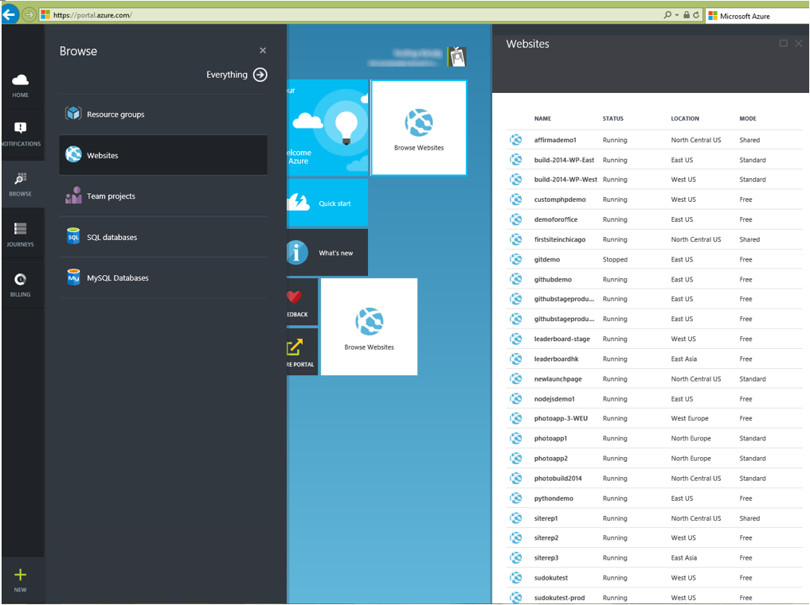

<properties 
	pageTitle="Azure 앱 서비스 계획의 포괄 개요" 
	description="Azure 앱 서비스에 대한 앱 서비스 계획의 작동 방식 및 이러한 계획을 통해 관리 환경을 향상시킬 수 있는 방법을 알아봅니다." 
	services="app-service" 
	documentationCenter="" 
	authors="cephalin" 
	manager="wpickett" 
	editor=""/>

<tags 
	ms.service="app-service" 
	ms.workload="web" 
	ms.tgt_pltfrm="na" 
	ms.devlang="na" 
	ms.topic="article" 
	ms.date="03/24/2015" 
	ms.author="byvinyal"/>

#Azure 앱 서비스 계획의 포괄 개요#

**앱 서비스 계획**은 웹앱, 모바일 앱, 논리 앱 또는 API 앱을 포함하여 [Azure 앱 서비스](http://go.microsoft.com/fwlink/?LinkId=529714)의 여러 앱에서 공유할 수 있는 기능 및 용량 집합을 나타냅니다. 이러한 계획에서는 5가지 가격 책정 계층(**무료**, **공유**, **기본**, **표준** 및 **프리미엄**)이 지원되며 각 계층에 고유한 기능과 용량이 있습니다. 동일한 구독 및 지리적 위치에 있는 앱은 계획을 공유할 수 있습니다. 계획을 공유하는 모든 앱은 계획 계층에서 정의된 모든 기능 및 특징을 활용할 수 있습니다. 주어진 계획과 관련된 모든 앱은 계획에 정의된 리소스에서 실행됩니다. 예를 들어 계획이 표준 서비스 계층의 "작은" 인스턴스 2개를 사용하도록 구성되어 있으면 해당 계획과 연결된 모든 앱이 두 인스턴스에서 모두 실행되고 표준 서비스 계층 기능에 액세스할 수 있습니다. 앱을 실행 중인 계획 인스턴스는 완전히 관리되며 가용성이 높습니다.

이 문서에서는 앱 서비스 계획의 계층 및 크기와 앱을 관리하는 동안 계획이 진행되는 방식과 같은 주요 특징을 살펴보겠습니다.

##앱 및 앱 서비스 계획

앱 서비스의 앱은 주어진 시간에 항상 하나의 앱 서비스 계획에만 연결될 수 있습니다.

앱과 계획은 둘 다 리소스 그룹에 포함됩니다. 리소스 그룹은 그룹 내에 포함된 모든 리소스에 대한 수명 주기 경계 역할을 합니다. 리소스 그룹을 사용하면 응용 프로그램의 모든 부분을 함께 관리할 수 있습니다.

단일 리소스 그룹에 여러 앱 서비스 계획을 포함하는 기능을 통해 각 물리적 리소스에 다른 앱을 할당할 수 있습니다. 예를 들어 이 기능을 통해 개발, 테스트 및 프로덕션 환경 간에 리소스를 구분할 수 있습니다. 이러한 시나리오는 프로덕션 앱에 대해 전용 리소스 집합을 포함하는 계획을 할당하고 개발 및 테스트 환경에 대해 다른 계획을 할당하려는 경우입니다. 이렇게 하면 새 버전의 앱에 대한 부하 테스트가 실제 고객에게 서비스를 제공하는 프로덕션 앱과 동일한 리소스를 경쟁하지 않습니다.

또한 단일 리소스 그룹에 여러 웹 계획을 포함하여 여러 지역에 걸쳐 있는 응용 프로그램을 정의할 수 있습니다. 예를 들어 두 개의 지역에서 실행되는 고가용성 앱에는 각 지역별로 하나씩 두 개의 계획이 포함되고 각 계획과 연결된 앱이 하나씩 포함됩니다. 이러한 경우 앱의 모든 복사본이 단일 리소스 그룹과 연결됩니다. 여러 계획과 여러 앱을 포함하는 리소스 그룹의 단일 보기가 있으면 응용 프로그램의 상태를 쉽게 관리, 제어 및 확인할 수 있습니다.

## 새로운 앱 서비스 계획 만들기 및 기존 계획 사용

새 앱을 만들 때 만들려는 앱이 새 프로젝트를 나타내는 경우 새 리소스 그룹을 만들어야 합니다. 이 경우 새 리소스 그룹, 계획 및 앱을 만드는 것이 좋습니다.

만들려는 앱이 대규모 응용 프로그램의 구성 요소인 경우 대규모 응용 프로그램에 대해 할당된 리소스 그룹 내에 이 웹앱을 만들어야 합니다.

새 앱이 완전히 새로운 응용 프로그램이든, 대규모 응용 프로그램의 일부이든 관계없이 기존 앱 서비스 계획을 활용하여 앱을 호스트하거나 새 계획을 만들 수 있습니다. 이 선택은 용량과 예상 부하에 따라 결정됩니다. 새 앱이 리소스를 많이 사용하며 기존 계획에 호스트된 기타 앱과 다른 배율 인수를 사용하는 경우 고유한 계획에 격리시키는 것이 좋습니다.

새 계획을 만들면 웹앱에 대해 새 리소스 집합을 할당할 수 있으며, 각 계획이 고유한 인스턴스 집합을 얻게 되므로 리소스 할당을 보다 강력하게 제어할 수 있습니다.
 
계획 간에 앱을 이동하는 기능을 사용하여 대규모 응용 프로그램에서 리소스가 할당되는 방법을 변경할 수도 있습니다.
 
마지막으로, 다른 지역에 새 앱을 만들려고 하며 해당 지역에 기존 계획이 없는 경우 이 지역에서 새 계획을 만들어야 앱을 호스트할 수 있습니다.

## 앱 서비스 계획 만들기

빈 앱 서비스 계획을 만들 수는 없습니다. 그러나 앱을 만드는 동안 새 계획을 명시적으로 만들 수 있습니다.

[Azure 포털](http://go.microsoft.com/fwlink/?LinkId=529715)에서 새 계획을 만들려면 **새로 만들기**를 클릭하고 **웹+모바일**을 선택한 다음 **웹앱**, **모바일 앱**, **논리 앱** 또는 **API 앱**을 선택합니다. 그런 다음 새 앱에 대한 앱 서비스 계획을 선택하거나 만들 수 있습니다.
 

##앱 서비스 계획에 앱 할당

앱을 만드는 중에 기존 계획에 앱을 할당할 수 있습니다.

[Azure 포털](http://portal.azure.com)에서 새 계획을 만들려면 **새로 만들기**를 클릭하고 **웹+모바일**을 선택한 다음 **웹앱**, **모바일 앱**, **논리 앱** 또는 **API 앱**을 선택합니다. 그런 다음 새 앱에 대한 앱 서비스 계획을 선택하거나 만들 수 있습니다. **또는 기존 계획 선택**을 클릭하면 선택할 수 있는 기존 계획 목록이 나타납니다.

 
## 다른 앱 서비스 계획으로 앱 이동

[Azure 포털](http://portal.azure.com)에서 앱을 다른 앱 서비스 계획으로 이동할 수 있습니다. 동일한 지역의 계획 간에 앱을 이동할 수 있습니다.

앱을 다른 계획으로 이동하려면 이동할 앱을 탐색하고 **앱 서비스 계획 변경**을 클릭합니다.
 
앱 서비스 계획 블레이드가 열립니다. 이때 기존 계획을 선택하거나 새 계획을 만들 수 있습니다. 다른 지리적 위치의 계획은 회색으로 표시되어 선택할 수 없습니다.

각 계획에는 고유한 가격 책정 계층이 있습니다. **무료** 계층에서 **표준** 계층으로 사이트를 이동하는 경우 앱이 **표준** 계층의 모든 기능과 리소스를 활용할 수 있습니다.

## 앱 서비스 계획 크기 조정

계획의 크기를 조정하는 세 가지 방법이 있습니다.

- 계획의 **가격 책정 계층**을 변경합니다. 예를 들어 **기본** 계층의 계획을 **표준** 또는 **프리미엄** 계층으로 변환할 수 있으며 해당 계획과 연결된 모든 앱이 새 서비스 계층에 제공된 기능을 활용할 수 있습니다.
- 계획의 **인스턴스 크기**를 변경합니다. 예를 들어 **작은** 인스턴스를 사용하는 **기본** 계층의 계획을 **큰** 인스턴스를 사용하도록 변경할 수 있습니다. 해당 계획과 연결된 모든 앱이 큰 인스턴스 크기에서 제공하는 추가 메모리 및 CPU 리소스를 활용할 수 있습니다.
- 계획의 **인스턴스 수**를 변경합니다. 예를 들어 3개 인스턴스로 규모가 확장된 **표준** 계획은 10개 인스턴스까지 확장할 수 있고 **프리미엄**(미리 보기) 계획은 20개 인스턴스까지 규모를 확장할 수 있습니다(일부 제한 적용). 해당 계획과 연결된 모든 앱이 큰 인스턴스 수에서 제공하는 추가 메모리 및 CPU 리소스를 활용할 수 있습니다.

아래 이미지에서는 **앱 서비스 계획** 블레이드 및 **가격 책정 계층** 블레이드를 볼 수 있습니다. **앱 서비스 계획** 블레이드에서 **가격 책정 계층** 파트를 클릭하면 계획의 가격 책정 계층과 인스턴스 크기를 변경할 수 있는 **가격 책정 계층** 블레이드가 확장됩니다.
 

##요약

앱 서비스 계획은 앱 간에 공유할 수 있는 기능 및 용량 집합을 나타냅니다. 앱 서비스 계획은 주어진 리소스 집합에 특정 앱을 할당하고 Azure 리소스 사용률을 더욱 최적화하는 유연성을 제공합니다. 따라서 테스트 환경에서 비용을 절약하려는 경우 여러 앱에서 계획을 공유할 수 있습니다. 여러 지역과 계획에 걸쳐 크기를 조정하여 프로덕션 환경의 생산량을 최대화할 수도 있습니다.

## 변경된 내용

* 웹 사이트에서 앱 서비스로의 변경에 대한 지침은 [Azure 앱 서비스와 이 서비스가 기존 Azure 서비스에 미치는 영향](http://go.microsoft.com/fwlink/?LinkId=529714)을 참조하세요.
* 이전 포털에서 새 포털로의 변경에 대한 지침은 [미리 보기 포털 탐색에 대한 참조](http://go.microsoft.com/fwlink/?LinkId=529715)를 참조하세요.

<!--HONumber=54-->