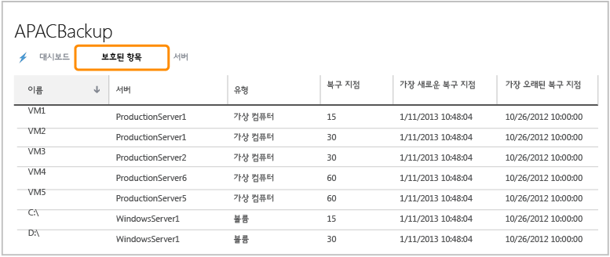

<properties  linkid="manage-services-recovery-configure-backup-vault" urlDisplayName="Configure a Backup Vault" pageTitle="Configure Azure Recovery Services to quickly and easily back-up Windows Server" metaKeywords="disaster recovery" description="Use this tutorial to learn how to use the Backup service in Microsoft's Azure cloud offering to back up Windows Server to the cloud." metaCanonical="" services="recovery-services" documentationCenter="" title="Configure Azure Backup to quickly and easily back-up Windows Server" authors="starra" solutions="" manager="cynthn" editor="tysonn" />

<h1>Windows Server를 빠르고 쉽게 백업하도록 Azure 백업 구성</h1>

 
<strong>참고</strong>
 

이 자습서를 완료하려면 Azure 백업 기능이 사용되는 Azure 계정이 필요합니다.

<ul> 
<li>계정이 없는 경우 몇 분 만에 무료 평가판 계정을 만들 수 있습니다. 자세한 내용은 <a href="/en-us/pricing/free-trial/">Azure 무료 평가판</a>을 참조하십시오.</li> 
 
<li>기존 계정이 있지만 Azure 백업 미리 보기를 사용하도록 설정해야 하는 경우 <a href="/en-us/develop/net/tutorials/create-a-windows-azure-account/#enable" target="_blank">Azure 미리 보기 기능 사용</a>을 참조하십시오.</li>
</ul>
 

백업 미리 보기 프로그램에 가입을 요청한 후 상태가 활성이 될 때까지 기다립니다. 모든 고객이 자동으로 승인되므로 이 작업은 오랜 시간이 걸리지 않습니다.
 

Windows Server의 파일과 데이터를 Azure에 백업하려면 데이터를 저장하려는 지역에 백업 저장소를 만들어야 합니다. 이 자습서에서는 백업을 저장하는 데 사용할 저장소 생성, 저장소에 인증서 업로드, 백업 에이전트 설치, 관리 포털을 통해 사용 가능한 백업 관리 작업 개요를 단계별로 안내합니다.

 
<strong>시작하기 전에</strong> 

이 자습서를 완료하려면 백업 저장소에 서버를 등록하기 위한 X.509 v3 인증서가 있어야 합니다.  인증서는 키 길이가 2048비트 이상이어야 하며 로컬 컴퓨터의 개인 인증서 저장소에 있어야 합니다. 인증서가 서버에 설치된 경우에는 인증서의 개인 키가 포함되어 있어야 합니다. Azure 관리 포털에 인증서를 업로드하려면 공개 키를 .cer 형식 파일로 내보내야 합니다.
 

다음 중 하나를 사용할 수 있습니다.
 
<ul>
<li>makecert 도구를 사용하여 만든 자체 서명된 고유 인증서 또는</li> 

<li>루트 인증서가 Microsoft 루트 인증서 프로그램을 통해 분산되었으며 Microsoft가 신뢰하는 CA(인증 기관)에서 발급된 유효한 SSL 인증서. 이 프로그램에 대한 자세한 내용은 <a href="http://go.microsoft.com/fwlink/p/?LinkId=294666">Windows 루트 인증서 프로그램 구성원</a>을 참조하십시오.</li>
</ul> 

인증서에 필요한 다른 일부 특성은 다음과 같습니다.
 

<ul>
<li>유효한 ClientAuthentication EKU가 있음</li>

<li>현재 유효하며 유효 기간이 3년을 초과하지 않음</li>  
</ul>

자체 서명된 고유 인증서를 사용하려면 다음 단계를 따르십시오. 

<ol>
<li><a href="http://go.microsoft.com/fwlink/p/?LinkID=294662">인증서 생성 도구(MakeCert.exe)</a>를 다운로드합니다.</li>  

<li>관리자 권한으로 명령 프롬프트(cmd.exe)를 연 다음 <i>CertificateName</i>을 해당 인증서 이름으로 바꾸고 -e 뒤에 인증서의 실제 만료 날짜를 지정하여 다음 명령을 실행합니다. <code>makecert.exe -r -pe -n CN=CertificateName -ss my -sr localmachine -eku 1.3.6.1.5.5.7.3.2 -len 2048 -e 01/01/2016 CertificateName.cer</code></li>
</ol>

인증서를 만들 때 사용한 것과 다른 서버를 등록하는 경우 .pfx 파일(개인 키 포함)을 내보내고 다른 서버에 복사한 후 해당 서버의 개인 인증서 저장소로 가져와야 합니다. 

저장소 인증서 업로드 프로세스에 대한 단계별 지침과 .pfx 파일을 내보내고 가져오는 방법에 대한 자세한 내용은 <a href="http://go.microsoft.com/fwlink/p/?LinkID=294662">저장소 인증서 관리</a>를 참조하십시오.
 

<h2>백업 저장소 만들기</h2>

1.  [관리 포털][1]에 로그인합니다.
    
    [WACOM.INCLUDE [disclaimer](../includes/disclaimer.md)]

2.  **복구 서비스**, **새로 만들기**를 차례로 클릭하고 **백업 저장소**를 가리킨 후 **빠른 생성**을 클릭합니다.
    
    

3.  **이름**에 백업 저장소를 식별할 이름을 입력합니다.

4.  **지역**에서 백업 저장소의 지역을 선택합니다.

5.  **구독**에 백업 저장소와 함께 사용할 Azure 구독을 입력합니다.

6.  **백업 저장소 만들기**를 클릭합니다.
    
    백업 저장소름 만드는 데 시간이 걸릴 수 있습니다. 상태를 확인하려면 포털 맨 아래에 표시되는 알림을 모니터링합니다. 백업 저장소를 만든 후 저장소가 만들어졌다는 메시지가 표시되며 복구 서비스에 대한 리소스에 **온라인**으로 나열됩니다.
    
    

<h2>인증서 업로드</h2>
1.  [관리 포털][1]에 로그인합니다.

2.  **복구 서비스**를 클릭하고 인증서로 식별할 백업 저장소의 이름을 클릭한 후 **인증서 관리**를 클릭합니다.
    
    

3.  **인증서 관리** 대화 상자에서 컴퓨터 찾아보기를 클릭하여 이 백업 저장소와 함께 사용할 .cer 파일을 찾습니다.
<h2>백업 에이전트 다운로드 및 설치</h2>
1.  [관리 포털][1]에 로그인합니다.

2.  **복구 서비스**를 클릭한 후 백업 저장소의 이름을 클릭하여 저장소 대시보드를 표시합니다.

3.  **에이전트 설치**를 클릭합니다.
    
    
4.  다운로드할 에이전트를 선택할 수 있는 대화 상자가 표시됩니다.
    * Windows Server 2012 및 System Center 2012 SP1 - Data Protection Manager용 에이전트
    * Windows Server 2012 Essentials용 에이전트
5.  해당 에이전트를 선택합니다. 에이전트 소프트웨어를 다운로드할 수 있는 Microsoft 다운로드 센터로 리디렉션됩니다.
    자세한 내용은 다음을 참조하십시오.
    
    * [Windows Server 2012 및 System Center 2012 SP1 - Data Protection Manager용 Azure 백업 에이전트 설치][2]
    * [Windows Server 2012 Essentials용 Azure 백업 에이전트 설치][3]

에이전트가 설치된 후 해당 로컬 관리 인터페이스(예: Microsoft Management Console 스냅인, System Center Data Protection Manager Console 또는 Windows Server Essentials Dashboard)를 사용하여 서버에 대한 백업 정책을 구성할 수 있습니다.

<h2>백업 저장소 및 서버 관리</h2>
1.  [관리 포털][1]에 로그인합니다.

2.  **복구 서비스**를 클릭한 후 백업 저장소의 이름을 클릭하여 저장소 대시보드를 표시합니다. 여기서 다음 작업을 수행할 수 있습니다.
    * **인증서 관리**. 이전에 업로드된 인증서를 업데이트하는 데 사용됩니다.
    * **삭제**. 현재 백업 저장소를 삭제합니다. 백업 저장소가 더 이상 사용되지 않는 경우 삭제하여 저장소 공간을 확보할 수 있습니다. **삭제**는 등록된 모든 서버가 저장소에서 삭제된 후에만 사용할 수 있습니다.

3.  **보호된 항목**을 클릭하여 서버에서 백업된 항목을 표시합니다. 이 목록은 정보 제공 목적으로만 사용됩니다.  
     

4.  **서버**를 클릭하여 이 저장소에 등록된 서버의 이름을 표시합니다. 여기서 다음 작업을 수행할 수 있습니다.
    * **다시 등록 허용**. 서버에 대해 이 옵션이 선택된 경우 에이전트에서 등록 마법사를 사용하여 백업 저장소에 서버를 다시 등록할 수 있습니다. 인증서 오류로 인해 또는 서버를 다시 빌드해야 한 경우 다시 등록해야 할 수도 있습니다. 서버 이름당 한 번만 다시 등록할 수 있습니다.
    * **삭제**. 백업 저장소에서 서버를 삭제합니다. 서버와 관련해서 저장된 모든 데이터가 즉시 삭제됩니다.
      
      

<h2>다음 단계</h2>

* Azure 백업에 대한 자세한 내용은 [Azure 백업 개요][4]를 참조하십시오.

* [Azure 백업 포럼][5]을 방문하십시오.

[1]: https://manage.windowsazure.com
[2]: http://technet.microsoft.com/en-us/library/hh831761.aspx#BKMK_installagent
[3]: http://technet.microsoft.com/en-us/library/jj884318.aspx
[4]: http://go.microsoft.com/fwlink/p/?LinkId=222425
[5]: http://go.microsoft.com/fwlink/p/?LinkId=290933