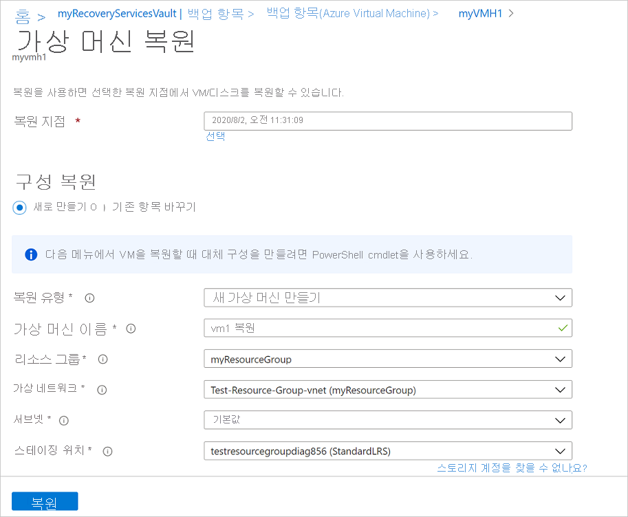
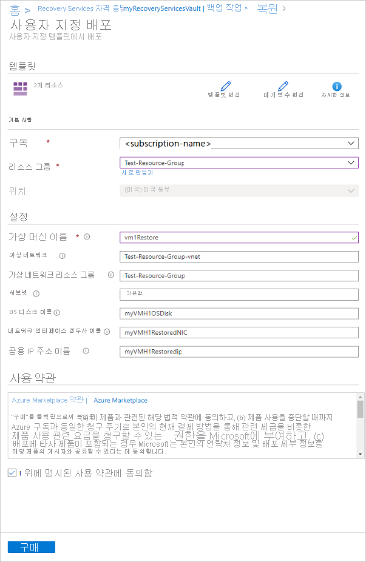

# Azure Portal을 사용하여 가상 머신 복원
정의된 간격으로 데이터의 스냅숏을 찍어 데이터를 보호합니다. 이러한 스냅숏은 복구 지점이라고 하며 Recovery Services 자격 증명 모음에 저장됩니다. VM(가상 머신)을 복구하거나 다시 빌드해야 하는 경우 저장된 복구 지점 중 하나에서 VM을 복원할 수 있습니다. 복구 지점을 복원할 때 다음을 수행할 수 있습니다.

* 새 VM 만들기: 백업된 VM의 지정 시간 복구 지점입니다.
* 디스크 복원: 프로세스와 함께 제공되는 템플릿을 사용하여 복원된 VM을 사용자 지정하거나 개별 파일 복구를 수행합니다.

이 문서에서는 새 VM에 VM을 복원하거나 모든 백업된 디스크를 복원하는 방법을 설명합니다. 개별 파일 복구는 [Azure VM 백업에서 파일 복구](backup-azure-restore-files-from-vm.md)를 참조하세요.

VM 백업에서 VM 또는 모든 디스크를 복원하는 작업은 다음과 같은 두 가지 단계를 포함합니다.

* 복원을 위한 복원 지점을 선택합니다.
* 복원 유형을 선택합니다.
    - 옵션 1: 새 VM 만들기
    - 옵션 2: 디스크 복원

## 복원을 위해 복원 지점 선택
1. [Azure Portal](http://portal.azure.com/)에 로그인합니다.

2. Azure 메뉴에서 **모든 서비스**를 선택합니다. 서비스 목록에서 **Recovery Services**를 입력하거나 **복구 서비스 자격 증명 모음**이 나열된 **저장소**로 이동하여 선택합니다.

    

3. 구독에서 자격 증명 모음의 목록이 표시됩니다.

    

4. 복구 서비스 자격 증명 모음 목록에서 복원하려는 VM과 연결된 자격 증명 모음을 선택합니다. 자격 증명 모음을 선택하면 해당 대시보드가 열립니다.

    

5. 자격 증명 모음 대시보드의 **백업 항목** 타일에서 **Azure Virtual Machine**을 선택합니다.

    

6. Azure VM 목록이 포함된 **백업 항목** 블레이드가 열립니다.

    

7. 목록에서 VM을 선택하여 대시보드를 엽니다. **복구 지점**이 포함된 모니터링 영역에 VM 대시보드가 열립니다. **지금 백업**, **파일 복구**, **백업 중지**와 같은 모든 VM 수준 작업은 이 블레이드에서 실행됩니다.
복원은 이 블레이드에서 여러 가지 방법으로 수행할 수 있습니다. 이 블레이드에는 최근 30일간의 복구 지점만 표시됩니다.

    - 지난 30일의 복원 지점을 사용하여 복원하려면 VM > **VM 복원**을 마우스 오른쪽 단추로 클릭합니다.
    - 30일이 지난 복원 지점을 사용하여 복원하려면 **복원 지점** 아래의 링크를 클릭합니다.
    - 사용자 지정 날짜로 VM을 나열하고 필터링하려면 메뉴에서 **VM 복원**을 클릭합니다. 필터를 사용하여 표시되는 복원 지점의 시간 범위를 수정합니다. 여러 유형의 데이터 일관성을 필터링할 수도 있습니다.
8. 복원 지점 설정을 검토합니다.
    - 데이터 일관성은 복구 지점의 [일관성 유형](backup-azure-vms-introduction.md#consistency-types)을 표시합니다.
    - **복구 유형**은 지점이 저장된 위치(스토리지 계정, 자격 증명 모음 또는 둘 다)를 표시합니다. 빠른 복구 지점에 대해 [자세히 알아보세요](https://azure.microsoft.com/blog/large-disk-support/).

  
9. 복원 지점을 선택합니다.

10. **복원 구성**을 선택합니다. **구성 복원** 블레이드가 열립니다.

## VM 복원 구성 선택
복원 지점을 선택한 후 VM 복원 구성을 선택합니다. 복원된 VM을 구성하려면 Azure Portal 또는 PowerShell을 사용할 수 있습니다.

### 복원 옵션

**옵션** | **세부 정보**
--- | ---
**new-create VM 만들기** | VM 빨리 만들기와 동일합니다. 복원 지점에서 기본 VM을 작동하고 실행합니다.   복원 프로세스의 일부로 VM 설정을 수정할 수 있습니다.
**new-restore 디스크 만들기** | 복원 프로세스의 일부로 사용자 지정할 수 있는 VM을 만듭니다.   이 옵션은 VHD를 지정된 스토리지 계정으로 복사합니다.   - 스토리지 계정은 자격 증명 모음과 동일한 위치에 있어야 합니다.   적절한 스토리지 계정이 없는 경우 새로 만들어야 합니다.   스토리지 계정 복제 유형은 괄호 안에 표시됩니다. ZRS(영역 중복 스토리지)는 지원되지 않습니다.   스토리지 계정에서 복원된 디스크를 기존 VM에 연결하거나 PowerShell을 사용하여 복원된 디스크에서 새 VM을 만들 수 있습니다.
**기존 항목 바꾸기** | 이 옵션을 사용하면 VM을 만들 필요가 없습니다.   현재 VM이 있어야 합니다. VM이 삭제된 경우에는 이 옵션을 사용할 수 없습니다.   Azure Backup은 기존 VM의 스냅숏을 만들어 지정된 준비 위치에 저장합니다. 그런 다음, VM에 연결된 기존 디스크가 선택한 복원 지점으로 바뀝니다. 이전에 만든 스냅숏은 자격 증명 모음에 복사되고 백업 보존 정책에 따라 복구 지점으로 저장됩니다.   기존 항목 바꾸기는 암호화되지 않은 관리 VM에 대해 지원됩니다. 관리되지 않는 디스크, [일반화된 VM](https://docs.microsoft.com/azure/virtual-machines/windows/capture-image-resource) 또는 [사용자 지정 이미지를 사용하여 만든](https://azure.microsoft.com/resources/videos/create-a-custom-virtual-machine-image-in-azure-resource-manager-with-powershell/) VM에 대해서는 지원되지 않습니다.   복원 지점에 현재 VM보다 많거나 적은 디스크가 있는 경우 복원 지점의 디스크 수는 VM만 반영합니다.

> [!NOTE]
> 고급 네트워킹 설정을 사용하여 VM을 복원하려는 경우(예: 내부 또는 외부 부하 분산 장치를 통해 관리되거나 여러 개의 NIC 또는 예약된 IP 주소가 있는 경우) PowerShell을 사용하여 복원합니다. [자세히 알아보기](#restore-vms-with-special-network-configurations).
> Windows VM에서 [HUB 라이선스](../virtual-machines/windows/hybrid-use-benefit-licensing.md)를 사용하는 경우, **new-restore 디스크 만들기** 옵션을 사용한 후 PowerShell 또는 복원 템플릿을 사용하여 **라이선스 유형**이 **Windows_Server**로 설정된 VM을 만듭니다. 이 설정은 VM을 만든 후에 적용할 수도 있습니다.

다음과 같이 복원 설정을 지정합니다.

1. **복원**에서 [복원 지점](#select-a-restore-point-for-restore) > **복원 구성**을 선택합니다.
2. **복원 구성**에서 위의 표에 요약된 설정에 따라 VM을 복원하는 방법을 선택합니다.

    

## new-Create VM 만들기

1. **복원 구성** > **새로 만들기** > **복원 유형**에서 **가상 머신 만들기**를 선택합니다.
2. **가상 머신 이름**에서 구독에 없는 VM을 지정합니다.
3. **리소스 그룹**에서 새 VM에 대해 기존 리소스 그룹을 선택하거나, 새 리소스 그룹을 전역 고유 이름으로 만듭니다. 이미 사용 중인 이름을 할당할 경우 Azure에서 VM과 동일한 이름을 그룹에 할당합니다.
4. **가상 네트워크**에서 VM을 배치할 VNet를 선택합니다. 구독과 연관된 모든 VNet가 표시됩니다. 서브넷을 선택합니다. 기본적으로 첫 번째 서브넷이 선택됩니다.
5. **스토리지 위치**에서 VM에 사용되는 스토리지 유형을 지정합니다.

    

6. **복원 구성**에서 **확인**을 선택합니다. **복원**에서 **복원**을 클릭하여 복원 작업을 트리거합니다.

## new-Restore 디스크 만들기

1. **복원 구성** > **새로 만들기** > **복원 유형**에서 **복원 디스크**를 선택합니다.
2. **리소스 그룹**에서 복원된 디스크에 대해 기존 리소스 그룹을 선택하거나, 새 리소스 그룹을 전역 고유 이름으로 만듭니다.
3. **스토리지 계정**에서 VHD를 복사할 계정을 지정합니다. 계정이 자격 증명 모음과 동일한 지역에 있는지 확인합니다.

    

4. **복원 구성**에서 **확인**을 선택합니다. **복원**에서 **복원**을 클릭하여 복원 작업을 트리거합니다.
5. 디스크가 복원된 후 다음 중 하나를 수행하여 VM 복원 작업을 완료할 수 있습니다.

    - 복원 작업의 일부로 생성된 템플릿을 사용하여 설정을 사용자 지정하고 VM 배포를 트리거합니다. 기본 템플릿 설정을 편집하고 VM 배포용 템플릿을 제출합니다.
    - [복원된 디스크를 기존 VM에 연결](https://docs.microsoft.com/azure/virtual-machines/windows/attach-disk-ps)할 수 있습니다.
    - PowerShell을 사용하여 복원된 디스크에서 [새 VM을 만들](backup-azure-vms-automation.md#restore-an-azure-vm) 수 있습니다.

## 기존 디스크 바꾸기

이 옵션을 사용하여 현재 VM의 기존 디스크를 선택한 복원 지점으로 바꿉니다.

1. **복원 구성**에서 **기존 항목 바꾸기**를 클릭합니다.
2. **복원 유형**에서 **디스크 바꾸기**(기존 VM 디스크를 바꿀 복원 지점)를 선택합니다.
3. **준비 위치**에서 현재 관리 디스크의 스냅숏을 저장해야 하는 위치를 지정합니다.

   

## 복원 작업 추적
복원 작업을 트리거하면 백업 서비스는 복원 작업을 추적하기 위한 작업을 만듭니다. 백업 서비스는 알림을 만들고 포털의 **알림** 영역에 일시적으로 표시합니다. 알림이 보이지 않으면 경우 **알림** 기호를 선택하여 알림을 확인합니다.

알림의 하이퍼링크를 클릭하여 **BackupJobs** 목록으로 이동합니다. 주어진 작업에 대한 작업의 모든 세부 정보는 **BackupJobs** 목록에 있습니다. 백업 작업 타일을 클릭하여 자격 증명 모음 대시보드의 **BackupJobs**으로 이동하고 **Azure 가상 머신**을 선택하여 자격 증명 모음과 연결된 작업을 표시할 수 있습니다.

**백업 작업** 블레이드가 열리고 작업 목록이 표시됩니다.

이제 **복원 세부 정보** 블레이드에서 **진행률 표시줄**을 사용할 수 있습니다. **진행 중** 상태인 복원 작업을 클릭하면 **복원 세부 정보** 블레이드를 열 수 있습니다. **진행률 표시줄**은 **새로 만들기**, **복원 디스크** 및 **기존 항목 바꾸기**와 같은 모든 복원 변형에서 사용할 수 있습니다. 복원 진행률 표시줄이 제공하는 세부 정보는 **예상 복원 시간**, **복원 백분율**, **전송된 바이트 수**입니다.

아래에는 복원 진행률 표시줄 세부 정보가 나와 있습니다.

- **예상 복원 시간**은 처음에 복원 작업을 완료하는 데 소요되는 시간을 제공합니다. 작업이 진행되면서 소요되는 시간이 감소하고, 복원 작업이 완료되면 0이 됩니다.
- **복원 백분율**은 완료된 복원 작업의 백분율 데이터를 제공합니다.
- **전송된 바이트 수**는 새 VM 만들기를 통해 복원이 수행될 때 하위 작업에서 사용할 수 있습니다. 전송할 총 바이트 수 대비, 전송된 바이트 수의 세부 정보를 제공합니다.

## 템플릿을 사용하여 복원된 VM 사용자 지정
[디스크 복원 작업을 마친 후](#Track-the-restore-operation) 복원 작업의 일환으로 생성된 템플릿을 사용하여 백업 구성과는 다른 구성이 있는 새 VM을 만듭니다. 복원 지점에서 새 VM을 만드는 프로세스 중에 생성된 리소스의 이름도 사용자 지정할 수 있습니다.

디스크 복원 옵션의 일부로 생성된 템플릿을 가져오려면

1. 작업에 해당하는 **복원 작업 세부 정보**로 이동합니다.

2. **복원 작업 세부 정보** 화면에서 **배포 템플릿** 단추를 클릭하여 템플릿 배포를 시작합니다.

3. 사용자 지정 배포를 위해 **배포 템플릿** 블레이드에서 템플릿 배포를 사용하여 [템플릿을 편집하고 배포하거나 배포](../azure-resource-manager/resource-group-template-deploy-portal.md#deploy-resources-from-custom-template)하기 전에 [템플릿을 작성](../azure-resource-manager/resource-group-authoring-templates.md)하여 사용자 지정을 추가합니다.

  

4. 필수 값을 입력한 후에 **약관**에 동의하고 **구매**를 선택합니다.

  

## 복원 후 단계
* Ubuntu와 같은 cloud-init 기반 Linux 배포를 사용하는 경우 보안상의 이유로 복원 후 암호를 차단합니다. 복원된 VM에서 VMAccess 확장을 사용하여 [암호를 재설정](../virtual-machines/linux/reset-password.md)하세요. 복원 후 암호를 다시 설정하지 않으려면 이러한 배포에서 SSH 키를 사용하는 것이 좋습니다.
* 백업 구성 중에 있는 확장을 설치하기는 하지만 사용할 수 없습니다. 문제가 있으면 확장을 다시 설치합니다.
* 백업 VM에 고정 IP 사후 복원이 있는 경우 복원된 VM을 만들 때 충돌을 방지하기 위해 복원된 VM는 동적 IP를 갖습니다. [복원된 VM에 고정 IP를 추가](../virtual-network/virtual-networks-reserved-private-ip.md#how-to-add-a-static-internal-ip-to-an-existing-vm)할 수 있는 방법에 대한 자세한 내용을 살펴봅니다.
* 복원된 VM에는 가용성 값 집합이 없습니다. 복원 디스크 옵션을 사용하여 PowerShell 또는 템플릿에서 VM을 만드는 경우 복원 디스크 옵션을 사용하고 [가용성 집합을 추가](../virtual-machines/windows/tutorial-availability-sets.md)하는 것이 좋습니다.

## 복원된 VM에 대한 백업
원래 백업한 VM과 같은 이름으로 같은 리소스 그룹에 VM을 복원하면, 백업이 VM 사후 복원에 계속 진행됩니다. 다른 리소스 그룹에 VM을 복원하거나 복원된 VM에 다른 이름을 지정한 경우 이 VM을 새 VM인 것으로 간주합니다. 복원된 VM에 대한 백업을 설정해야 합니다.

## Azure 데이터 센터 재해 중 VM 복원
백업 자격 증명 모음을 지리적으로 중복되도록 구성해 놓은 경우, VM이 실행되는 기본 데이터 센터에 재해가 발생하면, Azure Backup을 통해 쌍을 이루는 데이터 센터에 백업한 VM을 복원할 수 있습니다. 이러한 시나리오 중에는 데이터센터와 쌍을 이룬 저장소 계정을 선택합니다. 나머지 복원 프로세스는 같습니다. Backup은 쌍을 이루는 지역의 계산 서비스를 사용하여 복원된 VM을 생성합니다. 자세한 내용은 [Azure 데이터센터 복구](../resiliency/resiliency-technical-guidance-recovery-loss-azure-region.md)를 참조하세요.

## 도메인 컨트롤러 VM 복원
DC(도메인 컨트롤러) VM 백업은 Backup에서 지원되는 시나리오입니다. 그러나 복원 프로세스 동안 주의해야 합니다. 올바른 복원 프로세스는 도메인의 구조에 따라 다릅니다. 단순한 경우에 단일 도메인에 단일 DC가 있기도 하지만, 일반적으로 프로덕션 로드에서는 단일 도메인에 여러 DC가 있고, 일부 DC는 온-프레미스에 있을 수 있습니다. 여러 도메인이 있는 포리스트도 있을 수 있습니다.

Active Directory 관점에서 Azure VM은 지원되는 최신 하이퍼바이저의 다른 VM과 비슷합니다. 온-프레미스 하이퍼바이저와의 주된 차이점은 Azure에서는 사용할 수 없는 VM 콘솔이 없다는 것입니다. BMR(완전 복구) 유형 백업을 사용한 복구와 같은 특정 시나리오에서는 콘솔이 필요합니다. 하지만 백업 자격 증명 모음의 VM 복원이 BMR을 완전히 대체합니다. Active Directory 복원 모드(DSRM)도 사용할 수 있으므로 모든 Directory Services 복원 모드를 실행할 수 있습니다. 자세한 내용은 [가상화된 도메인 컨트롤러에 대한 백업 및 복원 고려 사항](https://technet.microsoft.com/library/virtual_active_directory_domain_controller_virtualization_hyperv(v=ws.10).aspx#backup_and_restore_considerations_for_virtualized_domain_controllers) 및 [Active Directory 포리스트 복구 계획](https://technet.microsoft.com/library/planning-active-directory-forest-recovery(v=ws.10).aspx)을 참조하세요.

### 단일 도메인의 단일 DC
Azure Portal에서 또는 PowerShell을 사용하여 다른 VM과 마찬가지로 VM을 복원할 수 있습니다.

### 단일 도메인의 여러 DC
네트워크를 통해 동일한 도메인의 다른 DC에 연결할 수 있는 경우 DC를 VM처럼 복원할 수 있습니다. 도메인에 남은 마지막 DC이거나 격리된 네트워크에서 복구를 수행하는 경우에는 포리스트 복구 절차를 따라야 합니다.

### 한 포리스트의 여러 도메인
네트워크를 통해 동일한 도메인의 다른 DC에 연결할 수 있는 경우 DC를 VM처럼 복원할 수 있습니다. 다른 모든 경우에 포리스트 복구를 사용하는 것이 좋습니다.

## 특수 네트워크 구성이 있는 VM 복원
다음과 같은 특수한 네트워크 구성으로 VM을 백업하고 복원하는 것이 가능합니다. 그러나 복원 프로세스를 수행하는 동안 이러한 구성에는 몇몇 특별한 주의가 필요합니다.

* 부하 분산 장치에서의 VM(내부 및 외부)
* 다중의 예약된 IP가 있는 VM
* 다중 NIC가 있는 VM

> [!IMPORTANT]
> VM에 대한 특수 네트워크 구성을 만드는 경우 PowerShell을 사용하여 복원된 디스크에서 VM을 만들어야 합니다.
>
>

디스크에 복원한 후에 VM을 다시 만들려면 다음 단계를 수행합니다.

1. [PowerShell](backup-azure-vms-automation.md#restore-an-azure-vm)을 사용하여 Recovery Services 자격 증명 모음에서 디스크를 복원합니다.

1. PowerShell cmdlet을 사용하여 부하 분산 장치/다중 NIC/다중 예약된 IP에 필요한 VM 구성을 만듭니다. 이것을 원하는 구성을 갖는 VM을 만드는 데 사용합니다.

   a. [내부 부하 분산 장치](https://azure.microsoft.com/documentation/articles/load-balancer-internal-getstarted/)가 있는 클라우드 서비스에서 VM을 만듭니다.

   b. [인터넷 연결 부하 분산 장치](https://azure.microsoft.com/documentation/articles/load-balancer-internet-getstarted/)에 연결하는 VM을 만듭니다.

   다. [여러 NIC](../virtual-machines/windows/multiple-nics.md)가 있는 VM을 만듭니다.

   d.  [여러 예약된 IP](../virtual-network/virtual-network-multiple-ip-addresses-powershell.md)가 있는 VM을 만듭니다.

## 다음 단계
VM을 복원할 수 있습니다. VM의 일반적인 오류에 대한 정보에 대한 문제 해결 문서를 참조하세요. 또한 VM을 사용하는 작업 관리에 대한 문서를 확인합니다.

* [문제 해결](backup-azure-vms-troubleshoot.md#restore)
* [가상 머신 관리](backup-azure-manage-vms.md)
