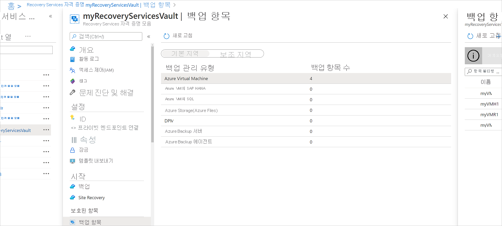

# Azure VM 백업 관리

이 문서에서는 [Azure Backup 서비스](backup-overview.md) 백업을 사용하여 백업된 Azure VM을 관리하는 방법에 대해 설명하고, 포털 대시보드에서 사용할 수 있는 백업 경고 정보를 요약하고 있습니다.

Azure Portal에서 Recovery Services 자격 증명 모음 대시보드는 다음을 포함하는 자격 증명 모음에 대한 정보에 액세스를 제공합니다.

* 최신 백업(최신 복원 지점이기도 함)
* 백업 정책
* 모든 백업 스냅숏의 총 크기
* 백업에 사용하도록 설정된 VM 수

대시보드를 사용하고 개별 VM으로 드릴다운하여 백업을 관리할 수 있습니다. 머신 백업은 대시보드에서 자격 증명 모음을 여는 것으로 시작합니다. 

## 대시보드에서 VM 보기

1. [Azure Portal](https://portal.azure.com/)에 로그인합니다.
2. 허브 메뉴에서 **찾아보기**를 클릭하고 리소스 목록에서 **Recovery Services**를 입력합니다. 입력을 시작하면 입력한 내용을 바탕으로 목록이 필터링됩니다. **Recovery Services 자격 증명 모음**을 클릭합니다. 
    

3. 사용하기 쉽도록 자격 증명 모음 목록에서 자격 증명 모음을 마우스 오른쪽 단추로 클릭하고, **대시보드에 고정**을 선택합니다.
3. 자격 증명 모음 대시보드를 엽니다. 
    

4. **백업 항목** 타일에서 **Azure Virtual Machines**를 클릭합니다.

    

5. **백업 항목** 블레이드에서 각 항목에 대한 마지막 백업 작업이 표시됩니다. 이 예제에는 자격 증명이 모음에 의해 보호되는 하나의 가상 머신인 demovm-markgal이 있습니다.  

    

 
6. 자격 증명 모음 항목 대시보드에서 백업 정책을 만들거나 수정하고, 복원 지점을 보고, 요청 시 백업을 실행하고, VM 보호를 중지 및 다시 시작하고, 복구 지점을 삭제하고, 복원을 실행할 수 있습니다.

    

## 백업 정책 관리
1. [자격 증명 모음 항목 대시보드](backup-azure-manage-vms.md#open-a-vault-item-dashboard)에서 **모든 설정**을 클릭합니다.

    
2. **설정**에서 **백업 정책**을 클릭합니다.
3. **백업 정책 선택** 메뉴에서:

   * 정책을 변경하려면 다른 정책을 선택하고 **저장**을 클릭합니다. 자격 증명 모음에 새 정책이 즉시 적용됩니다.
   * 정책을 만들려는 경우 **새로 만들기**를 선택합니다. [자세히 알아보기](backup-azure-arm-vms-prepare.md#configure-a-backup-policy)

     

## 요청 시 백업 실행
보호하도록 구성되면 VM의 요청 시 백업을 수행할 수 있습니다.
- 초기 백업이 보류 중인 경우 주문형 백업은 Recovery Services 자격 증명 모음에 가상 컴퓨터의 전체 복사본을 만듭니다.
- 초기 백업이 완료되면 주문형 백업은 이전 스냅숏에서 Recovery Services 자격 증명 모음에 변경 내용만 보냅니다. 즉, 이후의 백업은 항상 증분형입니다.
- 요청 시 백업에 대한 보존 범위는 정책의 매일 백업 지점에 지정된 보존 값입니다. 매일 백업 시점을 선택하지 않은 경우 주간 백업 지점을 사용합니다.

요청 시 백업을 트리거하려면 다음을 수행합니다.

1. [자격 증명 모음 항목 대시보드](backup-azure-manage-vms.md#open-a-vault-item-dashboard)에서 **지금 Backup**을 클릭합니다.

    

 2. **예** 를 클릭하여 백업 작업을 시작합니다.

    

 
 백업 작업에서 복구 지점이 생성됩니다. 복구 지점의 재방문 주기 범위는 가상 머신과 연결된 정책에 지정된 보존 범위와 같습니다. 작업에 대한 진행률을 추적하려면 자격 증명 모음 대시보드에서 **Backup 작업** 타일을 클릭합니다.  

## VM 보호 중지

VM 보호를 중지하는 두 가지 방법은 다음과 같습니다.

- 미래의 모든 백업 작업을 중지하고 모든 복구 지점을 삭제 이 경우 VM을 복원할 수 없습니다.
- 이후의 모든 백업 작업은 중지하지만 복구 지점은 그대로 유지합니다. 스토리지에서 복구 지점을 유지하는 데 관련된 비용이 있습니다. 그러나 복구 지점을 유지하는 경우 필요에 따라 VM을 복원할 수 있습니다. 가격 책정 세부 정보에 대해 [자세히 알아보세요](https://azure.microsoft.com/pricing/details/backup/).

가상 머신에 대한 보호를 중지하려면:

1. [자격 증명 모음 항목 대시보드](backup-azure-manage-vms.md#open-a-vault-item-dashboard)에서 **백업 중지**를 클릭합니다.

    
2. 백업 데이터를 유지하거나 삭제할지를 선택하고 필요에 따라 확인합니다. 필요에 따라 확인하고 선택적으로 설명을 제공합니다. 항목 이름을 모르는 경우 이름을 보려면 느낌표 위로 마우스를 가져갑니다.

    

 알림 메시지를 통해 백업 작업이 중지되었음을 알 수 있습니다.

## VM 보호 다시 시작

VM이 중지되었을 때 백업 데이터를 유지한 경우 보호를 다시 시작할 수 있습니다. 백업 데이터가 삭제되었으면 다시 시작할 수 없습니다.

Te

1. [자격 증명 모음 항목 대시보드](backup-azure-manage-vms.md#open-a-vault-item-dashboard)에서 **백업 다시 시작**을 클릭합니다.

2. [백업 정책 관리](backup-azure-manage-vms.md#manage-backup-policies)의 단계에 따라 가상 머신에 대한 정책을 할당합니다. 가상 머신이 처음에 보호된 정책과 다른 정책을 선택할 수 있습니다.
3. 백업 정책이 가상 머신에 적용되면 다음 메시지가 표시됩니다.

    

## Backup 데이터 삭제

**백업 중지** 작업 중 또는 백업 작업 완료 후 언제든지 VM과 연결된 백업 데이터를 삭제할 수 있습니다.

- 복구 지점을 삭제하기 전에 며칠 또는 몇 주 기다리는 것이 도움이 될 수도 있습니다.
- 백업 데이터를 삭제하는 경우 복구 지점을 복원하는 작업과 달리 특정 복구 지점을 삭제하도록 선택할 수 없습니다. 백업 데이터를 삭제하려는 경우 항목에 연결된 모든 복구 지점을 삭제합니다.

다음 절차에서는 VM에 대한 백업 작업이 중지되었거나 사용하지 않도록 설정되었다고 가정합니다.

1. [자격 증명 모음 항목 대시보드](backup-azure-manage-vms.md#open-a-vault-item-dashboard)에서 **백업 삭제**를 클릭합니다.

    

2. 항목의 이름을 입력하여 복구 지점을 삭제한다고 확인합니다.

    

4. 현재 항목에 대한 백업 데이터를 삭제하려면 를 클릭합니다.

    알림 메시지를 통해 백업 데이터가 삭제되었음을 알 수 있습니다.

## 다음 단계
- VM 설정에서 Azure VM을 백업하는 방법을 [알아봅니다](backup-azure-vms-first-look-arm.md).
- VM을 복원하는 방법을 [알아봅니다](backup-azure-arm-restore-vms.md). 
- Azure VM 백업을 모니터링하는 방법을 [알아봅니다](backup-azure-monitor-vms.md).
 
