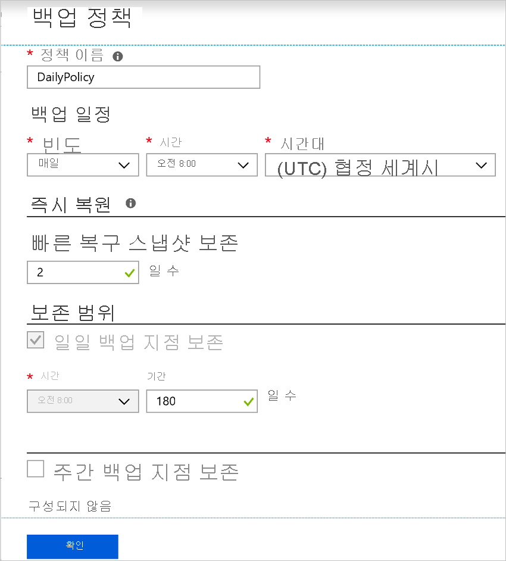

# Azure VM을 만들 때 백업 사용

Azure Backup 서비스를 사용 하 여 Azure Vm (가상 머신)을 백업 합니다. Vm은 백업 정책에 지정 된 일정에 따라 백업 되며 백업에서 복구 지점이 생성 됩니다. 복구 지점은 Recovery Services 자격 증명 모음에 저장 됩니다.

이 문서에서는 Azure Portal에서 VM (가상 머신)을 만들 때 백업을 사용 하도록 설정 하는 방법에 대해 자세히 설명 합니다.  

## 시작하기 전에

- VM을 만들 때 백업을 사용 하도록 설정 하는 경우 지원 되는 운영 체제를 [확인](backup-support-matrix-iaas.md#supported-backup-actions) 합니다.

## Azure에 로그인

계정에 아직 로그인 하지 않은 경우 [Azure Portal](https://portal.azure.com)에 로그인 합니다.

## 백업이 구성 된 VM 만들기

1. Azure Portal에서 **리소스 만들기**를 클릭 합니다.

2. Azure Marketplace에서 **Compute**를 클릭 한 다음 VM 이미지를 선택 합니다.

3. [Windows](https://docs.microsoft.com/azure/virtual-machines/windows/quick-create-portal) 또는 [Linux](https://docs.microsoft.com/azure/virtual-machines/linux/quick-create-portal) 지침에 따라 VM을 설정 합니다.

4. **관리** 탭의 **백업 사용**에서 **켜기**를 클릭 합니다.
5. Recovery Services 자격 증명 모음에 백업을 Azure Backup 합니다. 기존 자격 증명 모음이 없는 경우 **새로 만들기** 를 클릭 합니다.
6. 제안 된 자격 증명 모음 이름을 그대로 적용 하거나 고유한 이름을 지정 합니다.
7. 자격 증명 모음을 배치할 리소스 그룹을 지정 하거나 만듭니다. 리소스 그룹 자격 증명 모음은 VM 리소스 그룹과 다를 수 있습니다.

    

8. 기본 백업 정책을 적용 하거나 설정을 수정 합니다.
    - 백업 정책은 VM의 백업 스냅숏을 가져오는 빈도와 백업 복사본을 보관 하는 기간을 지정 합니다.
    - 기본 정책은 하루에 한 번 VM을 백업 합니다.
    - 매일 또는 매주 백업을 수행 하도록 Azure VM에 대 한 고유한 백업 정책을 사용자 지정할 수 있습니다.
    - Azure Vm에 대 한 백업 고려 사항에 대해 [자세히 알아보세요](backup-azure-vms-introduction.md#backup-and-restore-considerations) .
    - 즉시 복원 기능에 [대해 자세히 알아보세요](backup-instant-restore-capability.md) .

      

> [!NOTE]
> Azure Backup 서비스는 명명 형식 (예: **AzureBackupRG_geography_number** )을 사용 하 여 스냅숏을 저장 하기 위해 VM 리소스 그룹 이외의 별도 리소스 그룹을 만듭니다. AzureBackupRG_northeurope_1). 이 리소스 그룹의 데이터는 Azure 가상 머신 백업 정책의 *즉시 복구 스냅숏 유지* 섹션에 지정 된 기간 (일) 동안 보존 됩니다.  이 리소스 그룹에 잠금을 적용 하면 백업 오류가 발생할 수 있습니다. 
또한이 리소스 그룹은 모든 이름/태그 제한에서 제외 되어야 합니다. 제한 정책에 따라 다시 백업 오류가 발생 하 여 리소스 지점 컬렉션 만들기가 차단 됩니다.

## VM을 만든 후 백업 시작

VM 백업은 백업 정책에 따라 실행 됩니다. 그러나 초기 백업을 실행 하는 것이 좋습니다.

VM을 만든 후 다음을 수행 합니다.

1. VM 속성에서 **백업**을 클릭 합니다. 초기 백업이 실행 될 때까지 VM 상태는 초기 백업 보류 중입니다.
2. **지금** 백업을 클릭 하 여 요청 시 백업을 실행 합니다.

    

## 리소스 관리자 템플릿을 사용 하 여 보호 된 VM 배포

이전 단계에서는 Azure Portal를 사용 하 여 가상 머신을 만들고 Recovery Services 자격 증명 모음에서 보호 하는 방법을 설명 합니다. 하나 이상의 Vm을 신속 하 게 배포 하 고 Recovery Services 자격 증명 모음에서 보호 하려면 [WINDOWS VM 배포 및 백업 사용](https://azure.microsoft.com/resources/templates/101-recovery-services-create-vm-and-configure-backup/)템플릿을 참조 하세요.

## 다음 단계

VM을 보호 했으므로 이제 VM을 관리 하 고 복원 하는 방법을 알아봅니다.

- [Vm 관리 및 모니터링](backup-azure-manage-vms.md)
- [VM 복원](backup-azure-arm-restore-vms.md)

문제가 발생 하는 경우 문제 해결 가이드를 [검토](backup-azure-vms-troubleshoot.md) 합니다.
