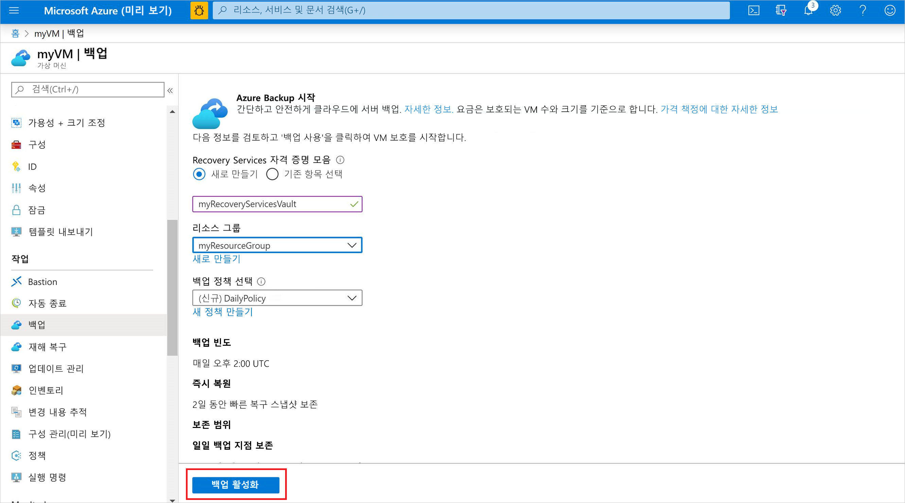
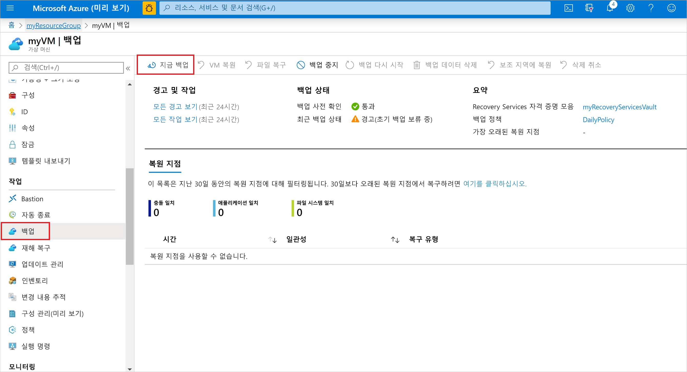
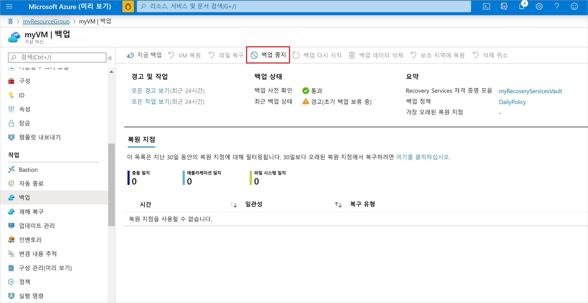

# Azure에서 가상 머신 백업

Azure Portal을 통해 Azure Backup을 만들 수 있습니다. 이 방법은 Azure Backup 및 관련된 모든 리소스를 만들고 구성하기 위한 브라우저 기반 사용자 인터페이스를 제공합니다. 정기적으로 백업을 수행하여 데이터를 보호할 수 있습니다. Azure Backup은 지역 중복 복구 자격 증명 모음에 저장될 수 있는 복구 지점을 만듭니다. 이 문서에서는 Azure Portal에서 VM(가상 머신)을 백업하는 방법을 자세히 설명합니다.

이 빠른 시작을 사용하면 기존 Azure VM에서 백업할 수 있습니다. VM을 생성해야 하는 경우 [Azure Portal을 사용하여 VM을 만들](../virtual-machines/windows/quick-create-portal.md) 수 있습니다.

## Azure에 로그인

[Azure Portal](https://portal.azure.com)에 로그인합니다.

## 백업할 VM을 선택합니다.

간단한 예약된 매일 백업을 Recovery Services 자격 증명 모음에 만듭니다.

1. 왼쪽 메뉴에서 **가상 머신**를 선택합니다.
2. 목록에서 백업할 VM을 선택합니다. 샘플 VM 빠른 시작 명령을 사용한 경우 VM은 *myResourceGroup* 리소스 그룹에서 *myVM*이라는 이름으로 지정됩니다.
3. **작업** 섹션에서 **백업**을 선택합니다. **백업 사용** 창이 열립니다.

## VM에서 백업 사용

Recovery Services 자격 증명 모음은 Azure VM과 같은 각 보호된 리소스에 대한 백업 데이터를 저장하는 논리 컨테이너입니다. 보호된 리소스에 대한 백업 작업이 실행될 때 Recovery Services 자격 증명 모음 내에 복구 지점을 만듭니다. 이러한 복구 지점 중 하나를 사용하여 지정된 특정 시점으로 데이터를 복원할 수 있습니다.

1. **새로 만들기**를 선택하고 *myRecoveryServicesVault*와 같은 새 자격 증명 모음의 이름을 입력합니다.
2. 선택하지 않은 경우 **기존 항목 사용**을 선택하고 드롭다운 메뉴에서 VM의 리소스 그룹을 선택합니다.

    

    기본적으로 자격 증명 모음이 지역 중복 스토리지에 설정됩니다. 데이터를 추가로 보호하려면 이 스토리지 중복 수준을 통해 백업 데이터를 주 지역으로부터 수백 마일 떨어진 보조 Azure 지역에 복제하도록 합니다.

    정책을 만들고 사용하여 백업 작업을 실행하는 시점 및 복구 지점이 저장되는 기간을 정의합니다. 기본 보호 정책은 매일 백업 작업을 실행하고 복구 지점을 30일 동안 유지합니다. VM을 신속하게 보호하기 위해 이러한 기본 정책 값을 사용할 수 있습니다.

3. 기본 백업 정책 값을 적용하려면 **백업 사용**을 선택합니다.

Recovery Services 자격 증명 모음을 만드는 데 몇 분 정도 걸립니다.

## 백업 작업 시작

예약된 시간에 작업을 실행하는 기본 정책을 대기하지 않고 지금 백업을 시작할 수 있습니다. 이 첫 번째 백업 작업에서 전체 복구 지점이 생성됩니다. 이 초기 백업 후에 각 백업 작업에서 증분 복구 지점이 생성됩니다. 증분 복구 지점은 마지막 백업 이후 변경된 내용만을 전송하기 때문에 스토리지 및 시간 효율적입니다.

1. VM의 **백업** 창에서 **지금 백업**을 선택합니다.

    

2. 30일이라는 백업 보존 정책을 수용하려면 기본 **백업 보존** 날짜를 그대로 둡니다. 작업을 시작하려면 **백업**을 선택합니다.

## 백업 작업 모니터링

VM의 **백업** 창에서 백업의 상태 및 완료된 복원 지점 수가 표시됩니다. VM 백업 작업이 완료되면 **최근 백업 시간**, **최근 복원 지점** 및 **가장 오래된 복원 지점**에 대한 정보가 **개요** 창의 오른쪽에 표시됩니다.

## 배포 정리

더 이상 필요하지 않은 경우 VM에 대한 보호를 사용하지 않도록 설정하고, 복원 지점 및 Recovery Services 자격 증명 모음을 제거한 후 리소스 그룹 및 연결된 VM 리소스를 삭제할 수 있습니다.

VM에 대한 데이터를 복원하는 방법에 대해 설명하는 백업 자습서를 계속 진행하는 경우 이 섹션의 단계를 건너뛰고 [다음 단계](#next-steps)로 이동합니다.

1. VM에 **백업** 옵션을 선택합니다.

2. **...추가**를 선택하여 추가 옵션을 표시하고 **백업 중지**를 선택합니다.

    

3. 드롭다운 메뉴에서 **백업 데이터 삭제**를 선택합니다.

4. **백업 항목의 이름 입력** 대화 상자에서 *myVM*과 같은 VM 이름을 입력합니다. **백업 중지**를 선택합니다.

    VM 백업이 중지되고 복구 지점이 제거되면 리소스 그룹을 삭제할 수 있습니다. 기존 VM을 사용하는 경우 리소스 그룹 및 VM을 그대로 둘 수도 있습니다.

5. 왼쪽 메뉴에서 **리소스 그룹**을 선택합니다.
6. 목록에서 리소스 그룹을 선택합니다. 샘플 VM 빠른 시작 명령을 사용한 경우 리소스 그룹은 *myResourceGroup*이라는 이름으로 지정됩니다.
7. **리소스 그룹 삭제**를 선택합니다. 확인하려면 리소스 그룹 이름을 입력한 다음 **삭제**를 선택합니다.

    

## 다음 단계

이 빠른 시작에서는 Recovery Services 자격 증명 모음을 만들고, VM에 대한 보호를 사용하도록 설정하고, 초기 복구 지점을 만들었습니다. Azure Backup 및 Recovery Services에 대한 자세한 내용은 자습서를 진행하세요.

> [!div class="nextstepaction"]
> [여러 Azure VM 백업](./tutorial-backup-vm-at-scale.md)
