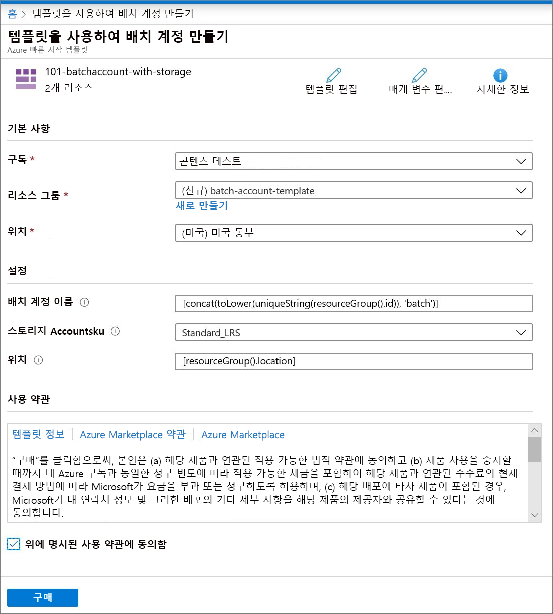

# 빠른 시작: Azure Resource Manager 템플릿을 사용하여 배치 계정 만들기

컴퓨팅 리소스(컴퓨팅 노드의 풀) 및 Batch 작업을 만들려면 배치 계정이 필요합니다. Azure Storage 계정을 배치 계정과 연결할 수 있습니다. 이는 애플리케이션을 배포하고 대부분의 실제 작업에 대한 입력 및 출력 데이터를 저장하는 데 유용합니다. 이 빠른 시작에서는 Azure Resource Manager 템플릿을 사용하여 스토리지를 비롯한 배치 계정을 만드는 방법을 보여 줍니다. 이 빠른 시작을 완료하면, Batch 서비스의 주요 개념을 이해하고 더 큰 규모의 더 실제적인 작업으로 Batch를 시도할 준비가 됩니다.

[!INCLUDE [About Azure Resource Manager](../../includes/resource-manager-quickstart-introduction.md)]

## 필수 구성 요소

활성 Azure 구독이 있어야 합니다.

- [!INCLUDE [quickstarts-free-trial-note](../../includes/quickstarts-free-trial-note.md)]

## 스토리지에서 Batch 계정 만들기

### 템플릿 검토

이 빠른 시작에서 사용되는 템플릿은 [Azure 빠른 시작 템플릿](https://azure.microsoft.com/resources/templates/101-batchaccount-with-storage/)에서 나온 것입니다.

:::code language="json" source="~/quickstart-templates/101-batchaccount-with-storage/azuredeploy.json" range="1-80" highlight="36-69":::

템플릿에는 두 개의 Azure 리소스가 정의되어 있습니다.

- [Microsoft.Storage/storageAccounts](https://docs.microsoft.com/azure/templates/microsoft.storage/storageaccounts): 스토리지 계정을 만듭니다.
- [Microsoft.Batch/batchAccounts](https://docs.microsoft.com/azure/templates/microsoft.batch/batchaccounts): Batch 계정을 만듭니다.

### 템플릿 배포

1. 다음 이미지를 선택하고 Azure에 로그인하여 템플릿을 엽니다. 템플릿은 Azure Batch 계정 및 스토리지 계정을 만듭니다.

   

1. 다음 값을 선택하거나 입력합니다.

   

   - **구독**: Azure 구독을 선택합니다.
   - **리소스 그룹**: **새로 만들기**를 선택하고 리소스 그룹에 고유한 이름을 입력한 다음, **확인**을 클릭합니다.
   - **위치**: 위치를 선택합니다. 예: **미국 중부**
   - **배치 계정 이름**: 기본값을 그대로 둡니다.
   - **Storage Accountsku**: 스토리지 계정 유형을 선택합니다. 예를 들어 **Standard_LRS**입니다.
   - **위치**: 리소스가 리소스 그룹과 동일한 위치에 있도록 기본값을 그대로 둡니다.
   - 위에 명시된 사용 약관에 동의함: **선택**

1. **구매**를 선택합니다.

몇 분 후에 배치 계정을 성공적으로 만들었다는 알림이 표시됩니다.

이 예제에서 Azure Portal은 템플릿을 배포하는데 사용됩니다. Azure Portal 외에도 Azure PowerShell, Azure CLI 및 REST API를 사용할 수 있습니다. 다른 배포 방법을 알아보려면 [템플릿 배포](../azure-resource-manager/templates/deploy-powershell.md)를 참조하세요.

## 배포 유효성 검사

생성한 리소스 그룹으로 이동하여 Azure Portal에서 배포의 유효성을 검사할 수 있습니다. **개요** 화면에서 배치 계정 및 스토리지 계정이 있는지 확인합니다.

## 리소스 정리

후속 빠른 시작 및 [자습서](./tutorial-parallel-dotnet.md)를 계속 진행하려는 경우 이러한 리소스를 그대로 유지하는 것이 좋습니다. 또는 더 이상 필요하지 않은 경우에는 [리소스 그룹을 삭제](../azure-resource-manager/management/delete-resource-group.md?tabs=azure-portal#delete-resource-group)할 수 있습니다. 그러면 만든 배치 계정 및 스토리지 계정도 삭제됩니다.

## 다음 단계

이 빠른 시작에서는 배치 계정 및 스토리지 계정을 만들었습니다. Azure Batch에 대한 자세한 내용은 Azure Batch 자습서로 계속 진행하세요.

> [!div class="nextstepaction"]
> [Azure Batch 자습서](./tutorial-parallel-dotnet.md)
