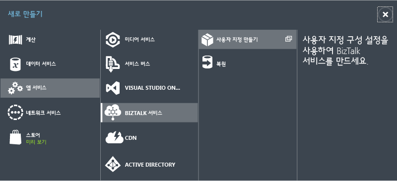

<properties linkid="provisioning-biztalk-service" urlDisplayName="Provision BizTalk Services in management portal" pageTitle="Provision BizTalk Services in management portal | Azure" metaKeywords="Get started Azure biztalk services, provision, Azure unstructured data" description="Learn how to provision a BizTalk service in the Azure Management Portal, as well as create an optional SQL database server and Storage account." metaCanonical="http://www.windowsazure.com/ko-kr/manage/services/biztalk-services/provisioning-biztalk-service" services="biztalk-services" documentationCenter="" title="BizTalk Services: Provisioning Using Azure Management Portal" authors="mandia" solutions="" manager="paulettm" editor="cgronlun" />

BizTalk 서비스: Azure 관리 포털을 사용하여 프로비전
===================================================

**팁**

Azure 관리 포털에 로그인하려면 Azure 계정과 Azure 구독이 있어야 합니다. 계정이 없는 경우 몇 분 만에 무료 평가판 계정을 만들 수 있습니다. 자세한 내용은 [Azure 무료 평가판](http://go.microsoft.com/fwlink/p/?LinkID=239738)을 참조하십시오.

Azure BizTalk 서비스는 다음 구성 요소로 구성됩니다.

<table border="1">
<tr bgcolor="FAF9F9">
    <td><strong>요구 사항</strong></td>
    <td><strong>설명</strong></td>
</tr>
<tr>
	<td>Azure 구독</td>
	<td>
구독은 Azure 관리 포털에 대한 액세스를 제어하고 Azure 계정 소유자가 <a HREF="https://account.windowsazure.com/Subscriptions">Azure 구독</a> 에서 만듭니다.

	
	
Azure 계정은 여러 구독을 가질 수 있으며 Azure 계정 소유자 또는 다른 사람이나 그룹이 관리할 수 있습니다. 예를 들어 Azure 계정 소유자는 *BizTalkServiceSubscription*이라는 구독을 만들고, 회사의 BizTalk 관리자(예: ContosoBTSAdmins@live.com)에게 이 구독에 대한 액세스를 제공합니다. 이 시나리오에서 BizTalk 관리자는 Azure 관리 포털에 로그인하고 구독의 모든 호스티드 서비스(Azure BizTalk 서비스 포함)에 대해 전체 관리자 권한을 가집니다. BizTalk 관리자는 Azure 계정 소유자가 아니므로 대금 청구 정보에 대한 액세스 권한이 없습니다.

	
	
<a HREF="http://go.microsoft.com/fwlink/p/?LinkID=267577">Azure 관리 포털에서 구독 및 저장소 계정 관리</a> 에서는 Azure 계정 및 구독에 대한 자세한 정보를 제공합니다.

	</td>
</tr>
<tr>
	<td>Azure SQL 데이터베이스</td>
	<td>
SQL 데이터베이스는 Azure BizTalk 서비스가 사용하는 테이블, 뷰 및 저장 프로시저를 저장합니다.

	
	
BizTalk 서비스를 프로비전할 때 기존 Azure SQL Server, Azure SQL 데이터베이스를 사용하거나 새로운 서버 또는 데이터베이스를 자동으로 만들 수 있습니다. 새 Azure SQL Server 및 데이터베이스를 만들도록 선택하면 Azure 서비스가 자동으로 사용하도록 설정됩니다.

	
	
기존 Azure SQL Server에서 새 Azure SQL 데이터베이스를 만들면 서버의 방화벽 규칙이 수정되지 않습니다. 따라서 다른 Azure 서비스가 서버의 데이터베이스에 액세스하지 못할 수 있습니다.

	
	SQL 데이터베이스 설정에 대한 최소 규모 요구 사항은 없습니다.</td>
</tr>
<tr>
	<td>Azure 액세스 제어 네임스페이스</td>
	<td>액세스 제어 네임스페이스는 Azure BizTalk 서비스로 인증됩니다. Visual Studio에서 BizTalk 서비스를 배포할 때 이 액세스 제어 네임스페이스를 입력합니다. BizTalk 서비스를 프로비전하면 액세스 제어 네임스페이스가 자동으로 만들어집니다.</td>
</tr>

<tr>
	<td>Azure 저장소 계정</td>
	<td>
Azure 저장소 계정은 테이블, Blob 및 큐에 대한 액세스를 제공합니다. BizTalk 서비스를 프로비전할 때 기존 저장소 계정을 사용하거나 새 저장소 계정을 자동으로 만들 수 있습니다. BizTalk 서비스는 테이블, Blob 및 큐를 사용하여 다음을 수행합니다.

	<ul>
	<li>BizTalk 서비스를 모니터링하는 로그 파일이 저장됩니다. 또한 모니터링한 결과도 Azure 관리 포털의 모니터링 탭에 표시됩니다.</li>
	<li>파트너 사이에 X12 또는 AS2 계약을 생성할 때 보관 기능을 사용하도록 설정하여 메시지 속성을 저장할 수 있습니다. 이 추적 데이터는 이 저장소 계정에 저장됩니다.</li>
	</ul>
	</td>
</tr>

<tr>
	<td>SSL 개인 인증서</td>
	<td>
Azure BizTalk 서비스를 프로비전할 때 BizTalk 서비스 이름을 포함하는 URL을 만듭니다. 이 개인 SSL 인증서(.pfx)는 BizTalk 서비스 URL에 대한 요청이 이루어질 때 HTTPS 서버 인증 인증서로 사용됩니다. BizTalk 서비스를 프로비전하면 자체 서명된 인증서가 자동으로 만들어집니다.

	<strong>중요 SSL 인증서 정보</strong>
	
	<ul>
	<li>인증서 만료 날짜는 5년 미만이어야 합니다.</li>
	<li>모든 개인 인증서에는 암호가 필요합니다. 이 암호를 확인하고 관리자와 공유하는 것이 좋습니다.</li>
	<li>자체 서명된 인증서는 테스트 또는 개발 환경에서 사용할 수 있습니다. 자체 서명된 인증서를 사용하는 경우 인증서를 개인 인증서 저장소 및 신뢰할 수 있는 루트 인증 기관 인증서 저장소로 가져옵니다.</li>
	</ul>
	 
	프로덕션 인증서 요청을 인증 기관에 보내는 경우 다음 인증서 속성을 지정합니다.
	 
	
	<ul>
	<li>
<strong>확장된 키 사용</strong>: 서버 인증 추가 키 사용은 인증서에서 설정할 수 있습니다. Azure BizTalk 서비스는 최소한 서버 인증이 필요합니다.
</li>
	<li>
<strong>일반 이름</strong>: Azure BizTalk 서비스 URL의 FQDN(정규화된 도메인 이름)을 입력합니다. 이 FQDN은 이 항목의 [BizTalk 서비스 프로비전](#BizTalk)에서 BizTalk 서비스를 프로비전할 때 만들어집니다.

	
따라서 인증서 요청을 인증 기관에 보낼 때의 URL을 알아야 합니다. BizTalk 서비스가 프로비전된 후에 새 인증서나 다른 인증서를 추가할 수 있습니다.
</li>
	</ul>
	 
	</td>
</tr>
</table>

이 항목에서는 Azure BizTalk 서비스를 프로비전하는 단계를 나열하며 다음이 포함됩니다.

-   [1단계: BizTalk 서비스 프로비전](#BizTalk)
-   [2단계: 프로비전 후 단계](#PostProv)
-   [옵션: SQL 데이터베이스 서버 만들기](#SQLDB)
-   [옵션: 저장소 계정 만들기](#Storage)

1단계: BizTalk 서비스 프로비전
------------------------------

BizTalk 서비스는 Azure BizTalk 서비스 응용 프로그램을 호스트합니다. BizTalk 서비스를 프로비전하면 액세스 제어 네임스페이스 및 자체 서명된 SSL 인증서가 자동으로 만들어집니다. 새 Azure SQL 데이터베이스 및 새 저장소 계정을 만들도록 선택할 수 있습니다. BizTalk 서비스가 프로비전된 후 이러한 요구 사항 중 일부가 업데이트될 수 있습니다.

다음 단계는 새 Azure BizTalk 서비스를 프로비전합니다.

1.  [Azure 관리 포털](http://go.microsoft.com/fwlink/p/?LinkID=213885)에 로그인합니다.

2.  탐색 창 맨 아래쪽에서 **+새로 만들기**를 선택합니다.

    

3.  **앱 서비스**를 선택하고 **BizTalk 서비스**를 선택한 다음 **사용자 지정 만들기**를 선택합니다.

    

4.  다음 BizTalk 서비스 설정을 입력합니다.

    <table border="1">
	<tr>
		<td><strong>BizTalk 서비스 이름</strong></td>
		<td>BizTalk 서비스의 이름을 입력합니다. 입력한 이름에 ".biztalk.windows.net"이 자동으로 추가됩니다. 그러면 BizTalk 서비스에 액세스하는 데 사용되는 URL이 됩니다. 아무 이름이나 입력할 수 있지만 고유한 이름을 입력하는 것이 좋습니다. 일부 사례:  
	     <em>mycompany</em>.biztalk.windows.net 
	     <em>mycompanymyapplication</em>.biztalk.windows.net 
	     <em>myapplication</em>.biztalk.windows.net
		</td>
	</tr>
	<tr>
		<td><strong>도메인 URL</strong></td>
		<td><strong>옵션</strong>. 기본적으로 도메인 URL은 *YourBizTalkServiceName*.biztalk.windows.net입니다. 사용자 지정 도메인을 입력할 수도 있습니다. 예를 들어 도메인이 *contoso*이면 다음과 같이 입력할 수 있습니다.
	     <em>MyCompany</em>.contoso.com  
	     <em>MyCompanyMyApplication</em>.contoso.com 
	     <em>MyApplication</em>.contoso.com 
	     <em>YourBizTalkServiceName</em>.contoso.com 
		</td>
	</tr>
	<tr>
		<td><strong>버전</strong></td>
		<td>옵션은 다음과 같습니다.
		<ul>
		<li>Developer</li>
		<li>Standard</li>
		<li>Basic</li>
		<li>Premium</li>
		</ul>
	    <a HREF="http://go.microsoft.com/fwlink/p/?LinkID=302279">BizTalk 서비스: Developer, Basic, Standard 및 Premium Editions 차트</a>는 버전 간의 차이를 나열합니다. 테스트/개발 단계에 있으면 **Developer**를 선택합니다. 프로덕션 단계에 있으면 차트를 사용하여 Premium, Standard, Basic 중 비즈니스 시나리오에 적합한 버전을 선택합니다.
		</td>
	</tr>
	<tr>
		<td><strong>지역</strong></td>
		<td>BizTalk 서비스를 호스트할 지리적 지역을 선택합니다.</td>
		</tr>
		<tr>
		<td><strong>추적 데이터베이스</strong></td>
		<td>
BizTalk 서비스가 사용할 테이블을 저장할 SQL 데이터베이스를 선택합니다. 다음 옵션 중 하나를 선택하십시오.

		<ul>
		<li><strong>기존 SQL 데이터베이스 인스턴스 사용</strong>: 기존 Azure SQL 데이터베이스를 사용하려면 이 옵션을 선택합니다. 다른 BizTalk 서비스에서 사용하지 않으면 기존 Azure SQL 데이터베이스를 사용할 수 있습니다. Azure SQL 데이터베이스 서버를 만들 때 지정한 로그인 이름과 암호가 있어야 합니다.</li>
		<li>
<strong>새 SQL 데이터베이스 인스턴스 만들기</strong>: 새 SQL 데이터베이스를 만들려면 이 옵션을 선택합니다.
</li>
	
	    </ul>
		</td>
	</tr>
	<tr>
		<td><strong>구독</strong></td>
		<td><strong>옵션</strong>. 구독이 두 개 이상인 경우에만 사용할 수 있습니다. BizTalk 서비스를 호스트할 구독을 선택합니다.</td>
	</tr>
	</table>
다음 화살표를 선택합니다.

5.  데이터베이스 설정을 입력합니다.

    <table border="1">
	<tr>
		<td><strong>구독</strong></td>
		<td><strong>옵션</strong>. 구독이 두 개 이상인 경우에만 사용할 수 있습니다. Azure SQL 데이터베이스를 호스트할 구독을 선택합니다.</td>
	</tr>
	<tr>
		<td><strong>데이터베이스</strong></td>
		<td>
이전 화면에서 <strong>기존 SQL 데이터베이스 인스턴스 사용</strong>을 선택한 경우에 사용할 수 있습니다.

	    BizTalk 서비스가 사용할 테이블을 저장할 SQL 데이터베이스를 선택합니다.
	    </td>
	</tr>
	<tr>
		<td><strong>이름</strong></td>
		<td>
이전 화면에서 <strong>새 SQL 데이터베이스 인스턴스 만들기</strong> 를 선택한 경우에 사용할 수 있습니다.

	    BizTalk 서비스가 사용할 SQL 데이터베이스 이름을 입력합니다. 기본적으로 *YourBizTalkServiceName*\_db가 입력됩니다.
		</td>
	</tr>
	<tr>
		<td><strong>서버</strong></td>
		<td>
이전 화면에서 <strong>새 SQL 데이터베이스 인스턴스 만들기</strong>를 선택한 경우에 사용할 수 있습니다.

	    기존 SQL 데이터베이스 서버를 선택합니다. 또는 새 SQL 데이터베이스 서버를 만들려면 <strong>새 SQL 데이터베이스 서버</strong>를 선택합니다.</td>
	</tr>
	<tr>
		<td><strong>서버 로그인 이름</strong></td>
		<td>로그인 사용자 이름을 입력합니다.</td>
	</tr>
	<tr>
		<td><strong>서버 로그인 암호</strong></td>
		<td>로그인 암호를 입력합니다.</td>
	</tr>
	<tr>
		<td><strong>지역</strong></td>
		<td><strong>새 SQL 데이터베이스 인스턴스 만들기</strong>를 선택한 경우에 사용할 수 있습니다. SQL 데이터베이스를 호스트할 지리적 지역을 선택합니다.</td>
	</tr>
	</table>
다음 화살표를 선택합니다.

6.  Azure 모니터링 설정을 입력합니다.

    <table border="1">
	<tr>
		<td><strong>저장소 계정 모니터링/보관</strong></td>
		<td>기존 저장소 계정을 선택하거나 <strong>새 저장소 계정 만들기</strong>를 선택합니다.</td>
	</tr>
	<tr>    
		<td><strong>저장소 계정 이름</strong></td>
    	<td><strong>새 저장소 계정 만들기</strong>를 선택한 경우에 사용할 수 있습니다. BizTalk 서비스가 사용할 저장소 계정의 이름을 입력합니다.</td>
	</tr>
	</table>

마법사를 완료하려면 확인 표시를 선택합니다. 완료되면 진행률 아이콘이 표시됩니다.

완료되면 Azure BizTalk 서비스가 프로비전되어 응용 프로그램에서 사용할 준비가 됩니다.

기본 설정이 충분합니다. 기본 설정을 수정하려면 왼쪽 탐색 창에서 **BizTalk 서비스**를 선택하고 해당 BizTalk 서비스를 선택합니다. 대시보드, 모니터 및 크기 조정 탭에 추가 설정이 표시됩니다.

BizTalk 서비스 상태에 따라 완료할 수 없는 작업도 일부 있습니다. 이러한 작업 목록은 [BizTalk 서비스: BizTalk 서비스 상태 차트](http://go.microsoft.com/fwlink/p/?LinkID=329870)를 참조하십시오.

2단계: 프로비전 후 단계
-----------------------

이 섹션에는 다음 단계가 나열되어 있습니다.

-   [개인 인증서 추가](#AddCert)
-   [액세스 제어 네임스페이스 가져오기](#ACS)

#### 개인 인증서 추가
Azure BizTalk 서비스를 프로비전하면 BizTalk 서비스를 포함하는 URL이 만들어집니다. 개인 SSL 인증서(.pfx)는 BizTalk 서비스 URL에 대한 요청이 이루어질 때 HTTPS 서버 인증 인증서로 사용됩니다.

BizTalk 서비스에 대해 자체 서명된 인증서가 자동으로 만들어집니다. 이 인증서는 BizTalk 서비스 대시보드에서 다운로드하거나 바꿀 수 있습니다. 자체 서명된 인증서는 개발 환경에서 사용됩니다.

프로덕션이 준비된 인증서를 추가하려면

1.  [Azure 관리 포털](http://go.microsoft.com/fwlink/p/?LinkID=213885)에 로그인합니다.
2.  왼쪽 탐색 창에서 **BizTalk 서비스**를 선택한 다음 해당 BizTalk 서비스를 선택합니다.
3.  **대시보드** 탭을 선택합니다.
4.  **SSL 인증서 업데이트**를 선택합니다.  

5.  BizTalk 서비스 이름을 포함하는 개인 SSL 인증서(*CertificateName*.pfx)를 찾아 암호를 입력하고 확인 표시를 선택합니다.

#### 액세스 제어 네임스페이스 가져오기

액세스 제어 네임스페이스는 Azure BizTalk 서비스로 인증됩니다. Visual Studio에서 BizTalk 서비스를 배포할 때 이 액세스 제어 네임스페이스를 입력합니다.

BizTalk 서비스에 대해 액세스 제어 네임스페이스가 자동으로 만들어집니다. 액세스 제어 네임스페이스, 기본 발급자, 발급자 키를 가져오려면 BizTalk 서비스 대시보드에서 **연결 정보** 단추를 선택합니다.

액세스 제어 네임스페이스를 가져오려면

1.  [Azure 관리 포털](http://go.microsoft.com/fwlink/p/?LinkID=213885)에 로그인합니다.
2.  왼쪽 탐색 창에서 **BizTalk 서비스**를 선택한 다음 해당 BizTalk 서비스를 선택합니다.
3.  작업 표시줄에서 **연결 정보**를 선택합니다.  

액세스 제어 값을 복사하여 붙여넣을 수 있습니다.

액세스 제어 네임스페이스가 만들어지면 액세스 제어 값을 모든 응용 프로그램에 사용할 수 있습니다. Azure BizTalk 서비스가 프로비전되면 이 액세스 제어 네임스페이스는 BizTalk 서비스 배포 인증을 제어합니다. 구독을 변경하거나 네임스페이스를 관리하려면 왼쪽 탐색 창에서 **ACTIVE DIRECTORY**를 선택한 다음 해당 네임스페이스를 선택합니다. 맨 아래 탐색 창에 옵션이 나열됩니다.

**관리**를 클릭하면 액세스 제어 관리 포털이 열립니다. 액세스 제어 관리 포털에서 BizTalk 서비스는 **서비스 ID**를 사용합니다.  

액세스 제어 서비스 ID는 응용 프로그램이나 클라이언트가 액세스 제어를 직접 인증하고 토큰을 받을 수 있도록 하는 자격 증명 집합입니다.

**중요** 
BizTalk 서비스는 **암호** 값 및 기본 서비스 ID의 **소유자**를 사용합니다. 암호 값 대신 대칭 키 값을 사용하면 다음 오류가 발생할 수 있습니다.

*지정한 자격 증명으로 액세스 제어 관리 서비스 계정에 연결할 수 없습니다.*

[ACS 네임스페이스 관리](http://go.microsoft.com/fwlink/p/?LinkID=285670)에는 일부 지침 및 권장 사항이 나열되어 있습니다.

옵션: SQL 데이터베이스 서버 만들기
----------------------------------

Azure BizTalk 서비스를 프로비전하면 새 SQL 데이터베이스 서버가 자동으로 만들어집니다. BizTalk 서비스와 관계없이 SQL 데이터베이스 서버를 만들려면 [.NET 응용 프로그램에서 Azure SQL 데이터베이스를 사용하는 방법](http://go.microsoft.com/fwlink/p/?LinkID=251285)을 참조하십시오.

완료되면 로그인하고 테이블, 뷰, 저장 프로시저를 만들 수 있는 새 Azure SQL 데이터베이스가 생깁니다.

기본적으로 SQL 데이터베이스 규모는 다음으로 구성됩니다.

-   Web Edition
-   1GB 데이터베이스 크기

기본 구성은 BizTalk 서비스에 대해 충분합니다. 규모 구성 설정을 수정하려면 왼쪽 탐색 창에서 **SQL 데이터베이스**를 선택하고 해당 SQL 데이터베이스를 두 번 선택하고 **구성** 탭을 선택합니다. 규모를 수정하면 가격이 달라질 수 있습니다. [Azure SQL 데이터베이스의 계정 및 대금 청구](http://go.microsoft.com/fwlink/p/?LinkID=234930)는 버전 및 대금 청구에 대한 정보를 제공합니다.

옵션: 저장소 계정 만들기
------------------------

Azure BizTalk 서비스를 프로비전하면 Azure 저장소 계정이 자동으로 만들어집니다. BizTalk 서비스와 관계없이 Azure 저장소 계정을 만들려면 [저장소 계정을 만드는 방법](http://go.microsoft.com/fwlink/p/?LinkID=279823)을 참조하십시오.

완료되면 테이블, Blob, 큐에 액세스할 수 있는 새 Azure 저장소 계정이 생깁니다.

기본 설정은 BizTalk 서비스에 대해 충분합니다. 기본 설정을 수정하려면 왼쪽 탐색 창에서 **저장소**를 선택하고 해당 저장소 계정을 선택합니다. 대시보드, 모니터, 구성 및 컨테이너 탭에 설정이 표시됩니다.

저장소 계정을 만들면 기본 키와 보조 키가 자동으로 만들어집니다. 이러한 키는 저장소 계정에 대한 액세스를 제어합니다. BizTalk 서비스는 자동으로 기본 키를 사용합니다.

[저장소](http://go.microsoft.com/fwlink/p/?LinkID=285671)는 저장소 계정에 대한 정보를 제공합니다.

다음
----

이제 BizTalk 서비스가 프로비전되었으며 [BizTalk 서비스: 대시보드, 모니터 및 크기 조정 탭](http://go.microsoft.com/fwlink/p/?LinkID=302281)에서 다른 탭도 익숙해질 수 있습니다. 응용 프로그램에 BizTalk 서비스를 사용할 준비가 되었습니다. 응용 프로그램을 만들려면 [Azure BizTalk 서비스](http://go.microsoft.com/fwlink/p/?LinkID=235197)로 이동하십시오.

참고 항목
---------

-   [BizTalk 서비스: Developer, Basic, Standard 및 Premium Editions 차트](http://go.microsoft.com/fwlink/p/?LinkID=302279)
-   [BizTalk 서비스: BizTalk 서비스 상태 차트](http://go.microsoft.com/fwlink/p/?LinkID=329870)
-   [BizTalk 서비스: 백업 및 복원](http://go.microsoft.com/fwlink/p/?LinkID=329873)
-   [BizTalk 서비스: 제한](http://go.microsoft.com/fwlink/p/?LinkID=302282)
-   [BizTalk 서비스: 발급자 이름 및 발급자 키](http://go.microsoft.com/fwlink/p/?LinkID=303941)
-   [Azure BizTalk 서비스 SDK로 시작하는 방법](http://go.microsoft.com/fwlink/p/?LinkID=302335)

[NewBizTalkService]: ./media/biztalk-provision-services/WABS_NewBizTalkService.png
[NEWButton]: ./media/biztalk-provision-services/WABS_New.png
[ProgressComplete]: ./media/biztalk-provision-services/WABS_ProgressComplete.png
[ACSConnectInfo]: ./media/biztalk-provision-services/WABS_ACSConnectInformation.png
[QuickGlance]: ./media/biztalk-provision-services/WABS_QuickGlance.png
[ACSServiceIdentities]: ./media/biztalk-provision-services/WABS_ACSServiceIdentities.png
