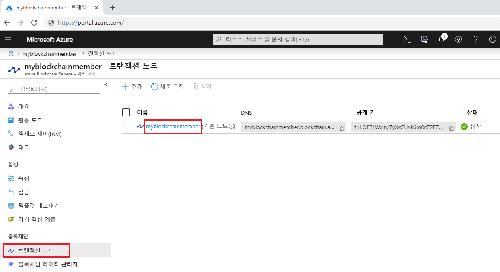
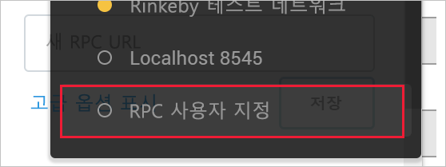
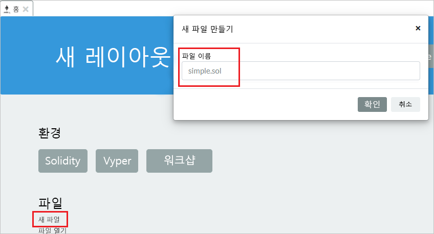
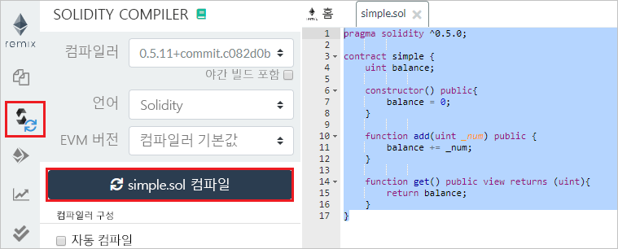
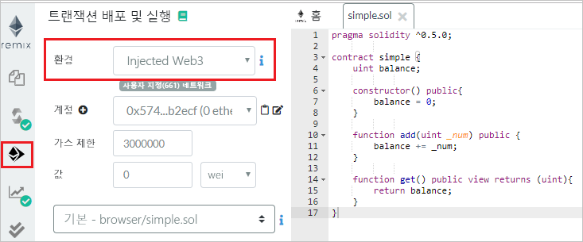
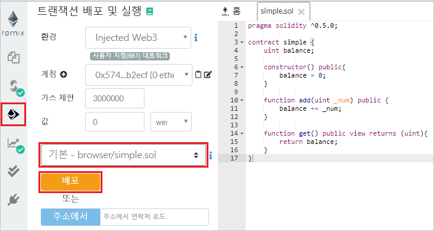
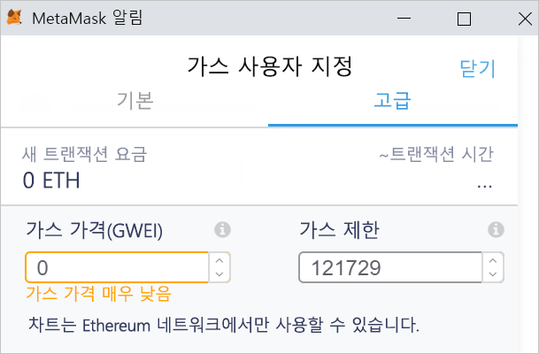
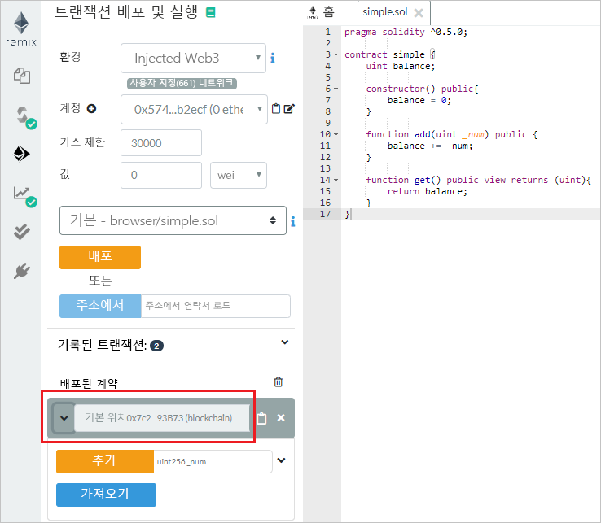

# <a name="quickstart-use-metamask-to-connect-and-deploy-a-smart-contract"></a>MetaMask를 사용하여 스마트 계약 연결 및 배포

이 빠른 시작에서는 MetaMask를 사용하여 Azure Blockchain Service 네트워크에 연결하고, Remix를 사용하여 스마트 계약을 배포합니다. Metamask는 Ether 지갑을 관리하고 스마트 계약 작업을 수행하는 브라우저 확장입니다.

[!INCLUDE [quickstarts-free-trial-note](../../../includes/quickstarts-free-trial-note.md)]

## <a name="prerequisites"></a>필수 구성 요소

* [빠른 시작: Azure Portal을 사용하여 블록체인 멤버 만들기](create-member.md) 또는 [빠른 시작: Azure CLI를 사용하여 Azure Blockchain Service 블록체인 멤버 만들기](create-member-cli.md)를 완료합니다.
* [MetaMask 브라우저 확장](https://metamask.io) 설치
* MetaMask [지갑](https://metamask.zendesk.com/hc/en-us/articles/360015488971-New-to-MetaMask-Learn-How-to-Setup-MetaMask-the-First-Time) 생성

## <a name="get-endpoint-address"></a>엔드포인트 주소 가져오기

블록체인 네트워크에 연결하려면 Azure Blockchain Service 엔드포인트 주소가 필요합니다. 엔드포인트 주소와 액세스 키는 Azure Portal에 있습니다.

1. [Azure Portal](https://portal.azure.com)에 로그인합니다.
1. Azure Blockchain Service 멤버로 이동합니다.
1. **트랜잭션 노드**와 기본 트랜잭션 노드 링크를 선택합니다.

    

1. **연결 문자열 > 액세스 키**를 차례로 선택합니다.
1. **HTTPS(액세스 키 1)** 에서 엔드포인트 주소를 복사합니다.

    

## <a name="connect-metamask"></a>MetaMask 연결

1. MetaMask 브라우저 확장을 열고 로그인합니다.
1. 네트워크 드롭다운에서 **사용자 지정 RPC**를 선택합니다.

    

1. **새 네트워크 > 새 RPC URL**의 위에서 복사한 엔드포인트 주소를 붙여넣습니다.
1. **저장**을 선택합니다.

    연결에 성공하면 사설망이 네트워크 드롭다운에 표시됩니다.

    

## <a name="deploy-smart-contract"></a>스마트 계약 배포

Remix는 브라우저 기반 Solidity 개발 환경입니다. MetaMask와 Remix를 모두 사용하면 스마트 계약을 배포하고 관련 작업을 수행할 수 있습니다.

1. 브라우저에서 `https://remix.ethereum.org`로 이동합니다.
1. **파일**의 **홈** 탭에서 **새 파일**을 선택합니다.

    새 파일의 이름을 `simple.sol`로 지정합니다.

    

    **확인**을 선택합니다.
1. Remix 편집기에서 다음 **simple 스마트 계약** 코드에 붙여넣습니다.

    ```solidity
    pragma solidity ^0.5.0;
             
    contract simple {
        uint balance;
                 
        constructor() public{
            balance = 0;
        }
                 
        function add(uint _num) public {
            balance += _num;
        }
                 
        function get() public view returns (uint){
            return balance;
        }
    }
    ```

    **simple 계약**은 **balance**라는 상태 변수를 선언합니다. 두 함수가 정의되어 있습니다. **add** 함수는 숫자를 **balance**에 추가합니다. **get** 함수는 **balance**의 값을 반환합니다.
1. 계약을 컴파일하려면 먼저 Solidity 컴파일러 창을 선택한 다음, **simple.sol 컴파일**을 선택합니다.

    

1. **배포 및 실행** 창을 선택한 다음, **환경**을 **삽입된 Web3**로 설정하여 MetaMask를 통해 블록체인 멤버에 연결합니다.

    

1. **simple** 계약, **배포**를 차례로 선택합니다.

    


1. MetaMask 알림은 트랜잭션을 수행할 자금이 부족하다고 알려줍니다.

    공용 블록체인 네트워크의 경우 트랜잭션 비용을 지불하기 위해 Ether가 필요합니다. 컨소시엄의 사설망이므로 가스 가격을 0으로 설정할 수 있습니다.

1.  **가스 요금 > 편집 > 고급**을 차례로 선택하고, **가스 가격**을 0으로 설정합니다.

    

    **저장**을 선택합니다.

1. **확인**을 선택하여 스마트 계약을 블록체인에 배포합니다.
1. **배포된 계약** 섹션에서 **simple** 계약을 펼칩니다.

    

    **add** 및 **get**의 두 가지 작업은 계약에 정의된 함수에 매핑됩니다.

1. 블록체인에서 **add** 트랜잭션을 수행하려면 추가할 숫자를 입력한 다음, **add**를 선택합니다. Remix에서 가스 예측 실패 메시지를 받을 수 있습니다. "가스가 필요 없는 프라이빗 블록 체인으로 트랜잭션을 전송하고 있습니다." **트랜잭션 보내기**를 선택하여 트랜잭션을 강제로 실행합니다.
1. 계약을 배포할 때와 마찬가지로 MetaMask 알림은 트랜잭션을 수행할 자금이 부족하다고 알려줍니다.

    컨소시엄의 사설망이므로 가스 가격을 0으로 설정할 수 있습니다.

1. **가스 요금 > 편집 > 고급**을 선택하고, **가스 가격**을 0으로 설정하고, **저장**을 선택합니다.
1. **확인**을 선택하여 블록체인으로 트랜잭션을 보냅니다.
1. **get** 작업을 선택합니다. 이 작업은 노드 데이터를 쿼리하기 위한 호출입니다. 트랜잭션이 필요하지 않습니다.

Remix의 디버그 창에는 블록체인의 트랜잭션에 대한 세부 정보가 표시됩니다.


**simple** 계약 만들기, **simple.add** 트랜잭션, **simple.get** 호출을 확인할 수 있습니다.

MetaMask에서 트랜잭션 기록을 보려면 MetaMask 브라우저 확장을 열고 **History** 섹션에서 배포된 계약 및 트랜잭션에 대한 로그를 확인합니다.

## <a name="next-steps"></a>다음 단계

이 빠른 시작에서는 MetaMask 브라우저 확장을 사용하여 Azure Blockchain Service 트랜잭션 노드에 연결하고, 스마트 계약을 배포하고, 트랜잭션을 블록체인에 보냈습니다. 다음 자습서에서 Etherum 및 Truffle용 Azure Blockchain Development Kit를 사용하여 트랜잭션을 통해 스마트 계약 함수를 만들고, 빌드하고, 배포하고, 실행해 보세요.

> [!div class="nextstepaction"]
> [Azure Blockchain Service에서 스마트 계약 생성, 빌드 및 배포](send-transaction.md)