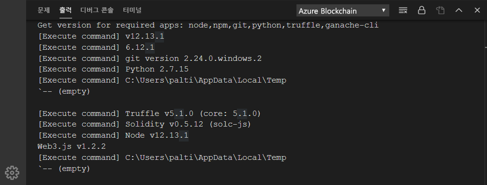

# 빠른 시작: Visual Studio Code를 사용하여 Azure Blockchain Service 컨소시엄 네트워크에 연결

이 빠른 시작에서는 Ethereum용 Azure Blockchain Development Kit Visual Studio Code 확장을 설치하고 사용하여 Azure Blockchain Service의 컨소시엄에 연결합니다. Azure Blockchain Development Kit를 사용하면 간단하게 Ethereum 원장에서 스마트 계약을 만들고, 연결하고, 빌드하고, 배포할 수 있습니다. 

[!INCLUDE [quickstarts-free-trial-note](../../../includes/quickstarts-free-trial-note.md)]

## 필수 조건

* [빠른 시작: Azure Portal을 사용하여 블록체인 멤버 만들기](create-member.md) 또는 [빠른 시작: Azure CLI를 사용하여 Azure Blockchain Service 블록체인 멤버 만들기](create-member-cli.md)를 완료합니다.
* [Visual Studio Code](https://code.visualstudio.com/Download)
* [Etherum용 Azure Blockchain Development Kit 확장](https://marketplace.visualstudio.com/items?itemName=AzBlockchain.azure-blockchain)
* [Node.JS](https://nodejs.org)
* [Git](https://git-scm.com)
* [Python](https://www.python.org/downloads/release/python-2715/). python.exe를 경로에 추가합니다. Azure Blockchain Development Kit에는 경로의 Python이 필요합니다.
* [Truffle](https://www.trufflesuite.com/docs/truffle/getting-started/installation)
* [Ganache CLI](https://github.com/trufflesuite/ganache-cli)

### Azure Blockchain Development Kit 환경 확인

Azure Blockchain Development Kit는 개발 환경 필수 구성 요소가 충족되었는지 확인합니다. 개발 환경을 확인하려면 다음을 수행합니다.

VS Code 명령 팔레트에서 **Azure Blockchain: 시작 페이지 표시**를 선택합니다.

Azure Blockchain Development Kit는 완료하는 데 1분 정도 걸리는 유효성 검사 스크립트를 실행합니다. **터미널 > 새 터미널**을 차례로 선택하여 출력을 볼 수 있습니다. 터미널 메뉴 모음의 드롭다운에서 **출력** 탭 및 **Azure Blockchain**을 선택합니다. 성공한 유효성 검사는 다음 이미지와 같습니다.

 필수 도구가 없는 경우 **Azure Blockchain Development Kit - 미리 보기**라는 새 탭에는 설치할 필수 앱과 해당 도구를 다운로드하는 데 필요한 링크가 나열됩니다.

빠른 시작을 진행하기 전에 누락된 필수 구성 요소를 모두 설치합니다.

## 컨소시엄 멤버에 연결

Azure Blockchain Development Kit VS Code 확장을 사용하여 컨소시엄 멤버에 연결할 수 있습니다. 컨소시엄에 연결되면 스마트 계약을 Azure Blockchain Service 컨소시엄 멤버에 컴파일, 빌드 및 배포할 수 있습니다.

Azure Blockchain Service 컨소시엄 멤버에 액세스할 수 없는 경우 [빠른 시작: Azure Portal을 사용하여 블록체인 멤버 만들기](create-member.md) 또는 [빠른 시작: Azure CLI를 사용하여 Azure Blockchain Service 블록체인 멤버 만들기](create-member-cli.md)의 필수 조건을 완료합니다.

1. VS Code(Visual Studio Code) 탐색기 창에서 **Azure Blockchain** 확장을 펼칩니다.
1. **컨소시엄에 연결**을 선택합니다.

   

    Azure 인증을 요청하는 메시지가 표시되면 프롬프트에 따라 브라우저를 사용하여 인증합니다.
1. 명령 팔레트 드롭다운에서 **Azure Blockchain Service 컨소시엄에 연결**을 선택합니다.
1. Azure Blockchain Service 컨소시엄 멤버와 연결된 구독 및 리소스 그룹을 선택합니다.
1. 목록에서 컨소시엄을 선택합니다.

컨소시엄 및 블록체인 멤버가 Visual Studio 탐색기 사이드바에 나열됩니다.

## 다음 단계

이 빠른 시작에서는 Ethereum용 Azure Blockchain Development Kit Visual Studio Code 확장을 사용하여 Azure Blockchain Service의 컨소시엄에 연결했습니다. 다음 자습서에서 Etherum 및 Truffle용 Azure Blockchain Development Kit를 사용하여 트랜잭션을 통해 스마트 계약 함수를 만들고, 빌드하고, 배포하고, 실행해 보세요.

> [!div class="nextstepaction"]
> [Visual Studio Code를 사용하여 스마트 계약 생성, 빌드 및 배포](send-transaction.md)