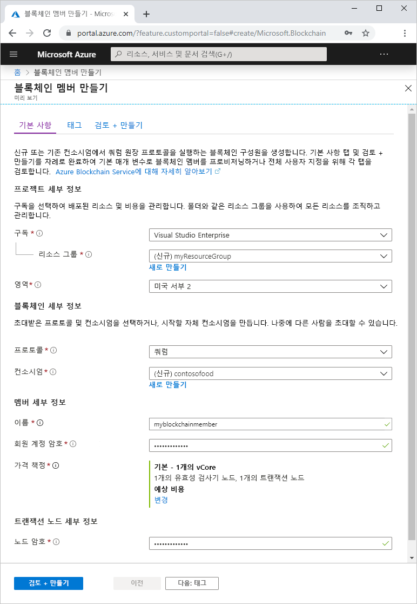

# 빠른 시작: Azure Portal을 사용하여 Azure Blockchain Service 블록체인 멤버 만들기

이 빠른 시작에서는 Azure Portal을 사용하여 Azure Blockchain Service에 새 블록체인 멤버 및 컨소시엄을 배포합니다.

[!INCLUDE [quickstarts-free-trial-note](../../../includes/quickstarts-free-trial-note.md)]

## 블록체인 멤버 만들기

Azure Blockchain Service 멤버는 프라이빗 컨소시엄 블록체인 네트워크의 블록체인 노드입니다. 멤버를 프로비저닝할 때 컨소시엄 네트워크를 만들거나 조인할 수 있습니다. 컨소시엄 네트워크에 멤버가 하나 이상이 필요합니다. 참가자가 필요로 하는 블록체인 멤버 수는 시나리오에 따라 달라집니다. 컨소시엄 참가자는 하나 이상의 블록체인 멤버를 보유하거나 다른 참가자와 멤버를 공유할 수 있습니다. 컨소시엄에 대한 자세한 내용은 [Azure Blockchain Service 컨소시엄](consortium.md)을 참조하세요.

1. [Azure Portal](https://portal.azure.com)에 로그인합니다.
1. Azure Portal의 왼쪽 위 모서리에서 **리소스 만들기**를 선택합니다.
1. **블록체인** > **Azure Blockchain Service(미리 보기)** 를 선택합니다.

    

    설정 | Description
    --------|------------
    Subscription | 서비스에 사용할 Azure 구독을 선택합니다. 구독이 여러 개인 경우, 리소스에 대해 요금이 청구되는 구독을 선택합니다.
    Resource group | 새 리소스 그룹 이름을 만들거나, 구독에서 기존 이름을 선택합니다.
    지역 | 멤버를 만들 지역을 선택합니다. 컨소시엄의 모든 멤버가 같은 위치에 있어야 합니다.
    프로토콜 | 현재 Azure Blockchain Service 미리 보기는 쿼럼 프로토콜을 지원합니다.
    컨소시엄 | 새 컨소시엄인 경우 고유한 이름을 입력합니다. 초대를 통해 컨소시엄에 참가하는 경우 참가하는 컨소시엄을 선택합니다. 컨소시엄에 대한 자세한 내용은 [Azure Blockchain Service 컨소시엄](consortium.md)을 참조하세요.
    속성 | Azure Blockchain Service 멤버의 고유한 이름을 선택합니다. 블록체인 멤버 이름에는 소문자와 숫자만 사용할 수 있습니다. 첫 번째 자리는 반드시 문자여야 합니다. 이름의 길이는 2-20자 사이여야 합니다.
    멤버 계정 암호 | 멤버 계정 암호는 멤버용으로 생성된 Ethereum 계정의 프라이빗 키를 암호화하는 데 사용됩니다. 컨소시엄 관리용 멤버 계정과 멤버 계정 암호를 사용합니다.
    가격 책정 | 새 서비스의 노드 구성 및 비용입니다. **변경** 링크를 선택하여 **표준** 계층과 **기본** 계층 중에 선택합니다. 개발, 테스트 및 개념 증명에 *기본* 계층을 사용합니다. 프로덕션 등급 배포에 *표준* 계층을 사용합니다. Blockchain Data Manager를 사용하거나 대량의 프라이빗 트랜잭션을 전송하는 경우 *표준* 계층도 사용해야 합니다. 멤버를 만든 후 기본과 표준 간의 가격 책정 계층 변경은 지원되지 않습니다.
    노드 암호 | 멤버의 기본 트랜잭션 노드에 대한 암호입니다. 블록체인 멤버의 기본 트랜잭션 노드 공용 엔드포인트에 연결할 때 기본 인증용 암호를 사용합니다.

1. **검토 + 만들기**를 선택하여 설정의 유효성을 검사합니다. **만들기**를 선택하여 서버를 프로비저닝합니다. 프로비저닝에는 약 10분이 걸립니다.
1. 배포 프로세스를 모니터링하려면 도구 모음에서 **알림**을 선택합니다.
1. 배포 후에는 블록체인 멤버로 이동합니다.

**개요**를 선택하면 RootContract 주소 및 멤버 계정을 포함하여 서비스에 대한 기본 정보를 볼 수 있습니다.

## 리소스 정리

앞에서 만든 멤버를 다음 빠른 시작 또는 자습서에 사용할 수 있습니다. 더 이상 필요 없는 경우 빠른 시작을 위해 만든 `myResourceGroup` 리소스 그룹을 삭제하여 리소스를 삭제할 수 있습니다.

리소스 그룹을 삭제하려면 다음을 수행합니다.

1. Azure Portal의 왼쪽 탐색 창에서 **리소스 그룹**으로 이동하고 삭제하려는 리소스 그룹을 선택합니다.
2. **리소스 그룹 삭제**를 선택합니다. 리소스 그룹 이름을 입력하여 삭제를 확인하고 **삭제**를 선택합니다.

## 다음 단계

이 빠른 시작에서는 Azure Blockchain Service 멤버 및 새로운 컨소시엄을 배포했습니다. 다음 빠른 시작을 통해 Ethereum용 Azure Blockchain Development Kit를 사용하여 Azure Blockchain Service 멤버에 연결합니다.

> [!div class="nextstepaction"]
> [Visual Studio Code를 사용하여 Azure Blockchain Service에 연결](connect-vscode.md)
