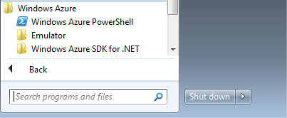
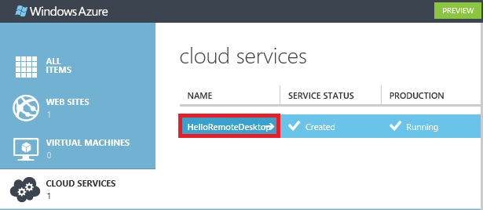

<properties linkid="dev-node-remotedesktop" urlDisplayName="Enable Remote Desktop" pageTitle="Enable remote desktop for cloud services (Node.js)" metaKeywords="Azure Node.js remote access, Azure Node.js remote connection, Azure Node.js VM access, Azure Node.js virtual machine access" description="Learn how to enable remote-desktop access for the virtual machines hosting your Azure Node.js application. " metaCanonical="" services="cloud-services" documentationCenter="Node.js" title="Enabling Remote Desktop in Azure" authors="" solutions="" manager="" editor="" />

Azure에서 원격 데스크톱 사용
============================

원격 데스크톱을 사용하면 Azure에서 실행 중인 역할 인스턴스의 데스크톱에 액세스할 수 있습니다. 원격 데스크톱 연결을 사용하여 가상 컴퓨터를 구성하거나 응용 프로그램의 문제를 해결할 수 있습니다.

**참고**

이 문서의 단계는 Azure 클라우드 서비스로 호스트되는 노드 응용 프로그램에만 적용됩니다.

이 작업에는 다음 단계가 포함됩니다.

-   [1단계: Azure PowerShell을 사용하여 원격 데스크톱 액세스에 대한 서비스 구성](#step1)
-   [2단계: 역할 인스턴스에 연결](#step2)
-   [3단계: Azure PowerShell을 사용하여 원격 데스크톱 액세스를 사용하지 않도록 서비스 구성](#step3)

1단계: Azure PowerShell을 사용하여 원격 데스크톱 액세스에 대한 서비스 구성
--------------------------------------------------------------------------

원격 데스크톱을 사용하려면 사용자 이름, 암호 및 인증서로 서비스 정의 및 서비스 구성을 구성하여 클라우드의 역할 인스턴스로 인증해야 합니다. [Azure PowerShell](http://go.microsoft.com/?linkid=9790229&clcid=0x409)에는 이 구성을 돕는 **Enable-AzureServiceProjectRemoteDesktop** cmdlet이 포함되어 있습니다.

서비스 정의를 만든 컴퓨터에서 다음 단계를 수행하십시오.

1.  **시작** 메뉴에서 **Azure PowerShell**을 선택합니다.

    

2.  디렉터리를 서비스 디렉터리로 변경하고 **Enable-AzureServiceProjectRemoteDesktop**을 입력한 다음 클라우드의 역할 인스턴스로 인증할 때 사용하기 위해 사용자 이름과 암호를 입력합니다.

    

3.  서비스 구성 변경 내용을 클라우드에 게시합니다. **Azure PowerShell** 프롬프트에서 **Publish-AzureServiceProject**를 입력합니다.

    

이 단계가 완료되면 클라우드의 서비스 역할 인스턴스가 원격 데스크톱 액세스에 대해 구성됩니다.

2단계: 역할 인스턴스에 연결
---------------------------

Azure에서 배포를 실행하면 역할 인스턴스에 연결할 수 있습니다.

1.  [Azure 관리 포털](http://manage.windowsazure.com)에서 **클라우드 서비스**를 선택한 다음 위 1단계에서 배포한 서비스를 선택합니다.

    

2.  **인스턴스**를 클릭한 다음 **프로덕션**이나 **스테이징**을 클릭하여 해당 서비스의 인스턴스를 확인합니다. 인스턴스를 선택하고 페이지 아래쪽에서 **연결**을 클릭합니다.

    

3.  **연결**을 클릭하면 웹 브라우저에서 .rdp 파일을 저장할지 묻습니다. Internet Explorer를 사용 중이면 **열기**를 클릭합니다.

    

4.  파일이 열리면 다음 보안 프롬프트가 나타납니다.

    

5.  **연결**을 클릭하면 인스턴스에 액세스할 자격 증명을 입력하기 위한 보안 프롬프트가 나타납니다. [1단계](#step1)에서 만든 암호를 입력하고 **확인**을 클릭합니다.

    

연결되면 원격 데스크톱 연결은 Azure에서 인스턴스의 바탕 화면을 표시합니다. 인스턴스에 대한 원격 액세스가 성공적으로 이루어졌으며 응용 프로그램을 관리하는 데 필요한 작업은 무엇이든 수행할 수 있습니다.

3단계: Azure PowerShell을 사용하여 원격 데스크톱 액세스를 사용하지 않도록 서비스 구성
-------------------------------------------------------------------------------------

클라우드의 역할 인스턴스에 대한 원격 데스크톱 연결이 더 이상 필요하지 않으면 [Azure PowerShell](http://go.microsoft.com/?linkid=9790229&clcid=0x409)을 사용하여 원격 데스크톱 액세스를 사용하지 않도록 설정합니다.

1.  **시작** 메뉴에서 **Azure PowerShell**을 선택합니다.

2.  디렉터리를 서비스 디렉터리로 변경하고 **Disable-AzureServiceProjectRemoteDesktop**을 입력합니다.

3.  서비스 구성 변경 내용을 클라우드에 게시합니다. **Azure PowerShell** 프롬프트에서 **Publish-AzureServiceProject**를 입력합니다.

추가 리소스
-----------

-   [Azure에서 역할 인스턴스 원격 액세스](http://msdn.microsoft.com/ko-kr/library/windowsazure/hh124107.aspx)
-   [Azure 역할과 함께 원격 데스크톱 사용](http://msdn.microsoft.com/ko-kr/library/windowsazure/gg443832.aspx)

  [Step 1: Configure the service for Remote Desktop access using Azure PowerShell]: #step1
  [Step 2: Connect to the role instance]: #step2
  [Step 3: Configure the service to disable Remote Desktop access using Azure PowerShell]: #step3
  [Azure PowerShell]: http://go.microsoft.com/?linkid=9790229&clcid=0x409

[Azure Management Portal]: http://manage.windowsazure.com
[powershell-menu]: ./media/cloud-services-nodejs-enable-remote-desktop/azure-powershell-menu.png
[publish-project]: ./media/cloud-services-nodejs-enable-remote-desktop/publish-rdp.png
[enable-rdp]: ./media/cloud-services-nodejs-enable-remote-desktop/enable-rdp.png
[cloud-services]: ./media/cloud-services-nodejs-enable-remote-desktop/cloud-services-remote.png
  [3]: ./media/cloud-services-nodejs-enable-remote-desktop/cloud-service-instance.png
  [4]: ./media/cloud-services-nodejs-enable-remote-desktop/rdp-open.png
  [5]: ./media/cloud-services-nodejs-enable-remote-desktop/remote-desktop-12.png
  [6]: ./media/cloud-services-nodejs-enable-remote-desktop/remote-desktop-13.png
  [7]: ./media/cloud-services-nodejs-enable-remote-desktop/remote-desktop-14.png
  
  [Remotely Accessing Role Instances in Azure]: http://msdn.microsoft.com/ko-kr/library/windowsazure/hh124107.aspx
  [Using Remote Desktop with Azure Roles]: http://msdn.microsoft.com/ko-kr/library/windowsazure/gg443832.aspx

