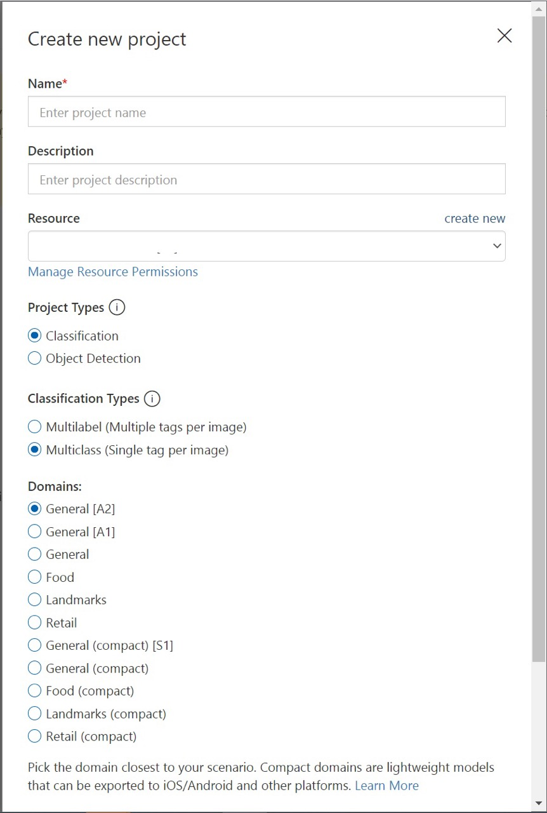

# Custom Vision을 사용하여 분류자를 빌드하는 방법

Custom Vision Service를 사용하려면 먼저 분류자를 빌드해야 합니다. 이 문서에서는 웹 브라우저를 통해 분류자를 빌드하는 방법을 알아봅니다.

## 필수 조건

분류자를 빌드하려면 먼저 다음이 있어야 합니다.

- 유효한 [Microsoft 계정](https://account.microsoft.com/account) 또는 Azure Active Directory OrgID(“회사 또는 학교 계정”). customvision.ai에 로그인하여 시작하는 데 필요합니다.

    > [!IMPORTANT] 
    > [국가별 클라우드](https://www.microsoft.com/en-us/trustcenter/cloudservices/nationalcloud)의 Azure AD(Azure Active Directory) 사용자에 대한 OrgID 로그인은 현재 지원되지 않습니다.

- 분류자를 학습하기 위한 일련의 이미지(태그당 최소 30개 이미지).

- 분류자가 학습된 후에 분류자를 테스트하기 위한 몇 개의 이미지.

- 선택 사항: Microsoft 계정 또는 OrgID와 연결된 Azure 구독. Azure 구독이 아직 없는 경우 시작하기 전에 [체험 계정](https://azure.microsoft.com/free/?WT.mc_id=A261C142F)을 만들 수 있습니다.

    > [!IMPORTANT]
    > Azure 구독이 없으면 __제한된 평가판__ 프로젝트만 만들 수 있습니다. Azure 구독이 있는 경우 프로젝트를 만드는 동안 [Azure Portal](https://portal.azure.com/?microsoft_azure_marketplace_ItemHideKey=microsoft_azure_cognitiveservices_customvision#create/Microsoft.CognitiveServicesCustomVision)에서 Custom Vision Service 학습 및 예측 리소스를 만들라는 메시지가 표시됩니다.   

## 새 프로젝트 만들기

새 프로젝트를 만들려면 다음 단계를 사용합니다.

1. 웹 브라우저에서 [Custom Vision 웹 페이지](https://customvision.ai)로 이동합니다. 서비스 사용을 시작하려면 __로그인__을 선택합니다.

    

    > [!NOTE]
    > Custom Vision Service에 로그인하면 프로젝트 목록이 표시됩니다. 테스트를 위한 두 개의 “제한된 평가판” 프로젝트 이외의 프로젝트는 Azure 리소스와 연결됩니다. Azure 사용자인 경우 액세스 권한이 있는 [Azure 리소스](https://docs.microsoft.com/azure/guides/developer/azure-developer-guide#grant-access-to-resources)와 연결된 모든 프로젝트를 볼 수 있습니다. 

2. 첫 번째 프로젝트를 만들려면 **새 프로젝트**를 선택합니다. 첫 번째 프로젝트의 경우 서비스 약관에 동의해야 합니다. 확인란을 선택하고 **동의함** 단추를 선택합니다. **새 프로젝트** 대화 상자가 나타납니다.

    

3. 프로젝트에 대한 이름과 설명을 입력합니다. 그런 다음, 사용 가능한 도메인 중 하나를 선택합니다. 각 도메인은 다음 표에 설명된 대로 특정 유형의 이미지에 대해 분류자를 최적화합니다.

    |도메인|목적|
    |---|---|
    |__일반__| 광범위한 이미지 분류 작업에 최적화되었습니다. 다른 도메인이 적절하지 않거나 선택할 도메인을 잘 모르겠으면 일반 도메인을 선택합니다. |
    |__음식__|식당 메뉴에 표시되는 것 같은 음식 사진에 최적화되었습니다. 개별 과일이나 채소 사진을 분류하려면 음식 도메인을 사용합니다.|
    |__랜드마크__|인식 가능한 자연적 및 인공적인 랜드마크에 최적화되었습니다. 이 도메인은 랜드마크가 사진에서 명확하게 표시될 때 가장 효과적입니다. 앞에 서 있는 사람이 랜드마크를 약간 가리고 있는 경우에도 도메인이 작동합니다.|
    |__소매__|쇼핑 카탈로그 또는 쇼핑 웹 사이트에 있는 이미지에 최적화되었습니다. 드레스, 바지 및 셔츠를 높은 정밀도로 분류하려는 경우 이 도메인을 사용합니다.|
    |__성인__|성인 콘텐츠와 비성인 콘텐츠 정의 향상에 최적화되었습니다. 예를 들어 수영복을 입은 사람의 이미지를 차단하려는 경우 이 도메인을 사용하여 해당 작업을 수행하는 사용자 지정 분류자를 빌드할 수 있습니다.|
    |__압축 도메인__| 모바일 장치의 실시간 분류 제약 조건에 최적화되었습니다. 압축 도메인에서 생성된 모델을 로컬에서 실행하기 위해 내보낼 수 있습니다.|

    원하는 경우 나중에 도메인을 변경할 수 있습니다.

4. 리소스 그룹을 선택합니다. 리소스 그룹 드롭다운에는 Custom Vision Service 리소스를 포함하는 모든 Azure 리소스 그룹이 표시됩니다. __제한된 평가판__을 만들 수도 있습니다. 제한된 평가판 항목은 비 Azure 사용자가 선택할 수 있는 유일한 리소스 그룹입니다.

    프로젝트를 만들려면 __프로젝트 만들기__를 선택합니다.

## 이미지 업로드 및 태그 지정

1. 분류자에 이미지를 추가하려면 __이미지 추가__ 단추를 사용하고 __로컬 파일 찾아보기__를 선택합니다. __열기__를 선택하여 태그 지정으로 이동합니다.

    > [!TIP]
    > 이미지를 선택한 후 태그를 지정해야 합니다. 이 태그는 업로드하도록 선택한 이미지 그룹에 적용되므로 사용하려는 이미지를 태그로 쉽게 업로드할 수 있습니다. 태그를 지정하고 업로드한 후 선택한 이미지의 태그를 변경할 수도 있습니다.

    > [!TIP]
    > 다양한 카메라 각도, 조명, 배경, 형식, 스타일, 그룹, 크기 등을 사용하는 이미지를 업로드합니다. 다양한 사진 형식을 사용하여 분류자가 편향되지 않고 잘 일반화될 수 있도록 합니다.

    Custom Vision Service는 이미지당 최대 6MB까지 .jpg, .png 및 .bmp 형식의 학습 이미지를 허용합니다. 예측 이미지는 이미지당 최대 4MB까지 가능합니다. 가장 짧은 가장자리가 256픽셀인 이미지를 사용하는 것이 좋습니다. 가장 짧은 가장자리가 256픽셀보다 짧은 이미지는 Custom Vision Service에서 확장됩니다.

    

    >[!NOTE] 
    > REST API를 사용하여 URL에서 학습 이미지를 로드할 수 있습니다.

2. 태그를 설정하려면 __내 태그__ 필드에 텍스트를 입력하고 __+__ 단추를 사용합니다. 이미지를 업로드하고 태그를 지정하려면 __[number]개 파일 업로드__ 단추를 사용합니다. 이미지에 둘 이상의 태그를 추가할 수 있습니다. 

    > [!NOTE]
    > 업로드 시간은 선택한 이미지 수와 크기에 따라 다릅니다.

    

3. 이미지가 업로드되면 __완료__를 선택합니다.

    

4. 다른 이미지 집합을 업로드하려면 1단계로 돌아갑니다. 예를 들어 개와 망아지를 구분하려면 망아지 이미지를 업로드하고 태그를 지정합니다.

## 분류자 학습 및 평가

분류자를 학습하려면 **학습** 단추를 선택합니다.

분류자를 학습하는 데 몇 분 정도면 됩니다. 이 시간 동안에는 학습 프로세스에 대한 정보가 표시됩니다.

학습 후에는 __성능__이 표시됩니다. 정밀도 및 재현율 표시기는 자동 테스트를 기준으로 분류자의 성능을 알려 줍니다. Custom Vision Service는 학습용으로 제출된 이미지를 사용하여 [k-겹 교차 유효성 검사](https://en.wikipedia.org/wiki/Cross-validation_(statistics))라는 프로세스를 통해 이러한 수치를 계산합니다.

> [!NOTE] 
> **학습** 단추를 선택할 때마다 분류자의 새 반복이 생성됩니다. **성능** 탭에서 이전 반복을 모두 볼 수 있으며 사용되지 않을 수 있는 모든 반복을 삭제할 수 있습니다. 반복을 삭제하면 고유하게 연결된 이미지도 모두 삭제됩니다.

분류자는 모든 이미지를 사용하여 각 태그를 식별하는 모델을 만듭니다. 모델의 품질을 테스트하기 위해 분류자는 모델에서 각 이미지를 시도하여 모델이 찾는 내용을 확인합니다.

분류자 결과의 품질이 표시됩니다.

|용어|정의|
|---|---|
|__자릿수__|이미지를 분류할 때 분류자가 이미지를 올바르게 분류할 가능성은 어느 정도인가요? 분류자(개와 망아지)를 학습하는 데 사용되는 모든 이미지 중에서 모델이 맞은 백분율은 어느 정도인가요? 100개 이미지 중 올바른 태그가 99개이면 정밀도는 99%가 됩니다.|
|__재현율__|올바르게 분류되었어야 하는 모든 이미지 중에서 분류자가 올바르게 식별한 이미지는 몇 개였나요? 재현율이 100%이면 분류자를 학습하는 데 사용된 이미지 중 개 이미지가 38개인 경우 분류자가 38개를 찾은 것입니다.|

## 다음 단계

[모델 테스트 및 유지](test-your-model.md)

