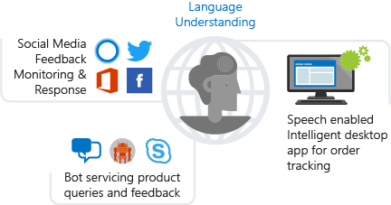

# <a name="what-is-language-understanding-luis"></a>LUIS(Language Understanding)란?
LUIS(Language Understanding)는 사용자 지정 기계 학습을 사용자의 자연스러운 기존 언어 텍스트에 적용하여 전체적인 의미를 예측하고 관련된 자세한 정보를 추출하는 클라우드 기반 서비스입니다. 

LUIS용 클라이언트 응용 프로그램은 자연어로 사용자와 통신하여 작업을 완료하는 대화형 응용 프로그램일 수 있습니다. 클라이언트 응용 프로그램의 예로는 소셜 미디어 앱, 챗봇 및 음성 지원 데스크톱 응용 프로그램을 들 수 있습니다.  



## <a name="what-is-a-luis-app"></a>LUIS 앱이란?
LUIS 앱은 사용자가 디자인하는 도메인별 자연어 모델을 포함합니다. 미리 빌드된 모델로 LUIS 앱을 시작하거나, 직접 빌드하거나, 미리 빌드된 도메인 부분을 사용자 지정 정보와 혼합할 수 있습니다.

[사전 빌드 도메인 모델](luis-how-to-use-prebuilt-domains.md)에는 이러한 모든 부분이 포함되며 LUIS를 빠르게 사작하는 유용한 방법입니다.

또한 LUIS 앱에는 통합 설정, [공동 작업자](luis-concept-collaborator.md) 및 [버전](luis-concept-version.md)도 포함되어 있습니다.

## <a name="using-a-luis-app"></a>LUIS 앱 사용
<a name="Accessing-LUIS"></a> LUIS 앱이 게시되면 클라이언트 응용 프로그램은 LUIS [끝점 API][endpoint-apis]에 발언을 전송하고, 예측 결과를 JSON 응답으로 수신합니다.

다음 다이어그램에서, 먼저 클라이언트 챗봇은 사람들이 자신만의 단어로 표현하려는 사용자 텍스트를 HTTP 요청으로 LUIS에 전송합니다. 둘째, LUIS는 학습한 모델을 자연어에 적용하여 사용자 입력을 이해하도록 하고 JSON(JavaScript Object Notation) 형식 응답을 반환합니다. 셋째, 클라이언트 챗봇은 이 JSON 응답을 사용하여 사용자의 요청을 이행합니다. 


### <a name="example-of-json-endpoint-response"></a>JSON 끝점 응답 예제

JSON 끝점 응답에는 최소한 쿼리 발언 및 최상위 점수의 의도가 포함됩니다. 

```JSON
{
  "query": "I want to call my HR rep.",
  "topScoringIntent": {
    "intent": "HRContact",
    "score": 0.921233
  },
  "entities": [
    {
      "entity": "call",
      "type": "Contact Type",
      "startIndex": 10,
      "endIndex": 13,
      "score": 0.7615982
    }
  ]
}
```

<a name="Key-LUIS-concepts"></a>
<a name="what-is-a-luis-model"></a>
## <a name="what-is-a-natural-language-model"></a>자연어 모델이란?
모델은 "항공편 예약" 또는 "기술 지원팀에 문의"와 같은 _의도_라고 하는 일반적인 사용자 의도 목록으로 시작됩니다. 의도에 대해 _예제 발언_이라고 하는 사용자의 예제 텍스트를 제공합니다. 그런 후 발언에서 _엔터티_라고 하는 중요한 단어 또는 구에 표시합니다.


모델에는 다음이 포함됩니다.

* **[의도](#intents)**: 사용자 의도의 범주(의도된 작업 또는 결과)
* **[엔터티](#entities)**: 발언에서 번호, 전자 메일 또는 이름과 같은 특정 데이터 유형
* **[예제 발언](#example-utterances)**: 클라이언트 응용 프로그램에서 사용자가 입력하는 예제 텍스트

### <a name="intents"></a>의도 
[의도](luis-how-to-add-intents.md)는 항공편 예약, 결제 또는 뉴스 기사 찾기와 같이 사용자 발언에 표현된 목적이나 목표입니다. 각 작업에 대한 의도를 만듭니다. LUIS 여행 앱은 "BookFlight"라는 의도를 정의할 수 있습니다. 클라이언트 응용 프로그램은 최상위 점수 의도를 사용하여 작업을 트리거할 수 있습니다. 예를 들어 "BookFlight" 의도가 LUIS에서 반환되면 클라이언트 응용 프로그램은 항공 티켓 예약을 위해 외부 서비스에 대한 API 호출을 트리거할 수 있습니다.

### <a name="entities"></a>엔터티
[엔터티](luis-how-to-add-entities.md)는 발언에서 사용자의 요청과 관련된 자세한 정보를 나타냅니다. 예를 들어, 발언 "파리행 항공편 예약"에서는 단일 티켓이 요청되며 “파리”는 위치를 나타냅니다. 단일 티켓을 나타내는 "티켓"과 목적지를 나타내는 “파리”의 두 엔터티가 확인됩니다. 

LUIS가 사용자 발언에 나오는 엔터티를 반환한 후에, 클라이언트 응용 프로그램은 작업을 트리거하는 매개 변수로 엔터티 목록을 사용할 수 있습니다. 예를 들어, 항공권 예약을 위해서는 여행 목적지, 날짜 및 항공사와 같은 엔터티가 필요합니다.

LUIS는 엔터티를 식별하고 분류하는 몇 가지 방법을 제공합니다.

* **미리 작성된 엔터티** LUIS에는 의도, 발언 및 [미리 작성된 엔터티](luis-prebuilt-entities.md)를 비롯하여 미리 작성된 여러 도메인 모델이 포함되어 있습니다. 미리 작성된 모델의 의도 및 발언을 사용하지 않고도 미리 작성된 엔터티를 사용할 수 있습니다. 미리 작성된 엔터티를 사용하면 시간이 절약됩니다.

* **사용자 지정 엔터티** LUIS는 기계 학습 엔터티, 특정 또는 리터럴 엔터티, 기계 학습 및 리터럴의 조합을 비롯하여 사용자 고유의 [엔터티](luis-concept-entity-types.md)를 식별하는 몇 가지 방법을 제공합니다.

### <a name="example-utterances"></a>예제 발화
예제 [발언](luis-how-to-add-example-utterances.md)은 클라이언트 응용 프로그램이 이해해야 하는 사용자의 입력 텍스트입니다. "파리행 티켓 예약"과 같은 문장이나 "예약" 또는 “파리행 항공권”과 같은 문장 부분이 있을 수 있습니다. 발언이 항상 올바른 형식인 것은 아니며 특정 의도에 대해 여러 발언 변형이 있을 수 있습니다. 각 의도에 10~20개의 예제 발언을 추가하고 모든 발언에서 엔터티에 표시합니다.

|예제 사용자 발언|의도|엔터티|
|-----------|-----------|-----------|
|"__시애틀__로 가는 항공편을 예약해줄 수 있나요?"|BookFlight|시애틀|
|"매장은 몇 시에 __문을 여나요__?"|StoreHoursAndLocation|open|
|"부서의 __Bob__과 __오후 1시__에 회의하기로 예약합니다."|ScheduleMeeting|1pm, Bob|

## <a name="improve-prediction-accuracy"></a>예측 정확도 개선
LUIS 앱이 게시되고 실제 사용자 발언이 수신되면, LUIS는 끝점 발언의 [능동적 학습](#active-learning), 도메인 단어 포함을 위한 [문구 목록](#phrase-lists) 및 필요한 발언 수를 줄이기 위한 [패턴](#patterns)과 같이 예측 정확도를 향상시키는 몇 가지 방법을 제공합니다.

### <a name="active-learning"></a>능동적 학습
[능동적 학습](luis-how-to-review-endoint-utt.md) 프로세스에서는 검토를 위해 끝점에서 수신된 발언을 선택하여 LUIS 앱을 실제 발언에 맞게 조정할 수 있습니다. 끝점 예측을 수락 또는 수정하고, 재학습하고, 재게시할 수 있습니다. LUIS는 이러한 반복 프로세스로 빠르게 학습하며, 사용자에게 필요한 시간과 노력을 최소화합니다. 

### <a name="phrase-lists"></a>문구 목록 
LUIS는 모델 도메인에 중요한 단어나 구를 나타낼 수 있도록 [문구 목록](luis-concept-feature.md)을 제공합니다. LUIS는 이러한 목록을 사용하여 모델에서 찾을 수 없는 해당 단어 및 문구에 추가적인 중요도를 추가합니다.

### <a name="patterns"></a>패턴 
패턴을 사용하면 의도의 발언 모음을 선택한 단어 및 단어 순서를 갖는 공통 [템플릿](luis-concept-patterns.md)으로 간소화할 수 있습니다. 이렇게 하면 LUIS에서 해당 의도에 대해 더 적은 수의 예제 발언이 필요하므로 더 빠르게 학습할 수 있습니다. 패턴은 정규식 및 기계 학습된 식의 혼합 시스템입니다. 

<a name="using-luis"></a>

## <a name="authoring-and-accessing-luis"></a>LUIS 작성 및 액세스
LUIS 웹 사이트에서 또는 [작성](https://aka.ms/luis-authoring-apis) API를 사용하여 프로그래밍 방식으로 LUIS 앱을 빌드하거나, 작성 요구에 따라 두 방법을 모두 사용합니다. [끝점](https://aka.ms/luis-endpoint-apis)을 쿼리하여 게시된 LUIS 앱에 액세스합니다. 

LUIS는 사용자 작성 지역에 따라, 전 세계적으로 3개의 웹 사이트를 제공합니다. 작성 지역은 LUIS 앱을 게시할 수 있는 Azure 지역을 결정합니다.
<!--
|Authoring region|Publishing region(s)|
|--|--|
|[www.luis.ai](https://www.luis.ai)|**U.S.**<br>West US<br>West US 2<br>East US<br>East US 2<br>South Central US<br>West Central US<br><br>**Asia**<br>Southeast Asia<br>East Asia<br><br>**South America**<br>Brazil South |
|[au.luis.ai](https://au.luis.ai)|Australia East|
|[eu.luis.ai](https://eu.luis.ai)|West Europe<br>North Europe|
-->

작성 및 게시 지역에 대해 [자세히](luis-reference-regions.md) 알아보세요.

## <a name="what-technologies-work-with-luis"></a>LUIS에는 어떤 기술이 사용되나요?
몇 가지 Microsoft 기술이 LUIS에 사용됩니다.

* [Bing Spell Check API](../bing-spell-check/proof-text.md)는 예측 전에 텍스트를 수정할 수 있도록 합니다. 
* [Bot Framework][bot-framework]에서는 텍스트 입력을 통해 챗봇으로 사용자와 대화할 수 있습니다. 완전한 봇 환경을 위해서는 [3.x](https://github.com/Microsoft/BotBuilder) 또는 [4.x](https://github.com/Microsoft/botbuilder-dotnet) SDK를 선택합니다.
* [QnA Maker][qnamaker]에서는 몇 가지 유형의 텍스트를 질문 및 답변 기술 자료로 결합할 수 있습니다.
* [Speech](../Speech/home.md)는 음성 언어 요청을 텍스트로 변환합니다. 일단 텍스트로 변환되면 LUIS가 요청을 처리합니다. 자세한 내용은 [Speech SDK](https://aka.ms/csspeech)를 참조하세요.
* [Text Analytics](../text-analytics/overview.md)는 감정 분석 및 핵심 구 데이터 추출을 제공합니다.

## <a name="next-steps"></a>다음 단계
[미리 작성된](luis-get-started-create-app.md) 또는 [사용자 지정](luis-quickstart-intents-only.md) 도메인으로 새 LUIS 앱을 만듭니다.

<!-- Reference-style links -->
[bot-framework]: https://docs.microsoft.com/bot-framework/
[flow]: https://docs.microsoft.com/connectors/luis/
[authoring-apis]: https://aka.ms/luis-authoring-api
[endpoint-apis]: https://aka.ms/luis-endpoint-apis
[qnamaker]: https://qnamaker.ai/