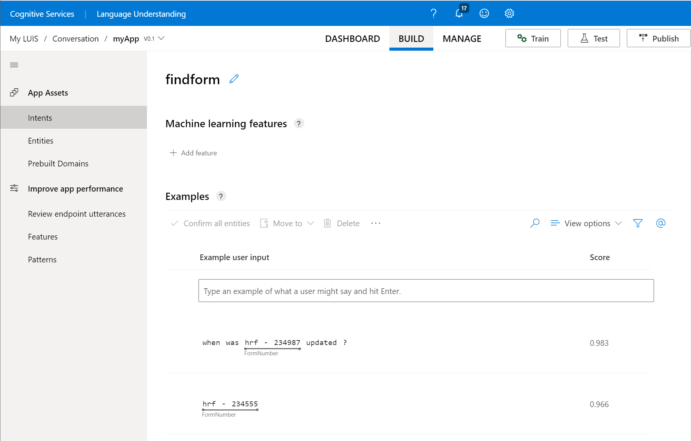

# <a name="quickstart-create-a-new-app-in-the-luis-portal"></a>빠른 시작: LUIS 포털에서 새 앱 만들기

이 빠른 시작에서는 [LUIS 포털](https://www.luis.ai)에서 새 앱을 작성합니다. 우선 앱, **의도** 및 **엔터티**의 기본적인 부분을 만듭니다. 그런 다음, 예측된 의도를 얻기 위해 대화형 테스트 패널에 샘플 사용자 발언을 제공하여 앱을 테스트합니다.

앱을 작성하는 것은 무료이며, Azure 구독이 필요하지 않습니다. 앱을 배포할 준비가 되면 [앱을 배포하기 위한 빠른 시작](get-started-portal-deploy-app.md)을 참조하세요. Azure Cognitive Service 리소스를 만들어서 앱에 할당하는 방법을 보여줍니다.

## <a name="create-an-app"></a>앱 만들기

1. 브라우저에서 [LUIS 포털](https://www.luis.ai)을 열고 로그인합니다. 처음 로그인하는 경우에는 무료 LUIS 포털 사용자 계정을 만들어야 합니다.

1. 상황에 맞는 도구 모음에서 **새 앱 만들기**를 선택합니다.

   [](./media/get-started-portal-build-app/create-app-in-portal.png#lightbox)

1. 팝업 창에서 다음 설정으로 앱을 구성한 다음, **완료**를 선택합니다.

   |설정 이름| 값 | 목적|
   |--|--|--|
   |Name|`myEnglishApp`|고유한 LUIS 앱 이름<br>필수|
   |문화권|**English**|사용자의 발화 언어, **en-us**<br>필수|
   |설명|`App made with LUIS Portal`|앱에 대한 설명<br>선택 사항|
   | | | |

   

## <a name="create-intents"></a>의도 만들기

LUIS 앱이 만들어지면 의도를 만들어야 합니다. 의도는 사용자의 텍스트를 분류하는 방법입니다. 예를 들어, 인적 자원 앱에는 두 가지 함수가 있을 수 있습니다. 도움이 되는 기능:

 1. 일자리를 찾아서 지원하기
 1. 일자리에 지원하는 양식 찾기

앱의 2가지 다른 _의도_는 다음과 같습니다.

|Intent|사용자의 예제 텍스트<br>(_발화_)|
|--|--|
|ApplyForJob|`I want to apply for the new software engineering position in Cairo.`|
|FindForm|`Where is the job transfer form hrf-123456?`|

의도를 만들려면 다음 단계를 완료합니다.

1. 앱을 만들면 **빌드** 섹션의 **의도** 페이지가 표시됩니다. **새 의도 만들기**를 선택합니다.

   [](./media/get-started-portal-build-app/create-new-intent-button.png#lightbox)

1. 의도 이름 `FindForm`을 입력한 다음, **완료**를 선택합니다.

   

## <a name="add-an-example-utterance"></a>예제 발화 추가

의도를 만든 후에 예제 발언을 추가합니다. 예제 발언은 챗봇이나 기타 클라이언트 애플리케이션에 사용자가 입력하는 텍스트입니다. 사용자 텍스트의 의도를 LUIS 의도에 매핑합니다.

이 예제 애플리케이션의 `FindForm` 의도는, 예제 발언에 양식 번호가 포함됩니다. 사용자의 요청을 이행하려면 클라이언트 애플리케이션에 양식 번호가 필요하기 때문에 발언에 양식 번호를 포함하는 것이 중요합니다.

[](./media/get-started-portal-build-app/add-example-utterance.png#lightbox)

다음 15가지 예제 발언을 `FindForm` 의도에 추가합니다.

|#|예제 발화|
|--|--|
|1|Looking for hrf-123456|
|2|Where is the human resources form hrf-234591?|
|3|hrf-345623, where is it|
|4|Is it possible to send me hrf-345794|
|5|Do I need hrf-234695 to apply for an internal job?|
|6|Does my manager need to know I'm applying for a job with hrf-234091|
|7|Where do I send hrf-234918? Do I get an email response it was received?|
|8|hrf-234555|
|9|When was hrf-234987 updated?|
|10|Do I use form hrf-876345 to apply for engineering positions|
|11|Was a new version of hrf-765234 submitted for my open req?|
|12|Do I use hrf-234234 for international jobs?|
|13|hrf-234598 spelling mistake|
|14|will hrf-234567 be edited for new requirements|
|15|hrf-123456, hrf-123123, hrf-234567|

기본적으로 이러한 예제 발언은 다음과 같이 다양합니다.

* 발화 길이
* 문장 부호
* 단어 선택
* 동사 시제(is, was, will be)
* 단어 순서


## <a name="create-a-regular-expression-entity"></a>정규식 엔터티 만들기

런타임 예측 응답에 양식 번호를 반환하려면 양식을 엔터티로 표시해야 합니다. 양식 번호 텍스트는 고도로 구조화되어 있기 때문에 정규식 엔터티를 사용하여 표시할 수 있습니다. 다음 단계를 사용하여 엔터티를 만듭니다.

1. 왼쪽 메뉴에서 **엔터티**를 선택합니다.

1. **엔터티** 페이지에서 **새 엔터티 만들기**를 선택합니다.

1. 이름 `Human Resources Form Number`를 입력하고 **Regex** 엔터티 형식을 선택한 후 정규식 `hrf-[0-9]{6}`을 입력합니다. 이 항목은 리터럴 문자, `hrf-`와 일치하며 정확히 6자를 허용합니다.

   

1. **완료** 를 선택합니다.

## <a name="add-example-utterances-to-the-none-intent"></a>None 의도에 예제 발언 추가

**None** 의도는 대체 의도로, 비워 둘 수 없습니다. 이 의도는 앱의 다른 의도에 대해 추가한 예제 발언 10개마다 1개의 발언을 포함해야 합니다.

**None** 의도의 예제 발화는 클라이언트 애플리케이션 영역 외부에 있어야 합니다.

1. 왼쪽 메뉴에서 **의도**를 선택한 다음, 의도 목록에서 **없음**을 선택합니다.

1. 다음 예제 발화를 의도에 추가하세요.

   |None 의도 예제 발화|
   |--|
   |개가 짖어서 시끄럽다|
   |피자 주문해 줘|
   |바다의 펭귄|

   이 인적 자원 앱에서 이러한 예제 발화는 해당 영역 외부에 있습니다. 인적 자원 도메인에 동물, 식품 또는 해양이 포함되는 경우에는 **None** 의도에 다른 에제 발언을 사용해야 합니다.

## <a name="train-the-app"></a>앱 학습

오른쪽 위에 있는 메뉴에서 **학습**을 선택하여 의도 및 엔터티 모델 변경 내용을 앱의 현재 버전에 적용합니다.

## <a name="look-at-the-regular-expression-entity-in-the-example-utterances"></a>예제 발화의 정규식 엔터티 확인

1. 왼쪽 메뉴에서 **의도**를 선택하여 엔터티가 **FindForm** 의도에 있는지 확인합니다. 그런 다음, **FindForm** 의도를 선택합니다.

   예제 발화에서 해당 엔터티가 있는 위치가 표시됩니다. 엔터티 이름 대신 원래 텍스트를 보려면 도구 모음에서 **엔터티 보기**를 토글합니다.

   [](./media/get-started-portal-build-app/all-example-utterances-marked-with-entities.png#lightbox)

## <a name="test-your-new-app-with-the-interactive-test-pane"></a>대화형 테스트 창을 사용하여 새 앱 테스트

LUIS 포털에서 대화형 **테스트** 창을 사용하여 앱에 아직 표시되지 않은 새 발언에서 엔터티가 추출되었는지 검증합니다.

1. 오른쪽 위 메뉴에서 **테스트**를 선택합니다.

1. 새 발언을 추가한 후 Enter 키를 누릅니다.

   ```Is there a form named hrf-234098```

   

   상위 예측 의도는 신뢰도 90%가 넘는(0.977) **FindForm**입니다. **인적 자원 양식 번호** 엔터티는 hrf-234098 값으로 추출됩니다.

## <a name="clean-up-resources"></a>리소스 정리

이 빠른 시작을 완료했는데 다음 빠른 시작으로 넘어가지 않으면 위쪽 탐색 메뉴에서 **내 앱**을 선택합니다. 그런 다음, 목록에서 앱의 왼쪽 확인란을 선택하고, 목록 위의 상황에 맞는 도구 모음에서 **삭제**를 선택합니다.

[](./media/get-started-portal-build-app/delete-app.png#lightbox)

## <a name="next-steps"></a>다음 단계

> [!div class="nextstepaction"]
> [2. 앱 배포](get-started-portal-deploy-app.md)
