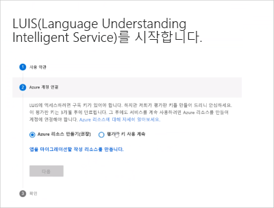
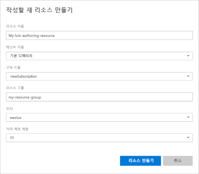

## LUIS 포털에 로그인

LUIS에 대한 새 사용자는 다음 절차를 수행해야 합니다.

1. [LUIS 포털](https://www.luis.ai)에 로그인한 후 국가/지역을 선택하고 사용 약관에 동의합니다. **내 앱**이 대신 표시되는 경우 LUIS 리소스가 이미 존재하므로 앱 만들기로 건너뛰어야 합니다. 지원되는 지역은 [작성 및 게시 지역과 관련 키](https://docs.microsoft.com/azure/cognitive-services/luis/luis-reference-regions)를 방문하세요.

1. **Azure 리소스 만들기**를 선택한 다음, **앱을 마이그레이션할 제작 리소스 만들기**를 선택합니다.

    

1. 리소스에 대한 세부 정보를 입력합니다.

    

    **새 제작 리소스를 만들** 때 다음 정보를 제공합니다.

    * **리소스 이름** - 사용자가 선택한 사용자 지정 이름으로, 작성 및 예측 엔드포인트 쿼리의 URL 중 일부로 사용됩니다.
    * **테넌트** - Azure 구독이 연결된 테넌트입니다.
    * **구독 이름** - 리소스에 대해 청구되는 구독입니다.
    * **리소스 그룹** - 사용자가 선택하거나 만드는 사용자 지정 리소스 그룹 이름입니다. 리소스 그룹을 사용하면 액세스 및 관리를 위해 Azure 리소스를 그룹화할 수 있습니다.
    * **위치** - 선택한 위치는 **리소스 그룹** 선택에 따라 결정됩니다.
    * **가격 책정 계층** - 가격 책정 계층은 초 및 월별 최대 트랜잭션 수를 결정합니다.

1. 만들 리소스에 대한 요약이 표시됩니다. **다음**을 선택합니다.

    

1. **계속**을 선택하여 확인합니다.

    
