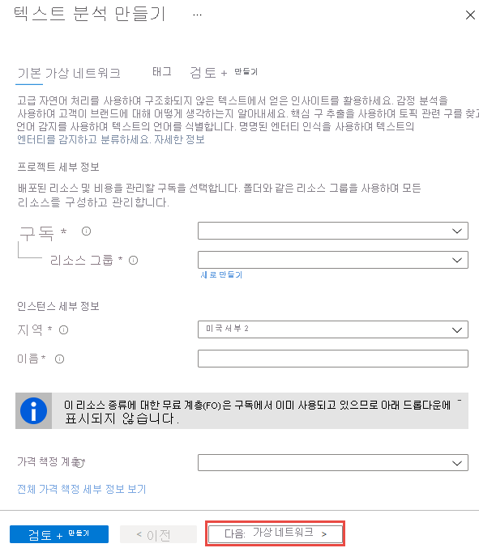

# Azure Portal를 사용 하 여 Cognitive Services 리소스 만들기

이 빠른 시작을 사용 하 여 Azure Portal를 사용 하 여 Azure Cognitive Services를 시작 하세요. Cognitive Services은 Azure 구독에서 만든 Azure [리소스로](https://docs.microsoft.com/azure/azure-resource-manager/resource-group-portal) 표시 됩니다. 리소스를 만든 후에는 응용 프로그램을 인증 하기 위해 생성 된 키 및 끝점을 사용 합니다. 

## 필수 구성 요소

* 유효한 Azure 구독- [무료로 하나를 만듭니다](https://azure.microsoft.com/free/) .

[!INCLUDE [cognitive-services-subscription-types](../../includes/cognitive-services-subscription-types.md)]

## 새 Azure Cognitive Services 리소스 만들기

Cognitive Services 리소스를 만들기 전에 리소스를 포함 하는 Azure 리소스 그룹이 있어야 합니다. 새 리소스를 만들 때 새 리소스 그룹을 만들거나 기존 리소스 그룹을 사용 하는 옵션이 있습니다. 이 문서에서는 새 리소스 그룹을 만드는 방법을 보여 줍니다.

1. [Azure Portal](https://portal.azure.com)에 로그인한 후 **+리소스 만들기**를 클릭합니다.

    

2. 다음과 같은 방법으로에서 사용할 수 있는 Cognitive Services를 찾을 수 있습니다.
    * 검색 표시줄을 사용 하 여 구독할 서비스의 이름을 입력 합니다.
        * 다중 서비스 리소스를 만들려면 검색 표시줄에 **Cognitive Services** 를 입력 하 고 **Cognitive Services** 리소스를 선택 합니다.

        

    * 사용 가능한 인식 서비스를 모두 보려면 **Azure Marketplace**에서 **AI + Machine Learning**를 선택 합니다. 관심이 있는 서비스가 표시 되지 않으면 **모두 보기** 를 클릭 하 고 **Cognitive Services**로 스크롤합니다. **자세히** 를 클릭 하 여 Cognitive Services API 전체 카탈로그를 봅니다.
    
        

3. **만들기** 페이지에서 다음 정보를 제공합니다.

    > [!IMPORTANT]
    > Azure Cognitive Services를 호출할 때 필요할 수 있으므로 Azure 위치를 염두에 두어야 합니다.

    |    |    |
    |--|--|
    | **이름** | Cognitive Services 리소스를 설명하는 이름입니다. 예: *MyCognitiveServicesAccount*. |
    | **구독** | 사용 가능한 Azure 구독 중 하나를 선택합니다. |
    | **위치** | Cognitive Service 인스턴스의 위치입니다. 다른 위치를 사용하면 대기 시간이 발생할 수 있지만 리소스의 런타임 가용성에는 영향을 주지 않습니다. |
    | **가격 책정 계층** | Cognitive Services 계정의 비용은 선택한 옵션 및 사용량에 따라 다릅니다. 자세한 내용은 API [가격 책정 세부 정보](https://azure.microsoft.com/pricing/details/cognitive-services/)를 참조하세요.
    | **리소스 그룹** | Cognitive Services 리소스를 포함할 [Azure 리소스 그룹](https://docs.microsoft.com/azure/architecture/cloud-adoption/governance/resource-consistency/azure-resource-access#what-is-an-azure-resource-group)입니다. 새 그룹을 만들거나 기존 그룹에 추가할 수 있습니다. |

    

## 리소스의 키를 가져옵니다.

리소스를 만든 후 고정하면 Azure 대시보드에서 액세스할 수 있습니다. 그렇지 않으면 **리소스 그룹**에서 찾을 수 있습니다. 리소스를 선택한 후 **리소스 관리**에서 **키** 를 선택 하 여 키를 가져올 수 있습니다.

[!INCLUDE [cognitive-services-environment-variables](../../includes/cognitive-services-environment-variables.md)]

## 리소스 정리

Cognitive Services 구독을 정리하고 제거하려면 리소스나 리소스 그룹을 삭제하면 됩니다. 리소스 그룹을 삭제 하면 해당 그룹에 포함 된 다른 리소스도 모두 삭제 됩니다.

Azure Portal을 사용하여 리소스 그룹을 제거하려면

1. Azure Portal에서 왼쪽의 메뉴를 확장하여 서비스 메뉴를 열고 **리소스 그룹**을 선택하여 리소스 그룹 목록을 표시합니다.
2. 삭제할 리소스 그룹을 찾아 목록 오른쪽에 있는 자세히 단추 (...)를 마우스 오른쪽 단추로 클릭 합니다.
3. **리소스 그룹 삭제**를 선택하고 확인합니다.

## 참고자료

* [Azure Cognitive Services에 대한 요청 인증](authentication.md)
* [Azure Cognitive Services 이란?](Welcome.md)
* [자연어 지원](language-support.md)
* [Docker 컨테이너 지원](cognitive-services-container-support.md)
