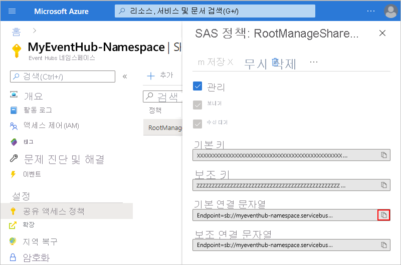
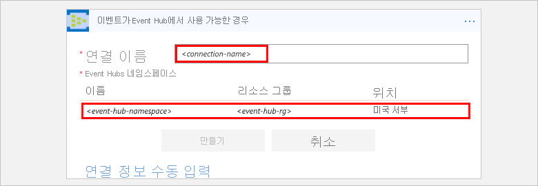
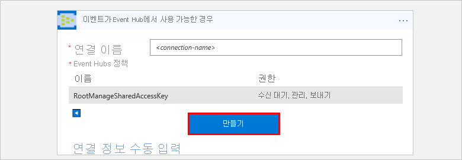

# Azure Event Hubs 및 Azure Logic Apps를 사용하여 이벤트 모니터링, 수신 및 전송

이 아티클에서는 Azure Event Hubs 커넥터를 사용하여 논리 앱 내에서 [Azure Event Hubs](../event-hubs/event-hubs-about.md)로 전송된 이벤트를 모니터링하고 관리하는 방법을 보여줍니다. 이런 방식으로 Event Hubs에서 이벤트를 검사하고, 전송하고, 수신하는 작업 및 워크플로를 자동화하는 논리 앱을 만들 수 있습니다. 커넥터 관련 기술 정보는 [Azure Event Hubs 커넥터 참조](/connectors/eventhubs/)를 참조 </a> 하세요.

## 사전 요구 사항

* Azure 계정 및 구독 Azure 구독이 없는 경우 [체험 Azure 계정에 등록](https://azure.microsoft.com/free/)합니다. 

* [Azure Event Hubs 네임 스페이스 및 이벤트 허브](../event-hubs/event-hubs-create.md)

* Event Hubs에 액세스하려는 논리 앱입니다. Azure Event Hubs 트리거를 사용 하 여 논리 앱을 시작 하려면 [빈 논리 앱](../logic-apps/quickstart-create-first-logic-app-workflow.md)이 필요 합니다.
논리 앱을 처음 접하는 경우 [Azure Logic Apps란?](../logic-apps/logic-apps-overview.md) 및 [빠른 시작: 첫 번째 논리 앱 만들기](../logic-apps/quickstart-create-first-logic-app-workflow.md)를 검토하세요.

## 사용 권한 확인 및 연결 문자열 가져오기

논리 앱이 이벤트 허브에 액세스할 수 있는지 확인 하려면 사용 권한을 확인 하 고 Event Hubs 네임 스페이스에 대 한 연결 문자열을 가져옵니다.

1. [Azure Portal](https://portal.azure.com)에 로그인합니다.

1. 특정 Event Hub가 아닌 Event Hubs *네임스페이스* 로 이동합니다. 

1. 네임 스페이스 메뉴의 **설정** 에서 **공유 액세스 정책** 을 선택 합니다. **클레임** 에서 해당 네임 스페이스에 대 한 **관리** 권한이 있는지 확인 합니다.

   

1. 연결 정보를 나중에 수동으로 입력하려는 경우 Event Hubs 네임스페이스에 대한 연결 문자열을 가져옵니다.

   1. **정책** 에서 **RootManageSharedAccessKey** 를 선택합니다.

   1. 기본 키 연결 문자열을 찾습니다. 복사 단추를 선택하고 나중에 사용할 연결 문자열을 저장합니다.

      

      > [!TIP]
      > 연결 문자열이 Event Hubs 네임스페이스 또는 특정 Event Hub와 연결되어 있는지 확인하려면 연결 문자열에 `EntityPath` 매개 변수가 있는지 확인합니다. 이 매개 변수를 찾으면 연결 문자열은 특정 Event Hub "엔터티"에 대한 것이고 논리 앱에 사용할 올바른 문자열이 아닙니다.

1. 이제 [Event Hubs 트리거 추가](#add-trigger) 또는 [Event Hubs 작업 추가](#add-action)를 계속합니다.

## Event Hubs 트리거 추가

Azure Logic Apps에서 모든 논리 앱은 특정 이벤트가 발생하거나 특정 조건이 충족할 때 실행되는 [트리거](../logic-apps/logic-apps-overview.md#logic-app-concepts)를 통해 시작되어야 합니다. 트리거가 실행될 때마다 Logic Apps 엔진에서 논리 앱 인스턴스를 만들고 앱의 워크플로를 실행하기 시작합니다.

이 예제에서는 새 이벤트를 Event Hub로 보내는 경우 논리 앱 워크플로를 시작할 수 있는 방법을 보여줍니다. 

> [!NOTE]
> 모든 이벤트 허브 트리거는 *긴 폴링* 트리거입니다. 즉, 트리거가 모든 이벤트를 처리 한 다음 이벤트 허브에 더 많은 이벤트가 나타날 때까지 파티션당 30 초를 대기 합니다. 따라서 트리거가 4 개의 파티션으로 설정 된 경우이 지연 시간은 트리거가 모든 파티션 폴링을 완료 하기까지 최대 2 분이 걸릴 수 있습니다. 이 지연 시간 안에 이벤트가 수신 되지 않으면 트리거 실행을 건너뜁니다. 그렇지 않으면 트리거는 Event Hub가 빈 상태가 될 때까지 이벤트를 계속 읽습니다. 다음 트리거 폴링은 트리거의 속성에 지정한 되풀이 간격을 기준으로 발생합니다.

1. Azure Portal 또는 Visual Studio에서 빈 논리 앱을 만들어 논리 앱 디자이너를 엽니다. 이 예에서는 Azure Portal을 사용합니다.

1. 검색 상자에 필터로 “event hubs”를 입력합니다. 트리거 목록에서 **이벤트 허브에서 이벤트를 사용할 수 있는 경우** 트리거를 선택 합니다.-Event Hubs

   

1. 연결 정보를 묻는 메시지가 표시되면 [이제 Event Hubs 연결을 만듭니다](#create-connection). 

1. 트리거에서 모니터링할 이벤트 허브에 대 한 정보를 제공 합니다. 추가 속성을 보려면 **새 매개 변수 추가** 목록을 엽니다. 매개 변수를 선택 하면 해당 속성이 트리거 카드에 추가 됩니다.

   

   | 속성 | 필수 | 설명 |
   |----------|----------|-------------|
   | **이벤트 허브 이름** | 예 | 모니터링할 이벤트 허브의 이름입니다. |
   | **콘텐츠 형식** | 아니요 | 이벤트의 내용 유형입니다. 기본값은 `application/octet-stream`입니다. |
   | **소비자 그룹 이름** | 아니요 | 이벤트를 읽는 데 사용할 [이벤트 허브 소비자 그룹의 이름](../event-hubs/event-hubs-features.md#consumer-groups) 입니다. 지정하지 않으면 기본값 소비자 그룹이 사용됩니다. |
   | **최대 이벤트 수** | 아니요 | 최대 이벤트 수입니다. 트리거는 1과 이 속성으로 지정된 이벤트의 수 범위의 숫자를 반환합니다. |
   | **간격** | 예 | 빈도에 따라 워크플로가 실행 되는 빈도를 설명 하는 양의 정수입니다. |
   | **빈도** | 예 | 되풀이의 시간 단위입니다. |
   ||||

   **추가 속성**

   | 속성 | 필수 | 설명 |
   |----------|----------|-------------|
   | **콘텐츠 스키마** | 아니요 | 이벤트 허브에서 읽을 이벤트의 JSON 콘텐츠 스키마입니다. 예를 들어 콘텐츠 스키마를 지정 하는 경우 스키마와 일치 하는 이벤트에 대해서만 논리 앱을 트리거할 수 있습니다. |
   | **최소 파티션 키** | 아니요 | 읽을 최소 [파티션](../event-hubs/event-hubs-features.md#partitions) ID를 입력합니다. 기본적으로 모든 파티션이 읽혀집니다. |
   | **최대 파티션 키** | 아니요 | 읽을 최대 [파티션](../event-hubs/event-hubs-features.md#partitions) ID를 입력합니다. 기본적으로 모든 파티션이 읽혀집니다. |
   | **표준 시간대** | 아니요 | 이 트리거는 UTC 오프셋을 허용하지 않으므로 시작 시간을 지정할 때만 적용됩니다. 적용하려는 표준 시간대를 선택합니다. 
자세한 내용은 [Azure Logic Apps를 사용 하 여 되풀이 작업 및 워크플로 만들기 및 실행](../connectors/connectors-native-recurrence.md)을 참조 하세요. |
   | **시작 시간** | 아니요 | 시작 시간을 다음 형식으로 입력합니다. 
표준 시간대를 선택하는 경우 YYYY-MM-DDThh:mm:ss
또는
표준 시간대를 선택하지 않은 경우 YYYY-MM-DDThh:mm:ssZ
자세한 내용은 [Azure Logic Apps를 사용 하 여 되풀이 작업 및 워크플로 만들기 및 실행](../connectors/connectors-native-recurrence.md)을 참조 하세요. |
   ||||

1. 완료되면 디자이너 도구 모음에서 **저장** 을 선택합니다.

1. 이제 트리거 결과와 함께 수행하려는 작업에 대한 논리 앱에 하나 이상의 작업을 계속해서 추가합니다. 

   예를 들어 특정 값 (예: 범주)에 따라 이벤트를 필터링 하려면 **전송 이벤트** 작업에서 조건에 맞는 이벤트만 보내도록 조건을 추가할 수 있습니다. 

## Event Hubs 작업 추가

Azure Logic Apps에서 [작업](../logic-apps/logic-apps-overview.md#logic-app-concepts)은 트리거 또는 다른 작업을 수행하는 워크플로의 한 단계입니다. 이 예제에서 논리 앱은 Event Hub에서 새 이벤트를 확인하는 Event Hubs 트리거를 시작합니다.

1. Azure Portal 또는 Visual Studio에서 논리 앱 디자이너에서 논리 앱을 엽니다. 이 예에서는 Azure Portal을 사용합니다.

1. 트리거 또는 작업에서 **새 단계** 를 선택 합니다.

   기존 단계 간에 작업을 추가하려면 연결 화살표 위로 마우스를 이동합니다. 
   표시되는 더하기 기호( **+** )를 선택한 다음, **작업 추가** 를 선택합니다.

1. 검색 상자에 필터로 “event hubs”를 입력합니다.
작업 목록에서 **이벤트 보내기-Event Hubs** 를 선택 합니다.

   

1. 연결 정보를 묻는 메시지가 표시되면 [이제 Event Hubs 연결을 만듭니다](#create-connection). 

1. 동작에서 전송 하려는 이벤트에 대 한 정보를 제공 합니다. 추가 속성을 보려면 **새 매개 변수 추가** 목록을 엽니다. 매개 변수를 선택 하면 해당 속성이 작업 카드에 추가 됩니다.

   

   | 속성 | 필수 | 설명 |
   |----------|----------|-------------|
   | **이벤트 허브 이름** | 예 | 이벤트를 보낼 이벤트 허브 |
   | **콘텐츠** | 아니요 | 전송하려는 이벤트의 콘텐츠 |
   | **속성** | 예 | 보낼 앱 속성 및 값 |
   | **파티션 키** | 아니요 | 이벤트를 보낼 위치에 대 한 [파티션](../event-hubs/event-hubs-features.md#partitions) ID입니다. |
   ||||

   예를 들어 Event Hubs 트리거의 출력을 다른 이벤트 허브로 보낼 수 있습니다.

   

1. 완료되면 디자이너 도구 모음에서 **저장** 을 선택합니다.

## Event Hub에 연결

[!INCLUDE [Create connection general intro](../../includes/connectors-create-connection-general-intro.md)] 

1. 연결 정보에 대한 메시지가 표시되면 다음과 같은 세부 정보를 입력합니다.

   | 속성 | 필수 | 값 | 설명 |
   |----------|----------|-------|-------------|
   | **연결 이름** | 예 | <*연결-이름*> | 연결에 만들 이름 |
   | **Event Hubs 네임 스페이스** | 예 | <*이벤트 허브-네임 스페이스*> | 사용하려는 Event Hubs 네임스페이스를 선택합니다. |
   |||||  

   예를 들면 다음과 같습니다.

   

   연결 문자열을 수동으로 입력 하려면 **연결 정보를 수동으로 입력** 을 선택 합니다. 
   [연결 문자열을 찾는 방법](#permissions-connection-string)을 알아보세요.

2. 선택하지 않은 경우 사용할 Event Hubs 정책을 선택합니다. **만들기** 를 선택합니다.

   

3. 연결을 만든 후에 [Event Hubs 트리거 추가](#add-trigger) 또는 [Event Hubs 작업 추가](#add-action)를 계속 진행합니다.

## 커넥터 참조

커넥터의 Swagger 파일에서 설명한 것처럼 트리거, 작업 및 제한과 같은 기술 세부 정보는 [커넥터의 참조 페이지](/connectors/eventhubs/)를 참조하세요.

> [!NOTE]
> [Ise (통합 서비스 환경](../logic-apps/connect-virtual-network-vnet-isolated-environment-overview.md))의 논리 앱의 경우이 커넥터의 ise 레이블 버전은 [ise 메시지 제한을](../logic-apps/logic-apps-limits-and-config.md#message-size-limits) 대신 사용 합니다.

## 다음 단계

* 다른 [Logic Apps 커넥터](../connectors/apis-list.md)에 대해 알아봅니다.
