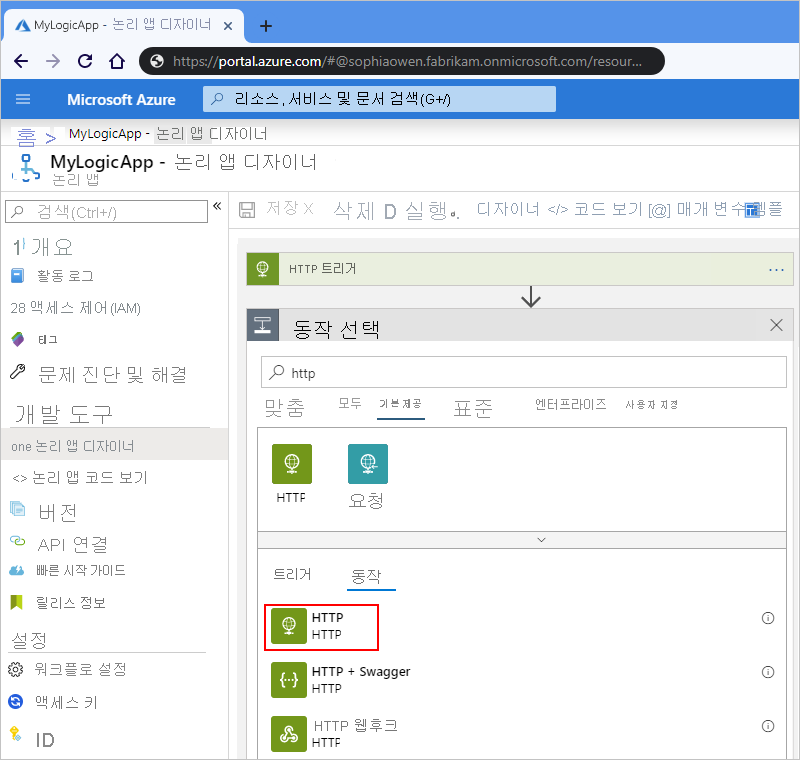

# Azure Logic Apps를 사용 하 여 HTTP 또는 HTTPS 끝점 호출

사용 하 여 [Azure Logic Apps](../logic-apps/logic-apps-overview.md) 및 기본 제공 HTTP 커넥터를 정기적으로 논리 앱을 빌드하여 모든 HTTP 또는 HTTPS 끝점을 호출 하는 워크플로 자동화할 수 있습니다. 예를 들어, 지정 된 일정에 따라 해당 끝점을 확인 하 여 웹 사이트에 대 한 서비스 끝점을 모니터링할 수 있습니다. 다운 웹 사이트와 같은 해당 끝점에서 특정 이벤트가 발생할 때 이벤트는 논리 앱 워크플로 트리거합니다 하 고 지정 된 작업을 실행 합니다.

확인 하려면 또는 *폴링* 끝점은 정기적으로 사용할 수 있습니다 HTTP 트리거는 첫 번째 단계로 워크플로에서 합니다. 각 검사에서 트리거는 엔드포인트에 호출 또는 *요청*을 전송합니다. 엔드포인트의 응답은 논리 앱의 워크플로가 실행될지 여부를 결정합니다. 트리거는 응답에서 논리 앱의 작업으로 모든 콘텐츠를 전달합니다.

원하는 경우 엔드포인트 호출을 위해 워크플로의 다른 단계로 HTTP 작업을 사용할 수 있습니다. 엔드포인트의 응답은 워크플로의 나머지 작업을 실행하는 방법을 결정합니다.

대상 끝점의 기능을 기반으로 HTTP 커넥터는 전송 계층 보안 (TLS) 버전 1.0, 1.1 및 1.2를 지원 합니다. 논리 앱 끝점을 사용 하 여 가능한 가장 높은 지원 되는 버전을 사용 하 여 협상 합니다. 따라서 예를 들어, 끝점 1.2를 지 원하는 경우 커넥터는 사용 1.2 먼저 합니다. 이 고, 그렇지 커넥터는 다음 가장 높은 지원 되는 버전을 사용 합니다.

## 필수 조건

* Azure 구독. Azure 구독이 없는 경우 [체험 Azure 계정에 등록](https://azure.microsoft.com/free/)합니다.

* 호출 하려는 대상 끝점에 대 한 URL

* [논리 앱 만드는 방법](../logic-apps/quickstart-create-first-logic-app-workflow.md)에 관한 기본 지식 논리 앱을 처음 접하는 경우 [Azure Logic Apps란?](../logic-apps/logic-apps-overview.md)을 검토합니다.

* 대상 끝점을 호출 하려는 논리 앱. HTTP 트리거를 사용 하 여 시작 [빈 논리 앱 만들기](../logic-apps/quickstart-create-first-logic-app-workflow.md)합니다. HTTP 동작을 사용 하려면 원하는 모든 트리거를 사용 하 여 논리 앱을 시작 합니다. 이 예제에서는 첫 번째 단계로 HTTP 트리거를 사용 합니다.

## HTTP 트리거를 추가 합니다.

이 기본 제공 트리거 끝점에 대해 지정된 된 URL에 HTTP 호출을 수행 하 고 응답을 반환 합니다.

1. [Azure Portal](https://portal.azure.com)에 로그인합니다. 논리 앱 디자이너에서 빈 논리 앱을 엽니다.

1. 디자이너에서 검색 상자에서 필터로 "http"를 입력 합니다. **트리거** 목록에서 선택 합니다 **HTTP** 트리거.

   

   이 예의 단계 보다 설명적인 이름을 갖도록 "HTTP 트리거" 트리거를 이름을 바꿉니다. 또한 HTTP 작업을 나중에 추가 하는 예제 및 이름이 모두 고유 해야 합니다.

1. 에 대 한 값을 제공 합니다 [HTTP 트리거 매개 변수](../logic-apps/logic-apps-workflow-actions-triggers.md##http-trigger) 대상 끝점에 대 한 호출에 포함 하려는 합니다. 대상 끝점을 확인 하려면 되풀이 트리거 하려는 빈도를 설정 합니다.

   

   HTTP에 대 한 인증 유형 사용할 수 있는 방법에 대 한 자세한 내용은 참조 [인증 HTTP 트리거 및 작업](../logic-apps/logic-apps-workflow-actions-triggers.md#connector-authentication)합니다.

1. 다른 사용 가능한 매개 변수를 추가 하려면 열을 **새 매개 변수 추가** 목록 및 매개 변수를 선택 합니다.

1. 트리거가 발생할 때 실행되는 작업을 사용하여 논리 앱의 워크플로를 계속해서 작성합니다.

1. 완료 하면 논리 앱을 저장 해야 하는 완료 합니다. 디자이너 도구 모음에서 선택 **저장할**합니다.

## HTTP 동작 추가

이 기본 제공 작업 끝점에 대해 지정된 된 URL에 HTTP 호출을 수행 하 고 응답을 반환 합니다.

1. [Azure Portal](https://portal.azure.com)에 로그인합니다. Logic Apps 디자이너에서 논리 앱을 엽니다.

   이 예제에서는 첫 번째 단계로 HTTP 트리거를 사용 합니다.

1. HTTP 동작 추가 하려는 단계를 아래에서 선택 **새 단계**합니다.

   단계 사이에서 작업을 추가하려면 단계 사이에 있는 화살표 위로 포인터를 이동합니다. 더하기 기호 ( **+** ) 표시 하 고 선택한 **작업 추가**합니다.

1. 디자이너에서 검색 상자에서 필터로 "http"를 입력 합니다. **작업** 목록에서 선택 합니다 **HTTP** 작업 합니다.

   

   이 예제에서는 단계 보다 설명적인 이름을 갖도록를 "HTTP 작업" 작업을 이름을 바꿉니다.

1. 에 대 한 값을 제공 합니다 [HTTP 작업 매개 변수](../logic-apps/logic-apps-workflow-actions-triggers.md##http-action) 대상 끝점에 대 한 호출에 포함 하려는 합니다.

   

   HTTP에 대 한 인증 유형 사용할 수 있는 방법에 대 한 자세한 내용은 참조 [인증 HTTP 트리거 및 작업](../logic-apps/logic-apps-workflow-actions-triggers.md#connector-authentication)합니다.

1. 다른 사용 가능한 매개 변수를 추가 하려면 열을 **새 매개 변수 추가** 목록 및 매개 변수를 선택 합니다.

1. 완료 하면 논리 앱을 저장 해야 합니다. 디자이너 도구 모음에서 선택 **저장할**합니다.

## 커넥터 참조

트리거 및 작업 매개 변수에 대 한 자세한 내용은이 섹션을 참조 하세요.

* [HTTP 트리거 매개 변수](../logic-apps/logic-apps-workflow-actions-triggers.md##http-trigger)
* [HTTP 작업 매개 변수](../logic-apps/logic-apps-workflow-actions-triggers.md##http-action)

### 출력 세부 정보

HTTP 트리거 또는이 정보를 반환 하는 작업에서 출력에 대 한 자세한 정보는 다음과 같습니다.

| 속성 이름 | 형식 | 설명 |
|---------------|------|-------------|
| headers | object | 요청에서 헤더 |
| body | object | JSON 개체 | 요청 본문 내용 사용 하 여 개체 |
| status code | int | 요청에서 상태 코드 |
|||

| status code | 설명 |
|-------------|-------------|
| 200 | 확인 |
| 202 | 동의함 |
| 400 | 잘못된 요청 |
| 401 | 권한 없음 |
| 403 | 사용할 수 없음 |
| 404 | 찾을 수 없음 |
| 500 | 내부 서버 오류. 알 수 없는 오류 발생. |
|||

## 다음 단계

* 다른 [Logic Apps 커넥터](../connectors/apis-list.md)에 대해 알아봅니다.
