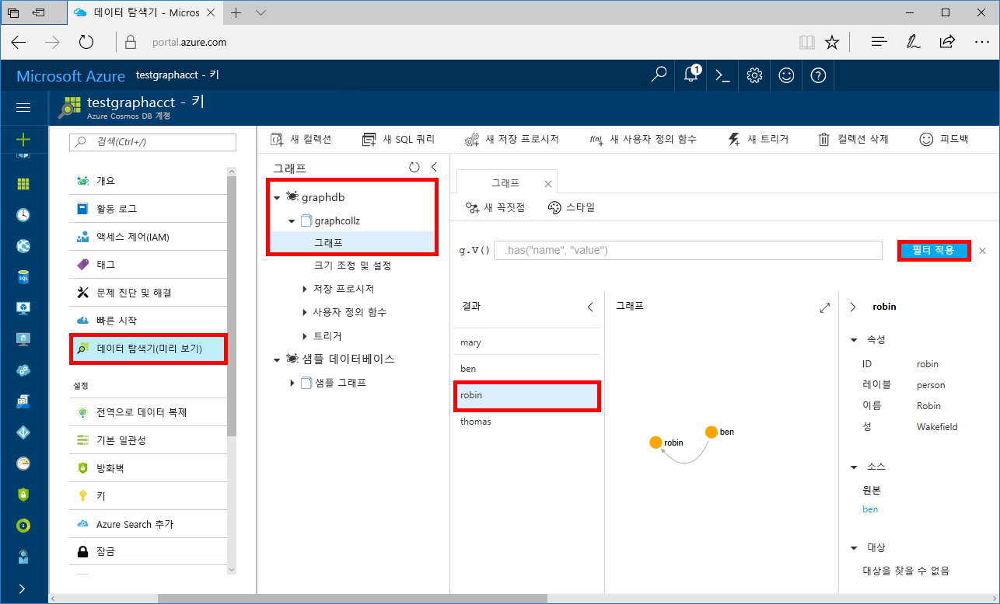

# <a name="azure-cosmos-db-build-a-net-framework-or-core-application-using-the-graph-api"></a>Azure Cosmos DB: Graph API를 사용한 .NET Framework 또는 Core 응용 프로그램 빌드

Azure Cosmos DB는 전 세계에 배포된 Microsoft의 다중 모델 데이터베이스 서비스입니다. Azure Cosmos DB의 핵심인 전역 배포 및 수평적 크기 조정 기능의 이점을 활용하여 문서, 키/값 및 그래프 데이터베이스를 빠르게 만들고 쿼리할 수 있습니다. 

이 빠른 시작에서는 Azure Portal을 사용하여 Azure Cosmos DB [Graph API](graph-introduction.md) 계정, 데이터베이스 및 그래프(컨테이너)를 만드는 방법을 보여 줍니다. 그런 후 오픈 소스 드라이버 [Gremlin.Net](http://tinkerpop.apache.org/docs/3.2.7/reference/#gremlin-DotNet)을 사용하여 콘솔 앱을 빌드하고 실행합니다.  

## <a name="prerequisites"></a>필수 조건

Visual Studio 2017이 아직 설치되지 않은 경우 **체험판** [Visual Studio 2017 Community Edition](https://www.visualstudio.com/downloads/)을 다운로드하고 사용할 수 있습니다. Visual Studio를 설치하는 동안 **Azure 개발**을 사용하도록 설정합니다.

Visual Studio 2017이 이미 설치되어 있는 경우 [Visual Studio 2017 업데이트 3](https://www.visualstudio.com/en-us/news/releasenotes/vs2017-relnotes)까지 설치되었는지 확인합니다.

[!INCLUDE [quickstarts-free-trial-note](../../includes/quickstarts-free-trial-note.md)]

## <a name="create-a-database-account"></a>데이터베이스 계정 만들기

[!INCLUDE [cosmos-db-create-dbaccount-graph](../../includes/cosmos-db-create-dbaccount-graph.md)]

## <a name="add-a-graph"></a>그래프 추가

[!INCLUDE [cosmos-db-create-graph](../../includes/cosmos-db-create-graph.md)]

## <a name="clone-the-sample-application"></a>샘플 응용 프로그램 복제

이제 GitHub에서 Graph API 앱을 복제하고 연결 문자열을 설정한 다음 실행해 보겠습니다. 프로그래밍 방식으로 데이터를 사용하여 얼마나 쉽게 작업할 수 있는지 알게 될 것입니다. 

1. 명령 프롬프트를 git-samples라는 새 폴더를 만든 다음 명령 프롬프트를 닫습니다.

    ```bash
    md "C:\git-samples"
    ```

2. Git Bash와 같은 Git 터미널 창을 열고, `cd` 명령을 사용하여 샘플 앱을 설치할 새 폴더로 변경합니다.

    ```bash
    cd "C:\git-samples"
    ```

3. 다음 명령을 실행하여 샘플 리포지토리를 복제합니다. 이 명령은 컴퓨터에서 샘플 앱의 복사본을 만듭니다.

    ```bash
    git clone https://github.com/Azure-Samples/azure-cosmos-db-graph-gremlindotnet-getting-started.git
    ```

4. 그런 다음 Visual Studio를 열고 솔루션 파일을 엽니다.

5. 프로젝트에서 NuGet 패키지를 복원합니다. Gremlin.Net 드라이버와 Newtonsoft.Json 패키지가 포함되어야 합니다.


6. Nuget 패키지 관리자 또는 [nuget 명령줄 유틸리티](https://docs.microsoft.com/en-us/nuget/install-nuget-client-tools)를 사용하여 Gremlin.Net 드라이버를 수동으로 설치할 수도 있습니다. 

    ```bash
    nuget install Gremlin.Net
    ```

## <a name="review-the-code"></a>코드 검토

이 단계는 옵션입니다. 데이터베이스 리소스를 코드로 만드는 방법을 알아보려는 경우 다음 코드 조각을 검토할 수 있습니다. 그렇지 않으면 [연결 문자열 업데이트](#update-your-connection-string)로 건너뛸 수 있습니다. 

다음 코드 조각은 모두 Program.cs 파일에서 가져옵니다.

* 위에서 만든 계정을 기반으로 연결 매개 변수를 설정합니다(줄 19). 

    ```csharp
    private static string hostname = "your-endpoint.gremlin.cosmosdb.azure.com";
    private static int port = 443;
    private static string authKey = "your-authentication-key";
    private static string database = "your-database";
    private static string collection = "your-collection-or-graph";
    ```

* 실행할 Gremlin 명령은 사전에 나열됩니다(줄 26).

    ```csharp
    private static Dictionary<string, string> gremlinQueries = new Dictionary<string, string>
    {
        { "Cleanup",        "g.V().drop()" },
        { "AddVertex 1",    "g.addV('person').property('id', 'thomas').property('firstName', 'Thomas').property('age', 44)" },
        { "AddVertex 2",    "g.addV('person').property('id', 'mary').property('firstName', 'Mary').property('lastName', 'Andersen').property('age', 39)" },
        { "AddVertex 3",    "g.addV('person').property('id', 'ben').property('firstName', 'Ben').property('lastName', 'Miller')" },
        { "AddVertex 4",    "g.addV('person').property('id', 'robin').property('firstName', 'Robin').property('lastName', 'Wakefield')" },
        { "AddEdge 1",      "g.V('thomas').addE('knows').to(g.V('mary'))" },
        { "AddEdge 2",      "g.V('thomas').addE('knows').to(g.V('ben'))" },
        { "AddEdge 3",      "g.V('ben').addE('knows').to(g.V('robin'))" },
        { "UpdateVertex",   "g.V('thomas').property('age', 44)" },
        { "CountVertices",  "g.V().count()" },
        { "Filter Range",   "g.V().hasLabel('person').has('age', gt(40))" },
        { "Project",        "g.V().hasLabel('person').values('firstName')" },
        { "Sort",           "g.V().hasLabel('person').order().by('firstName', decr)" },
        { "Traverse",       "g.V('thomas').out('knows').hasLabel('person')" },
        { "Traverse 2x",    "g.V('thomas').out('knows').hasLabel('person').out('knows').hasLabel('person')" },
        { "Loop",           "g.V('thomas').repeat(out()).until(has('id', 'robin')).path()" },
        { "DropEdge",       "g.V('thomas').outE('knows').where(inV().has('id', 'mary')).drop()" },
        { "CountEdges",     "g.E().count()" },
        { "DropVertex",     "g.V('thomas').drop()" },
    };
    ```


* 위에서 제공된 매개 변수를 사용하여 `GremlinServer` 연결 개체를 만듭니다(줄 52).

    ```csharp
    var gremlinServer = new GremlinServer(hostname, port, enableSsl: true, 
                                                    username: "/dbs/" + database + "/colls/" + collection, 
                                                    password: authKey);
    ```

* 새 `GremlinClient` 개체를 만듭니다(줄 56).

    ```csharp
    var gremlinClient = new GremlinClient(gremlinServer);
    ```

* 비동기 작업에 `GremlinClient` 개체를 사용하여 각 Gremlin 쿼리를 실행합니다(줄 63). 이렇게 하면 위에서 정의된 사전에서 Gremlin 쿼리를 읽습니다(줄 26).

    ```csharp
    var task = gremlinClient.SubmitAsync<dynamic>(query.Value);
    task.Wait();
    ```

* Newtonsoft.Json에서 `JsonSerializer` 클래스를 사용하여 결과를 검색하고 값을 읽습니다. 값은 그 형식이 사전으로 지정됩니다.

    ```csharp
    foreach (var result in task.Result)
    {
        // The vertex results are formed as dictionaries with a nested dictionary for their properties
        string output = JsonConvert.SerializeObject(result);
        Console.WriteLine(String.Format("\tResult:\n\t{0}", output));
    }
    ```

## <a name="update-your-connection-string"></a>연결 문자열 업데이트

이제 Azure Portal로 다시 이동하여 연결 문자열 정보를 가져와서 앱에 복사합니다.

1. [Azure Portal](http://portal.azure.com/)에서 **키**를 클릭합니다. 

    URI 값의 첫 번째 부분을 복사합니다.

    

2. Program.cs에서 줄 19에 있는 `hostname` 변수의 `your-endpoint` 자리에 값을 붙여넣습니다. 

    `"private static string hostname = "your-endpoint.gremlin.cosmosdb.azure.com";`

    엔드포인트 값은 이제 다음과 같이 표시됩니다.

    `"private static string hostname = "testgraphacct.gremlin.cosmosdb.azure.com";`

3. 포털에서 **기본 키** 값을 복사하여 `authkey` 변수 자리에 붙여넣고, 줄 21의 `"your-authentication-key"` 자리 표시자를 바꿉니다. 

    `private static string authKey = "your-authentication-key";`

4. 위에서 만든 데이터베이스 정보를 사용하여 줄 22의 `database` 변수 안에 데이터베이스 이름을 붙여넣습니다. 

    `private static string database = "your-database";`

5. 마찬가지로, 위에서 만든 컬렉션 정보를 사용하여 줄 23의 `collection` 변수 안에 컬렉션(그래프 이름이기도 함)을 붙여넣습니다. 

    `private static string collection = "your-collection-or-graph";`

6. Program.cs 파일을 저장합니다. 

이제 Azure Cosmos DB와 통신하는 데 필요한 모든 정보로 앱이 업데이트되었습니다. 

## <a name="run-the-console-app"></a>콘솔 앱 실행

Ctrl+F5를 눌러 응용 프로그램을 실행합니다. 응용 프로그램이 Gremlin 쿼리 명령과 콘솔의 결과를 모두 인쇄합니다.

   그래프에 추가된 꼭짓점 및 에지가 콘솔 창에 표시됩니다. 스크립트가 완료되면 ENTER 키를 눌러 콘솔 창을 닫습니다.

## <a name="browse-using-the-data-explorer"></a>데이터 탐색기를 사용하여 찾아보기

이제 Azure Portal에서 데이터 탐색기로 돌아가고 새 그래프 데이터를 찾아 쿼리합니다.

1. [데이터 탐색기]에서 새 데이터베이스가 그래프 창에 표시됩니다. 데이터베이스 및 컬렉션 노드를 확장한 다음, **그래프**를 클릭합니다.

2. **필터 적용** 단추를 클릭하고 기본 쿼리를 사용하여 그래프의 모든 꼭짓점을 봅니다. 샘플 앱에 의해 생성된 데이터는 그래프 창에 표시됩니다.

    그래프를 확대/축소하고, 그래프 표시 공간을 확장하고, 꼭짓점을 추가하고, 표시 표면에서 꼭짓점을 이동할 수 있습니다.

    

## <a name="review-slas-in-the-azure-portal"></a>Azure Portal에서 SLA 검토

[!INCLUDE [cosmosdb-tutorial-review-slas](../../includes/cosmos-db-tutorial-review-slas.md)]

## <a name="clean-up-resources"></a>리소스 정리

[!INCLUDE [cosmosdb-delete-resource-group](../../includes/cosmos-db-delete-resource-group.md)]

## <a name="next-steps"></a>다음 단계

이 빠른 시작에서, Azure Cosmos DB 계정을 만들고, 데이터 탐색기를 사용하여 그래프를 만들고, 앱을 실행하는 방법을 알아보았습니다. 이제 Gremlin을 사용하여 더 복잡한 쿼리를 작성하고 강력한 그래프 순회 논리를 구현할 수 있습니다. 

> [!div class="nextstepaction"]
> [Gremlin을 사용하여 쿼리](tutorial-query-graph.md)

