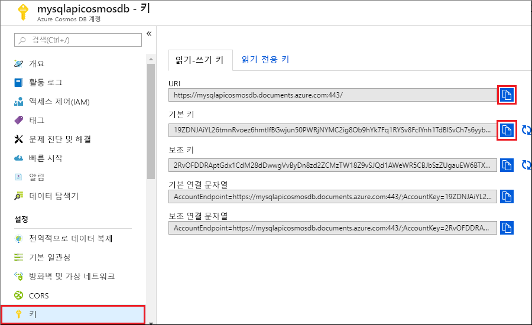

# <a name="quickstart-build-a-net-web-app-with-azure-cosmos-db-using-the-sql-api-and-the-azure-portal"></a>빠른 시작: SQL API 및 Azure Portal을 사용하여 Azure Cosmos DB가 있는 .NET 웹앱 빌드

Azure Cosmos DB는 전 세계에 배포된 Microsoft의 다중 모델 데이터베이스 서비스입니다. Azure Cosmos DB의 핵심인 전역 배포 및 수평적 크기 조정 기능의 이점을 활용하여 문서, 키/값 및 그래프 데이터베이스를 빠르게 만들고 쿼리할 수 있습니다. 

이 빠른 시작에서는 Azure Portal을 사용하여 Azure Cosmos DB [SQL API](sql-api-introduction.md) 계정, 문서 데이터베이스 및 컬렉션을 만드는 방법을 보여 줍니다. 그런 다음 아래 스크린샷과 같이 [SQL .NET API](sql-api-sdk-dotnet.md)에 작성된 할 일 목록 웹앱을 빌드하고 배포합니다. 


## <a name="prerequisites"></a>필수 구성 요소

Visual Studio 2017이 아직 설치되지 않은 경우 **체험판** [Visual Studio 2017 Community Edition](https://www.visualstudio.com/downloads/)을 다운로드하고 사용할 수 있습니다. Visual Studio를 설치하는 동안 **Azure 개발**을 사용하도록 설정합니다.

[!INCLUDE [quickstarts-free-trial-note](../../includes/quickstarts-free-trial-note.md)] 
[!INCLUDE [cosmos-db-emulator-docdb-api](../../includes/cosmos-db-emulator-docdb-api.md)]  

<a id="create-account"></a>
## <a name="create-a-database-account"></a>데이터베이스 계정 만들기

[!INCLUDE [cosmos-db-create-dbaccount](../../includes/cosmos-db-create-dbaccount.md)]

<a id="create-collection"></a>
## <a name="add-a-collection"></a>컬렉션 추가

[!INCLUDE [cosmos-db-create-collection](../../includes/cosmos-db-create-collection.md)]

<a id="add-sample-data"></a>
## <a name="add-sample-data"></a>샘플 데이터 추가

[!INCLUDE [cosmos-db-create-sql-api-add-sample-data](../../includes/cosmos-db-create-sql-api-add-sample-data.md)]

## <a name="query-your-data"></a>데이터 쿼리

[!INCLUDE [cosmos-db-create-sql-api-query-data](../../includes/cosmos-db-create-sql-api-query-data.md)]

## <a name="clone-the-sample-application"></a>샘플 응용 프로그램 복제

이제 코드 사용으로 전환해 보겠습니다. [GitHub에서 SQL API 앱](https://github.com/Azure-Samples/documentdb-dotnet-todo-app)을 복제하고 연결 문자열을 설정하고 실행해보겠습니다. 프로그래밍 방식으로 데이터를 사용하여 얼마나 쉽게 작업할 수 있는지 알게 될 것입니다. 

1. 명령 프롬프트를 git-samples라는 새 폴더를 만든 다음 명령 프롬프트를 닫습니다.

    ```bash
    md "C:\git-samples"
    ```

2. Git Bash와 같은 Git 터미널 창을 열고, `cd` 명령을 사용하여 샘플 앱을 설치할 새 폴더로 변경합니다.

    ```bash
    cd "C:\git-samples"
    ```

3. 다음 명령을 실행하여 샘플 리포지토리를 복제합니다. 이 명령은 컴퓨터에서 샘플 앱의 복사본을 만듭니다.

    ```bash
    git clone https://github.com/Azure-Samples/documentdb-dotnet-todo-app.git
    ```

4. 그런 다음 Visual Studio에서 todo 솔루션 파일을 엽니다. 

## <a name="review-the-code"></a>코드 검토

이 단계는 옵션입니다. 데이터베이스 리소스를 코드로 만드는 방법을 알아보려는 경우 다음 코드 조각을 검토할 수 있습니다. 그렇지 않으면 [연결 문자열 업데이트](#update-your-connection-string)로 건너뛸 수 있습니다. 

다음 코드 조각은 모두 DocumentDBRepository.cs 파일에서 가져옵니다.

* 76번 줄에서 DocumentClient가 초기화됩니다.

    ```csharp
    client = new DocumentClient(new Uri(ConfigurationManager.AppSettings["endpoint"]), ConfigurationManager.AppSettings["authKey"]);
    ```

* 91번 줄에서 새 데이터베이스가 만들어집니다.

    ```csharp
    await client.CreateDatabaseAsync(new Database { Id = DatabaseId });
    ```

* 110번 줄에서 새 컬렉션이 만들어집니다.

    ```csharp
    await client.CreateDocumentCollectionAsync(
        UriFactory.CreateDatabaseUri(DatabaseId),
        new DocumentCollection
            {
               Id = CollectionId
            },
        new RequestOptions { OfferThroughput = 400 });
    ```

## <a name="update-your-connection-string"></a>연결 문자열 업데이트

이제 Azure Portal로 다시 이동하여 연결 문자열 정보를 가져와서 앱에 복사합니다.

1. [Azure Portal](http://portal.azure.com/)의 Azure Cosmos DB 계정에서 왼쪽 탐색 영역의 **키**를 클릭한 다음 **읽기-쓰기 키**를 클릭합니다. 다음 단계에서 화면 오른쪽의 복사 단추를 사용하여 URI 및 기본 키를 web.config 파일에 복사하게 됩니다.

    

2. Visual Studio 2017에서 web.config 파일을 엽니다. 

3. 포털에서 URI 값을 복사(복사 단추 사용)한 후 이 값을 web.config에서 끝점 키 값으로 만듭니다. 

    `<add key="endpoint" value="FILLME" />`

4. 그 다음, 포털에서 사용자의 기본 키 값을 복사한 후 web.config에서 authKey 값으로 만듭니다. 이제 Azure Cosmos DB와 통신하는 데 필요한 모든 정보로 앱이 업데이트되었습니다. 

    `<add key="authKey" value="FILLME" />`
    
## <a name="run-the-web-app"></a>웹앱 실행
1. Visual Studio의 **솔루션 탐색기**에서 프로젝트를 마우스 오른쪽 단추로 클릭한 후 **NuGet 패키지 관리**를 클릭합니다. 

2. NuGet **찾아보기** 상자에 *DocumentDB*를 입력합니다.

3. 결과에서 **Microsoft.Azure.DocumentDB** 라이브러리를 설치합니다. 그러면 Microsoft.Azure.DocumentDB 패키지 뿐만 아니라 모든 종속성도 설치됩니다.

4. Ctrl+F5를 눌러 응용 프로그램을 실행합니다. 앱이 브라우저에 표시됩니다. 

5. 브라우저에서 **새로 만들기**를 클릭하고 Todo 앱에서 몇 가지 새 작업을 만듭니다.

   

이제 데이터 탐색기로 돌아가서 이 새 데이터를 쿼리 및 수정하고 작업에 사용할 수 있습니다. 

## <a name="review-slas-in-the-azure-portal"></a>Azure Portal에서 SLA 검토

[!INCLUDE [cosmosdb-tutorial-review-slas](../../includes/cosmos-db-tutorial-review-slas.md)]

## <a name="clean-up-resources"></a>리소스 정리

[!INCLUDE [cosmosdb-delete-resource-group](../../includes/cosmos-db-delete-resource-group.md)]

## <a name="next-steps"></a>다음 단계

이 빠른 시작에서, Azure Cosmos DB 계정을 만들고, 데이터 탐색기를 사용하여 컬렉션을 만들고, 웹앱을 실행하는 방법을 알아보았습니다. 이제 사용자의 Cosmos DB 계정에 추가 데이터를 가져올 수 있습니다. 

> [!div class="nextstepaction"]
> [Azure Cosmos DB로 데이터 가져오기](import-data.md)


