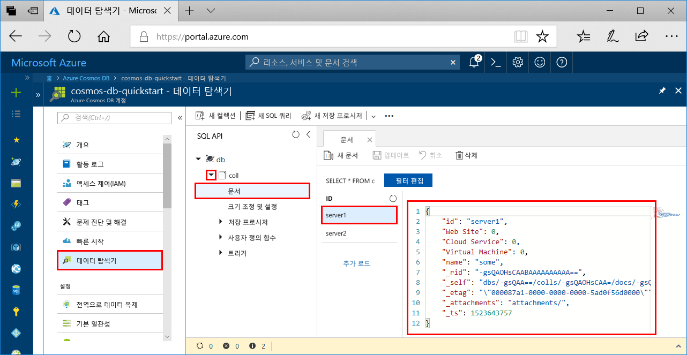

# <a name="azure-cosmos-db-build-a-python-application-using-azure-cosmos-db-sql-api-account"></a>Azure Cosmos DB는 Azure Cosmos DB SQL API 계정을 사용하여 Python 애플리케이션 빌드

> [!div class="op_single_selector"]
> * [.NET](create-sql-api-dotnet.md)
> * [Java](create-sql-api-java.md)
> * [Node.JS](create-sql-api-nodejs.md)
> * [Python](create-sql-api-python.md)
> * [Xamarin](create-sql-api-xamarin-dotnet.md)
>  

Azure Cosmos DB는 전 세계에 배포된 Microsoft의 다중 모델 데이터베이스 서비스입니다. 문서, 키/값, 넓은 열 및 그래프 데이터베이스를 신속하게 만들고 쿼리할 수 있습니다. 이러한 모든 작업은 Azure Cosmos DB의 분포와 규모의 이점을 활용합니다.

이 빠른 시작에서는 Azure Portal을 사용하여 Azure Cosmos DB [SQL API](sql-api-introduction.md) 계정, 문서 데이터베이스 및 컨테이너를 만드는 방법을 보여줍니다. 그런 다음, [SQL API](sql-api-sdk-python.md)용 Python SDK를 사용하여 빌드된 콘솔 앱을 빌드하고 실행합니다. 이 빠른 시작에서는 [Python SDK](https://pypi.org/project/azure-cosmos) 3.0 버전을 사용합니다.

[!INCLUDE [quickstarts-free-trial-note](../../includes/quickstarts-free-trial-note.md)] [!INCLUDE [cosmos-db-emulator-docdb-api](../../includes/cosmos-db-emulator-docdb-api.md)]

## <a name="prerequisites"></a>필수 조건

* `PATH` 사용 가능한 `python` 실행 파일을 사용하는 [Python 3.6](https://www.python.org/downloads/)
* [Visual Studio Code](https://code.visualstudio.com/)
* [Visual Studio Code용 Python 확장](https://marketplace.visualstudio.com/items?itemName=ms-python.python#overview)

## <a name="create-a-database-account"></a>데이터베이스 계정 만들기

[!INCLUDE [cosmos-db-create-dbaccount](../../includes/cosmos-db-create-dbaccount.md)]

## <a name="add-a-container"></a>컨테이너 추가

[!INCLUDE [cosmos-db-create-collection](../../includes/cosmos-db-create-collection.md)]

## <a name="add-sample-data"></a>샘플 데이터 추가

[!INCLUDE [cosmos-db-create-sql-api-add-sample-data](../../includes/cosmos-db-create-sql-api-add-sample-data.md)]

## <a name="query-your-data"></a>데이터 쿼리

[!INCLUDE [cosmos-db-create-sql-api-query-data](../../includes/cosmos-db-create-sql-api-query-data.md)]

## <a name="clone-the-sample-application"></a>샘플 응용 프로그램 복제

이제 GitHub에서 SQL API 앱을 복제하고, 연결 문자열을 설정하고, 실행해보겠습니다.

1. 명령 프롬프트를 열고, git-samples라는 새 폴더를 만든 다음 명령 프롬프트를 닫습니다.

    ```cmd
    md "git-samples"
    ```
   bash 프롬프트를 사용하는 경우에는 다음 명령을 대신 사용해야 합니다.

   ```bash
   mkdir "git-samples"
   ```

2. Git Bash와 같은 Git 터미널 창을 열고, `cd` 명령을 사용하여 샘플 앱을 설치할 새 폴더로 변경합니다.

    ```bash
    cd "git-samples"
    ```

3. 다음 명령을 실행하여 샘플 리포지토리를 복제합니다. 이 명령은 컴퓨터에서 샘플 앱의 복사본을 만듭니다. 

    ```bash
    git clone https://github.com/Azure-Samples/azure-cosmos-db-python-getting-started.git
    ```  

## <a name="update-your-connection-string"></a>연결 문자열 업데이트

이제 Azure Portal로 다시 이동하여 연결 문자열 정보를 가져와서 앱에 복사합니다.

1. [Azure Portal](https://portal.azure.com/)의 Azure Cosmos 계정에서 왼쪽 탐색 영역에 있는 **키**를 클릭합니다. 다음 단계에서 화면 오른쪽의 복사 단추를 사용하여 **URI** 및 **기본 키**를 `CosmosGetStarted.py` 파일에 복사하게 됩니다.

    

2. Visual Studio Code의 \git-samples\azure-cosmos-db-python-getting-started에서 `CosmosGetStarted.py` 파일을 엽니다.

3. 복사 단추를 사용하여 포털에서 **URI** 값을 복사하고, 이 값을 ``CosmosGetStarted.py``의 **엔드포인트** 키 값으로 만듭니다. 

    `'ENDPOINT': 'https://FILLME.documents.azure.com',`

4. 그런 다음, 포털에서 **기본 키** 값을 복사하고 이 값을 ``CosmosGetStarted.py``의 **config.PRIMARYKEY** 값으로 만듭니다. 이제 Azure Cosmos DB와 통신하는 데 필요한 모든 정보로 앱이 업데이트되었습니다. 

    `'PRIMARYKEY': 'FILLME',`

5. ``CosmosGetStarted.py`` 파일을 저장합니다.

## <a name="review-the-code"></a>코드 검토

이 단계는 선택 사항입니다. 코드에서 만든 데이터베이스 리소스에 대해 알아보거나 [연결 문자열 업데이트](#update-your-connection-string)로 건너뜁니다.

이전 버전의 Python SDK에 익숙한 경우 "컬렉션" 및 "문서"라는 용어를 자주 들어 보셨을 것입니다. Azure Cosmos DB가 여러 API 모델을 지원하므로 Python SDK 버전 3.0 이상에서는 컬렉션, 그래프 또는 테이블을 가리키는 일반적인 용어인 "컨테이너"와 컨테이너의 콘텐츠를 설명하는 "항목"이라는 용어를 사용합니다.

다음 코드 조각은 모두 `CosmosGetStarted.py` 파일에서 가져옵니다.

* CosmosClient가 초기화됩니다. [연결 문자열 업데이트](#update-your-connection-string) 섹션에 설명된 대로 "엔드포인트" 및 "마스터 키"를 업데이트해야 합니다. 

    ```python
    # Initialize the Cosmos client
    client = cosmos_client.CosmosClient(url_connection=config['ENDPOINT'], auth={'masterKey': config['MASTERKEY']})
    ```

* 새 데이터베이스가 만들어집니다.

    ```python
    # Create a database
    db = client.CreateDatabase({ 'id': config['DATABASE'] })
    ```

* 새 컬렉션이 만들어집니다.

    ```python
    # Create collection options
    options = {
        'offerThroughput': 400
    }

    # Create a container
    container = client.CreateContainer(db['_self'], container_definition, options)
    ```

* 일부 항목은 컨테이너에 추가됩니다.

    ```python
    # Create and add some items to the container
    item1 = client.CreateItem(container['_self'], {
        'serverId': 'server1',
        'Web Site': 0,
        'Cloud Service': 0,
        'Virtual Machine': 0,
        'message': 'Hello World from Server 1!'
        }
    )

    item2 = client.CreateItem(container['_self'], {
        'serverId': 'server2',
        'Web Site': 1,
        'Cloud Service': 0,
        'Virtual Machine': 0,
        'message': 'Hello World from Server 2!'
        }
    )
    ```

* SQL을 사용하여 쿼리가 수행됩니다.

    ```python
    query = {'query': 'SELECT * FROM server s'}

    options = {}
    options['enableCrossPartitionQuery'] = True
    options['maxItemCount'] = 2

    result_iterable = client.QueryItems(container['_self'], query, options)
    for item in iter(result_iterable):
        print(item['message'])
    ```
   
## <a name="run-the-app"></a>앱 실행

1. Visual Studio Code에서 **보기**>**명령 팔레트**를 선택합니다. 

2. 프롬프트에서 **Python: Select Interpreter**를 입력한 다음, 사용할 Python 버전을 선택합니다.

    선택한 인터프리터를 나타내도록 Visual Studio Code의 바닥글이 업데이트됩니다. 

3. **보기** > **통합 터미널**을 선택하여 Visual Studio Code 통합 터미널을 엽니다.

4. 통합 터미널 창에서, azure-cosmos-db-python-getting-started 폴더를 실행 중인지 확인합니다. 이 폴더에 있지 않으면 다음 명령을 실행하여 샘플 폴더로 전환합니다. 

    ```cmd
    cd "\git-samples\azure-cosmos-db-python-getting-started"`
    ```

5. 다음 명령을 실행하여 azure-cosmos 패키지를 설치합니다. 

    ```python
    pip3 install azure-cosmos
    ```

    azure-cosmos를 설치하려고 하면 액세스 거부 오류가 발생하는 경우 [관리자 권한으로 VS Code를 실행](https://stackoverflow.com/questions/37700536/visual-studio-code-terminal-how-to-run-a-command-with-administrator-rights)해야 합니다.

6. 다음 명령을 실행하여 샘플을 실행하고 새 문서를 만들어 Azure Cosmos dB에 저장합니다.

    ```python
    python CosmosGetStarted.py
    ```

7. 새 항목이 생성되고 저장되었는지 확인하려면 Azure Portal에서 **데이터 탐색기**를 선택하고, **coll**을 확장하고, **문서**를 확장한 다음, **server1** 문서를 선택합니다. server1 문서의 콘텐츠는 통합 터미널 창에서 반환된 콘텐츠와 일치합니다. 

    

## <a name="review-slas-in-the-azure-portal"></a>Azure Portal에서 SLA 검토

[!INCLUDE [cosmosdb-tutorial-review-slas](../../includes/cosmos-db-tutorial-review-slas.md)]

## <a name="clean-up-resources"></a>리소스 정리

[!INCLUDE [cosmosdb-delete-resource-group](../../includes/cosmos-db-delete-resource-group.md)]

## <a name="next-steps"></a>다음 단계

이 빠른 시작에서는 Azure Cosmos 계정을 만들고, Data Explorer를 사용하여 컨테이너를 만들고, 앱을 실행하는 방법을 알아보았습니다. 이제 사용자의 Cosmos DB 계정에 추가 데이터를 가져올 수 있습니다. 

> [!div class="nextstepaction"]
> [SQL API에 대한 Azure Cosmos DB로 데이터 가져오기](import-data.md)


