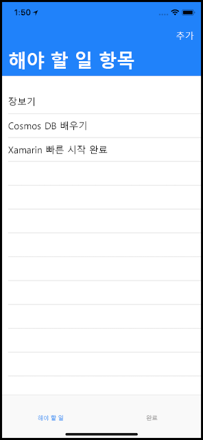
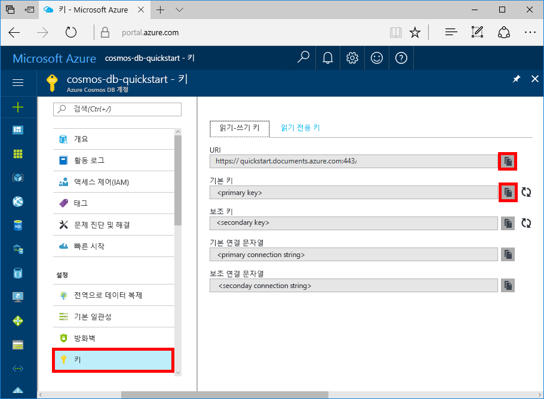
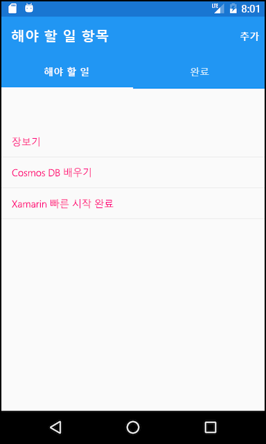
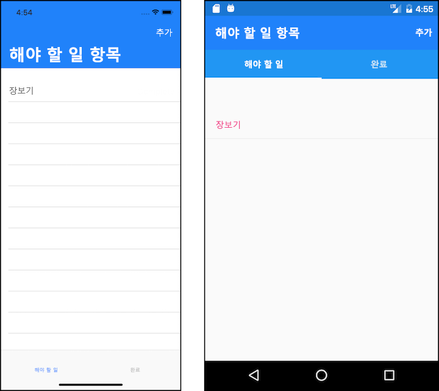
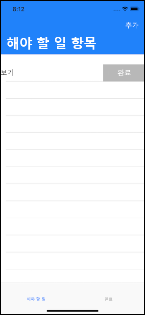
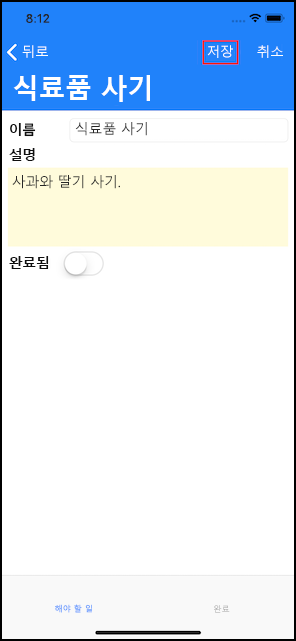
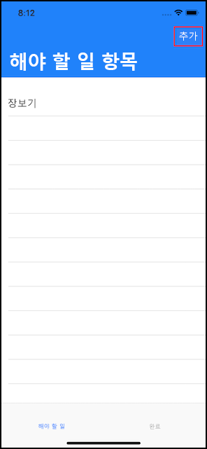

# <a name="azure-cosmos-db-build-a-todo-app-with-xamarin"></a>Azure Cosmos DB는 Xamarin을 사용하여 todo 앱 빌드

> [!div class="op_single_selector"]
> * [.NET](create-sql-api-dotnet.md)
> * [.NET(미리 보기)](create-sql-api-dotnet-preview.md)
> * [Java](create-sql-api-java.md)
> * [Node.JS](create-sql-api-nodejs.md)
> * [Python](create-sql-api-python.md)
> * [Xamarin](create-sql-api-xamarin-dotnet.md)
>  

Azure Cosmos DB는 전 세계에 배포된 Microsoft의 다중 모델 데이터베이스 서비스입니다. Azure Cosmos DB의 핵심인 전역 배포 및 수평적 크기 조정 기능의 이점을 활용하여 문서, 키/값 및 그래프 데이터베이스를 빠르게 만들고 쿼리할 수 있습니다.

> [!NOTE]
> CosmosDB를 포함하여 여러 Azure 제품을 보여주는 전체 정식 샘플 Xamarin 앱에 대한 샘플 코드를 [여기](https://github.com/xamarinhq/app-geocontacts) GitHub에서 확인할 수 있습니다. 이 앱은 지리적으로 분산된 연락처 보기 및 연락처의 위치를 업데이트할 수 있는 방법을 보여줍니다.

이 빠른 시작에서는 Azure Portal을 사용하여 Azure Cosmos DB SQL API 계정, 문서 데이터베이스 및 컬렉션을 만드는 방법을 보여줍니다. 그런 다음, [Xamarin.Forms](https://docs.microsoft.com/xamarin/#pivot=platforms&panel=XamarinForms) 및 [MVVM 아키텍처 패턴](https://docs.microsoft.com/xamarin/xamarin-forms/xaml/xaml-basics/data-bindings-to-mvvm)을 활용하여 [SQL.NET API](sql-api-sdk-dotnet.md) 및 [Xamarin](https://docs.microsoft.com/xamarin/#pivot=platforms&panel=Cross-Platform)을 기반으로 하는 할 일 목록 웹앱을 빌드하고 배포합니다.



## <a name="prerequisites"></a>필수 조건

Windows에서 개발하는 중이고 Visual Studio 2017이 아직 설치되지 않은 경우 **체험판** [Visual Studio 2017 Community Edition](https://www.visualstudio.com/downloads/)을 다운로드하고 사용할 수 있습니다. Visual Studio를 설치하는 동안 **Azure 개발** 및 **.NET을 사용한 모바일 개발** 워크로드를 사용하도록 설정합니다.

Mac을 사용하는 경우 **무료** [Mac용 Visual Studio](https://www.visualstudio.com/vs/mac/)를 다운로드할 수 있습니다.

[!INCLUDE [quickstarts-free-trial-note](../../includes/quickstarts-free-trial-note.md)]
[!INCLUDE [cosmos-db-emulator-docdb-api](../../includes/cosmos-db-emulator-docdb-api.md)]

## <a name="create-a-database-account"></a>데이터베이스 계정 만들기

[!INCLUDE [cosmos-db-create-dbaccount](../../includes/cosmos-db-create-dbaccount.md)]

## <a name="add-a-collection"></a>컬렉션 추가

[!INCLUDE [cosmos-db-create-collection](../../includes/cosmos-db-create-collection.md)]

## <a name="add-sample-data"></a>샘플 데이터 추가

[!INCLUDE [cosmos-db-create-sql-api-add-sample-data](../../includes/cosmos-db-create-sql-api-add-sample-data.md)]

## <a name="query-your-data"></a>데이터 쿼리

[!INCLUDE [cosmos-db-create-sql-api-query-data](../../includes/cosmos-db-create-sql-api-query-data.md)]

## <a name="clone-the-sample-application"></a>샘플 응용 프로그램 복제

이제 GitHub에서 Xamarin SQL API 앱을 복제하고, 코드를 검토하고, API 키를 가져오고, 실행하겠습니다. 프로그래밍 방식으로 데이터를 사용하여 얼마나 쉽게 작업할 수 있는지 알게 될 것입니다.

1. 명령 프롬프트를 git-samples라는 새 폴더를 만든 다음 명령 프롬프트를 닫습니다.

    ```bash
    md "C:\git-samples"
    ```

2. Git Bash와 같은 Git 터미널 창을 열고, `cd` 명령을 사용하여 샘플 앱을 설치할 새 폴더로 변경합니다.

    ```bash
    cd "C:\git-samples"
    ```

3. 다음 명령을 실행하여 샘플 리포지토리를 복제합니다. 이 명령은 컴퓨터에서 샘플 앱의 복사본을 만듭니다.

    ```bash
    git clone https://github.com/Azure-Samples/azure-cosmos-db-sql-xamarin-getting-started.git
    ```

4. 그런 다음, Visual Studio의 samples/xamarin/ToDoItems 폴더에서 ToDoItems.sln 파일을 엽니다.

## <a name="obtain-your-api-keys"></a>API 키 가져오기

Azure Portal로 다시 이동하여 API 키 정보를 가져오고 앱에 복사합니다.

1. [Azure Portal](https://portal.azure.com/)의 Azure Cosmos DB SQL API 계정에서 왼쪽 탐색 영역의 **키**를 클릭한 다음, **읽기-쓰기 키**를 클릭합니다. 다음 단계에서 화면 오른쪽의 복사 단추를 사용하여 URI 및 기본 키를 APIKeys.cs 파일에 복사하게 됩니다.

    

2. Visual Studio 2017 또는 Mac용 Visual Studio에서 azure-documentdb-dotnet/samples/xamarin/ToDoItems/ToDoItems.Core/Helpers 폴더에 있는 APIKeys.cs 파일을 엽니다.

3. 포털에서 URI 값을 복사(복사 단추 사용)하고 이 값을 APIKeys.cs의 `CosmosEndpointUrl` 변수로 만듭니다.

    `public static readonly string CosmosEndpointUrl = "{Azure Cosmos DB account URL}";`

4. 그런 다음, 포털에서 사용자의 기본 키 값을 복사하고 APIKeys.cs의 `Cosmos Auth Key` 값으로 만듭니다.

    `public static readonly string CosmosAuthKey = "{Azure Cosmos DB secret}";`

[!INCLUDE [cosmos-db-auth-key-info](../../includes/cosmos-db-auth-key-info.md)]

## <a name="review-the-code"></a>코드 검토

이 솔루션에서는 Azure Cosmos DB SQL API 및 Xamarin.Forms를 사용하여 ToDo 앱을 만드는 방법을 보여줍니다. 앱에는 아직 완료되지 않은 할 일 항목을 표시하는 목록 보기를 포함하는 첫 번째 탭 및 완료된 할 일 항목을 표시하는 두 번째 탭과 같은 두 개의 탭이 있습니다. 첫 번째 탭에서 완료되지 않은 할 일 항목을 보는 것 외에도 새로운 할 일 항목을 추가하고, 기존 할 일 목록을 편집하고, 항목을 완료되었다고 표시할 수 있습니다.



ToDoItems 솔루션의 코드에는 다음 항목이 포함됩니다.

* ToDoItems.Core: Azure Cosmos DB 내에서 todo 항목을 유지하는 Xamarin.Forms 프로젝트 및 공유 애플리케이션 로직 코드를 보유한 .NET Standard 프로젝트입니다.
* ToDoItems.Android: 이 프로젝트에는 Android 앱이 포함됩니다.
* ToDoItems.iOS: 이 프로젝트에는 iOS 앱이 포함됩니다.

이제 앱이 Azure Cosmos DB와 통신하는 방법을 간략히 검토하겠습니다.

* [Microsoft.Azure.DocumentDb.Core](https://www.nuget.org/packages/Microsoft.Azure.DocumentDB.Core/) NuGet 패키지는 모든 프로젝트에 추가되어야 합니다.
* azure-documentdb-dotnet/samples/xamarin/ToDoItems/ToDoItems.Core/Models 폴더의 `ToDoItem` 클래스는 위에서 만든 **항목** 컬렉션에 있는 문서를 모델로 합니다. 속성 이름을 지정할 때 대/소문자를 구분합니다.
* azure-documentdb-dotnet/samples/xamarin/ToDoItems/ToDoItems.Core/Services 폴더의 `CosmosDBService` 클래스는 Azure Cosmos DB에 대한 통신을 캡슐화합니다.
* `CosmosDBService` 클래스 내에 `DocumentClient` 형식 변수가 있습니다. `DocumentClient`는 Azure Cosmos DB 계정에 대한 요청을 구성하고 실행하는 데 사용되고 31줄에서 인스턴스화됩니다.

    ```csharp
    docClient = new DocumentClient(new Uri(APIKeys.CosmosEndpointUrl), APIKeys.CosmosAuthKey);
    ```

* 문서에 대한 컬렉션을 쿼리할 경우 `CosmosDBService.GetToDoItems` 함수와 같이 `DocumentClient.CreateDocumentQuery<T>` 메서드를 사용합니다.

    ```csharp
    public async static Task<List<ToDoItem>> GetToDoItems()
    {
        var todos = new List<ToDoItem>();

        var todoQuery = docClient.CreateDocumentQuery<ToDoItem>(
                                UriFactory.CreateDocumentCollectionUri(databaseName, collectionName),
                                .Where(todo => todo.Completed == false)
                                .AsDocumentQuery();

        while (todoQuery.HasMoreResults)
        {
            var queryResults = await todoQuery.ExecuteNextAsync<ToDoItem>();

            todos.AddRange(queryResults);
        }

        return todos;
    }
    ```

    `CreateDocumentQuery<T>`는 이전 섹션에서 만든 컬렉션을 가리키는 URI를 사용합니다. `Where` 절과 같은 LINQ 연산자를 지정할 수도 있습니다. 이 경우에 완료되지 않은 할 일 항목만 반환됩니다.

    `CreateDocumentQuery<T>` 함수는 동기적으로 실행되고 `IQueryable<T>`를 반환합니다. 그러나 `AsDocumentQuery` 메서드는 `IQueryable<T>`을 비동기적으로 실행될 수 있는 `IDocumentQuery<T>` 개체로 변환합니다. 따라서 모바일 애플리케이션에 대한 UI 스레드를 차단하지 않습니다.

    `IDocumentQuery<T>.ExecuteNextAsync<T>` 함수는 Azure Cosmos DB에서 결과 페이지를 검색합니다. 여기서 `HasMoreResults` 검사는 추가 결과가 반환되었는지를 확인합니다.

> [!TIP]
> Azure Cosmos DB 컬렉션 및 문서에서 작동하는 여러 함수는 URI를 컬렉션 또는 문서의 주소를 지정하는 매개 변수로 사용합니다. `URIFactory` 클래스를 사용하여 이 URI가 생성됩니다. 데이터베이스, 컬렉션 및 문서에 대한 URI는 이 클래스를 사용하여 만들 수 있습니다.

* 107줄의 `ComsmosDBService.InsertToDoItem` 함수에서는 새 문서를 삽입하는 방법을 보여줍니다.

    ```csharp
    public async static Task InsertToDoItem(ToDoItem item)
    {
        ...
        await docClient.CreateDocumentAsync(UriFactory.CreateDocumentCollectionUri(databaseName, collectionName), item);
        ...
    }
    ```

    항목을 삽입할 뿐만 아니라 문서 컬렉션 URI를 지정합니다.

* 124줄의 `CosmosDBService.UpdateToDoItem` 함수는 기존 문서를 새 항목으로 대체하는 방법을 보여줍니다.

    ```csharp
    public async static Task UpdateToDoItem(ToDoItem item)
    {
        ...
        var docUri = UriFactory.CreateDocumentUri(databaseName, collectionName, item.Id);

        await docClient.ReplaceDocumentAsync(docUri, item);
    }
    ```

    여기에서 교체할 문서를 고유하게 식별하는 데 새 URI가 필요합니다. 해당 URI는 `UriFactory.CreateDocumentUri`를 사용하여 가져오고 데이터베이스와 컬렉션 및 문서의 ID에 전달합니다.

    `DocumentClient.ReplaceDocumentAsync`는 URI로 식별된 문서를 매개 변수로 지정된 문서로 바꿉니다.

* 항목을 삭제하는 방법은 115줄의 `CosmosDBService.DeleteToDoItem` 함수를 사용하여 설명합니다.

    ```csharp
    public async static Task DeleteToDoItem(ToDoItem item)
    {
        ...
        var docUri = UriFactory.CreateDocumentUri(databaseName, collectionName, item.Id);

        await docClient.DeleteDocumentAsync(docUri);
    }
    ```

    만들고 `DocumentClient.DeleteDocumentAsync` 함수에 전달된 고유한 문서 URI를 다시 적어둡니다.

## <a name="run-the-app"></a>앱 실행

이제 Azure Cosmos DB와 통신하는 데 필요한 모든 정보로 앱이 업데이트되었습니다.

다음 단계에서는 Mac용 Visual Studio 디버거를 사용하여 앱을 실행하는 방법을 보여줍니다.

> [!NOTE]
> Android 버전 앱의 사용 방법은 정확하게 동일합니다. 모든 차이점은 다음 단계에서 호출됩니다. Windows에서 Visual Studio를 사용하여 디버그하려는 경우 할 일 설명서는 [iOS(여기)](https://docs.microsoft.com/xamarin/ios/deploy-test/debugging-in-xamarin-ios?tabs=vswin) 및 [Android(여기)](https://docs.microsoft.com/xamarin/android/deploy-test/debugging/)에서 확인할 수 있습니다.

1. 강조 표시된 첫 번째 드롭다운을 클릭하고 iOS의 경우 ToDoItems.iOS 또는 Android의 경우 ToDoItems.Android를 선택하여 대상으로 지정하려는 플랫폼을 먼저 선택합니다.

    

2. 앱을 디버깅하기 시작하려면 cmd + Enter 키를 누르거나 재생 단추를 클릭합니다.

    

3. iOS 시뮬레이터 또는 Android 에뮬레이터의 실행이 완료되면 앱은 iOS의 경우 화면 맨 아래 2개의 탭을 표시하고 Android의 경우 화면 위쪽에 2개의 탭을 표시합니다. 첫 번째 탭은 완료되지 않은 할 일 항목을 표시하고, 두 번째 탭은 완료된 할 일 항목을 표시합니다.

    

4. iOS에서 할 일 항목을 완료하려면 왼쪽으로 슬라이드하고 **완료** 단추를 누릅니다. Android에서 할 일 항목을 완료하려면 해당 항목을 길게 누흔 다음, 완료 단추를 누릅니다.

    

5. 할 일 항목을 편집하려면 항목을 누르고, 새 값을 입력할 수 있는 새 화면이 나타납니다. 저장 단추를 눌러서 Azure Cosmos DB에 변경 내용을 유지합니다.

    

6. 할 일 항목을 추가하고, 홈 화면 오른쪽 상단에서 **추가** 단추를 누르려면 새롭게 비어 있는 편집 페이지가 표시됩니다.

    

## <a name="review-slas-in-the-azure-portal"></a>Azure Portal에서 SLA 검토

[!INCLUDE [cosmosdb-tutorial-review-slas](../../includes/cosmos-db-tutorial-review-slas.md)]

## <a name="clean-up-resources"></a>리소스 정리

[!INCLUDE [cosmosdb-delete-resource-group](../../includes/cosmos-db-delete-resource-group.md)]

## <a name="next-steps"></a>다음 단계

이 빠른 시작에서, Azure Cosmos DB 계정을 만들고, 데이터 탐색기를 사용하여 컬렉션을 만들고, Xamarin 앱을 작성 및 배포하는 방법을 알아보았습니다. 이제 사용자의 Azure Cosmos DB 계정에 추가 데이터를 가져올 수 있습니다.

> [!div class="nextstepaction"]
> [Azure Cosmos DB로 데이터 가져오기](import-data.md)
