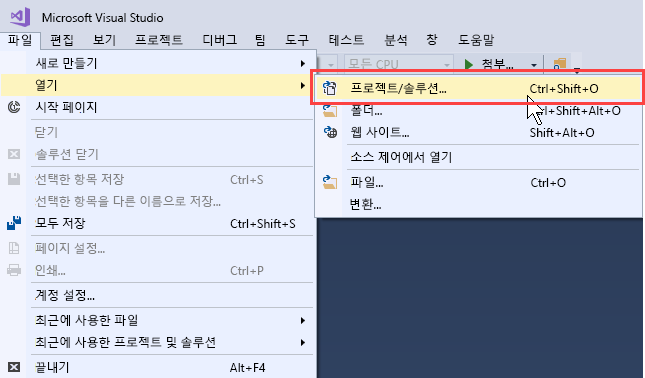
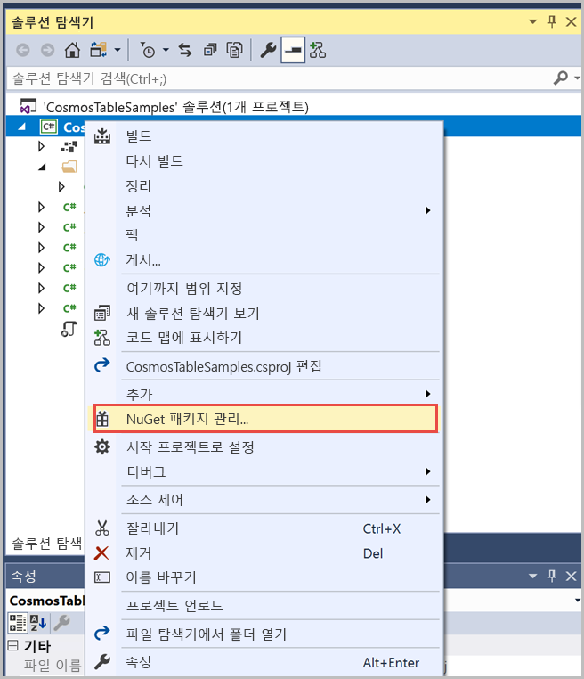
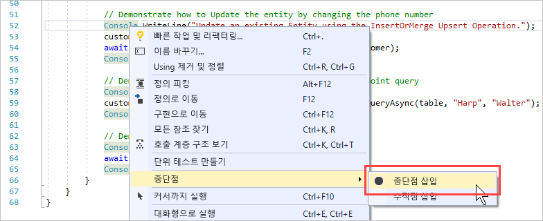
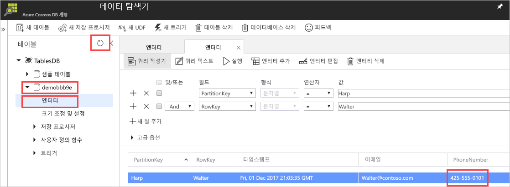

# <a name="quickstart-build-a-table-api-app-with-net-and-azure-cosmos-db"></a>빠른 시작: .NET 및 Azure Cosmos DB를 사용하여 Table API 앱 빌드 

> [!div class="op_single_selector"]
> * [.NET](create-table-dotnet.md)
> * [Java](create-table-java.md)
> * [Node.js](create-table-nodejs.md)
> * [Python](create-table-python.md)
>  

이 빠른 시작에서는 GitHub에서 예제를 복제하여 .NET과 Azure Cosmos DB [Table API](table-introduction.md)를 통해 앱을 빌드하는 방법을 보여 줍니다. 또한 Azure Cosmos DB 계정을 만드는 방법 및 데이터 탐색기를 사용하여 웹 기반 Azure Portal에 테이블과 엔터티를 만드는 방법도 보여줍니다.

Azure Cosmos DB는 전 세계에 배포된 Microsoft의 다중 모델 데이터베이스 서비스입니다. Azure Cosmos DB의 핵심인 전역 배포 및 수평적 크기 조정 기능의 이점을 활용하여 문서, 키/값 및 그래프 데이터베이스를 빠르게 만들고 쿼리할 수 있습니다. 

## <a name="prerequisites"></a>필수 조건

Visual Studio 2017이 아직 설치되지 않은 경우 **체험판** [Visual Studio 2017 Community Edition](https://www.visualstudio.com/downloads/)을 다운로드하고 사용할 수 있습니다. Visual Studio를 설치하는 동안 **Azure 개발**을 사용하도록 설정합니다.

[!INCLUDE [quickstarts-free-trial-note](../../includes/quickstarts-free-trial-note.md)]

## <a name="create-a-database-account"></a>데이터베이스 계정 만들기

> [!IMPORTANT] 
> 일반 공급 Table API SDK를 사용하려면 새 Table API 계정을 만들어야 합니다. 미리 보기 중에 만들어진 Table API 계정은 일반 공급 SDK에서 지원되지 않습니다.
>

[!INCLUDE [cosmos-db-create-dbaccount-table](../../includes/cosmos-db-create-dbaccount-table.md)]

## <a name="add-a-table"></a>테이블 추가

[!INCLUDE [cosmos-db-create-table](../../includes/cosmos-db-create-table.md)]

## <a name="add-sample-data"></a>샘플 데이터 추가

[!INCLUDE [cosmos-db-create-table-add-sample-data](../../includes/cosmos-db-create-table-add-sample-data.md)]

## <a name="clone-the-sample-application"></a>샘플 응용 프로그램 복제

이제 GitHub에서 Table 앱을 복제하고 연결 문자열을 설정한 다음 실행해 보겠습니다. 프로그래밍 방식으로 데이터를 사용하여 얼마나 쉽게 작업할 수 있는지 알게 될 것입니다. 

1. 명령 프롬프트를 git-samples라는 새 폴더를 만든 다음 명령 프롬프트를 닫습니다.

    ```bash
    md "C:\git-samples"
    ```

2. Git Bash와 같은 Git 터미널 창을 열고, `cd` 명령을 사용하여 샘플 앱을 설치할 새 폴더로 변경합니다.

    ```bash
    cd "C:\git-samples"
    ```

3. 다음 명령을 실행하여 샘플 리포지토리를 복제합니다. 이 명령은 컴퓨터에서 샘플 앱의 복사본을 만듭니다.

    ```bash
    git clone https://github.com/Azure-Samples/storage-table-dotnet-getting-started.git
    ```
## <a name="open-the-sample-application-in-visual-studio"></a>Visual Studio에서 샘플 응용 프로그램 열기

1. Visual Studio의 **파일** 메뉴에서 **열기**를 선택한 다음 **프로젝트/솔루션**을 선택합니다. 

    

2. 샘플 응용 프로그램을 복제한 폴더로 이동한 다음 TableStorage.sln 파일을 엽니다.

    

## <a name="update-your-connection-string"></a>연결 문자열 업데이트

이제 Azure Portal로 다시 이동하여 연결 문자열 정보를 가져와서 앱에 복사합니다. 이를 통해 앱이 호스팅된 데이터베이스와 통신할 수 있게 됩니다. 

1. [Azure Portal](http://portal.azure.com/)에서 **연결 문자열**을 클릭합니다. 

    창의 오른쪽에서 복사 단추를 사용하여 **기본 연결 문자열**을 복사합니다.

    

2. Visual Studio에서 App.config 파일을 엽니다. 

3. 이 자습서에서는 Azure SDK 저장소 에뮬레이터를 사용하지 않으므로, 8줄의 StorageConnectionString 주석 처리를 제거하고, 7줄의 StorageConnectionString을 주석으로 처리합니다. 이제 7줄과 8줄은 다음과 같이 표시됩니다.

    ```
    <!--key="StorageConnectionString" value="UseDevelopmentStorage=true;" />-->
    <add key="StorageConnectionString" value="DefaultEndpointsProtocol=https;AccountName=[AccountName];AccountKey=[AccountKey]" />
    ```

4. 포털의 **기본 연결 문자열** 값을 8줄의 StorageConnectionString 값에 붙여넣습니다. 따옴표 내에 문자열을 붙여넣습니다. 

    > [!IMPORTANT]
    > 엔드포인트에서 documents.azure.com을 사용하는 경우 미리 보기 계정이 있다는 의미이며, 일반 공급 Table API SDK를 사용하려면 [새 Table API 계정](#create-a-database-account)을 만들어야 합니다. 
    > 

    이제 8줄은 다음과 같이 표시됩니다.

    ```
    <add key="StorageConnectionString" value="DefaultEndpointsProtocol=https;AccountName=<account name>;AccountKey=<account-key>;TableEndpoint=https://<account name>.table.cosmosdb.azure.com;" />
    ```

5. Ctrl+S를 눌러 App.config 파일을 저장합니다.

이제 Azure Cosmos DB와 통신하는 데 필요한 모든 정보로 앱이 업데이트되었습니다. 

## <a name="build-and-deploy-the-app"></a>앱 빌드 및 배포

1. Visual Studio의 **솔루션 탐색기**에서 **TableStorage** 프로젝트를 마우스 오른쪽 단추로 클릭한 후 **NuGet 패키지 관리**를 클릭합니다. 

   
2. NuGet **찾아보기** 상자에 *Microsoft.Azure.CosmosDB.Table*을 입력합니다. 그러면 Cosmos DB Table API 클라이언트 라이브러리를 찾을 수 있습니다. 이 라이브러리는 현재 .NET 표준에만 제공되고, .NET Core에는 제공되지 않습니다.
   
   

3. **설치**를 클릭하여 **Microsoft.Azure.CosmosDB.Table** 라이브러리를 설치합니다. 그러면 Azure Cosmos DB Table API 패키지 및 모든 종속성이 설치됩니다.

    

4. BasicSamples.cs를 엽니다. 52줄을 마우스 오른쪽 단추로 클릭하고 **중단점**을 선택한 다음 **중단점 삽입**을 선택합니다. 55줄에 다른 중단점을 삽입합니다.

    

5. F5 키를 눌러 응용 프로그램을 실행합니다.

    콘솔 창에서 Azure Cosmos DB의 새 테이블 데이터베이스에 대한 이름(이 경우 demo91ab4)이 표시됩니다. 
    
    

    종속성에 대한 오류가 발생할 경우 [문제 해결](table-sdk-dotnet.md#troubleshooting)을 참조하세요.

    첫 번째 중단점에 도달하면 Azure Portal의 데이터 탐색기로 돌아갑니다. **새로 고침** 단추를 클릭하고 demo* 테이블을 펼친 다음 **엔터티**를 클릭합니다. 오른쪽의 **엔터티** 탭에서 Walter Harp에 추가된 새 엔터티가 표시됩니다. 새 엔터티에 대한 전화 번호는 425-555-0101입니다.

    
    
6. [데이터 탐색기]에서 **엔터티** 탭을 닫습니다.
    
7. F5 키를 눌러 다음 중단점까지 앱을 실행합니다. 

    중단점에 도달하면 Azure Portal로 다시 전환하고 **엔터티**를 다시 클릭하여 **엔터티** 탭을 엽니다. 전화 번호가 425-555-0105로 업데이트되었습니다.

8. F5 키를 눌러 앱을 실행합니다. 
 
   앱은 Table API에서 현재 지원하지 않는 고급 샘플 앱에 사용할 엔터티를 추가합니다. 그런 다음 샘플 앱에서 만든 테이블을 삭제합니다.

9. 콘솔 창에서 Enter 키를 눌러 앱 실행을 종료합니다. 
  

## <a name="review-slas-in-the-azure-portal"></a>Azure Portal에서 SLA 검토

[!INCLUDE [cosmosdb-tutorial-review-slas](../../includes/cosmos-db-tutorial-review-slas.md)]

## <a name="clean-up-resources"></a>리소스 정리

[!INCLUDE [cosmosdb-delete-resource-group](../../includes/cosmos-db-delete-resource-group.md)]

## <a name="next-steps"></a>다음 단계

이 빠른 시작에서, Azure Cosmos DB 계정을 만들고, 데이터 탐색기를 사용하여 테이블을 만들고, 앱을 실행하는 방법을 알아보았습니다.  이제 테이블 API를 사용하여 데이터를 쿼리할 수 있습니다.  

> [!div class="nextstepaction"]
> [Table API로 테이블 데이터 가져오기](table-import.md)

