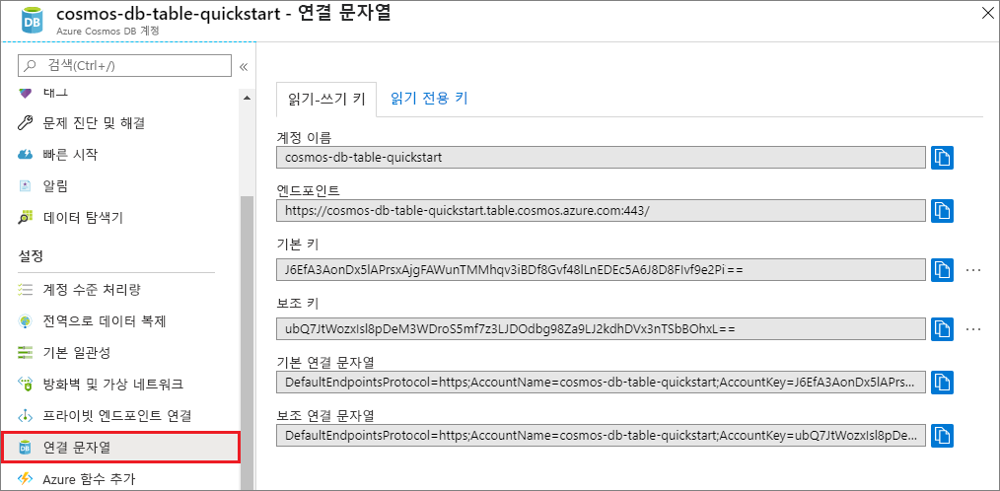

# <a name="quickstart-build-a-java-app-to-manage-azure-cosmos-db-table-api-data"></a>빠른 시작: Azure Cosmos DB Table API 데이터를 관리하는 Java 앱 빌드

> [!div class="op_single_selector"]
> * [.NET](create-table-dotnet.md)
> * [Java](create-table-java.md)
> * [Node.JS](create-table-nodejs.md)
> * [Python](create-table-python.md)
> 

이 빠른 시작은 GitHub에서 예제를 복제하여 앱을 빌드하기 위해 Java와 Azure Cosmos DB [Table API](table-introduction.md)를 사용하는 방법을 보여줍니다. Azure Cosmos DB 계정을 만드는 방법 및 데이터 탐색기를 사용하여 웹 기반 Azure Portal에 테이블과 엔터티를 만드는 방법을 알아봅니다.

Azure Cosmos DB는 전 세계에 배포된 Microsoft의 다중 모델 데이터베이스 서비스입니다. Azure Cosmos DB의 핵심인 전역 배포 및 수평적 크기 조정 기능의 이점을 활용하여 문서, 키/값 및 그래프 데이터베이스를 빠르게 만들고 쿼리할 수 있습니다. 

## <a name="prerequisites"></a>필수 조건

[!INCLUDE [quickstarts-free-trial-note](../../includes/quickstarts-free-trial-note.md)]
[!INCLUDE [cosmos-db-emulator-docdb-api](../../includes/cosmos-db-emulator-docdb-api.md)]

또한, 

* [JDK(Java Development Kit) 8](https://aka.ms/azure-jdks)
    * JAVA_HOME 환경 변수가 반드시 JDK가 설치된 폴더를 지정하도록 설정합니다.
* [Maven](https://maven.apache.org/) 이진 아카이브 [다운로드](https://maven.apache.org/download.cgi) 및 [설치](https://maven.apache.org/install.html)
    * Ubuntu에서 `apt-get install maven`을 실행하여 Maven을 실행할 수 있습니다.
* [Git](https://www.git-scm.com/)
    * Ubuntu에서 `sudo apt-get install git`를 실행하여 Git를 실행할 수 있습니다.

## <a name="create-a-database-account"></a>데이터베이스 계정 만들기

> [!IMPORTANT] 
> 일반 공급 Table API SDK를 사용하려면 새 Table API 계정을 만들어야 합니다. 미리 보기 중에 만들어진 Table API 계정은 일반 공급 SDK에서 지원되지 않습니다.
>

[!INCLUDE [cosmos-db-create-dbaccount-table](../../includes/cosmos-db-create-dbaccount-table.md)]

## <a name="add-a-table"></a>테이블 추가

[!INCLUDE [cosmos-db-create-table](../../includes/cosmos-db-create-table.md)]

## <a name="add-sample-data"></a>샘플 데이터 추가

[!INCLUDE [cosmos-db-create-table-add-sample-data](../../includes/cosmos-db-create-table-add-sample-data.md)]

## <a name="clone-the-sample-application"></a>샘플 애플리케이션 복제

이제 GitHub에서 Table 앱을 복제하고 연결 문자열을 설정한 다음 실행해 보겠습니다. 프로그래밍 방식으로 데이터를 사용하여 얼마나 쉽게 작업할 수 있는지 알게 될 것입니다. 

1. 명령 프롬프트를 git-samples라는 새 폴더를 만든 다음 명령 프롬프트를 닫습니다.

    ```bash
    md "C:\git-samples"
    ```

2. Git Bash와 같은 Git 터미널 창을 열고, `cd` 명령을 사용하여 샘플 앱을 설치할 새 폴더로 변경합니다.

    ```bash
    cd "C:\git-samples"
    ```

3. 다음 명령을 실행하여 샘플 리포지토리를 복제합니다. 이 명령은 컴퓨터에서 샘플 앱의 복사본을 만듭니다.

    ```bash
    git clone https://github.com/Azure-Samples/storage-table-java-getting-started.git 
    ```

## <a name="update-your-connection-string"></a>연결 문자열 업데이트

이제 Azure Portal로 다시 이동하여 연결 문자열 정보를 가져와서 앱에 복사합니다. 이를 통해 앱이 호스팅된 데이터베이스와 통신할 수 있게 됩니다. 

1. [Azure Portal](https://portal.azure.com/)에서 **연결 문자열**을 선택합니다. 

   

2. 오른쪽의 복사 단추를 사용하여 기본 연결 문자열을 복사합니다.

3. C:\git-samples\storage-table-java-getting-started\src\main\resources 폴더에서 config.properties를 엽니다. 

5. 첫 번째 줄을 주석으로 처리하고 두 번째 줄의 주석 처리를 제거합니다. 이제 처음 두 줄은 아래와 같은 모양입니다.

    ```xml
    #StorageConnectionString = UseDevelopmentStorage=true
    StorageConnectionString = DefaultEndpointsProtocol=https;AccountName=[ACCOUNTNAME];AccountKey=[ACCOUNTKEY]
    ```

6. 포털의 기본 연결 문자열을 2번째 줄의 StorageConnectionString 값에 붙여 넣습니다. 

    > [!IMPORTANT]
    > 엔드포인트에서 documents.azure.com을 사용하면 미리 보기 계정이 있다는 것을 의미하고 일반 공급 Table API SDK를 사용하려면 [새 Table API 계정](#create-a-database-account)을 만들어야 합니다.
    >

7. config.properties 파일을 저장합니다.

이제 Azure Cosmos DB와 통신하는 데 필요한 모든 정보로 앱이 업데이트되었습니다. 

## <a name="run-the-app"></a>앱 실행

1. git 터미널 창에서 storage-table-java-getting-started 폴더로 `cd`를 실행합니다.

    ```git
    cd "C:\git-samples\storage-table-java-getting-started"
    ```

2. git 터미널 창에서 다음 명령을 실행하여 Java 애플리케이션 시작을 실행합니다.

    ```git
    mvn compile exec:java 
    ```

    Azure Cosmos DB에서 새 테이블 데이터베이스에 추가되는 테이블 데이터가 콘솔 창에 표시됩니다.

    이제 데이터 탐색기로 돌아가서 이 새 데이터를 쿼리 및 수정하고 작업에 사용할 수 있습니다. 

## <a name="review-slas-in-the-azure-portal"></a>Azure Portal에서 SLA 검토

[!INCLUDE [cosmosdb-tutorial-review-slas](../../includes/cosmos-db-tutorial-review-slas.md)]

## <a name="clean-up-resources"></a>리소스 정리

[!INCLUDE [cosmosdb-delete-resource-group](../../includes/cosmos-db-delete-resource-group.md)]

## <a name="next-steps"></a>다음 단계

이 빠른 시작에서, Azure Cosmos DB 계정을 만들고, 데이터 탐색기를 사용하여 테이블을 만들고, 앱을 실행하는 방법을 알아보았습니다.  이제 테이블 API를 사용하여 데이터를 쿼리할 수 있습니다.  

> [!div class="nextstepaction"]
> [Table API로 테이블 데이터 가져오기](table-import.md)
