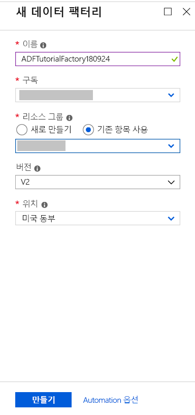

# 데이터 복사 도구를 사용하여 데이터 복사 
> [!div class="op_single_selector" title1="Select the version of Data Factory service you are using:"]
> * [버전 1 - GA](v1/data-factory-copy-data-from-azure-blob-storage-to-sql-database.md)
> * [버전 2 - 미리 보기](quickstart-create-data-factory-copy-data-tool.md)

이 빠른 시작에서는 Azure Portal을 사용하여 데이터 팩터리를 만듭니다. 그런 다음 데이터 복사 도구를 사용하여 Azure Blob Storage의 한 폴더에서 다른 폴더로 데이터를 복사하는 파이프라인을 만듭니다. 

> [!NOTE]
> Azure Data Factory를 처음 사용하는 경우 이 빠른 시작을 수행하기 전에 [Azure Data Factory 소개](data-factory-introduction.md)를 참조하세요. 
>
> 이 문서는 현재 미리 보기 상태인 Data Factory 버전 2에 적용됩니다. 일반 공급(GA)되는 Data Factory 버전 1 서비스를 사용하는 경우 [Data Factory 버전 1 시작](v1/data-factory-copy-data-from-azure-blob-storage-to-sql-database.md)을 참조하세요.

[!INCLUDE [data-factory-quickstart-prerequisites](../../includes/data-factory-quickstart-prerequisites.md)] 

## 데이터 팩터리를 만듭니다.

1. 왼쪽 메뉴에서 **새로 만들기**를 클릭하고 **데이터 + 분석**, **Data Factory**를 차례로 클릭합니다. 
   
   
2. **새 데이터 팩터리** 페이지에서 **이름**에 대해 **ADFTutorialDataFactory**를 입력합니다. 
      
     
 
   Azure Data Factory의 이름은 **전역적으로 고유**해야 합니다. 이름 필드에 대해 다음과 같은 오류가 표시되면, 데이터 팩터리의 이름(예: yournameADFTutorialDataFactory)을 변경하고 다시 만듭니다. Data Factory 아티팩트에 대한 명명 규칙은 [데이터 팩터리 - 명명 규칙](naming-rules.md) 문서를 참조하세요.
  
     
3. 데이터 팩터리를 만들려는 위치에 Azure **구독**을 선택합니다. 
4. **리소스 그룹**에 대해 다음 단계 중 하나를 수행합니다.
     
      - **기존 항목 사용**을 선택하고 드롭다운 목록에서 기존 리소스 그룹을 선택합니다. 
      - **새로 만들기**를 선택하고 리소스 그룹의 이름을 입력합니다.   
         
      리소스 그룹에 대한 자세한 내용은 [리소스 그룹을 사용하여 Azure 리소스 관리](../azure-resource-manager/resource-group-overview.md)를 참조하세요.  
4. **버전**에 **V2(미리 보기)**를 선택합니다.
5. 데이터 팩터리의 **위치** 를 선택합니다. 지원되는 위치만 드롭다운 목록에 표시됩니다. 데이터 팩터리에서 사용되는 데이터 저장소(Azure Storage, Azure SQL Database 등) 및 계산(HDInsight 등)은 다른 위치/지역에 있을 수 있습니다.
6. **대시보드에 고정**을 선택합니다.     
7. **만들기**를 클릭합니다.
8. 대시보드에서 **데이터 팩터리 배포 중** 상태의 타일이 표시됩니다. 

    
9. 만들기가 완료되면 이미지와 같은 **Data Factory** 페이지가 표시됩니다.
   
   
10. **작성 및 모니터링** 타일을 클릭하여 별도의 탭에서 Azure Data Factory UI(사용자 인터페이스)를 시작합니다. 

## 데이터 복사 도구 시작

1. 시작 페이지에서 **데이터 복사** 타일을 클릭하여 데이터 복사 도구를 실행합니다. 

   
2. 데이터 복사 도구의 **속성** 페이지에서 **다음**을 클릭합니다. 이 페이지에서 파이프라인에 대한 이름과 설명을 지정할 수 있습니다. 

    
3. **원본 데이터 저장소 페이지**에서 **Azure Blob Storage**를 선택하고 **다음**을 클릭합니다.

    
4. **Azure Blob 저장소 계정 지정** 페이지의 드롭다운 목록에서 **저장소 계정 이름**을 선택하고 [다음]을 클릭합니다. 

    
5. **입력 파일 또는 폴더 선택** 페이지에서 다음 단계를 수행합니다.

    1. **adftutorial/input** 폴더로 이동합니다. 
    2. **emp.txt** 파일을 선택합니다.
    3. **선택**을 클릭합니다. **emp.txt**를 두 번 클릭하여 이 단계를 건너뛸 수 있습니다. 
    4. **다음**을 클릭합니다. 

    
6. **파일 형식 설정** 페이지에서 도구가 열과 행 구분 기호를 자동으로 검색하고 **다음**을 클릭합니다. 또한 이 페이지에서 데이터를 미리 보고 입력 데이터의 스키마를 볼 수도 있습니다. 

    
7. **대상 데이터 저장소 페이지**에서 **Azure Blob Storage**를 선택하고 **다음**을 클릭합니다. 

        
8. **Azure Blob 저장소 계정 지정** 페이지에서 Azure Blob 저장소 계정을 선택하고 **다음**을 클릭합니다. 

    
9. **출력 파일 또는 폴더 선택** 페이지에서 다음 단계를 수행합니다. 

    1. **폴더 경로**에 대해 **adftutorial/output**을 입력합니다.
    2. **파일 이름**에 대해 **emp.txt**를 입력합니다. 
    3. **다음**을 클릭합니다. 

     
10. **파일 형식 설정** 페이지에서 **다음**을 클릭합니다. 

    
11. **설정** 페이지에서 **다음**을 클릭합니다. 

    
12. **요약** 페이지에서 모든 설정을 검토하고 [다음]을 클릭합니다. 

    
13. **배포 완료** 페이지에서 **모니터**를 클릭하여 만든 파이프라인을 모니터링합니다. 

    
14. 응용 프로그램이 **모니터** 탭으로 전환됩니다. 이 페이지에서 파이프라인의 상태가 표시됩니다. **새로 고침**을 클릭하여 목록을 새로 고칩니다. 
    
    
15. [작업] 열에서 **활동 실행 보기** 링크를 클릭합니다. 파이프라인에는 **복사** 유형의 활동 하나만 있습니다. 

    
16. 복사 활동에 대한 세부 정보를 보려면 **작업** 열에서 **세부 정보**(안경 이미지) 링크를 클릭합니다. 속성에 대한 자세한 내용은 [복사 활동 개요](copy-activity-overview.md)를 참조하세요. 

    
17. **emp.txt** 파일이 **adftutorial** 컨테이너의 **output** 폴더에 만들어졌는지 확인합니다. 출력 폴더가 없으면 Data Factory 서비스에서 자동으로 만듭니다. 
18. **편집** 탭으로 전환하여 연결된 서비스, 데이터 집합 및 파이프라인을 편집할 수 있습니다. Data Factory UI에서 이러한 항목을 편집하는 방법을 알아보려면 [Azure Portal을 사용하여 데이터 팩터리 만들기](quickstart-create-data-factory-portal.md)를 참조하세요.

    

## 다음 단계
이 샘플의 파이프라인은 Azure Blob 저장소의 한 위치에서 다른 위치로 데이터를 복사합니다. [자습서](tutorial-copy-data-portal.md)를 통해 더 많은 시나리오에서의 데이터 팩터리 사용에 관해 알아보세요. 