# <a name="data-management-gateway"></a>데이터 관리 게이트웨이
> [!NOTE]
> 이 아티클은 Data Factory 버전 1에 적용됩니다. 현재 버전의 Data Factory 서비스를 사용 중인 경우, [Data Factory의 자체 호스팅 통합 런타임](../create-self-hosted-integration-runtime.md)을 참조하세요.

> [!NOTE]
> 데이터 관리 게이트웨이를 이제는 자체 호스트 Integration Runtime이라고 합니다.

데이터 관리 게이트웨이는 클라우드 및 온-프레미스 데이터 저장소 간에 데이터를 복사하기 위해 온-프레미스 환경에 설치해야 하는 클라이언트 에이전트입니다. Data Factory에서 지원하는 온-프레미스 데이터 저장소는 [지원되는 데이터 소스](data-factory-data-movement-activities.md#supported-data-stores-and-formats) 섹션에 나와 있습니다.

이 문서는 [온-프레미스 및 클라우드 데이터 저장소 간에 데이터 이동](data-factory-move-data-between-onprem-and-cloud.md) 문서에서 설명하는 연습을 보완하는 정보를 제공합니다. 이 연습에서는 게이트웨이를 사용 하 여 SQL Server 데이터베이스에서 Azure blob으로 데이터를 이동 하는 파이프라인을 만듭니다. 이 문서는 데이터 관리 게이트웨이에 대한 자세한 정보를 제공합니다.

여러 온-프레미스 컴퓨터를 게이트웨이와 연결하여 데이터 관리 게이트웨이의 규모를 확장할 수 있습니다. 노드에서 동시에 실행할 수 있는 데이터 이동 작업의 수를 늘려 강화할 수 있습니다. 이 기능은 단일 노드가 있는 논리 게이트웨이에서도 사용할 수 있습니다. 자세한 내용은 [Azure Data Factory에서 데이터 관리 게이트웨이 확장](data-factory-data-management-gateway-high-availability-scalability.md) 문서를 참조하세요.

> [!NOTE]
> 현재 게이트웨이에서는 Data Factory의 복사 작업 및 저장 프로시저 작업만 지원합니다. 사용자 지정 활동에서 게이트웨이를 사용하여 온-프레미스 데이터 원본에 액세스할 수는 없습니다.

[!INCLUDE [updated-for-az](../../../includes/updated-for-az.md)]

## <a name="overview"></a>개요
### <a name="capabilities-of-data-management-gateway"></a>데이터 관리 게이트웨이의 기능
데이터 관리 게이트웨이는 다음 기능을 제공합니다.

* 데이터 팩터리 내 온-프레미스 데이터 원본 및 클라우드 데이터 원본을 모델로 데이터를 이동합니다.
* Data Factory 페이지에서 게이트웨이 상태에 대한 가시성이 있는 모니터링 및 관리를 위한 단일 돋보기 창이 있습니다.
* 온-프레미스 데이터 원본에 안전한 액세스를 관리합니다.
  * 회사 방화벽에 필요한 변경 내용이 없습니다. 게이트웨이를 통해서만 아웃바운드 HTTP 기반 연결로 인터넷을 열 수 있습니다.
  * 인증서를 사용하여 온-프레미스 데이터 저장소에 대한 자격 증명을 암호화합니다.
* 효율적인 데이터 이동 - 데이터가 병렬로 전송되며, 자동 다시 시도 논리를 사용하여 일시적인 네트워크 문제를 빠르게 복구할 수 있습니다.

### <a name="command-flow-and-data-flow"></a>명령 흐름 및 데이터 흐름
복사 활동을 사용하여 온-프레미스와 클라우드 간에 데이터를 복사할 때 해당 활동은 게이트웨이를 사용하여 온-프레미스 데이터 소스와 클라우드 간에 데이터를 전송합니다.

높은 수준의 데이터 흐름 및 데이터 게이트웨이를 사용하여 복사하는 단계의 요약은 다음과 같습니다. 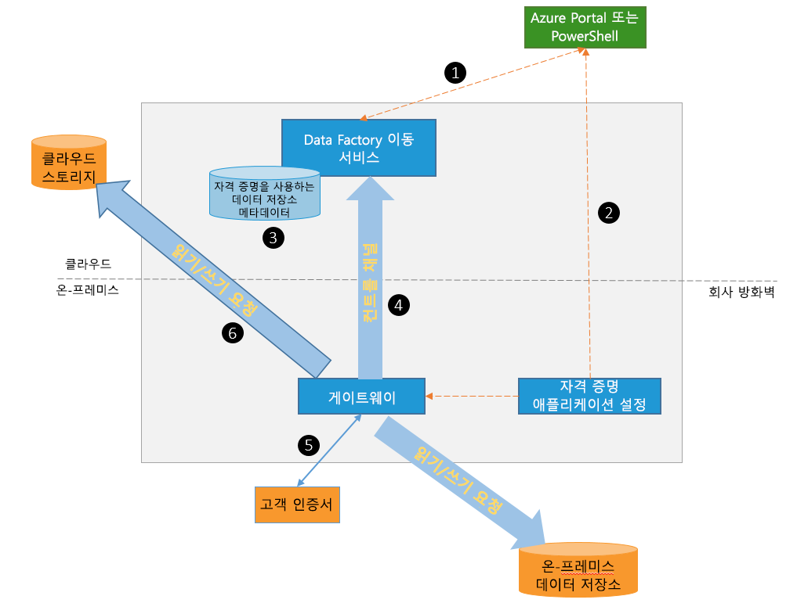

1. 데이터 개발자는 [Azure Portal](https://portal.azure.com) 또는 [PowerShell Cmdlet](https://docs.microsoft.com/powershell/module/az.datafactory/) 중 하나를 사용하는 Azure Data Factory에 대한 게이트웨이를 만듭니다.
2. 데이터 개발자는 게이트웨이 지정하여 온-프레미스 데이터 저장소에 대한 연결된 서비스를 만듭니다. 연결된 서비스 데이터 설정의 일부로서 데이터 개발자는 자격 증명 설정 애플리케이션을 사용하여 인증 유형 및 자격 증명을 지정합니다. 자격 증명 설정 애플리케이션 대화 상자는 연결을 테스트하는 데이터 저장소 및 자격 증명을 저장하는 게이트웨이와 통신합니다.
3. 게이트웨이는 클라우드에서 자격 증명을 저장하기 전에 게이트웨이(데이터 개발자가 제공함)에 연결된 인증서로 자격 증명을 암호화합니다.
4. Data Factory 서비스는 공유 Azure 서비스 버스 큐를 사용하는 컨트롤 채널을 통해 작업의 예정 및 관리에 대한 게이트웨이와 통신합니다. 복사 작업이 시작되어야 할 경우 Data Factory는 자격 증명 정보와 함께 요청을 큐에 보관합니다. 게이트웨이는 큐를 폴링한 후에 작업을 시작합니다.
5. 게이트웨이는 동일한 인증서를 사용하여 자격 증명의 암호를 해독하고 적절한 인증 형식 및 자격 증명을 사용하여 온-프레미스 데이터 저장소에 연결합니다.
6. 게이트웨이는 데이터 파이프라인에서 복사 활동을 구성하는 방법에 따라 온-프레미스 스토리지와 클라우드 스토리지 간에 데이터를 복사합니다. 이 단계에서 게이트웨이는 보안(HTTPS) 채널을 통해 Azure Blob Storage 등의 클라우드 기반 Storage 서비스와 직접 통신합니다.

### <a name="considerations-for-using-gateway"></a>게이트웨이 사용을 위한 고려 사항
* 데이터 관리 게이트웨이의 단일 인스턴스를 여러 온-프레미스 데이터 소스에 사용할 수 있습니다. 그러나 **각 게이트웨이 인스턴스는 Azure Data Factory 하나에만 연결**되며, 다른 Data Factory와 공유할 수는 없습니다.
* 단일 컴퓨터에 **데이터 관리 게이트웨이 인스턴스** 를 하나만 설치할 수 있습니다. 온-프레미스 데이터 소스에 액세스해야 하는 Data Factory가 2개라면 두 온-프레미스 컴퓨터에 게이트웨이를 설치해야 합니다. 즉, 게이트웨이는 특정 Data Factory에 연결됩니다.
* **게이트웨이가 데이터 소스와 같은 컴퓨터에 있을 필요는 없습니다**. 그러나 게이트웨이를 데이터 소스에 가까이 배치하면 게이트웨이가 데이터 소스에 연결하는 데 걸리는 시간을 줄일 수 있습니다. 온-프레미스 데이터 소스를 호스트하는 컴퓨터와는 다른 컴퓨터에 게이트웨이를 설치하는 것이 좋습니다. 게이트웨이와 데이터 소스가 서로 다른 컴퓨터에 있으면 게이트웨이와 데이터 소스 간에 리소스 경합이 발생하지 않습니다.
* **서로 다른 컴퓨터의 여러 게이트웨이가 동일한 온-프레미스 데이터 원본에 연결**할 수 있습니다. 예를 들어 두 게이트웨이가 2개의 데이터 팩터리를 처리하지만 동일한 온-프레미스 데이터 원본이 두 데이터 팩터리에 등록되어 있습니다.
* 컴퓨터에 **Power BI** 시나리오를 처리할 게이트웨이가 이미 설치된 경우 **별도의 Azure Data Factory용 게이트웨이**를 다른 컴퓨터에 설치하세요.
* **ExpressRoute**를 사용할 때도 게이트웨이를 사용해야 합니다.
* **ExpressRoute**를 사용하더라도 데이터 소스는 방화벽으로 보호되는 온-프레미스 데이터 소스로 취급해야 합니다. 게이트웨이를 사용하여 서비스와 데이터 소스 간의 연결을 설정합니다.
* 데이터 저장소가 **Azure IaaS VM**의 클라우드에 있더라도 **게이트웨이를 사용**해야 합니다.

## <a name="installation"></a>설치
### <a name="prerequisites"></a>전제 조건
* 지원되는 **운영 체제** 버전은 Windows 7, Windows 8/8.1, Windows 10, Windows Server 2008 R2, Windows Server 2012, Windows Server 2012 R2입니다. 현재 도메인 컨트롤러에 데이터 관리 게이트웨이를 설치하도록 지원되지 않습니다.
* .NET Framework 4.5.1 이상이 필요합니다. Windows 7 컴퓨터에 게이트웨이를 설치하는 경우 .NET Framework 4.5 이상을 설치하세요. 자세한 내용은 [.NET Framework 시스템 요구 사항](https://msdn.microsoft.com/library/8z6watww.aspx)을 참조하세요.
* 게이트웨이 컴퓨터에 권장 되는 **구성은** 최소 2ghz, 4 개 코어, 8gb RAM 및 80 gb 디스크입니다.
* 호스트 컴퓨터가 최대 절전 모드인 경우 게이트웨이가 데이터 요청에 응답하지 않습니다. 따라서 게이트웨이를 설치 하기 전에 컴퓨터에서 **전원 계획** 을 적절 하 게 구성 합니다. 컴퓨터가 최대 절전 모드로 구성된 경우 게이트웨이 설치 시에 메시지가 표시됩니다.
* 데이터 관리 게이트웨이를 성공적으로 설치 및 구성하려면 컴퓨터의 관리자여야 합니다. **데이터 관리 게이트웨이 사용자** 로컬 Windows 그룹에 사용자를 더 추가할 수 있습니다. 이 그룹의 구성원은 **데이터 관리 게이트웨이 구성 관리자** 도구를 사용하여 게이트웨이를 구성할 수 있습니다.

또한 특정 주기에 복사 활동이 실행되므로 컴퓨터에서 리소스 사용(CPU, 메모리)은 유휴 시간 사용량이 가장 많을 때와 동일한 패턴을 따릅니다. 리소스 사용률은 이동하는 데이터 양에 따라 달라집니다. 여러 복사 작업이 진행 중인 경우 사용량이 많은 시간 동안 리소스 사용량이 증가하는 것을 볼 수 있습니다.

### <a name="installation-options"></a>설치 옵션
다음과 같은 방법으로 데이터 관리 게이트웨이를 설치할 수 있습니다.

* [Microsoft 다운로드 센터](https://www.microsoft.com/download/details.aspx?id=39717)에서 MSI 설치 패키지를 다운로드합니다. MSI는 유지된 모든 설정을 사용하여 기존 데이터 관리 게이트웨이를 최신 버전으로 업그레이드하는 데 사용할 수 있습니다.
* 수동 설치에서 **데이터 게이트웨이 다운로드 및 설치** 링크 또는 빠른 설치에서 **이 컴퓨터에 직접 설치**를 클릭합니다. 빠른 설치를 사용하는 단계별 지침은 [온-프레미스 및 클라우드 간 데이터 이동](data-factory-move-data-between-onprem-and-cloud.md) 문서를 참조하세요. 수동 단계에서는 다운로드 센터로 이동합니다. 다운로드 센터에서 게이트웨이를 다운로드 및 설치하는 지침은 다음 섹션에 있습니다.

### <a name="installation-best-practices"></a>설치 모범 사례입니다.
1. 게이트웨이에 대한 호스트 컴퓨터에서 전원 계획을 구성하여 컴퓨터는 최대 절전 모드로 합니다. 호스트 컴퓨터가 최대 절전 모드인 경우 게이트웨이가 데이터 요청에 응답하지 않습니다.
2. 게이트웨이에 연결된 인증서를 백업합니다.

### <a name="install-the-gateway-from-download-center"></a>다운로드 센터에서 게이트웨이 설치
1. [Microsoft 데이터 관리 게이트웨이 다운로드 페이지](https://www.microsoft.com/download/details.aspx?id=39717)로 이동합니다.
2. **다운로드**를 클릭 하 고 **64 비트** 버전 (32 비트는 더 이상 지원 되지 않음)을 선택 하 고 **다음**을 클릭 합니다.
3. **MSI**를 직접 실행하거나 하드 디스크에 저장하고 실행합니다.
4. **시작** 페이지에서 **언어**를 선택하고 **다음**을 클릭합니다.
5. 최종 사용자 라이선스 규약에 **동의**하고 **다음**을 클릭합니다.
6. **폴더**를 선택하여 게이트웨이를 설치하고 **다음**을 클릭합니다.
7. **설치 준비 완료** 페이지에서 **설치**를 클릭합니다.
8. **마침**을 클릭하고 설치를 완료합니다.
9. Azure Portal에서 키를 가져옵니다. 단계별 지침은 다음 섹션을 참조하세요.
10. 컴퓨터에서 실행 중인 **데이터 관리 게이트웨이 구성 관리자**의 **게이트웨이 등록** 페이지에서 다음 단계를 수행합니다.
    1. 텍스트에 키를 붙여넣습니다.
    2. 필요에 따라 **게이트웨이 키 표시**를 클릭하여 키 텍스트를 확인합니다.
    3. **등록**을 클릭합니다.

### <a name="register-gateway-using-key"></a>키를 사용하여 게이트웨이 등록
#### <a name="if-you-havent-already-created-a-logical-gateway-in-the-portal"></a>포털에서 논리 게이트웨이를 아직 만들지 않은 경우
포털에서 게이트웨이를 만들고 **구성** 페이지에서 키를 가져오려면 [온-프레미스 및 클라우드 간에 데이터 이동](data-factory-move-data-between-onprem-and-cloud.md) 문서의 연습 단계를 수행합니다.

#### <a name="if-you-have-already-created-the-logical-gateway-in-the-portal"></a>포털에서 논리 게이트웨이를 이미 만든 경우
1. Azure Portal에서 **Data Factory** 페이지로 이동하여 **연결된 서비스** 타일을 클릭합니다.

    
2. **연결된 서비스** 페이지의 포털에서 만든 논리 **게이트웨이**를 선택합니다.

    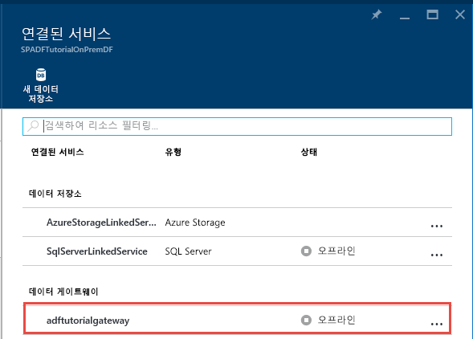
3. **데이터 게이트웨이** 페이지에서 **데이터 게이트웨이 다운로드 및 설치**를 클릭합니다.

    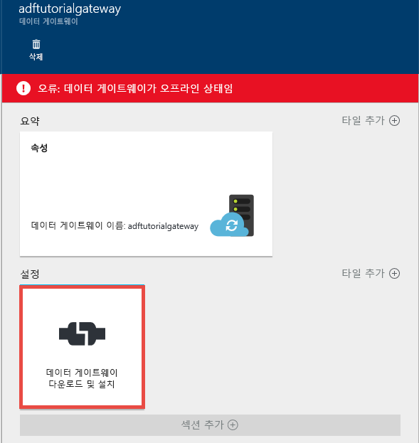
4. **구성** 페이지에서 **키 다시 만들기**를 클릭합니다. 신중하게 읽은 후 경고 메시지에 대해 예를 클릭합니다.

    
5. 키 옆의 복사 단추를 클릭합니다. 키가 클립보드에 복사됩니다.

    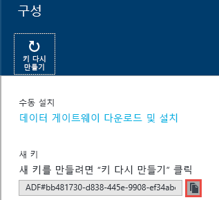

### <a name="system-tray-icons-notifications"></a>시스템 트레이 아이콘/알림
다음 이미지는 표시될 몇몇 트레이 아이콘을 보여 줍니다.


커서를 시스템 트레이 아이콘/알림 메시지 위로 이동하면 게이트웨이/업데이트 작업의 상태에 관한 세부 정보가 팝업 창에 표시됩니다.

### <a name="ports-and-firewall"></a>포트 및 방화벽
다음과 같은 고려해야 할 두 방화벽이 있습니다. 조직의 중앙 라우터에서 실행되는 **회사 방화벽** 및 게이트웨이를 설치한 로컬 컴퓨터에서 디먼으로 구성 **Windows 방화벽**입니다.

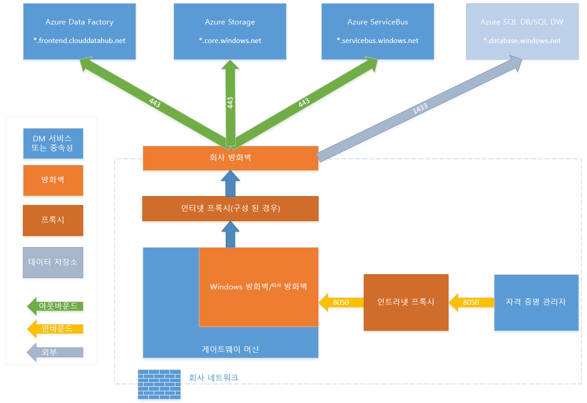

회사 방화벽 수준에서 다음 도메인 및 아웃바운드 포트를 구성 해야 합니다.

| 도메인 이름 | 포트 | 설명 |
| --- | --- | --- |
| \*.servicebus.windows.net |443 |데이터 이동 서비스 백 엔드와 통신에 사용됨 |
| *.core.windows.net |443 |Azure Blob를 사용하여 준비된 복사에 사용됨(구성된 경우)|
| *.frontend.clouddatahub.net |443 |데이터 이동 서비스 백 엔드와 통신에 사용됨 |
| \*.servicebus.windows.net |9350-9354, 5671 |복사 마법사에서 사용하는 TCP에 대한 선택적 Service Bus Relay |

Windows 방화벽 수준에서 이러한 아웃바운드 포트를 일반적으로 사용할 수 있습니다. 그렇지 않은 경우 게이트웨이 컴퓨터에서 도메인 및 포트를 그에 따라 구성할 수 있습니다.

> [!NOTE]
> 1. 소스/싱크에 따라 회사/Windows 방화벽에서 추가 도메인 및 아웃바운드 포트를 허용 목록으로 만들어야 할 수 있습니다.
> 2. 일부 클라우드 데이터베이스(예: [Azure SQL Database](https://docs.microsoft.com/azure/sql-database/sql-database-configure-firewall-settings), [Azure Data Lake](https://docs.microsoft.com/azure/data-lake-store/data-lake-store-secure-data#set-ip-address-range-for-data-access) 등)의 경우 해당 방화벽 구성에서 게이트웨이 머신의 IP 주소를 허용 목록으로 만들어야 합니다.
>
>

#### <a name="copy-data-from-a-source-data-store-to-a-sink-data-store"></a>소스 데이터 저장소의 데이터를 싱크 데이터 저장소에 복사
방화벽 규칙이 회사 방화벽, 게이트웨이 컴퓨터의 Windows 방화벽 및 데이터 저장소 자체에 올바르게 설정되어 있는지 확인합니다. 이러한 규칙을 사용하면 게이트웨이가 소스와 싱크에 모두 정상적으로 연결할 수 있습니다. 복사 작업과 관련된 각 데이터 저장소에 대해 규칙을 사용하도록 설정합니다.

예를 들어 **온-프레미스 데이터 저장소에서 Azure SQL Database 싱크 또는 Azure SQL Data Warehouse 싱크로**복사 하려면 다음 단계를 수행 합니다.

* Windows 방화벽 및 회사 방화벽 둘 다에 대해 포트 **1433** 에서 아웃 바운드 **TCP** 통신을 허용 합니다.
* 논리 SQL server의 방화벽 설정을 구성 하 여 허용 된 IP 주소 목록에 게이트웨이 컴퓨터의 IP 주소를 추가 합니다.

> [!NOTE]
> 방화벽이 아웃바운드 포트 1433을 허용하지 않으면 게이트웨이는 Azure SQL에 직접 액세스할 수 없습니다. 이 경우 SQL Database/SQL Managed Instance/SQL Azure DW에 대해 [준비 된 복사](https://docs.microsoft.com/azure/data-factory/data-factory-copy-activity-performance#staged-copy) 를 사용할 수 있습니다. 이 시나리오에서는 데이터 이동에 HTTPS(포트 443)만 필요합니다.
>
>

### <a name="proxy-server-considerations"></a>프록시 서버 고려 사항
회사 네트워크 환경에서 프록시 서버를 사용하여 인터넷에 액세스하는 경우 데이터 관리 게이트웨이가 적절한 프록시 설정을 사용하도록 구성합니다. 초기 등록 단계에서 프록시를 설정할 수 있습니다.

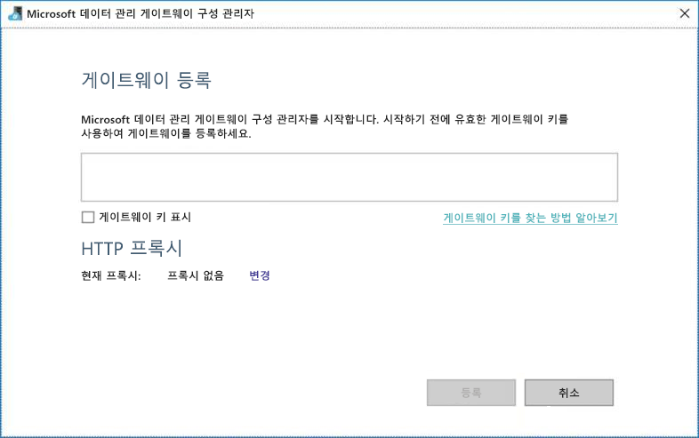

게이트웨이는 프록시 서버를 사용하여 클라우드 서비스에 연결합니다. 초기 설치 중에 **변경** 링크를 클릭 합니다. **프록시 설정** 대화가 표시됩니다.

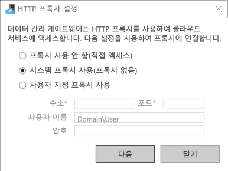

이 대화 상자에는 세 가지 구성 옵션이 있습니다.

* **프록시 사용 안 함**: 게이트웨이가 클라우드 서비스에 연결하는 데 프록시를 명시적으로 사용하지 않습니다.
* **시스템 프록시 사용**: 게이트웨이는 diahost.exe.config 및 diawp.exe.config에 구성 된 프록시 설정을 사용 합니다. diahost.exe.config 및 diawp.exe.config에 프록시가 구성 되어 있지 않으면 게이트웨이는 프록시를 거치지 않고 클라우드 서비스에 직접 연결 합니다.
* **사용자 지정 프록시 사용**: diahost.exe.config 및 diawp.exe.config에서 구성을 사용 하는 대신 게이트웨이에 사용할 HTTP 프록시 설정을 구성 합니다. 주소와 포트가 필요 합니다. 사용자 이름 및 암호는 프록시 인증 설정에 따라 입력할 수 있습니다. 모든 설정은 게이트웨이의 자격 증명 인증서를 사용하여 암호화되며 게이트웨이 호스트 컴퓨터에 로컬로 저장됩니다.

업데이트된 프록시 설정을 저장하고 나면 데이터 관리 게이트웨이 호스트 서비스가 자동으로 다시 시작됩니다.

게이트웨이를 올바르게 등록한 후 프록시 설정을 확인하거나 업데이트하려면 데이터 관리 게이트웨이 구성 관리자를 사용합니다.

1. **데이터 관리 게이트웨이 구성 관리자**를 시작합니다.
2. **설정** 탭으로 전환합니다.
3. **HTTP 프록시** 섹션에서 **변경** 링크를 클릭하여 **HTTP 프록시 설정** 대화 상자를 시작합니다.
4. **다음** 단추를 클릭하면 프록시 설정을 저장하고 게이트웨이 호스트 서비스를 다시 시작하기 위한 권한이 필요하다는 경고 대화 상자가 표시됩니다.

구성 관리자 도구를 사용하여 HTTP 프록시를 확인하고 업데이트할 수 있습니다.


> [!NOTE]
> NTLM 인증을 사용하여 프록시 서버를 설치하면 게이트웨이 호스트 서비스가 도메인 계정에서 실행됩니다. 나중에 도메인 계정의 암호를 변경하는 경우에는 서비스의 구성 설정을 업데이트하여 서비스를 다시 시작해야 합니다. 이 요구 사항을 감안하여, 암호를 자주 업데이트하지 않아도 되는 전용 도메인 계정을 사용해 프록시 서버에 액세스하는 것이 좋습니다.
>
>

### <a name="configure-proxy-server-settings"></a>프록시 서버 설정 구성
HTTP 프록시에 대해 **시스템 프록시 사용** 설정을 선택 하는 경우 게이트웨이는 diahost.exe.config 및 diawp.exe.config에서 프록시 설정을 사용 합니다. diahost.exe.config 및 diawp.exe.config에 프록시가 지정 되어 있지 않으면 게이트웨이는 프록시를 거치지 않고 클라우드 서비스에 직접 연결 합니다. 다음 절차에서는 diahost.exe.config 파일을 업데이트하는 지침을 제공합니다.

1. 파일 탐색기에서 원본 파일을 백업 하는 *C: \\ \\ Program Files \\ Microsoft 데이터 관리 Gateway \\ 2.0 \\ Shared \\diahost.exe.config* 의 안전한 복사본을 만듭니다.
2. 관리자 권한으로 실행 Notepad.exe 시작 하 고 텍스트 파일 *C: \\ \\ Program Files \\ Microsoft 데이터 관리 Gateway \\ 2.0 \\ Shared \\diahost.exe.config*를 엽니다. 다음 코드와 같이 system.net에 대 한 기본 태그를 찾을 수 있습니다.

    ```
    <system.net>
        <defaultProxy useDefaultCredentials="true" />
    </system.net>
    ```

    그러면 다음 예제와 같이 프록시 서버 세부 정보를 추가할 수 있습니다.

    ```
    <system.net>
        <defaultProxy enabled="true">
            <proxy bypassonlocal="true" proxyaddress="http://proxy.domain.org:8888/" />
        </defaultProxy>
    </system.net>
    ```

    프록시 태그 내에 scriptLocation과 같은 필수 설정을 지정하는 추가 속성을 사용할 수 있습니다. 구문의 [proxy 요소(네트워크 설정)](https://msdn.microsoft.com/library/sa91de1e.aspx)를 참조하세요.

    ```
    <proxy autoDetect="true|false|unspecified" bypassonlocal="true|false|unspecified" proxyaddress="uriString" scriptLocation="uriString" usesystemdefault="true|false|unspecified "/>
    ```
3. 구성 파일을 원래 위치에 저장한 다음 데이터 관리 게이트웨이 호스트 서비스를 다시 시작하면 변경 내용이 적용됩니다. 서비스를 다시 시작하려면 제어판의 서비스 애플릿을 사용하거나, **데이터 관리 게이트웨이 구성 관리자**에서 **서비스 중지** 단추를 클릭한 후 **서비스 시작**을 클릭합니다. 서비스가 시작되지 않으면 잘못된 XML 태그 구문이 편집된 애플리케이션 구성 파일에 추가되었을 가능성이 높습니다.

> [!IMPORTANT]
> diahost.exe.config와 diawp.exe.config를 **모두** 업데이트 하는 것을 잊지 마십시오.

이러한 사항 외에 Microsoft Azure가 회사의 허용 목록에 있는지도 확인해야 합니다. [Microsoft 다운로드 센터](https://www.microsoft.com/download/details.aspx?id=41653)에서 유효한 Microsoft Azure IP 주소의 목록을 다운로드할 수 있습니다.

#### <a name="possible-symptoms-for-firewall-and-proxy-server-related-issues"></a>방화벽 및 프록시 서버 관련 문제 발생 시 나타날 수 있는 증상
다음과 비슷한 오류가 발생할 경우 방화벽 또는 프록시 서버가 잘못 구성된 것일 수 있습니다. 그러면 게이트웨이가 Data Factory에 연결하여 인증을 할 수 없게 됩니다. 이전 섹션을 참조하여 방화벽 및 프록시 서버가 올바르게 구성되었는지 확인합니다.

1. 게이트웨이를 등록하려고 하는 경우 다음과 같은 오류가 나타납니다. "게이트웨이 키를 등록하지 못했습니다. 게이트웨이 키를 다시 등록하려 하기 전에 데이터 관리 게이트웨이가 연결된 상태이며 데이터 관리 게이트웨이 호스트 서비스가 시작되었는지 확인합니다."
2. Configuration Manager를 열 때 상태가 “연결 끊김” 또는 “연결 중”으로 표시됩니다. Windows 이벤트 로그를 확인할 때 “이벤트 뷰어” &gt; “애플리케이션 및 서비스 로그” &gt; “데이터 관리 게이트웨이”에 다음 오류와 같은 오류 메시지가 표시됩니다. `Unable to connect to the remote server`
   `A component of Data Management Gateway has become unresponsive and restarts automatically. Component name: Gateway.`

### <a name="open-port-8050-for-credential-encryption"></a>자격 증명 암호화용 8050 포트 열기
Azure Portal에서 온-프레미스 연결된 서비스를 설정할 때 **자격 증명 설정** 애플리케이션은 인바운드 포트 **8050**을 사용하여 게이트웨이로 자격 증명을 릴레이합니다. 게이트웨이를 설정하는 동안 기본적으로 게이트웨이를 설치하면 게이트웨이 컴퓨터에 이 포트가 열립니다.

타사 방화벽을 사용 중인 경우 포트 8050을 수동으로 열 수 있습니다. 게이트웨이를 설치하는 동안 방화벽 문제가 발생하는 경우 다음 명령을 사용하여 방화벽을 구성하지 않고 게이트웨이를 설치할 수 있습니다.

```cmd
msiexec /q /i DataManagementGateway.msi NOFIREWALL=1
```

게이트웨이 머신에서 포트 8050을 열지 않는 경우 **자격 증명 설정** 애플리케이션을 사용하는 방식 이외의 메커니즘을 사용하여 데이터 스토리지 자격 증명을 구성합니다. 예를 들어 [AzDataFactoryEncryptValue](https://docs.microsoft.com/powershell/module/az.datafactory/new-azdatafactoryencryptvalue) PowerShell cmdlet을 사용할 수 있습니다. 데이터 저장소 자격 증명을 설정할 수 있는 방법은 자격 증명 및 보안 설정 섹션을 참조하세요.

## <a name="update"></a>업데이트
기본적으로 데이터 관리 게이트웨이는 게이트웨이의 새 버전을 사용할 수 있을 때 자동으로 업데이트됩니다. 게이트웨이는 모든 예약된 작업이 완료될 때까지 업데이트되지 않습니다. 업데이트 작업이 완료될 때까지 게이트웨이가 더 이상 작업을 처리하지 않습니다. 업데이트가 실패하면 게이트웨이는 이전 버전으로 다시 롤백됩니다.

예약된 업데이트 시간은 다음 위치에 표시됩니다.

* Azure Portal의 게이트웨이 속성 페이지
* 데이터 관리 게이트웨이 구성 관리자의 홈 페이지
* 시스템 트레이 알림 메시지

데이터 관리 게이트웨이 구성 관리자의 홈 탭에 업데이트 일정 및 게이트웨이가 마지막 설치/업데이트된 시간이 표시됩니다.


업데이트를 즉시 설치할 수도 있고, 게이트웨이가 예약된 시간에 자동으로 업데이트되도록 기다릴 수도 있습니다. 예를 들어 다음 이미지에는 게이트웨이 구성 관리자에 표시된 알림 메시지와, 업데이트를 즉시 설치하려는 경우 클릭할 수 있는 업데이트 단추가 나와 있습니다.


시스템 트레이의 알림 메시지는 다음 그림과 같습니다.


시스템 트레이에 업데이트 작업(수동 또는 자동)의 상태가 표시됩니다. 다음 번에 게이트웨이 구성 관리자를 시작하면 게이트웨이가 업데이트되었다는 메시지가 알림 표시줄에 표시되며 [새로운 기능 항목](data-factory-gateway-release-notes.md) 링크가 표시됩니다.

### <a name="to-disableenable-auto-update-feature"></a>자동 업데이트 기능 사용 안 함/사용
다음 단계를 수행하여 자동 업데이트 기능을 사용하지 않거나/사용할 수 있습니다.

[단일 노드 게이트웨이의 경우]
1. 게이트웨이 컴퓨터에서 Windows PowerShell을 시작합니다.
2. *C: \\ \\ Program Files \\ Microsoft Integration Runtime \\ 3.0 \\ powershellscript \\ * 폴더로 전환 합니다.
3. 다음 명령을 실행하여 자동 업데이트 기능을 끕니다(사용 안 함).

    ```powershell
    .\IntegrationRuntimeAutoUpdateToggle.ps1 -off
    ```
4. 다시 켜려면:

    ```powershell
    .\IntegrationRuntimeAutoUpdateToggle.ps1 -on
    ```
   [다중 노드 고가용성 및 확장성 있는 게이트웨이의 경우](data-factory-data-management-gateway-high-availability-scalability.md)
1. 게이트웨이 컴퓨터에서 Windows PowerShell을 시작합니다.
2. *C: \\ \\ Program Files \\ Microsoft Integration Runtime \\ 3.0 \\ powershellscript \\ * 폴더로 전환 합니다.
3. 다음 명령을 실행하여 자동 업데이트 기능을 끕니다(사용 안 함).

    고가용성 기능이 있는 게이트웨이의 경우, 추가 AuthKey 매개 변수가 필요합니다.
    ```powershell
    .\IntegrationRuntimeAutoUpdateToggle.ps1 -off -AuthKey <your auth key>
    ```
4. 다시 켜려면:

    ```powershell
    .\IntegrationRuntimeAutoUpdateToggle.ps1 -on -AuthKey <your auth key>
    ```

## <a name="configuration-manager"></a>Configuration Manager
게이트웨이를 설치하면 다음 방법 중 하나로 데이터 관리 게이트웨이 구성 관리자를 시작할 수 있습니다.

1. **Search** 창에서 **데이터 관리 게이트웨이**를 입력하여 이 유틸리티에 액세스합니다.
2. *C: \\ \\ Program Files \\ Microsoft 데이터 관리 Gateway \\ 2.0 \\ Shared*폴더에 있는 실행 파일 *ConfigManager.exe* 를 실행 합니다.

### <a name="home-page"></a>홈페이지
홈 페이지를 통해 다음 작업을 수행할 수 있습니다.

* 게이트웨이의 상태를 봅니다(클라우드 서비스에 연결되어 있는지 등).
* **Register**합니다.
* 게이트웨이 컴퓨터에서 **데이터 관리 게이트웨이 호스트 서비스**를 **중지**하고 시작합니다.
* **업데이트를 예약**합니다.
* 게이트웨이가 **마지막으로 업데이트된** 날짜를 봅니다.

### <a name="settings-page"></a>설정 페이지
설정 페이지를 통해 다음 작업을 수행할 수 있습니다.

* 게이트웨이에서 사용한 **인증서**를 보고 변경하고 내보냅니다. 이 인증서는 데이터 원본 자격 증명을 암호화하는 데 사용됩니다.
* 엔드포인트에 대한 **HTTPS 포트**를 변경합니다. 게이트웨이는 데이터 원본 자격 증명을 설정하기 위한 포트를 엽니다.
* **상태**
* **SSL 인증서** 보기는 데이터 원본에 대 한 자격 증명을 설정 하기 위해 포털과 게이트웨이 간의 TLS/SSL 통신에 사용 됩니다.

### <a name="remote-access-from-intranet"></a>인트라넷에서 원격 액세스
이 기능은 나중에 사용할 수 있습니다. 향후 업데이트(v3.4 이상)에서는 현재 자격 증명 암호화에 PowerShell 또는 자격 증명 관리자 애플리케이션을 사용하는 동안 포트 8050(위의 섹션 참조)을 사용하여 이뤄지는 원격 연결을 사용자가 활성화/비활성화할 수 있습니다.

### <a name="diagnostics-page"></a>진단 페이지
진단 페이지를 통해 다음 작업을 수행할 수 있습니다.

* 자세한 정보 **로깅**을 사용하고, 이벤트 뷰어에서 로그를 보고, 오류 발생 시 Microsoft에 로그를 보냅니다.
* **연결을 테스트**합니다.

### <a name="help-page"></a>도움말 페이지
도움말 페이지에는 다음 정보가 표시됩니다.

* 게이트웨이의 간략한 설명
* 버전 번호
* 온라인 도움말, 개인 정보 취급 방침 및 사용권 규약에 대한 링크

## <a name="monitor-gateway-in-the-portal"></a>포털에서 게이트웨이 모니터링
Azure Portal에서 게이트웨이 컴퓨터의 리소스 사용률(CPU, 메모리, 네트워크(수신/송신) 등)에 대한 스냅샷을 거의 실시간으로 볼 수 있습니다.

1. Azure Portal에서 Data Factory의 홈페이지로 이동하여 **연결된 서비스** 타일을 클릭합니다.

    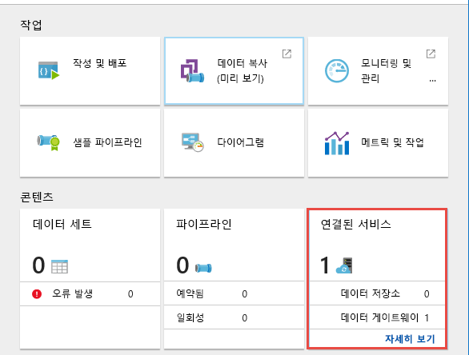
2. **연결된 서비스** 페이지에서 **게이트웨이**를 선택합니다.

    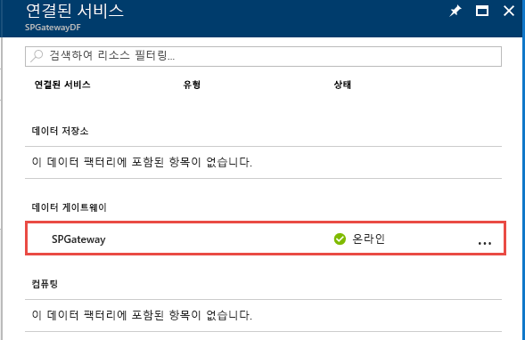
3. **게이트웨이** 페이지에서 게이트웨이의 메모리 및 CPU 사용량을 볼 수 있습니다.

    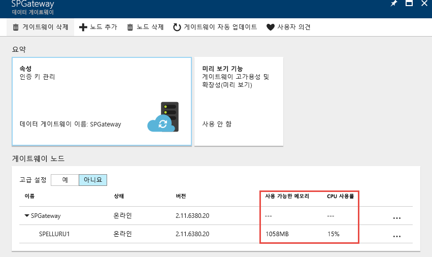
4. **고급 설정**을 사용하도록 설정하여 네트워크 사용량과 같은 자세한 정보를 확인할 수 있습니다.
    
    

다음 표에서는 **게이트웨이 노드** 목록의 열에 대해 설명합니다.

모니터링 속성 | 설명
:------------------ | :----------
Name | 논리 게이트웨이 및 이 게이트웨이와 연결된 노드의 이름입니다. 노드는 게이트웨이가 설치되는 온-프레미스 Windows 컴퓨터입니다. 단일 논리 게이트웨이에서 하나 이상의 노드(최대 4개의 노드)를 포함하는 방법은 [데이터 관리 게이트웨이 - 고가용성 및 확장성](data-factory-data-management-gateway-high-availability-scalability.md)을 참조하세요.
상태 | 논리 게이트웨이 및 게이트웨이 노드의 상태입니다. 예: 온라인/오프 라인/제한 됨/등 이러한 상태에 대 한 자세한 내용은 [게이트웨이 상태](#gateway-status) 섹션을 참조 하세요.
버전 | 논리 게이트웨이 및 각 게이트웨이 노드의 버전을 표시합니다. 논리 게이트웨이의 버전은 그룹에 있는 대다수 노드의 버전에 따라 결정됩니다. 논리 게이트웨이 설정에 다른 버전의 노드가 있으면 논리 게이트웨이와 버전 번호가 동일한 노드만 제대로 작동합니다. 다른 버전의 노드는 제한된 모드에 있으므로 수동으로 업데이트해야 합니다(자동 업데이트가 실패할 경우에만).
사용 가능한 메모리 | 게이트웨이 노드에서 사용 가능한 메모리입니다. 이 값은 거의 실시간 스냅샷입니다.
CPU 사용률 | 게이트웨이 노드의 CPU 사용률입니다. 이 값은 거의 실시간 스냅샷입니다.
네트워킹(수신/송신) | 게이트웨이 노드의 네트워크 사용률입니다. 이 값은 거의 실시간 스냅샷입니다.
동시 작업(실행/제한) | 각 노드에서 실행되는 작업 또는 태스크의 수입니다. 이 값은 거의 실시간 스냅샷입니다. 제한은 각 노드의 최대 동시 작업 수를 나타냅니다. 이 값은 컴퓨터 크기에 따라 정의됩니다. CPU/메모리/네트워크가 미달 사용 되지만 작업 시간이 초과 되는 고급 시나리오에서 동시 작업 실행을 확장 하는 제한을 늘릴 수 있습니다. 이 기능은 단일 노드 게이트웨이에서도 사용할 수 있습니다 (확장성 및 가용성 기능을 사용 하지 않는 경우에도).
역할 | 다중 노드 게이트웨이에는 디스패처 및 작업자라는 두 가지 역할이 있습니다. 모든 노드는 작업자이며, 이는 모두 작업을 실행하는 데 사용할 수 있음을 의미합니다. 디스패처 노드는 하나만 존재합니다. 이 노드는 클라우드 서비스에서 작업/태스크를 가져와서 다른 작업자 노드(자체 포함)에 전달하는 데 사용됩니다.

이 페이지에서 게이트웨이에 두 개 이상의 노드(확장 시나리오)가 있는 경우에 더 적절한 일부 설정을 볼 수 있습니다. 다중 노드 게이트웨이를 설정하는 세부 정보는 [데이터 관리 게이트웨이 - 고가용성 및 확장성](data-factory-data-management-gateway-high-availability-scalability.md)을 참조하세요.

### <a name="gateway-status"></a>게이트웨이 상태
다음 표에서는 **게이트웨이 노드**에 가능한 상태에 대해 설명합니다.

상태  | 설명/시나리오
:------- | :------------------
온라인 | 노드가 Data Factory 서비스에 연결되어 있습니다.
오프라인 | 노드가 오프라인 상태입니다.
업그레이드 중 | 노드가 자동 업데이트 중입니다.
제한됨 | 연결 문제로 인해 제한되는 상태입니다. 8050 HTTP 포트 문제, 서비스 버스 연결 문제 또는 자격 증명 동기화 문제 때문일 수 있습니다.
비활성 | 노드의 구성이 다른 주 노드의 구성과 다릅니다.<br/><br/> 다른 노드에 연결할 수 없을 때 노드가 비활성 상태일 수 있습니다.

다음 표에서는 **논리 게이트웨이**에 가능한 상태에 대해 설명합니다. 게이트웨이 상태는 게이트웨이 노드의 상태에 따라 달라집니다.

상태 | 주석
:----- | :-------
등록이 필요합니다. | 이 논리 게이트웨이에 노드가 아직 등록되지 않았습니다.
온라인 | 게이트웨이 노드가 온라인 상태입니다.
오프라인 | 온라인 상태의 노드가 없습니다.
제한됨 | 이 게이트웨이의 모든 노드가 정상 상태가 아닙니다. 이 상태는 일부 노드가 중단되었을 수 있다는 경고입니다. <br/><br/>디스패처/작업자 노드의 자격 증명 동기화 문제 일 수 있습니다.

## <a name="scale-up-gateway"></a>게이트웨이 강화
노드에서 실행할 수 있는 **동시 데이터 이동 작업** 수를 구성하여 온-프레미스 및 클라우드 데이터 저장소 간에 데이터를 이동하는 기능을 강화할 수 있습니다.

사용 가능한 메모리와 CPU가 잘 사용되지는 않지만 유휴 용량이 0이면 노드에서 실행할 수 있는 동시 작업 수를 늘려 강화할 수 있습니다. 또한 게이트웨이 오버로드로 인해 활동 시간이 초과되는 경우에도 강화할 수 있습니다. 게이트웨이 노드의 고급 설정에서 노드에 대한 최대 수용작업량을 늘릴 수 있습니다.

## <a name="troubleshooting-gateway-issues"></a>게이트웨이 문제 해결
데이터 관리 게이트웨이를 사용 하는 문제를 해결 하는 방법에 대 한 정보/팁은 [게이트웨이 문제 해결](data-factory-troubleshoot-gateway-issues.md) 문서를 참조 하세요.

## <a name="move-gateway-from-one-machine-to-another"></a>컴퓨터 간에 게이트웨이 이동
이 섹션에서는 컴퓨터 간에 게이트웨이 클라이언트를 이동하는 단계를 제공합니다.

1. 포털에서 **데이터 팩터리 홈페이지**로 이동하여 **연결된 서비스** 타일을 클릭합니다.

    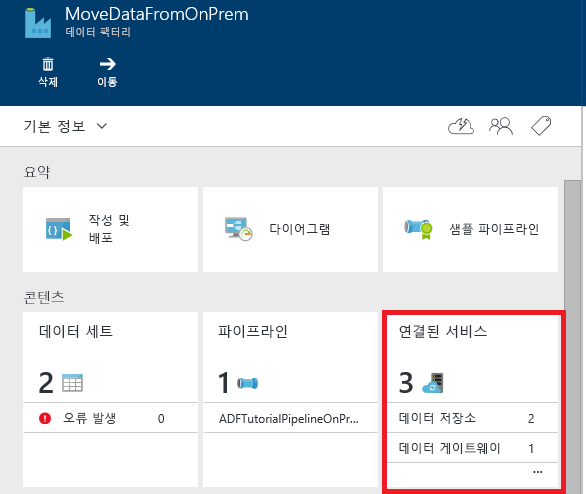
2. **연결된 서비스** 페이지의 **데이터 게이트웨이** 섹션에서 게이트웨이를 선택합니다.

    
3. **데이터 게이트웨이** 페이지에서 **데이터 게이트웨이 다운로드 및 설치**를 클릭 합니다.

    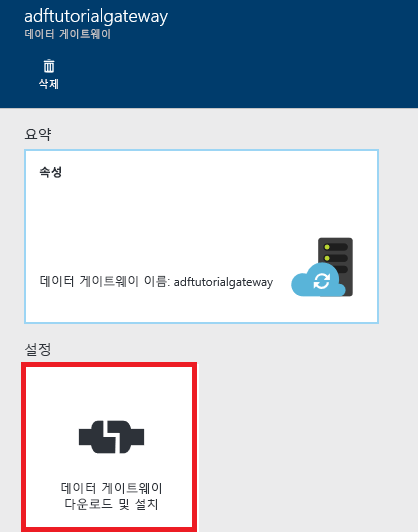
4. 그러면 **구성** 페이지에서 **데이터 게이트웨이 다운로드 및 설치**를 클릭하고 지침에 따라 데이터 게이트웨이를 컴퓨터에 설치합니다.

    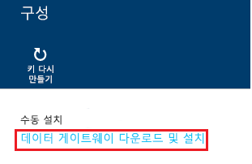
5. **Microsoft 데이터 관리 게이트웨이 구성 관리자**를 열어 둡니다.

    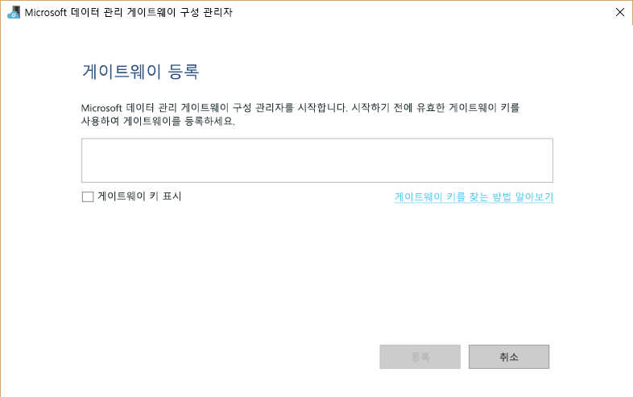
6. 포털의 **구성** 페이지에서 명령 모음에 있는 **키 다시 만들기**를 클릭하고 경고 메시지가 나타나면 **예**를 클릭합니다. 키 텍스트 옆의 **복사 단추**를 클릭하여 키를 클립보드에 복사합니다. 키를 다시 만드는 즉시 이전 컴퓨터의 게이트웨이가 작동 중지됩니다.

    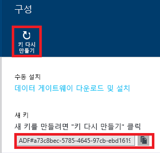
7. 컴퓨터의 **데이터 관리 게이트웨이 구성 관리자**의 **게이트웨이 등록** 페이지에서 **키**를 텍스트 상자에 붙여 넣습니다. (선택 사항) **게이트웨이 키 표시** 확인란을 클릭하여 키 텍스트를 확인합니다.

    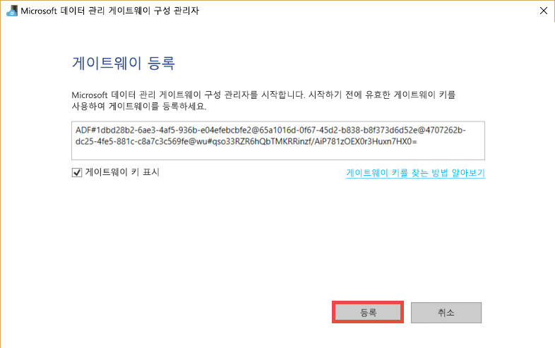
8. **등록**을 클릭하여 클라우드 서비스에 게이트웨이를 등록합니다.
9. **설정** 탭에서 **변경**을 클릭하여 이전 게이트웨이에 사용된 것과 동일한 인증서를 선택하고 **암호**를 입력한 다음 **마침**을 클릭합니다.

   

   이전 게이트웨이에서 인증서를 내보낼 수 있습니다. 이전 컴퓨터에서 데이터 관리 게이트웨이 구성 관리자를 시작하고 **인증서** 탭으로 전환한 후 **내보내기** 단추를 클릭하고 지침을 따르면 됩니다.
10. 게이트웨이 등록에 성공하면 게이트웨이 구성 관리자의 홈페이지에 **등록**이 **등록됨**으로 설정되고 **상태**가 **시작됨**으로 설정됩니다.

## <a name="encrypting-credentials"></a>자격 증명 암호화
Data Factory 편집기에서 자격 증명을 암호화하려면 다음 단계를 수행합니다.

1. **게이트웨이 컴퓨터**에서 웹 브라우저를 시작하여 [Azure Portal](https://portal.azure.com)로 이동합니다. 필요한 경우 Data Factory를 검색하여 **Data Factory** 페이지에서 Data Factory를 연 다음 **작성자 및 배포**를 클릭하여 Data Factory 편집기를 시작합니다.
2. 트리 뷰에서 기존 **연결된 서비스**를 클릭하여 해당 JSON 정의를 보거나 데이터 관리 게이트웨이(예: SQL Server 또는 Oracle)를 필요로 하는 연결된 서비스를 만듭니다.
3. JSON 편집기에서 **gatewayName** 속성으로 게이트웨이의 이름을 입력합니다.
4. **connectionString**에 **데이터 원본** 속성의 서버 이름을 입력합니다.
5. **connectionString**에 **초기 카탈로그** 속성의 데이터베이스 이름을 입력합니다.
6. 명령 모음에서 **암호화** 단추를 클릭하여 ClickOnce **자격 증명 관리자** 애플리케이션을 시작합니다. **자격 증명 설정** 대화 상자가 표시됩니다.

    
7. **자격 증명 설정** 대화 상자에서 다음 단계를 수행합니다.
   1. 데이터 팩터리 서비스가 사용하려는 **인증**을 선택하여 데이터베이스에 연결합니다.
   2. **USERNAME** 설정에 대해 데이터베이스에 액세스할 수 있는 사용자의 이름을 입력합니다.
   3. **PASSWORD** 설정에 대해 사용자 암호를 입력합니다.
   4. **확인**을 클릭하여 자격 증명을 암호화하고 대화 상자를 닫습니다.
8. 이제 **connectionString**에 **encryptedCredential** 속성이 표시되어야 합니다.

    ```JSON
    {
        "name": "SqlServerLinkedService",
        "properties": {
            "type": "OnPremisesSqlServer",
            "description": "",
            "typeProperties": {
                "connectionString": "data source=myserver;initial catalog=mydatabase;Integrated Security=False;EncryptedCredential=eyJDb25uZWN0aW9uU3R",
                "gatewayName": "adftutorialgateway"
            }
        }
    }
    ```
   게이트웨이 컴퓨터와 다른 컴퓨터에서 포털에 액세스하는 경우 자격 증명 관리자 애플리케이션이 게이트웨이 컴퓨터에 연결할 수 있는지 확인해야 합니다. 애플리케이션이 게이트웨이 컴퓨터에 연결할 수 없는 경우, 데이터 원본에 대한 자격 증명을 설정하고 데이터 원본에 대한 연결을 테스트할 수 없습니다.

**자격 증명 설정** 애플리케이션을 사용하는 경우 포털은 게이트웨이 머신에서 **게이트웨이 구성 관리자**의 **인증서** 탭에 지정한 인증서를 사용하여 자격 증명을 암호화합니다.

자격 증명을 암호화 하기 위한 API 기반 접근 방식을 찾고 있는 경우 [AzDataFactoryEncryptValue](https://docs.microsoft.com/powershell/module/az.datafactory/new-azdatafactoryencryptvalue) PowerShell cmdlet을 사용 하 여 자격 증명을 암호화할 수 있습니다. Cmdlet은 해당 게이트웨이 구성하는 인증서를 사용하여 자격 증명을 암호화를 사용합니다. 암호화된 자격 증명을 JSON에서 **connectionString**의 **EncryptedCredential** 요소에 추가합니다. [AzDataFactoryLinkedService](https://docs.microsoft.com/powershell/module/az.datafactory/new-azdatafactorylinkedservice) cmdlet 또는 Data Factory 편집기에서 JSON을 사용 합니다.

```JSON
"connectionString": "Data Source=<servername>;Initial Catalog=<databasename>;Integrated Security=True;EncryptedCredential=<encrypted credential>",
```

데이터 팩터리 편집기를 사용하여 자격 증명을 설정할 수 있는 방법이 한 가지 더 있습니다. 편집기를 사용하여 SQL Server 연결된 서비스를 만들고 일반 텍스트로 자격 증명을 입력하면 Data Factory 서비스가 소유한 인증서를 사용하여 자격 증명이 암호화됩니다. 즉, 게이트웨이가 사용하도록 구성된 인증서는 사용되지 않습니다. 경우에 따라 이 방법은 약간 빠를 수 있는 반면에 안전성이 떨어집니다. 따라서 개발/테스트 목적에 대해서만이 방법을 수행하는 것이 좋습니다.

## <a name="powershell-cmdlets"></a>PowerShell cmdlet
이 섹션에서는 Azure PowerShell cmdlet을 사용하여 게이트웨이를 만들고 등록하는 방법에 대해 설명합니다.

1. **Azure PowerShell**을 관리자 모드로 시작합니다.
2. 다음 명령을 실행하고 Azure 자격 증명을 입력하여 Azure 계정에 로그인합니다.

    ```powershell
    Connect-AzAccount
    ```
3. **AzDataFactoryGateway** cmdlet을 사용 하 여 다음과 같이 논리 게이트웨이를 만듭니다.

    ```powershell
    $MyDMG = New-AzDataFactoryGateway -Name <gatewayName> -DataFactoryName <dataFactoryName> -ResourceGroupName ADF –Description <desc>
    ```
    **예제 명령 및 출력**:

    ```
    PS C:\> $MyDMG = New-AzDataFactoryGateway -Name MyGateway -DataFactoryName $df -ResourceGroupName ADF –Description "gateway for walkthrough"

    Name              : MyGateway
    Description       : gateway for walkthrough
    Version           :
    Status            : NeedRegistration
    VersionStatus     : None
    CreateTime        : 9/28/2014 10:58:22
    RegisterTime      :
    LastConnectTime   :
    ExpiryTime        :
    ProvisioningState : Succeeded
    Key               : ADF#00000000-0000-4fb8-a867-947877aef6cb@fda06d87-f446-43b1-9485-78af26b8bab0@4707262b-dc25-4fe5-881c-c8a7c3c569fe@wu#nfU4aBlq/heRyYFZ2Xt/CD+7i73PEO521Sj2AFOCmiI
    ```

1. Azure PowerShell에서 *C: \\ \\ Program Files \\ Microsoft Integration Runtime \\ 3.0 \\ powershellscript \\ *폴더로 전환 합니다. 다음 명령에 나와 있는 대로 로컬 변수 **$Key** 와 연결된 *RegisterGateway.ps1* 을 실행합니다. 이 스크립트는 컴퓨터에 설치된 클라이언트 에이전트를 앞에서 만든 논리적 게이트웨이에 등록합니다.

    ```powershell
    PS C:\> .\RegisterGateway.ps1 $MyDMG.Key
    ```
    ```
    Agent registration is successful!
    ```
    IsRegisterOnRemoteMachine 매개 변수를 사용하여 원격 컴퓨터에서 게이트웨이를 등록할 수 있습니다. 예:

    ```powershell
    .\RegisterGateway.ps1 $MyDMG.Key -IsRegisterOnRemoteMachine true
    ```
2. **AzDataFactoryGateway** cmdlet을 사용 하 여 데이터 팩터리의 게이트웨이 목록을 가져올 수 있습니다. **상태**에 **online**이 표시되어 있으면 게이트웨이를 사용할 준비가 되었음을 나타냅니다.

    ```powershell        
    Get-AzDataFactoryGateway -DataFactoryName <dataFactoryName> -ResourceGroupName ADF
    ```
   **AzDataFactoryGateway** cmdlet을 사용 하 여 게이트웨이를 제거 하 고 **AzDataFactoryGateway** cmdlet을 사용 하 여 게이트웨이에 대 한 설명을 업데이트할 수 있습니다. 이러한 cmdlet에 대한 구문 및 기타 세부 정보는 데이터 팩터리 Cmdlet 참조를 참조하세요.  

### <a name="list-gateways-using-powershell"></a>PowerShell을 사용하여 게이트웨이 나열

```powershell
Get-AzDataFactoryGateway -DataFactoryName jasoncopyusingstoredprocedure -ResourceGroupName ADF_ResourceGroup
```

### <a name="remove-gateway-using-powershell"></a>PowerShell을 사용하여 게이트웨이 제거

```powershell
Remove-AzDataFactoryGateway -Name JasonHDMG_byPSRemote -ResourceGroupName ADF_ResourceGroup -DataFactoryName jasoncopyusingstoredprocedure -Force
```

## <a name="next-steps"></a>다음 단계
* [온-프레미스 및 클라우드 간 데이터 이동](data-factory-move-data-between-onprem-and-cloud.md) 문서를 참조하세요. 이 연습에서는 게이트웨이를 사용 하 여 SQL Server 데이터베이스에서 Azure blob으로 데이터를 이동 하는 파이프라인을 만듭니다.
