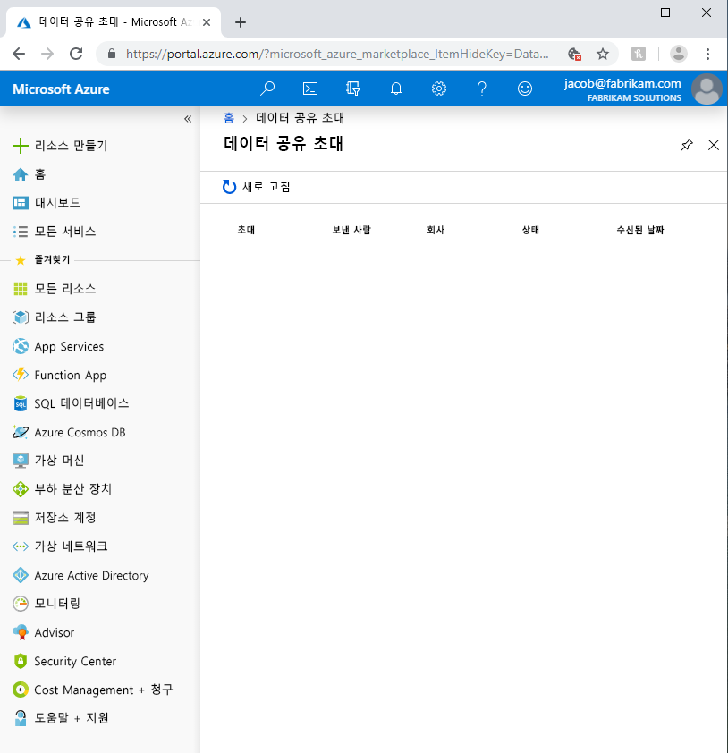

# <a name="troubleshoot-common-issues-in-azure-data-share"></a>Azure 데이터 공유에서 일반적인 문제 해결 

이 문서에서는 Azure 데이터 공유에 대한 일반적인 문제를 해결하는 방법을 보여 주며 있습니다. 

## <a name="azure-data-share-invitations"></a>Azure Data Share 초대 

경우에 따라, 새로운 사용자가 전송된 이메일 초대에서 **초대 수락**을 클릭하면 빈 초대 목록이 표시될 수 있습니다. 



이는 다음과 같은 이유로 인해 발생할 수 있습니다.

* **Azure 데이터 공유 서비스는 Azure 테넌트의 모든 Azure 구독의 리소스 공급자로 등록되지 않았습니다.** Azure 테넌트에 데이터 공유 리소스가 없는 경우 이 문제가 발생합니다. Azure 데이터 공유 리소스를 만들 면 Azure 구독에서 리소스 공급자를 자동으로 등록 합니다. 다음 단계에 따라 데이터 공유 서비스를 수동으로 등록할 수도 있습니다. 이러한 단계를 완료하려면 Azure 기여자 역할이 있어야 합니다.

    1. Azure Portal에서 **구독**으로 이동합니다.
    1. Azure 데이터 공유 리소스를 만드는 데 사용할 구독을 선택합니다.
    1. **리소스 공급자**를 클릭합니다.
    1. 마이크로소프트 **를 검색합니다.데이터 쉐어**
    1. **등록을 클릭합니다.** 

    이 단계를 완료하려면 [Azure Contributor RBAC 역할](https://docs.microsoft.com/azure/role-based-access-control/built-in-roles#contributor)이 필요합니다. 

* **Azure 로그인 이메일 대신 초대장이 이메일 별칭으로 전송됩니다.** Azure Data Share 서비스를 등록했거나 Azure 테넌트에서 데이터 공유 리소스를 이미 만들었으나 초대를 볼 수 없는 경우 공급자가 Azure 로그인 전자 메일 주소 대신 전자 메일 별칭을 받는 사람으로 입력했기 때문일 수 있습니다. 데이터 공급자에게 문의하여 전자 메일 별칭이 아닌 Azure 로그인 전자 메일 주소로 초대장을 보냈는지 확인합니다.

* **초대가 이미 수락되었습니다.** 전자 메일의 링크는 보류 중인 초대장만 나열하는 Azure 포털의 데이터 공유 초대 페이지로 이동합니다. 초대를 이미 수락한 경우 데이터 공유 초대 페이지에 더 이상 표시되지 않습니다. 수신된 공유를 보고 대상 Azure Data Explorer 클러스터 설정을 구성하기 위해 초대를 수락하는 데 사용한 데이터 공유 리소스로 이동합니다.

## <a name="error-when-creating-or-receiving-a-new-share"></a>새 공유를 만들거나 받을 때 오류가 발생했습니다.

"데이터 집합을 추가하지 못했습니다."

"데이터 집합매핑실패"

"y에 대한 데이터 공유 리소스 x 액세스 권한을 부여할 수 없음"

"x에 대한 적절한 사용 권한이 없습니다."

"선택한 리소스 중 하나 이상에 Azure Data Share 계정에 대한 쓰기 권한을 추가할 수 없습니다."

새 공유 또는 매핑 데이터 집합을 만들 때 위의 오류가 발생하는 경우 Azure 데이터 저장소에 대한 권한이 부족하기 때문일 수 있습니다. 필요한 사용 권한에 대한 [역할 및 요구 사항을](concepts-roles-permissions.md) 참조하십시오. 

일반적으로 기여자 역할에 있는 Azure 데이터 저장소에서 데이터를 공유하거나 받을 수 있는 쓰기 권한이 필요합니다. 

Azure 데이터 저장소에서 데이터를 공유하거나 처음 받는 경우 일반적으로 소유자 역할에 있는 *Microsoft.권한 부여/역할 할당/쓰기* 권한도 필요합니다. Azure 데이터 저장소 리소스를 만든 경우에도 자동으로 리소스의 소유자가 되지 않습니다. 적절한 권한을 가진 Azure Data Share 서비스는 데이터 저장소에 대한 데이터 공유 리소스의 관리되는 ID 액세스를 자동으로 부여합니다. 이 프로세스는 적용하는 데 몇 분 정도 걸릴 수 있습니다. 이 지연으로 인해 오류가 발생하면 몇 분 안에 다시 시도하십시오.

SQL 기반 공유에는 추가 권한이 필요합니다. 자세한 내용은 SQL 기반 공유 문제 해결을 참조하십시오.

## <a name="troubleshooting-sql-based-sharing"></a>SQL 기반 공유 문제 해결

"사용자 x가 SQL 데이터베이스에 없습니다."

SQL 기반 원본에서 데이터 집합을 추가할 때 이 오류가 발생하면 SQL Server에서 Azure Data Share 관리 ID에 대한 사용자를 만들지 않았기 때문일 수 있습니다.  이 문제를 해결하려면 다음 스크립트를 실행하십시오.

```sql
    create user "<share_acct_name>" from external provider; 
    exec sp_addrolemember db_datareader, "<share_acct_name>";
```      
데이터 집합을 SQL 기반 대상에 매핑할 때 이 오류가 발생하면 SQL Server에서 Azure Data Share 관리 ID에 대한 사용자를 만들지 않았기 때문일 수 있습니다.  이 문제를 해결하려면 다음 스크립트를 실행하십시오.

```sql
    create user "<share_acc_name>" from external provider; 
    exec sp_addrolemember db_datareader, "<share_acc_name>"; 
    exec sp_addrolemember db_datawriter, "<share_acc_name>"; 
    exec sp_addrolemember db_ddladmin, "<share_acc_name>";
```
*<share_acc_name>* 은 Data Share 리소스의 이름입니다.      

[데이터 공유에](share-your-data.md) 나열된 모든 필수 구성 조건을 따르고 데이터 자습서를 [수락하고 수신해야](subscribe-to-data-share.md) 합니다.

## <a name="snapshot-failed"></a>스냅샷 실패
여러 가지 이유로 인해 스냅숏이 실패할 수 있습니다. 스냅숏의 시작 시간과 각 데이터 집합의 상태를 클릭하여 자세한 오류 메시지를 찾을 수 있습니다. 

오류 메시지가 사용 권한과 관련된 경우 데이터 공유 서비스에 필요한 권한이 있는지 확인합니다. 자세한 내용은 [역할 및 요구 사항을](concepts-roles-permissions.md) 참조하십시오. 스냅숏을 처음 생성할 때 데이터 공유 리소스에 Azure 데이터 저장소에 대한 액세스 권한이 부여되는 데 몇 분 정도 걸릴 수 있습니다. 몇 분 동안 기다렸다가 다시 시도하십시오.

## <a name="next-steps"></a>다음 단계

데이터 공유를 시작하는 방법을 알아보려면 [데이터 공유](share-your-data.md) 자습서로 계속 진행하세요. 

데이터를 수신하는 방법을 알아보려면 데이터 자습서를 [수락하고 수신합니다.](subscribe-to-data-share.md)

