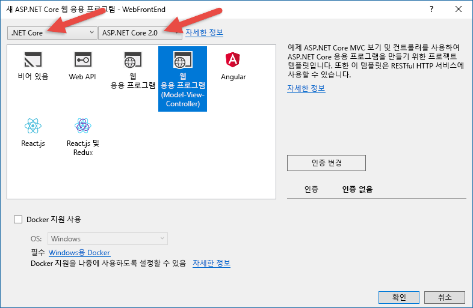
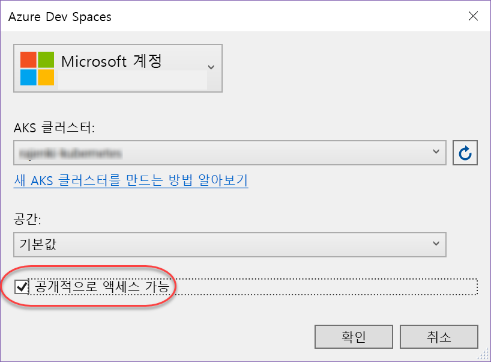
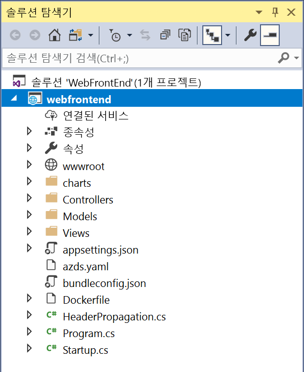

# <a name="create-a-kubernetes-dev-space-visual-studio-and-net-core-with-azure-dev-spaces"></a>Kubernetes 개발 공간 만들기: Azure Dev Spaces가 포함된 Visual Studio 및 .NET Core

이 가이드에서는 다음을 수행하는 방법을 배우게 됩니다.

- Azure에서 관리되는 Kubernetes 클러스터를 사용하여 Azure Dev Spaces를 설정합니다.
- Visual Studio를 사용하여 컨테이너에서 반복적으로 코드를 개발합니다.
- 독립적으로 별도의 두 서비스를 개발하고, Kubernetes의 DNS 서비스 검색을 사용하여 다른 서비스를 호출합니다.
- 팀 환경에서 코드를 생산적으로 개발하고 테스트합니다.

> [!NOTE]
> **의문 사항이 있으면** 언제든지 [문제 해결](troubleshooting.md) 섹션을 참조하세요.

## <a name="install-the-azure-cli"></a>Azure CLI 설치
Azure Dev Spaces에는 최소한의 로컬 컴퓨터 설정이 필요합니다. 개발 환경의 구성은 대부분 클라우드에 저장되며 다른 사용자와 공유할 수 있습니다. 먼저 [Azure CLI](/cli/azure/install-azure-cli?view=azure-cli-latest)를 다운로드하고 실행하여 시작합니다.

### <a name="sign-in-to-azure-cli"></a>Azure CLI에 로그인
Azure에 로그인합니다. 터미널 창에 다음 명령을 입력합니다.

```azurecli
az login
```

> [!NOTE]
> Azure 구독이 없는 경우 [체험 계정](https://azure.microsoft.com/free)을 만들 수 있습니다.

#### <a name="if-you-have-multiple-azure-subscriptions"></a>여러 Azure 구독이 있는 경우...
다음을 실행하여 구독을 볼 수 있습니다. 

```azurecli
az account list --output table
```

*IsDefault*에 대해 *True*가 있는 구독을 찾습니다.
사용하려는 구독이 없으면 기본 구독을 변경할 수 있습니다.

```azurecli
az account set --subscription <subscription ID>
```

## <a name="create-a-kubernetes-cluster-enabled-for-azure-dev-spaces"></a>Azure Dev Space에 사용하도록 설정된 Kubernetes 클러스터 만들기

명령 프롬프트에서 [Azure Dev Spaces를 지원하는 영역][supported-regions]에 리소스 그룹을 만듭니다.

```azurecli
az group create --name MyResourceGroup --location <region>
```

다음 명령을 사용하여 Kubernetes 클러스터를 만듭니다.

```azurecli
az aks create -g MyResourceGroup -n MyAKS --location <region> --generate-ssh-keys
```

클러스터를 만드는 데 몇 분이 걸립니다.

### <a name="configure-your-aks-cluster-to-use-azure-dev-spaces"></a>Azure Dev Spaces를 사용하도록 AKS 클러스터 구성

AKS 클러스터를 포함하는 리소스 그룹을 사용하여 다음 Azure CLI 명령 및 AKS 클러스터 이름을 입력합니다. 명령은 Azure Dev Spaces에 대한 지원을 통해 클러스터를 구성합니다.

   ```azurecli
   az aks use-dev-spaces -g MyResourceGroup -n MyAKS
   ```
   
> [!IMPORTANT]
> Azure Dev Spaces 구성 프로세스는 클러스터에서 `azds` 네임스페이스를 제거합니다(있는 경우).

## <a name="get-the-visual-studio-tools"></a>Visual Studio 도구 가져오기
Azure Development 워크로드를 사용하여 Windows에 최신 버전의 [Visual Studio 2019](https://www.visualstudio.com/vs/)를 설치합니다.

## <a name="create-a-web-app-running-in-a-container"></a>컨테이너에서 실행되는 웹앱 만들기

이 섹션에서는 ASP.NET Core 웹앱을 만들어 Kubernetes의 컨테이너에서 실행합니다.

### <a name="create-an-aspnet-web-app"></a>ASP.NET 웹앱 만들기

Visual Studio에서 새 프로젝트를 만듭니다. 현재 프로젝트는 **ASP.NET Core 웹 애플리케이션**이어야 합니다. 프로젝트의 이름을 '**webfrontend**'로 지정합니다.


대화 상자의 상단에 있는 두 개의 드롭다운에서 **웹 애플리케이션 (모델-보기-컨트롤러)** 템플릿을 선택하고, **.NET Core** 및 **ASP.NET Core 2.0**을 대상으로 하고 있는지 확인합니다. **확인**을 클릭하여 프로젝트를 만듭니다.



### <a name="enable-dev-spaces-for-an-aks-cluster"></a>AKS 클러스터에 대한 개발 환경을 사용하도록 설정

방금 만든 프로젝트를 사용하여 아래 그림과 같이 시작 설정 드롭다운에서 **Azure Dev Spaces**를 선택합니다.


다음에 표시되는 대화 상자에서 적절한 계정으로 로그인했는지 확인한 다음, 기존 Kubernetes 클러스터를 선택합니다.


지금은 **공간** 드롭다운을 기본값 `default`로 둡니다. 나중에 이 옵션에 대해 자세히 알아보겠습니다. 공용 엔드포인트를 통해 웹앱에 액세스할 수 있도록 **공용 액세스 가능** 확인란을 선택합니다. 이 설정은 필요한 것은 아니지만 이 연습의 뒷부분에서 몇 가지 개념을 보여주는 데 도움이 될 것입니다. 두 경우 모두 Visual Studio를 사용하여 웹 사이트를 디버깅할 수는 있으니 걱정하지 마세요.



클러스터를 선택하거나 만들려면 **확인**을 클릭합니다.

Azure Dev Spaces에서 작동하도록 설정되지 않은 클러스터를 선택하면 구성할 것인지 묻는 메시지가 표시됩니다.


**확인**을 선택합니다.

> [!IMPORTANT]
> Azure Dev Spaces 구성 프로세스는 클러스터에서 `azds` 네임스페이스를 제거합니다(있는 경우).

 이 작업을 수행하기 위한 백그라운드 작업이 시작됩니다. 완료하는 데 몇 분 정도 걸립니다. 아직 생성 중인지 확인하려면 다음 그림과 같이 상태 표시줄의 왼쪽 아래 모서리에 있는 **백그라운드 작업** 아이콘 위로 포인터를 이동합니다.


> [!NOTE]
> 개발 환경이 성공적으로 만들어질 때까지는 애플리케이션을 디버깅할 수 없습니다.

### <a name="look-at-the-files-added-to-project"></a>프로젝트에 추가된 파일 확인
개발 환경이 생성될 때까지 기다리는 동안 개발 환경을 사용하도록 선택할 때 프로젝트에 추가된 파일을 확인합니다.

먼저, `charts`라는 폴더가 추가되었으며, 이 폴더 내에는 애플리케이션에 대한 [Helm 차트](https://docs.helm.sh)가 스캐폴딩되어 있습니다. 이러한 파일은 개발 환경에 애플리케이션을 배포하는 데 사용됩니다.

`Dockerfile`이라는 파일이 추가되었습니다. 이 파일에는 애플리케이션을 표준 Docker 형식으로 패키징하는 데 필요한 정보가 있습니다.

마지막으로 개발 환경에서 필요한 개발 시간 구성을 포함하는 `azds.yaml`라는 파일이 표시됩니다.



## <a name="debug-a-container-in-kubernetes"></a>Kubernetes에서 컨테이너 디버깅
개발 환경이 성공적으로 만들어지면 애플리케이션을 디버깅할 수 있습니다. 코드에서 중단점을 설정합니다(예: `Message` 변수가 설정된 파일 `HomeController.cs`의 줄 20). **F5** 키를 클릭하여 디버깅을 시작합니다. 

Visual Studio는 개발 환경과 통신하여 애플리케이션을 빌드 및 배포한 다음, 웹앱이 실행되는 브라우저를 엽니다. 컨테이너가 로컬에서 실행되는 것처럼 보일 수도 있지만, 실제로는 Azure의 개발 환경에서 실행됩니다. 로컬 호스트 주소인 이유는 Azure Dev Spaces가 AKS에서 실행 중인 컨테이너에 임시 SSH 터널을 생성하기 때문입니다.

중단점을 트리거하려면 페이지 상단에 있는 **정보** 링크를 클릭합니다. 호출 스택, 지역 변수, 예외 정보 등과 같은 코드가 로컬에서 실행되는 경우와 마찬가지로 디버그 정보에 대한 모든 액세스 권한을 갖습니다.

## <a name="iteratively-develop-code"></a>반복적으로 코드 개발

Azure Dev Spaces는 Kubernetes에서 단순히 코드를 실행하는 것이 아니라, 클라우드의 Kubernetes 환경에서 코드 변경 내용을 신속하고 반복적으로 확인할 수 있게 해주는 것입니다.

### <a name="update-a-content-file"></a>콘텐츠 파일 업데이트


1. `./Views/Home/Index.cshtml` 파일을 찾고 이 HTML 파일을 편집합니다. 예를 들어 [`<h2>Application uses</h2>`를 읽는 줄 73](https://github.com/Azure/dev-spaces/blob/master/samples/dotnetcore/getting-started/webfrontend/Views/Home/Index.cshtml#L73)을 다음과 같이 변경합니다. 
  
    ```html
    <h2>Hello k8s in Azure!</h2>`
    ```

2. 파일을 저장합니다.
3. 브라우저로 이동하여 페이지를 새로 고칩니다. 웹 페이지에 업데이트된 HTML이 표시되어야 합니다.

어떻게 된 건가요? HTML 및 CSS와 같은 콘텐츠 파일을 편집하는 경우 .NET Core 웹앱에서 다시 컴파일을 수행할 필요가 없기 때문에 활성 F5 세션은 수정된 콘텐츠 파일을 AKS에서 실행 중인 컨테이너에 자동으로 동기화하므로 콘텐츠 편집 내용을 바로 볼 수 있습니다.

### <a name="update-a-code-file"></a>코드 파일 업데이트
.NET Core 앱이 업데이트된 애플리케이션 이진 파일을 다시 빌드하고 생성해야 하기 때문에 코드 파일을 업데이트하려면 작업이 좀 더 필요합니다.

1. Visual Studio에서 디버거를 중지합니다.
1. `Controllers/HomeController.cs`라는 코드 파일을 열고, 정보 페이지(`ViewData["Message"] = "Your application description page.";`)에 표시될 메시지를 편집합니다.
1. 파일을 저장합니다.
1. **F5** 키를 눌러 다시 디버깅을 시작합니다. 

코드 편집이 완료될 때마다 상당한 시간이 소요되는 새 컨테이너 이미지 다시 빌드 및 다시 배포 작업을 수행하는 대신 Azure Dev Spaces는 기존 컨테이너 내에서 코드를 점진적으로 다시 컴파일하여 더 빠른 편집/디버그 루프를 제공합니다.

브라우저에서 웹앱을 새로 고치고 정보 페이지로 이동합니다. 사용자 지정 메시지가 UI에 표시되어야 합니다.

## <a name="next-steps"></a>다음 단계

Azure Dev Spaces 작동 방식에 대해 자세히 알아봅니다.

> [!div class="nextstepaction"]
> [Azure Dev Spaces의 작동 원리](how-dev-spaces-works.md)


[supported-regions]: https://azure.microsoft.com/global-infrastructure/services/?products=kubernetes-service
