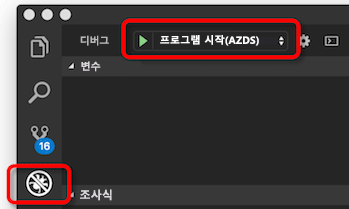

# <a name="get-started-on-azure-dev-spaces-with-nodejs"></a>Azure Dev Spaces에서 Node.js를 사용하여 시작

이 가이드에서는 다음을 수행하는 방법을 배우게 됩니다.

- 개발용으로 최적화된 Azure의 Kubernetes 기반 환경인 _개발 공간_을 만듭니다.
- VS Code 및 명령줄을 사용하여 컨테이너에서 반복적으로 코드를 개발합니다.
- 팀 환경에서 코드를 생산적으로 개발하고 테스트합니다.

> [!Note]
> **의문 사항이 있으면** 언제든지 [문제 해결](troubleshooting.md) 섹션을 참조하거나 이 페이지에 의견을 게시하세요.

이제 Azure에서 Kubernetes 기반 개발 환경을 만들 준비가 되었습니다.

## <a name="install-the-azure-cli"></a>Azure CLI 설치
Azure Dev Spaces에는 최소한의 로컬 컴퓨터 설정이 필요합니다. 개발 환경의 구성은 대부분 클라우드에 저장되며 다른 사용자와 공유할 수 있습니다. 로컬 머신은 Windows, Mac 또는 Linux를 실행할 수 있습니다. Linux에 지원되는 배포판은 Ubuntu(18.04, 16.04, 14.04), Debian 8 및 9, RHEL 7, Fedora 26+, CentOS 7, openSUSE 42.2 및 SLES 12입니다.

먼저 [Azure CLI](/cli/azure/install-azure-cli?view=azure-cli-latest)를 다운로드하고 실행하여 시작합니다. 

> [!IMPORTANT]
> Azure CLI가 이미 설치되어 있는 경우 2.0.43 이상 버전을 사용하고 있는지 확인합니다.

### <a name="sign-in-to-azure-cli"></a>Azure CLI에 로그인
Azure에 로그인합니다. 터미널 창에 다음 명령을 입력합니다.

```cmd
az login
```

> [!Note]
> Azure 구독이 없는 경우 [체험 계정](https://azure.microsoft.com/free)을 만들 수 있습니다.

#### <a name="if-you-have-multiple-azure-subscriptions"></a>여러 Azure 구독이 있는 경우...
다음을 실행하여 구독을 볼 수 있습니다. 

```cmd
az account list
```
JSON 출력에서 `isDefault: true`이 포함된 구독을 찾습니다.
사용하려는 구독이 없으면 기본 구독을 변경할 수 있습니다.

```cmd
az account set --subscription <subscription ID>
```

## <a name="create-a-kubernetes-cluster-enabled-for-azure-dev-spaces"></a>Azure Dev Space에 사용하도록 설정된 Kubernetes 클러스터 만들기

명령 프롬프트에서 리소스 그룹을 만듭니다. 현재 지원되는 지역(미국 동부, 미국 동부 2, 미국 중부, 미국 서부 2, 서유럽, 동남 아시아, 캐나다 중부 또는 캐나다 동부) 중 하나를 사용합니다.

```cmd
az group create --name MyResourceGroup --location <region>
```

다음 명령을 사용하여 Kubernetes 클러스터를 만듭니다.

```cmd
az aks create -g MyResourceGroup -n MyAKS --location <region> --kubernetes-version 1.11.2 --enable-addons http_application_routing --generate-ssh-keys
```

클러스터를 만드는 데 몇 분이 걸립니다.

### <a name="configure-your-aks-cluster-to-use-azure-dev-spaces"></a>Azure Dev Spaces를 사용하도록 AKS 클러스터 구성

AKS 클러스터를 포함하는 리소스 그룹을 사용하여 다음 Azure CLI 명령 및 AKS 클러스터 이름을 입력합니다. 명령은 Azure Dev Spaces에 대한 지원을 통해 클러스터를 구성합니다.

   ```cmd
   az aks use-dev-spaces -g MyResourceGroup -n MyAKS
   ```

> [!IMPORTANT]
> Azure Dev Spaces 구성 프로세스는 클러스터에서 `azds` 네임스페이스를 제거합니다(있는 경우).

## <a name="get-kubernetes-debugging-for-vs-code"></a>VS Code용 Kubernetes 디버깅 가져오기
Kubernetes 디버깅과 같은 다양한 기능은 VS Code를 사용하는 .NET Core 및 Node.js 개발자가 사용할 수 있습니다.

1. [VS Code](https://code.visualstudio.com/Download)가 없으면 이를 설치합니다.
1. [VS Azure Dev Spaces 확장](https://marketplace.visualstudio.com/items?itemName=azuredevspaces.azds)을 다운로드하여 설치합니다. 확장의 Marketplace 페이지 및 VS Code에서 [설치]를 한 번 클릭합니다. 

## <a name="create-a-nodejs-container-in-kubernetes"></a>Kubernetes에서 Node.js 컨테이너 만들기

이 섹션에서는 Node.js 웹앱을 만들어 Kubernetes의 컨테이너에서 실행합니다.

### <a name="create-a-nodejs-web-app"></a>Node.js 웹앱 만들기
https://github.com/Azure/dev-spaces로 이동하여 GitHub에서 코드를 다운로드하고 **복제 또는 다운로드**을 선택하여 GitHub 리포지토리를 로컬 환경으로 다운로드합니다. 이 가이드의 코드는 `samples/nodejs/getting-started/webfrontend`에 있습니다.

## <a name="preparing-code-for-docker-and-kubernetes-development"></a>Docker 및 Kubernetes 개발을 위한 코드 준비
지금까지 로컬로 실행할 수 있는 기본 웹앱이 있었습니다. 이제 앱의 컨테이너 및 Kubernetes에 배포되는 방법을 정의하는 자산을 만들어 컨테이너화합니다. 이 작업은 Azure Dev Spaces를 사용하여 쉽게 할 수 있습니다. 

1. VS Code를 시작하고 `webfrontend` 폴더를 엽니다. (디버그 자산을 추가하거나 프로젝트를 복원하라는 모든 기본 프롬프트를 무시할 수 있습니다.)
1. VS Code에서 통합 터미널을 엽니다(**보기 > 통합 터미널** 메뉴 사용).
1. 이 명령을 실행합니다(**webfrontend**가 현재 폴더인지 확인).

    ```cmd
    azds prep --public
    ```

Azure CLI의 `azds prep` 명령은 기본 설정으로 Docker 및 Kubernetes 자산을 생성합니다.
* `./Dockerfile`은 앱의 컨테이너 이미지 및 원본 코드가 빌드되는 방법을 설명하고 컨테이너 내에서 실행됩니다.
* `./charts/webfrontend` 아래의 [Helm 차트](https://docs.helm.sh)는 Kubernetes에 컨테이너를 배포하는 방법을 설명합니다.

지금은 이러한 파일의 전체 컨텐츠를 이해할 필요가 없습니다. 언급할 가치가 있지만 **코드 자산으로 동일한 Kubernetes 및 Docker 구성을 개발에서 프로덕션까지 사용할 수 있으므로 서로 다른 환경에서 더 나은 일관성을 제공합니다.**
 
또한 `./azds.yaml`이라는 파일이 `prep` 명령으로 생성되며, 이는 Azure Dev Spaces에 대한 구성 파일입니다. Azure에서 반복 개발 환경을 활성화하는 추가 구성으로 Docker 및 Kubernetes 아티팩트를 보완합니다.

## <a name="build-and-run-code-in-kubernetes"></a>Kubernetes에서 코드 빌드 및 실행
코드를 실행해 보겠습니다! 터미널 창의 **루트 코드 폴더**인 webfrontend에서 다음 명령을 실행합니다.

```cmd
azds up
```

명령의 출력을 계속 지켜보면 명령이 진행될 때 몇 가지 사항을 확인할 수 있습니다.
- 소스 코드는 Azure의 개발 공간에 동기화됩니다.
- 코드 폴더의 Docker 자산에 지정된 대로 Azure에서 컨테이너 이미지가 만들어집니다.
- 또한 코드 폴더의 Helm 차트에 지정된 대로 컨테이너 이미지를 활용하는 Kubernetes 개체가 만들어집니다.
- 컨테이너의 엔드포인트에 대한 정보가 표시됩니다. 이 예제에서는 공용 HTTP URL이 표시됩니다.
- 위 단계가 성공적으로 완료되었다고 가정하면 컨테이너가 시작될 때 `stdout`(및 `stderr`) 출력이 표시되기 시작해야 합니다.

> [!Note]
> `up` 명령을 처음 실행할 때는 이러한 단계가 오래 걸리지만 후속 실행은 더 빨라집니다.

### <a name="test-the-web-app"></a>웹앱 테스트
콘솔 출력에서 `up` 명령으로 생성된 공용 URL에 대한 정보를 검색합니다. 다음과 같은 형식입니다. 

```
(pending registration) Service 'webfrontend' port 'http' will be available at <url>
Service 'webfrontend' port 80 (TCP) is available at http://localhost:<port>
```

브라우저 창에서 이 URL을 열고 웹앱 로드를 확인합니다. 컨테이너가 실행될 때 `stdout` 및 `stderr` 출력이 터미널 창으로 스트리밍됩니다.

> [!Note]
> 첫 번째 실행 시 공용 DNS를 준비하는 데 몇 분 정도 걸릴 수 있습니다. 공용 URL이 확인되지 않으면 콘솔 출력에 표시되는 http://localhost:<portnumber> URL을 대신 사용할 수 있습니다. localhost URL을 사용하는 경우 컨테이너가 로컬로 실행되는 것처럼 보이지만, 실제로는 AKS에서 실행되고 있습니다. 편의상 로컬 컴퓨터에서 서비스와 쉽게 상호 작용할 수 있도록 Azure Dev Spaces는 Azure에서 실행되는 컨테이너에 대한 임시 SSH 터널을 만듭니다. DNS 레코드 준비되면 돌아와서 나중에 공용 URL을 시도해볼 수 있습니다.

### <a name="update-a-content-file"></a>콘텐츠 파일 업데이트
Azure Dev Spaces는 Kubernetes에서 단순히 코드를 실행하는 것이 아니라, 클라우드의 Kubernetes 환경에서 코드 변경 내용을 신속하고 반복적으로 확인할 수 있게 해주는 것입니다.

1. `./public/index.html` 파일을 찾고 이 HTML 파일을 편집합니다. 예를 들어, 페이지의 배경색을 파란색 음영으로 변경합니다.

    ```html
    <body style="background-color: #95B9C7; margin-left:10px; margin-right:10px;">
    ```

2. 파일을 저장합니다. 잠시 후, 터미널 창에 실행 중인 컨테이너의 파일이 업데이트되었다는 메시지가 표시됩니다.
1. 브라우저로 이동하여 페이지를 새로 고칩니다. 색상 업데이트가 표시되어야 합니다.

어떻게 된 건가요? HTML 및 CSS와 같은 콘텐츠 파일을 편집하면 Node.js 프로세스를 다시 시작할 필요가 없으므로, 활성 `azds up` 명령은 수정된 컨텐츠 파일을 Azure에서 실행 중인 컨테이너에 바로 자동으로 동기화합니다. 따라서 콘텐츠 편집 내용을 빠르게 볼 수 있습니다.

### <a name="test-from-a-mobile-device"></a>모바일 장치에서 테스트
webfrontend에 대한 공용 URL을 사용하여 모바일 장치에서 웹앱을 엽니다. 긴 주소를 입력하지 않으려면 데스크탑에서 URL을 복사하여 장치로 보내고 싶을 수 있습니다. 웹앱이 모바일 장치에 로드되면 소형 장치에서 UI가 제대로 표시되지 않는 것을 알 수 있습니다.

이 문제를 해결하려면 `viewport` 메타 태그를 추가합니다.
1. `./public/index.html` 파일 열기
1. 기존 `head` 요소에 `viewport` 메타 태그를 추가합니다.

    ```html
    <head>
        <!-- Add this line -->
        <meta name="viewport" content="width=device-width, initial-scale=1">
    </head>
    ```

1. 파일을 저장합니다.
1. 장치의 브라우저를 새로 고칩니다. 이제 올바르게 렌더링된 웹앱이 표시됩니다. 

이 예제는 앱을 사용할 장치에서 테스트할 때까지 일부 문제가 발견되지 않음을 보여줍니다. Azure Dev Spaces를 사용하면 코드를 빠르게 반복하여 대상 장치의 변경 내용에 대한 유효성을 검사할 수 있습니다.

### <a name="update-a-code-file"></a>코드 파일 업데이트
Node.js 앱을 다시 시작해야 하므로 서버 쪽 코드 파일을 업데이트하려면 약간의 작업이 더 필요합니다.

1. 터미널 창에서 `Ctrl+C`(`azds up` 중지)를 누릅니다.
1. `server.js`라는 코드 파일을 열고, 서비스의 hello 메시지를 편집합니다. 

    ```javascript
    res.send('Hello from webfrontend running in Azure!');
    ```

3. 파일을 저장합니다.
1. 터미널 창에서 `azds up`를 실행합니다. 

이 명령은 컨테이너 이미지를 다시 빌드하고 Helm 차트를 다시 배포합니다. 브라우저 페이지를 다시 로드하여 코드 변경 내용이 적용되는지 확인합니다.

하지만 코드 개발에 사용할 수 있는 *훨씬 더 빠른 방법*이 있으며, 이에 대해서는 다음 섹션에서 살펴볼 예정입니다. 

## <a name="debug-a-container-in-kubernetes"></a>Kubernetes에서 컨테이너 디버깅

이 섹션에서는 VS Code를 사용하여 Azure에서 실행 중인 컨테이너를 직접 디버그합니다. 또한 편집-실행-테스트를 더 빠르게 반복하는 방법도 알아봅니다.


> [!Note]
> **의문 사항이 있으면** 언제든지 [문제 해결](troubleshooting.md) 섹션을 참조하거나 이 페이지에 의견을 게시하세요.

### <a name="initialize-debug-assets-with-the-vs-code-extension"></a>VS Code 확장을 사용하여 디버그 자산 초기화
먼저 VS Code가 Azure에서 개발 환경과 통신하도록 코드 프로젝트를 구성해야 합니다. Azure Dev Spaces에 대한 VS Code 확장은 디버그 구성을 설정하는 도우미 명령을 제공합니다. 

**명령 팔레트**(**보기 | 명령 팔레트** 메뉴를 사용하여)를 열고, 자동 완성을 사용하여 입력하고 이 명령을 선택합니다. `Azure Dev Spaces: Prepare configuration files for Azure Dev Spaces` 

이렇게 하면 `.vscode` 폴더 아래에 Azure Dev Spaces에 대한 디버그 구성이 추가됩니다. 이 명령은 배포 프로젝트를 구성하는 `azds prep` 명령과 혼동하면 안됩니다.


### <a name="select-the-azds-debug-configuration"></a>AZDS 디버그 구성 선택
1. 디버그 보기를 열려면 VS Code 측면의 **활동 표시줄**에서 디버그 아이콘을 클릭합니다.
1. 활성 디버그 구성으로 **시작 프로그램(AZDS)** 을 선택합니다.



> [!Note]
> 명령 팔레트에 Azure Dev Spaces 명령이 표시되지 않으면 [Azure Dev Spaces용 VS Code 확장이 설치되었는지](get-started-nodejs.md#get-kubernetes-debugging-for-vs-code) 확인합니다.

### <a name="debug-the-container-in-kubernetes"></a>Kubernetes에서 컨테이너 디버깅
**F5** 키를 눌러 Kubernetes에서 코드를 디버깅하세요.

`up` 명령과 마찬가지로 디버깅을 시작할 때 코드가 개발 환경에 동기화되고, 컨테이너가 빌드되어 Kubernetes에 배포됩니다. 이번에는 디버거가 원격 컨테이너에 연결됩니다.

> [!Tip]
> VS Code 상태 표시줄에 클릭 가능한 URL이 표시됩니다.


서버 측 코드 파일(예: `server.js`의 `app.get('/api'...`)에 중단점을 설정합니다. 브라우저 페이지를 새로 고치거나 '다시 말하기' 단추를 누르면 중단점을 맞추고 코드를 단계별로 실행할 수 있습니다.

코드가 로컬에서 실행되는 경우처럼 호출 스택, 지역 변수, 예외 정보 등과 같은 디버그 정보에 대한 전체 액세스 권한이 있습니다.

### <a name="edit-code-and-refresh-the-debug-session"></a>코드 편집 및 디버그 세션 새로 고침
디버거를 활성화한 상태에서 코드를 편집합니다. 예를 들어, hello 메시지를 다시 수정합니다.

```javascript
app.get('/api', function (req, res) {
    res.send('**** Hello from webfrontend running in Azure! ****');
});
```

파일을 저장하고, **디버그 작업 창**에서 **새로 고침** 단추를 클릭합니다. 


코드 편집이 완료될 때마다 상당한 시간이 소요되는 새 컨테이너 이미지 다시 빌드 및 다시 배포 작업을 수행하는 대신 Azure Dev Spaces는 더 빠른 편집/디버그 루프를 제공하기 위해 디버그 세션 간에 Node.js 프로세스를 다시 시작합니다.

브라우저에서 웹앱을 새로 고치거나, *다시 말하기* 단추를 누릅니다. 사용자 지정 메시지가 UI에 표시되어야 합니다.

### <a name="use-nodemon-to-develop-even-faster"></a>NodeMon을 사용하여 더 빠르게 개발
*Nodemon*은 Node.js 개발자가 신속한 개발을 위해 사용하는 인기 있는 도구입니다. 개발자는 서버 쪽 코드 편집을 수행할 때마다 노드 프로젝트를 수동으로 다시 시작하는 대신, *nodemon*이 파일 변경을 모니터링하고 서버 프로세스를 자동으로 다시 시작하도록 노드 프로젝트를 구성하는 경우가 많습니다. 이러한 작업 방식을 따르는 개발자는 코드를 편집한 후 브라우저를 새로 고치기만 하면 됩니다.

Azure Dev Spaces를 사용하면 로컬 개발 시 사용하는 것과 동일한 개발 워크플로를 많이 사용할 수 있습니다. 이 점을 설명하기 위해 샘플 `webfrontend` 프로젝트는 *nodemon*을 사용하도록 구성되었습니다(`package.json`에서 개발 종속성으로 구성됨).

다음 단계를 수행합니다.
1. VS Code 디버거를 중지합니다.
1. VS Code 측면의 **활동 표시줄**에서 디버그 아이콘을 클릭합니다. 
1. 활성 디버그 구성으로 **연결(AZDS)** 을 선택합니다.
1. F5 키를 누릅니다.

이 구성에서 컨테이너는 *nodemon*을 시작하도록 구성됩니다. 서버 코드를 편집하면 로컬에서 개발할 때와 마찬가지로 *nodemon*에서 노드 프로세스를 자동으로 다시 시작합니다. 
1. `server.js`에서 hello 메시지를 다시 편집하고 파일을 저장합니다.
1. 브라우저를 새로 고치거나 *다시 말하기* 단추를 클릭하여 변경 내용이 적용되는지 확인합니다.

**이제 코드를 빠르게 반복하고 Kubernetes에서 직접 디버그하는 방법을 사용할 수 있습니다!** 다음으로, 두 번째 컨테이너를 만들고 호출하는 방법을 살펴보겠습니다.

## <a name="next-steps"></a>다음 단계

> [!div class="nextstepaction"]
> [팀 개발 알아보기](team-development-nodejs.md)

